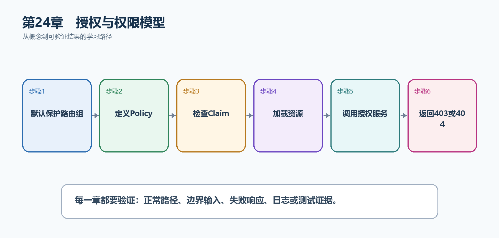

# 第25章　授权与权限模型

认证知道用户是谁，授权决定用户能否执行当前操作。简单角色可以直接判断；复杂系统应使用Policy和资源级授权，把用户、操作和具体资源一起评估。

  --------------------------------------------------------------------------------------------------------------------------
  **先把三个问题说清楚　**这是什么：授权是根据角色、Claim、Policy或资源关系决定已认证用户是否可以访问端点或操作某个对象。\
  目的是什么：防止任何已登录用户都能修改所有任务，并让权限规则集中、可测试。\
  最后得到什么：TaskHub默认保护/api路由；只有带tasks.write权限的用户能创建任务，只有任务所有者或管理员能修改具体任务。
  --------------------------------------------------------------------------------------------------------------------------

  --------------------------------------------------------------------------------------------------------------------------

  ----------------------------------------------------------------------------------------------------
  **本章操作路线　**默认保护路由组 → 定义Policy → 检查Claim → 加载资源 → 调用授权服务 → 返回403或404
  ----------------------------------------------------------------------------------------------------

  ----------------------------------------------------------------------------------------------------

{width="6.102362204724409in" height="2.915573053368329in"}

图25-1　授权与权限模型从概念到结果的实现路线

## 25.1 先看最终效果

TaskHub默认保护/api路由；只有带tasks.write权限的用户能创建任务，只有任务所有者或管理员能修改具体任务。

本章仍然使用TaskHub任务协作API作为落点。请先完成最小成功路径，再故意制造一次失败；只有能解释状态码、日志或测试结果，才算真正掌握。

195. 匿名访问保护路由得到401。

196. 已认证但缺少tasks.write权限时创建任务得到403。

197. 任务所有者修改成功，其他普通用户被拒绝。

198. 管理员通过Policy或资源处理器获得明确授权。

## 25.2 本章核心示例：使用Policy保护任务写操作

本节先展示本章核心写法。若代码定义了所用的全部类型，它可以独立运行；若引用TaskDbContext、TaskEntity、GetTasks等本节没有定义的名称，它就是加入前文TaskHub项目的增量代码，不能直接粘贴到空项目。附录A和附录B提供从空目录开始、能够完整复制运行的项目。

示例25-2　使用Policy保护任务写操作

```csharp
builder.Services.AddAuthorization(options =>
{
options.AddPolicy("TaskWriter", policy =>
policy.RequireAuthenticatedUser()
.RequireClaim("permission", "tasks.write"));
});

var taskApi = app.MapGroup("/api/tasks")
.RequireAuthorization();

taskApi.MapGet("/", GetTasks);

taskApi.MapPost("/", CreateTask)
.RequireAuthorization("TaskWriter");
```

-   路由组RequireAuthorization让任务端点默认需要登录。

-   TaskWriter Policy要求permission=tasks.write。

-   写操作叠加更严格Policy，读取仍只要求认证。

  -------------------------------------------------------------------------------------------------
  **运行后应该看到什么　**匿名请求得到401；已登录但无permission得到403；具备Claim的用户可以POST。
  -------------------------------------------------------------------------------------------------

  -------------------------------------------------------------------------------------------------

## 25.3 为什么要这样做

把if(userId==\...)散落在端点中容易遗漏。Policy适合可复用权限，Resource-based Authorization适合需要读取任务所有者后才能判断的规则。

在TaskHub中，本章把它应用到"控制谁能读取、创建和修改具体任务"。实现时要明确输入来自哪里、状态在哪里改变、失败怎样返回，以及运维或测试人员从哪里获得证据。

## 25.4 Role授权

这是什么：Role适合少量稳定的粗粒度职责，例如Admin。细粒度动作更适合Permission Claim或Policy，避免角色数量不断膨胀。

## 25.5 自定义Requirement

这是什么：Requirement只描述授权条件，Handler负责判断并调用Succeed。把判断拆开后可以复用、组合并单独测试。

## 25.6 Resource-based Authorization

这是什么：先加载目标资源再调用IAuthorizationService，把当前用户与资源所有者、项目成员关系共同纳入判断。

怎样做：先加入下面的最小配置或处理代码，保存并重新启动应用，再按示例给出的地址或命令验证。

示例25-3　根据任务所有者进行资源级授权

```csharp
sealed class TaskOwnerRequirement : IAuthorizationRequirement
{
}

sealed class TaskOwnerHandler
: AuthorizationHandler<TaskOwnerRequirement, TaskEntity>
{
protected override Task HandleRequirementAsync(
AuthorizationHandlerContext context,
TaskOwnerRequirement requirement,
TaskEntity resource)
{
var userId = context.User.FindFirstValue(ClaimTypes.NameIdentifier);
if (userId == resource.OwnerUserId || context.User.IsInRole("Admin"))
context.Succeed(requirement);

return Task.CompletedTask;
}
}

builder.Services.AddSingleton<IAuthorizationHandler, TaskOwnerHandler>();

app.MapPut("/api/tasks/{id:int}", async (
int id,
TaskDbContext db,
IAuthorizationService authorization,
ClaimsPrincipal user) =>
{
var task = await db.Tasks.FindAsync(id);
if (task is null) return Results.NotFound();

var result = await authorization.AuthorizeAsync(
user, task, new TaskOwnerRequirement());

return result.Succeeded ? Results.NoContent() : Results.Forbid();
});
```

-   先加载资源，才能知道OwnerUserId。

-   Handler集中表达所有者或管理员规则。

-   端点只把授权结果转换为HTTP响应。

  -----------------------------------------------------------------------
  **预期结果　**任务所有者或管理员得到204；其他已认证用户得到403。
  -----------------------------------------------------------------------

  -----------------------------------------------------------------------

## 25.7 权限模型

这是什么：先列出资源、动作和角色/权限矩阵，再写Policy。权限默认拒绝，新增端点必须明确属于公开、登录可用还是特定权限。

## 25.8 多租户权限

这是什么：每次查询和写入都必须带可信租户边界；租户ID应来自已验证身份或主机映射，而不是直接信任请求参数。

## 25.9 最终结果与注意事项

完成本章后，不要只确认项目能够编译。请按下面清单检查运行结果，并保留能够复现的请求、日志或测试。

199. 匿名访问保护路由得到401。

200. 已认证但缺少tasks.write权限时创建任务得到403。

201. 任务所有者修改成功，其他普通用户被拒绝。

202. 管理员通过Policy或资源处理器获得明确授权。

  --------------------------------------------------------------------------------------------------------------------------------------------------------------
  **特别注意　**401表示未认证，403表示身份已知但权限不足；多租户查询必须先加入可信租户边界；客户端隐藏按钮不等于后端授权；资源不存在与无权查看的响应策略要一致
  --------------------------------------------------------------------------------------------------------------------------------------------------------------

  --------------------------------------------------------------------------------------------------------------------------------------------------------------
