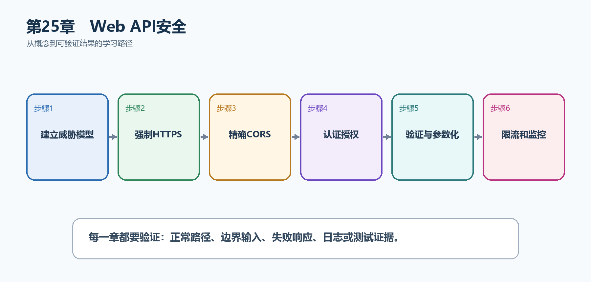

# 第26章　Web API安全

安全不是最后加一个中间件，而是从资产、入口和信任边界开始设计。HTTPS、认证、授权、输入验证、限流和日志共同构成防线，任何一层都不能代替其他层。

  ---------------------------------------------------------------------------------------------------------------
  **先把三个问题说清楚　**这是什么：Web API安全是针对身份伪造、数据泄露、注入、滥用和资源耗尽建立多层控制。\
  目的是什么：保护TaskHub用户、任务、附件和密钥，同时让异常流量不会拖垮服务。\
  最后得到什么：API只允许明确前端Origin，写操作受认证授权保护，敏感端点启用限流，上传和数据库操作使用安全边界。
  ---------------------------------------------------------------------------------------------------------------

  ---------------------------------------------------------------------------------------------------------------

  ----------------------------------------------------------------------------------------------
  **本章操作路线　**建立威胁模型 → 强制HTTPS → 精确CORS → 认证授权 → 验证与参数化 → 限流和监控
  ----------------------------------------------------------------------------------------------

  ----------------------------------------------------------------------------------------------

{width="6.102362204724409in" height="2.915573053368329in"}

图26-1　Web API安全从概念到结果的实现路线

## 26.1 先看最终效果

API只允许明确前端Origin，写操作受认证授权保护，敏感端点启用限流，上传和数据库操作使用安全边界。

本章仍然使用TaskHub任务协作API作为落点。请先完成最小成功路径，再故意制造一次失败；只有能解释状态码、日志或测试结果，才算真正掌握。

203. 非允许Origin的浏览器跨源请求被CORS阻止。

204. 匿名或越权写请求分别得到401和403。

205. 登录或高成本端点超过限制后得到429。

206. 恶意文件名、超大请求和动态SQL输入被拒绝。

## 26.2 本章核心示例：配置精确CORS和固定窗口限流

本节先展示本章核心写法。若代码定义了所用的全部类型，它可以独立运行；若引用TaskDbContext、TaskEntity、GetTasks等本节没有定义的名称，它就是加入前文TaskHub项目的增量代码，不能直接粘贴到空项目。附录A和附录B提供从空目录开始、能够完整复制运行的项目。

示例26-2　配置精确CORS和固定窗口限流

```csharp
using System.Threading.RateLimiting;

var builder = WebApplication.CreateBuilder(args);

builder.Services.AddCors(options =>
{
options.AddPolicy("Frontend", policy =>
policy.WithOrigins("https://app.example.com")
.AllowAnyHeader()
.AllowAnyMethod());
});

builder.Services.AddRateLimiter(options =>
{
options.RejectionStatusCode = StatusCodes.Status429TooManyRequests;
options.AddFixedWindowLimiter("Login", limiter =>
{
limiter.PermitLimit = 5;
limiter.Window = TimeSpan.FromMinutes(1);
limiter.QueueLimit = 0;
});
});

var app = builder.Build();
app.UseHttpsRedirection();
app.UseCors("Frontend");
app.UseRateLimiter();

app.MapPost("/api/login", () => Results.Ok())
.RequireRateLimiting("Login");

app.Run();
```

-   WithOrigins只允许明确生产前端源。

-   UseHttpsRedirection推动客户端使用HTTPS。

-   登录端点每分钟最多5次，超出返回429。

-   限流缓解滥用，但仍需认证、锁定和监控。

  --------------------------------------------------------------------------------------------------------
  **运行后应该看到什么　**允许Origin的前端调用成功；其他Origin无CORS许可；一分钟内第6次登录请求得到429。
  --------------------------------------------------------------------------------------------------------

  --------------------------------------------------------------------------------------------------------

## 26.3 为什么要这样做

CORS不是认证，HTTPS不能阻止越权，输入验证不能替代SQL参数化。先列出要保护的资产和攻击入口，再为每条数据流组合控制措施。

在TaskHub中，本章把它应用到"保护任务写操作、登录入口和附件上传"。实现时要明确输入来自哪里、状态在哪里改变、失败怎样返回，以及运维或测试人员从哪里获得证据。

## 26.4 CSRF

这是什么：Cookie会被浏览器自动携带，因此状态修改请求需要SameSite策略与防伪令牌；Bearer头通常不自动发送。

## 26.5 XSS

这是什么：输出编码、限制富文本和Content Security Policy共同降低脚本注入风险，令牌放在可被脚本读取的位置会放大后果。

## 26.6 SQL注入

这是什么：使用参数化LINQ或命令，不把用户输入拼进SQL、排序字段或表名；动态部分采用白名单映射。

怎样做：先加入下面的最小配置或处理代码，保存并重新启动应用，再按示例给出的地址或命令验证。

示例26-3　使用LINQ参数化并白名单映射排序字段

```text
var query = db.Tasks.AsNoTracking();

if (!string.IsNullOrWhiteSpace(search))
query = query.Where(x => x.Title.Contains(search));

query = sort?.ToLowerInvariant() switch
{
"title" => query.OrderBy(x => x.Title),
"created" => query.OrderBy(x => x.CreatedAt),
_ => query.OrderBy(x => x.Id)
};
```

-   LINQ值会由数据库提供程序参数化。

-   动态排序字段不能直接拼字符串，使用白名单switch。

-   表名和列名等结构部分必须由服务器控制。

  -----------------------------------------------------------------------------------
  **预期结果　**search中的引号等字符被当作数据而不是SQL；未知sort退回安全默认排序。
  -----------------------------------------------------------------------------------

  -----------------------------------------------------------------------------------

## 26.7 文件上传安全

这是什么：限制大小、扩展名与实际内容，随机化存储名并放在Web根目录之外；高风险文件交给恶意软件扫描。

## 26.8 请求限制

这是什么：同时限制请求体大小、表单字段、文件大小、分页上限和执行时间。限制应在尽量靠前的位置拒绝请求，避免先消耗大量资源。

## 26.9 密钥与数据保护

这是什么：连接字符串、签名密钥和API Key来自User Secrets或生产密钥存储。Data Protection用于保护Cookie等应用数据，密钥环在多实例环境要共享并持久化。

## 26.10 安全响应头

这是什么：根据前端形态配置HSTS、Content-Security-Policy、X-Content-Type-Options等响应头。CSP要从报告模式逐步收紧，避免直接破坏页面。

## 26.11 依赖安全

这是什么：定期查看过期和存在漏洞的NuGet包，升级后重新构建、测试并检查破坏性变化。锁定版本不能代替安全更新。

## 26.12 最终结果与注意事项

完成本章后，不要只确认项目能够编译。请按下面清单检查运行结果，并保留能够复现的请求、日志或测试。

207. 非允许Origin的浏览器跨源请求被CORS阻止。

208. 匿名或越权写请求分别得到401和403。

209. 登录或高成本端点超过限制后得到429。

210. 恶意文件名、超大请求和动态SQL输入被拒绝。

  --------------------------------------------------------------------------------------------------------------------------
  **特别注意　**CORS不是API鉴权；Cookie认证写操作要防CSRF；用户输入不能拼进SQL、路径和排序表达式；安全日志不能反向泄露秘密
  --------------------------------------------------------------------------------------------------------------------------

  --------------------------------------------------------------------------------------------------------------------------
