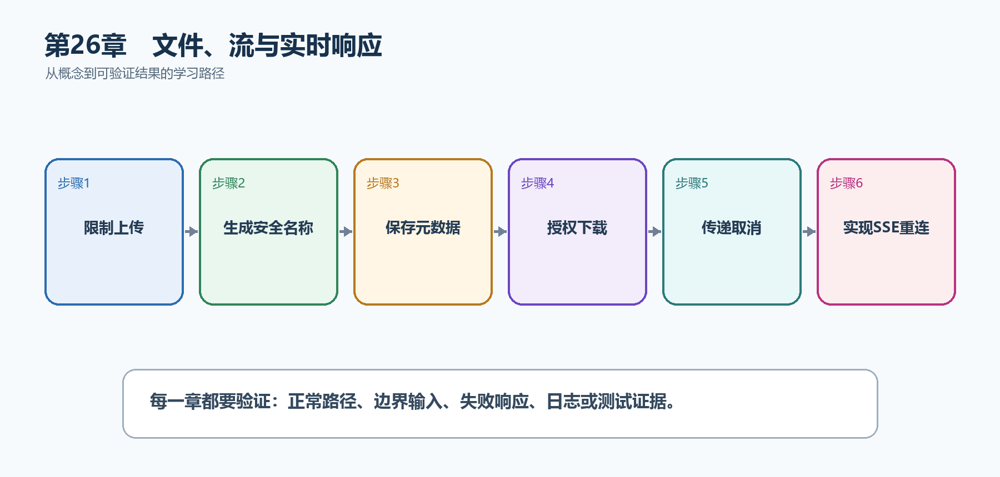

# 第27章　文件、流与实时响应

文件和实时数据不适合全部一次读入内存。安全上传需要限制大小、随机化文件名和隔离存储；下载要授权；流式JSON和SSE则要处理取消、缓冲和断线重连。

  ---------------------------------------------------------------------------------------------------------------------------------------
  **先把三个问题说清楚　**这是什么：文件与流式响应通过Stream、IFormFile、IAsyncEnumerable或SSE逐步传输数据，而不是只返回小型JSON对象。\
  目的是什么：在可控内存和安全边界内上传附件、下载文件并向浏览器推送任务事件。\
  最后得到什么：TaskHub可以安全保存小型附件、授权下载，并通过SSE推送任务状态事件。
  ---------------------------------------------------------------------------------------------------------------------------------------

  ---------------------------------------------------------------------------------------------------------------------------------------

  --------------------------------------------------------------------------------------------
  **本章操作路线　**限制上传 → 生成安全名称 → 保存元数据 → 授权下载 → 传递取消 → 实现SSE重连
  --------------------------------------------------------------------------------------------

  --------------------------------------------------------------------------------------------

{width="6.102362204724409in" height="2.915573053368329in"}

图27-1　文件、流与实时响应从概念到结果的实现路线

## 27.1 先看最终效果

TaskHub可以安全保存小型附件、授权下载，并通过SSE推送任务状态事件。

本章仍然使用TaskHub任务协作API作为落点。请先完成最小成功路径，再故意制造一次失败；只有能解释状态码、日志或测试结果，才算真正掌握。

211. 空文件和超过限制的文件得到400或413。

212. 服务器存储名是随机值，原文件名仅作为元数据。

213. 无权用户下载附件得到403或404。

214. SSE客户端收到多个事件，断开后服务器停止写入。

## 27.2 本章核心示例：限制大小并随机化保存上传文件

本节先展示本章核心写法。若代码定义了所用的全部类型，它可以独立运行；若引用TaskDbContext、TaskEntity、GetTasks等本节没有定义的名称，它就是加入前文TaskHub项目的增量代码，不能直接粘贴到空项目。附录A和附录B提供从空目录开始、能够完整复制运行的项目。

示例27-2　限制大小并随机化保存上传文件

```csharp
app.MapPost("/api/tasks/{taskId:int}/attachments", async (
int taskId,
IFormFile file,
IWebHostEnvironment environment,
CancellationToken ct) =>
{
if (file.Length == 0 || file.Length > 10 * 1024 * 1024)
return Results.BadRequest(new { message = "文件必须在1字节到10MB之间" });

var extension = Path.GetExtension(file.FileName).ToLowerInvariant();
var allowed = new HashSet<string> { ".pdf", ".png", ".jpg" };
if (!allowed.Contains(extension))
return Results.BadRequest(new { message = "不允许的文件类型" });

var storageRoot = Path.Combine(environment.ContentRootPath, "storage");
Directory.CreateDirectory(storageRoot);

var storedName = $"{Guid.NewGuid():N}{extension}";
var path = Path.Combine(storageRoot, storedName);

await using var target = File.Create(path);
await file.CopyToAsync(target, ct);

return Results.Created(
$"/api/attachments/{storedName}",
new { taskId, fileName = file.FileName, storedName, file.Length });
});
```

-   先限制长度和允许扩展名。

-   存储名由服务器随机生成，避免路径穿越和覆盖。

-   storage位于ContentRoot下，不直接暴露为静态文件。

-   CopyToAsync传递请求取消令牌。

  ------------------------------------------------------------------------------------------
  **运行后应该看到什么　**合法文件返回201和随机storedName；空文件、超大文件或.exe得到400。
  ------------------------------------------------------------------------------------------

  ------------------------------------------------------------------------------------------

## 27.3 为什么要这样做

直接使用客户端文件名会产生路径穿越和覆盖风险；把大文件读成byte\[\]会占用大量内存；流开始后再抛异常也无法重新改变状态码。

在TaskHub中，本章把它应用到"上传任务附件并实时推送任务事件"。实现时要明确输入来自哪里、状态在哪里改变、失败怎样返回，以及运维或测试人员从哪里获得证据。

## 27.4 对象存储

这是什么：生产文件通常存入对象存储，数据库只保存对象键、大小、类型和所有者。下载前仍要授权，并使用短期签名URL或后端代理。

## 27.5 IAsyncEnumerable

这是什么：异步枚举让元素边产生边序列化，降低首字节延迟；枚举期间异常发生时响应可能已经开始。

## 27.6 Server-Sent Events

这是什么：SSE通过单向长连接推送事件，.NET 10可用TypedResults.ServerSentEvents；客户端需要重连和事件ID策略。

怎样做：先加入下面的最小配置或处理代码，保存并重新启动应用，再按示例给出的地址或命令验证。

示例27-3　使用.NET 10 TypedResults推送任务事件

```csharp
using System.Net.ServerSentEvents;
using System.Runtime.CompilerServices;

app.MapGet("/api/task-events", () =>
TypedResults.ServerSentEvents(GetEvents()));

static async IAsyncEnumerable<SseItem<object>> GetEvents(
[EnumeratorCancellation] CancellationToken ct = default)
{
for (var i = 1; i <= 5; i++)
{
await Task.Delay(1000, ct);
yield return new SseItem<object>(
new { taskId = i, status = "updated" },
eventType: "task-updated")
{
EventId = i.ToString()
};
}
}
```

-   SSE是服务器到浏览器的单向事件流。

-   EventId帮助客户端重连后判断位置。

-   CancellationToken使浏览器断开后停止循环。

  -------------------------------------------------------------------------------------------
  **预期结果　**浏览器EventSource或curl持续收到task-updated事件；关闭连接后服务器取消枚举。
  -------------------------------------------------------------------------------------------

  -------------------------------------------------------------------------------------------

## 27.7 WebSocket简介

这是什么：WebSocket提供双向长连接，适合双方频繁实时通信。它比SSE复杂，需要连接管理、心跳、扩缩容和消息顺序策略。

## 27.8 最终结果与注意事项

完成本章后，不要只确认项目能够编译。请按下面清单检查运行结果，并保留能够复现的请求、日志或测试。

215. 空文件和超过限制的文件得到400或413。

216. 服务器存储名是随机值，原文件名仅作为元数据。

217. 无权用户下载附件得到403或404。

218. SSE客户端收到多个事件，断开后服务器停止写入。

  -------------------------------------------------------------------------------------------------------------------------------------
  **特别注意　**上传文件放在Web根目录之外；不能只相信扩展名和Content-Type；大文件必须限制请求体并流式复制；流开始后不能可靠更改状态码
  -------------------------------------------------------------------------------------------------------------------------------------

  -------------------------------------------------------------------------------------------------------------------------------------
