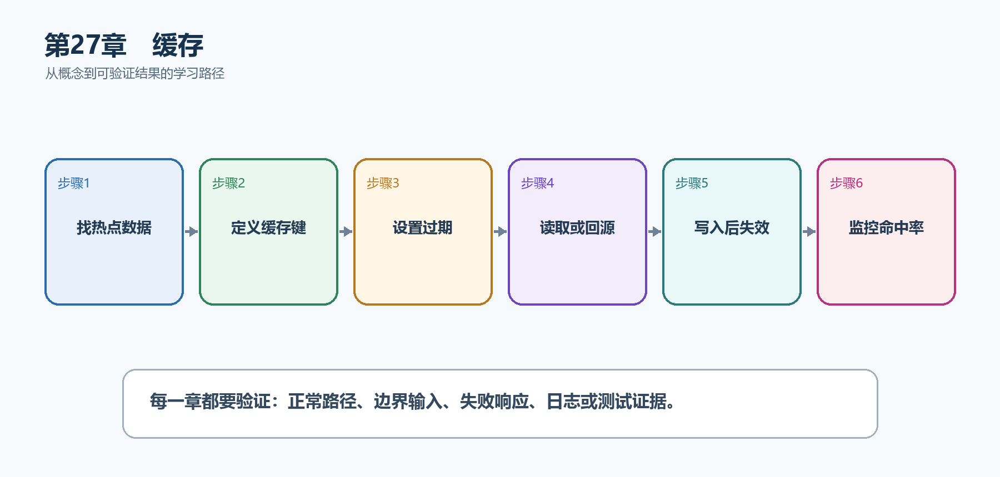

# 第28章　缓存

缓存用更快、更近的副本减少数据库和外部服务压力，但会引入过期、失效和多实例一致性问题。正确做法是先确定可接受的陈旧时间，再选择内存、分布式或输出缓存。

  -------------------------------------------------------------------------------------------------------
  **先把三个问题说清楚　**这是什么：缓存是在权威数据源之外保存可重建副本，以降低延迟和依赖负载。\
  目的是什么：加速热点任务列表和公共只读响应，同时明确写入后怎样失效。\
  最后得到什么：单实例使用IMemoryCache缓存任务详情；公共GET使用Output Cache；写入后主动清除相关缓存键。
  -------------------------------------------------------------------------------------------------------

  -------------------------------------------------------------------------------------------------------

  ---------------------------------------------------------------------------------------------
  **本章操作路线　**找热点数据 → 定义缓存键 → 设置过期 → 读取或回源 → 写入后失效 → 监控命中率
  ---------------------------------------------------------------------------------------------

  ---------------------------------------------------------------------------------------------

{width="6.102362204724409in" height="2.915573053368329in"}

图28-1　缓存从概念到结果的实现路线

## 28.1 先看最终效果

单实例使用IMemoryCache缓存任务详情；公共GET使用Output Cache；写入后主动清除相关缓存键。

本章仍然使用TaskHub任务协作API作为落点。请先完成最小成功路径，再故意制造一次失败；只有能解释状态码、日志或测试结果，才算真正掌握。

219. 第一次读取访问数据库，第二次读取命中缓存。

220. 更新任务后主动Remove，下一次读取获得新值。

221. 已认证或设置Cookie的响应不会被错误公共缓存。

222. 缓存不可用时API能回源或明确降级，而不是丢失权威数据。

## 28.2 本章核心示例：使用IMemoryCache缓存任务详情

本节先展示本章核心写法。若代码定义了所用的全部类型，它可以独立运行；若引用TaskDbContext、TaskEntity、GetTasks等本节没有定义的名称，它就是加入前文TaskHub项目的增量代码，不能直接粘贴到空项目。附录A和附录B提供从空目录开始、能够完整复制运行的项目。

示例28-2　使用IMemoryCache缓存任务详情

```csharp
builder.Services.AddMemoryCache();

app.MapGet("/api/tasks/{id:int}", async (
int id,
IMemoryCache cache,
TaskDbContext db,
CancellationToken ct) =>
{
var key = $"task:{id}";
var task = await cache.GetOrCreateAsync(key, async entry =>
{
entry.AbsoluteExpirationRelativeToNow = TimeSpan.FromMinutes(5);
entry.SlidingExpiration = TimeSpan.FromMinutes(1);

return await db.Tasks
.AsNoTracking()
.Where(x => x.Id == id)
.Select(x => new TaskResponse(x.Id, x.Title, x.Completed))
.SingleOrDefaultAsync(ct);
});

return task is null ? Results.NotFound() : Results.Ok(task);
});
```

-   缓存键包含资源类型和id。

-   GetOrCreateAsync未命中时从数据库加载。

-   绝对和滑动过期共同限制生命周期。

-   只缓存可重建DTO，不缓存DbContext实体跟踪状态。

  ----------------------------------------------------------------------------------------------
  **运行后应该看到什么　**同一进程内第二次读取不再查询数据库；五分钟后或主动Remove后重新回源。
  ----------------------------------------------------------------------------------------------

  ----------------------------------------------------------------------------------------------

## 28.3 为什么要这样做

缓存不能成为唯一数据源。单实例内存缓存不会跨服务器共享，分布式缓存又增加网络和序列化失败。选择前要清楚一致性要求。

在TaskHub中，本章把它应用到"缓存热点任务详情和公共任务列表"。实现时要明确输入来自哪里、状态在哪里改变、失败怎样返回，以及运维或测试人员从哪里获得证据。

## 28.4 分布式缓存

这是什么：多实例共享Redis等外部缓存，序列化版本、网络失败和超时应纳入设计，缓存不可成为唯一数据源。

## 28.5 HTTP缓存

这是什么：ETag、Last-Modified和Cache-Control让客户端或代理复用响应。包含用户私有数据时必须使用private或禁止共享缓存。

## 28.6 缓存模式

这是什么：Cache-Aside由应用先查缓存、未命中再查数据库并回填。写入后要删除或更新对应Key，并明确允许多长时间的旧数据。

## 28.7 缓存穿透、击穿与雪崩

这是什么：空值短期缓存、请求合并、随机过期与限流分别缓解穿透、击穿和雪崩，但根本仍是容量和降级设计。

## 28.8 缓存一致性与失效

这是什么：写入后主动失效或采用版本键，明确可接受的陈旧窗口；不要追求比业务需要更强的一致性。

怎样做：先加入下面的最小配置或处理代码，保存并重新启动应用，再按示例给出的地址或命令验证。

示例28-3　任务更新后主动清除缓存

```csharp
app.MapPut("/api/tasks/{id:int}", async (
int id,
UpdateTaskRequest request,
TaskDbContext db,
IMemoryCache cache,
CancellationToken ct) =>
{
var task = await db.Tasks.FindAsync([id], ct);
if (task is null) return Results.NotFound();

task.Title = request.Title;
await db.SaveChangesAsync(ct);
cache.Remove($"task:{id}");

return Results.NoContent();
});
```

-   先提交权威数据库，再移除副本。

-   下一次读取重新加载新值。

-   多实例时需要分布式缓存或跨实例失效机制。

  -----------------------------------------------------------------------
  **预期结果　**更新后再次GET不会返回旧标题。
  -----------------------------------------------------------------------

  -----------------------------------------------------------------------

## 28.9 最终结果与注意事项

完成本章后，不要只确认项目能够编译。请按下面清单检查运行结果，并保留能够复现的请求、日志或测试。

223. 第一次读取访问数据库，第二次读取命中缓存。

224. 更新任务后主动Remove，下一次读取获得新值。

225. 已认证或设置Cookie的响应不会被错误公共缓存。

226. 缓存不可用时API能回源或明确降级，而不是丢失权威数据。

  ------------------------------------------------------------------------------------------------------------------------------
  **特别注意　**缓存不是权威数据源；缓存键必须包含租户和权限边界；不要缓存带用户秘密的完整响应；避免所有键同一时刻过期造成雪崩
  ------------------------------------------------------------------------------------------------------------------------------

  ------------------------------------------------------------------------------------------------------------------------------
