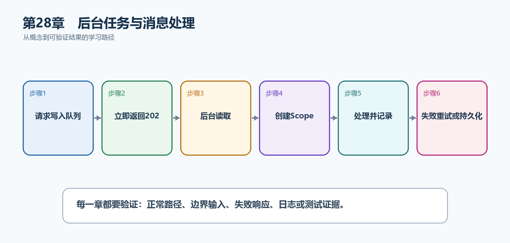

# 第29章　后台任务与消息处理

HTTP请求应该尽快返回，邮件、报表和通知等耗时工作可以交给后台处理。但随意Task.Run会丢失进程生命周期、异常和可靠性；正确方案需要队列、Hosted Service、取消和幂等。

  ----------------------------------------------------------------------------------------------------------------------------
  **先把三个问题说清楚　**这是什么：后台任务是在HTTP请求之外由IHostedService、BackgroundService或消息消费者持续执行的工作。\
  目的是什么：把耗时或可延后的工作从请求路径移出，同时保证重启、失败和重复消息有明确行为。\
  最后得到什么：TaskHub把通知写入有界Channel，由BackgroundService消费；关键任务理解持久消息队列和Outbox边界。
  ----------------------------------------------------------------------------------------------------------------------------

  ----------------------------------------------------------------------------------------------------------------------------

  -----------------------------------------------------------------------------------------------------
  **本章操作路线　**请求写入队列 → 立即返回202 → 后台读取 → 创建Scope → 处理并记录 → 失败重试或持久化
  -----------------------------------------------------------------------------------------------------

  -----------------------------------------------------------------------------------------------------

{width="6.102362204724409in" height="2.915573053368329in"}

图29-1　后台任务与消息处理从概念到结果的实现路线

## 29.1 先看最终效果

TaskHub把通知写入有界Channel，由BackgroundService消费；关键任务理解持久消息队列和Outbox边界。

本章仍然使用TaskHub任务协作API作为落点。请先完成最小成功路径，再故意制造一次失败；只有能解释状态码、日志或测试结果，才算真正掌握。

227. POST通知请求立即返回202，而不是等待邮件发送完成。

228. 后台日志随后记录消息被处理。

229. 应用停止时消费者响应stoppingToken并有序退出。

230. 重复消息不会重复产生不可接受的副作用。

## 29.2 本章核心示例：用有界Channel和BackgroundService处理通知

本节先展示本章核心写法。若代码定义了所用的全部类型，它可以独立运行；若引用TaskDbContext、TaskEntity、GetTasks等本节没有定义的名称，它就是加入前文TaskHub项目的增量代码，不能直接粘贴到空项目。附录A和附录B提供从空目录开始、能够完整复制运行的项目。

示例29-2　用有界Channel和BackgroundService处理通知

```csharp
using System.Threading.Channels;

var builder = WebApplication.CreateBuilder(args);
builder.Services.AddSingleton(Channel.CreateBounded<TaskNotification>(
new BoundedChannelOptions(100)
{
FullMode = BoundedChannelFullMode.Wait
}));
builder.Services.AddHostedService<NotificationWorker>();

var app = builder.Build();

app.MapPost("/api/notifications", async (
TaskNotification message,
Channel<TaskNotification> channel,
CancellationToken ct) =>
{
await channel.Writer.WriteAsync(message, ct);
return Results.Accepted();
});

app.Run();

record TaskNotification(int TaskId, string Message);

sealed class NotificationWorker(
Channel<TaskNotification> channel,
ILogger<NotificationWorker> logger) : BackgroundService
{
protected override async Task ExecuteAsync(CancellationToken stoppingToken)
{
await foreach (var message in
channel.Reader.ReadAllAsync(stoppingToken))
{
try
{
logger.LogInformation(
"处理任务通知 {TaskId}: {Message}",
message.TaskId,
message.Message);
}
catch (Exception ex)
{
logger.LogError(ex,
"任务通知处理失败 {TaskId}", message.TaskId);
}
}
}
}
```

-   有界Channel限制内存队列长度并提供背压。

-   HTTP端点写入消息后返回202 Accepted。

-   BackgroundService持续读取并响应停止令牌。

-   单条失败被隔离，不让整个Worker退出。

  -----------------------------------------------------------------------------
  **运行后应该看到什么　**POST快速得到202；控制台随后出现TaskId对应处理日志。
  -----------------------------------------------------------------------------

  -----------------------------------------------------------------------------

## 29.3 为什么要这样做

请求内Task.Run不受可靠队列保护，进程重启会丢失工作，异常也可能无人观察。有界Channel适合单进程非关键工作；关键业务消息需要持久队列和幂等消费者。

在TaskHub中，本章把它应用到"任务创建后异步发送通知"。实现时要明确输入来自哪里、状态在哪里改变、失败怎样返回，以及运维或测试人员从哪里获得证据。

## 29.4 IHostedService

这是什么：IHostedService提供StartAsync和StopAsync生命周期，适合需要精确启动/停止控制的后台组件。持续循环通常继承BackgroundService更简单。

## 29.5 Scoped服务

这是什么：Hosted Service通常是Singleton，需要用IServiceScopeFactory为每次消息显式创建Scope再解析DbContext等Scoped服务。

怎样做：先加入下面的最小配置或处理代码，保存并重新启动应用，再按示例给出的地址或命令验证。

示例29-3　后台服务中为每条消息创建Scope

```csharp
sealed class DatabaseWorker(
IServiceScopeFactory scopeFactory) : BackgroundService
{
protected override async Task ExecuteAsync(CancellationToken stoppingToken)
{
while (!stoppingToken.IsCancellationRequested)
{
await using var scope = scopeFactory.CreateAsyncScope();
var db = scope.ServiceProvider
.GetRequiredService<TaskDbContext>();

await ProcessNextAsync(db, stoppingToken);
}
}
}
```

-   Hosted Service通常是Singleton，不能直接构造注入Scoped DbContext。

-   每次工作创建并释放AsyncScope。

-   作用域内解析DbContext和业务服务。

  -------------------------------------------------------------------------------
  **预期结果　**每次处理获得独立DbContext，完成后正确释放，不发生生命周期捕获。
  -------------------------------------------------------------------------------

  -------------------------------------------------------------------------------

## 29.6 定时任务

这是什么：简单定时循环要使用PeriodicTimer并响应stoppingToken。多实例部署时还要解决重复执行、错过执行和持久化调度问题。

## 29.7 消息队列

这是什么：持久消息队列把生产者和消费者解耦，并提供重试、死信和削峰。消息格式是长期契约，需要版本和兼容策略。

## 29.8 消费者幂等

这是什么：为可能重试的创建或支付操作接收幂等键，持久化请求指纹与结果，避免网络重试产生重复副作用。

## 29.9 Outbox模式

这是什么：在同一数据库事务写业务数据和待发送消息，再由发布器投递，可避免数据库提交成功但消息丢失。

## 29.10 最终结果与注意事项

完成本章后，不要只确认项目能够编译。请按下面清单检查运行结果，并保留能够复现的请求、日志或测试。

231. POST通知请求立即返回202，而不是等待邮件发送完成。

232. 后台日志随后记录消息被处理。

233. 应用停止时消费者响应stoppingToken并有序退出。

234. 重复消息不会重复产生不可接受的副作用。

  --------------------------------------------------------------------------------------------------------------------------------------------------------------------
  **特别注意　**不要在请求中随意Task.Run；BackgroundService通常是Singleton，使用Scoped服务要创建Scope；进程内Channel重启会丢数据；关键消息需要持久队列、幂等和Outbox
  --------------------------------------------------------------------------------------------------------------------------------------------------------------------

  --------------------------------------------------------------------------------------------------------------------------------------------------------------------
