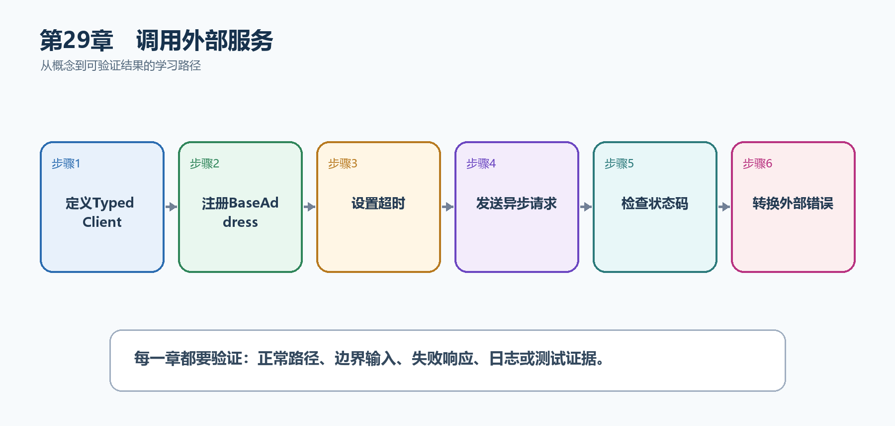

# 第30章　调用外部服务

现代API经常调用邮件、支付、地图或其他微服务。直接每次new HttpClient会导致连接管理问题；没有超时、取消和失败转换又会让外部故障拖垮本服务。

  --------------------------------------------------------------------------------------------------------------------------------
  **先把三个问题说清楚　**这是什么：IHttpClientFactory集中创建和配置HttpClient，管理Handler生命周期并接入日志、超时和弹性策略。\
  目的是什么：可靠调用外部任务评分服务，把外部错误限制在明确边界，并转换为本API稳定响应。\
  最后得到什么：TaskHub使用Typed Client调用外部服务，设置BaseAddress和超时，传递CancellationToken，并对短暂失败采用受控重试。
  --------------------------------------------------------------------------------------------------------------------------------

  --------------------------------------------------------------------------------------------------------------------------------

  ------------------------------------------------------------------------------------------------------------
  **本章操作路线　**定义Typed Client → 注册BaseAddress → 设置超时 → 发送异步请求 → 检查状态码 → 转换外部错误
  ------------------------------------------------------------------------------------------------------------

  ------------------------------------------------------------------------------------------------------------

{width="6.102362204724409in" height="2.915573053368329in"}

图30-1　调用外部服务从概念到结果的实现路线

## 30.1 先看最终效果

TaskHub使用Typed Client调用外部服务，设置BaseAddress和超时，传递CancellationToken，并对短暂失败采用受控重试。

本章仍然使用TaskHub任务协作API作为落点。请先完成最小成功路径，再故意制造一次失败；只有能解释状态码、日志或测试结果，才算真正掌握。

235. 外部200响应被反序列化为强类型DTO。

236. 外部404或400被转换为本API可理解错误。

237. 超时或客户端取消会停止外部请求。

238. 模拟短暂503，确认只有允许的幂等请求按策略重试。

## 30.2 本章核心示例：注册并使用Typed HttpClient

本节先展示本章核心写法。若代码定义了所用的全部类型，它可以独立运行；若引用TaskDbContext、TaskEntity、GetTasks等本节没有定义的名称，它就是加入前文TaskHub项目的增量代码，不能直接粘贴到空项目。附录A和附录B提供从空目录开始、能够完整复制运行的项目。

示例30-2　注册并使用Typed HttpClient

```csharp
var builder = WebApplication.CreateBuilder(args);

builder.Services.AddHttpClient<TaskScoreClient>(client =>
{
client.BaseAddress = new Uri(
builder.Configuration["ScoreApi:BaseUrl"]
?? throw new InvalidOperationException("缺少ScoreApi:BaseUrl"));
client.Timeout = TimeSpan.FromSeconds(3);
});

var app = builder.Build();

app.MapGet("/api/tasks/{id:int}/score", async (
int id,
TaskScoreClient client,
CancellationToken ct) =>
{
var score = await client.GetScoreAsync(id, ct);
return score is null ? Results.NotFound() : Results.Ok(score);
});

app.Run();

sealed class TaskScoreClient(HttpClient httpClient)
{
public async Task<TaskScore?> GetScoreAsync(
int taskId,
CancellationToken ct)
{
using var response = await httpClient.GetAsync(
$"api/scores/{taskId}", ct);

if (response.StatusCode == HttpStatusCode.NotFound)
return null;

response.EnsureSuccessStatusCode();
return await response.Content
.ReadFromJsonAsync<TaskScore>(cancellationToken: ct);
}
}

record TaskScore(int TaskId, int Value);
```

-   BaseAddress和Timeout集中在注册位置。

-   Typed Client封装外部协议，不让端点直接处理URL细节。

-   CancellationToken贯穿GetAsync和JSON读取。

-   404被转换为null，其他非成功响应由异常边界处理。

  -------------------------------------------------------------------------------------------------------------
  **运行后应该看到什么　**外部成功时本API返回评分；外部404时返回404；三秒无响应时请求超时并进入统一错误处理。
  -------------------------------------------------------------------------------------------------------------

  -------------------------------------------------------------------------------------------------------------

## 30.3 为什么要这样做

HttpClient应该复用底层连接，IHttpClientFactory负责Handler轮换。重试只能用于短暂且安全的失败；对非幂等POST盲目重试会重复副作用。

在TaskHub中，本章把它应用到"调用外部任务评分服务并返回评分"。实现时要明确输入来自哪里、状态在哪里改变、失败怎样返回，以及运维或测试人员从哪里获得证据。

## 30.4 Named Client

这是什么：Named Client用字符串名称集中配置BaseAddress、Header和Handler。客户端较复杂时优先Typed Client，减少调用方记忆名称和细节。

## 30.5 重试

这是什么：只重试短暂失败并采用指数退避与抖动；非幂等请求默认不应自动重试，否则可能重复写入。

怎样做：先加入下面的最小配置或处理代码，保存并重新启动应用，再按示例给出的地址或命令验证。

示例30-3　准备依赖或执行命令

```bash
dotnet add package Microsoft.Extensions.Http.Resilience
```

示例30-4　为幂等外部调用加入标准弹性策略

```csharp
builder.Services
.AddHttpClient<TaskScoreClient>(client =>
{
client.BaseAddress = new Uri(scoreApiBaseUrl);
})
.AddStandardResilienceHandler(options =>
{
options.TotalRequestTimeout.Timeout = TimeSpan.FromSeconds(10);
options.AttemptTimeout.Timeout = TimeSpan.FromSeconds(2);
options.Retry.MaxRetryAttempts = 2;
});
```

-   总超时限制整个调用，AttemptTimeout限制单次尝试。

-   标准处理器包含重试、熔断和超时等默认策略。

-   只对确定安全的请求启用重试，写操作要结合幂等键。

  ---------------------------------------------------------------------------
  **预期结果　**短暂失败最多重试2次；超过总超时后快速失败，不无限占用连接。
  ---------------------------------------------------------------------------

  ---------------------------------------------------------------------------

## 30.6 熔断与限流

这是什么：当失败率超过阈值时暂时拒绝调用，让依赖恢复并保护本服务线程与连接池；半开探测决定是否恢复。

## 30.7 响应处理

这是什么：外部响应先检查状态码、Content-Type和大小，再反序列化。失败响应也可能有结构化错误体，读取时要保留取消令牌。

## 30.8 外部错误转换

这是什么：把第三方超时、限流和无效响应转换为本系统稳定的错误语义，同时记录上游名称和Trace。不要把第三方内部错误原样暴露给客户端。

## 30.9 最终结果与注意事项

完成本章后，不要只确认项目能够编译。请按下面清单检查运行结果，并保留能够复现的请求、日志或测试。

239. 外部200响应被反序列化为强类型DTO。

240. 外部404或400被转换为本API可理解错误。

241. 超时或客户端取消会停止外部请求。

242. 模拟短暂503，确认只有允许的幂等请求按策略重试。

  ----------------------------------------------------------------------------------------------------------------------------------------
  **特别注意　**不要每个请求new HttpClient；所有外部调用必须有超时和取消；非幂等请求默认不要自动重试；不要把外部响应细节原样泄露给客户端
  ----------------------------------------------------------------------------------------------------------------------------------------

  ----------------------------------------------------------------------------------------------------------------------------------------
