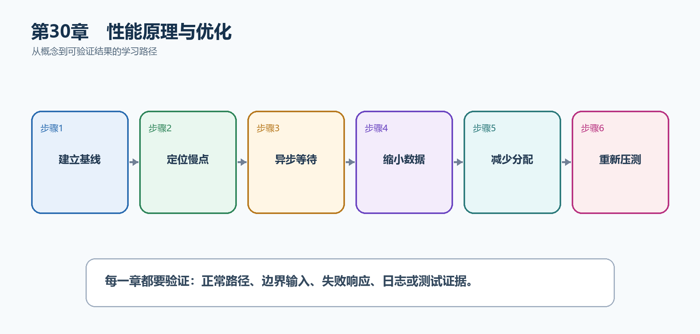

# 第31章　性能原理与优化

性能优化首先是测量，不是猜测。API延迟可能来自数据库、外部HTTP、同步阻塞、序列化、分配或部署配置。先找到占比最高的瓶颈，再用基准和负载测试证明改动。

  ---------------------------------------------------------------------------------------------------------------
  **先把三个问题说清楚　**这是什么：性能优化是在正确性和可维护性前提下，通过测量降低延迟、资源消耗并提高吞吐。\
  目的是什么：让TaskHub在并发请求下仍保持稳定延迟，避免线程池饥饿、过量查询和大对象分配。\
  最后得到什么：热点端点使用异步I/O、数据库投影、受限分页和响应压缩，并建立可重复负载基线。
  ---------------------------------------------------------------------------------------------------------------

  ---------------------------------------------------------------------------------------------------------------

  -----------------------------------------------------------------------------------
  **本章操作路线　**建立基线 → 定位慢点 → 异步等待 → 缩小数据 → 减少分配 → 重新压测
  -----------------------------------------------------------------------------------

  -----------------------------------------------------------------------------------

{width="6.102362204724409in" height="2.915573053368329in"}

图31-1　性能原理与优化从概念到结果的实现路线

## 31.1 先看最终效果

热点端点使用异步I/O、数据库投影、受限分页和响应压缩，并建立可重复负载基线。

本章仍然使用TaskHub任务协作API作为落点。请先完成最小成功路径，再故意制造一次失败；只有能解释状态码、日志或测试结果，才算真正掌握。

243. 记录优化前P50、P95、错误率、CPU和内存。

244. 确认端点没有.Result、.Wait()或无界并发。

245. 数据库只选择响应需要的列，并限制pageSize。

246. 相同负载再次测试，确认收益且没有契约回归。

## 31.2 本章核心示例：异步投影和受限分页

本节先展示本章核心写法。若代码定义了所用的全部类型，它可以独立运行；若引用TaskDbContext、TaskEntity、GetTasks等本节没有定义的名称，它就是加入前文TaskHub项目的增量代码，不能直接粘贴到空项目。附录A和附录B提供从空目录开始、能够完整复制运行的项目。

示例31-2　异步投影和受限分页

```csharp
app.MapGet("/api/tasks", async (
int page = 1,
int pageSize = 20,
TaskDbContext db,
CancellationToken ct) =>
{
if (page < 1 || pageSize is < 1 or > 100)
return Results.BadRequest();

var items = await db.Tasks
.AsNoTracking()
.OrderBy(x => x.Id)
.Skip((page - 1) * pageSize)
.Take(pageSize)
.Select(x => new TaskResponse(
x.Id,
x.Title,
x.Completed))
.ToListAsync(ct);

return Results.Ok(items);
});
```

-   ToListAsync等待数据库I/O时释放请求线程。

-   AsNoTracking降低只读查询跟踪开销。

-   Select在数据库端只读取需要列。

-   限制pageSize防止单请求拉取过多数据。

  ---------------------------------------------------------------------------------------------
  **运行后应该看到什么　**数据库SQL只选择Id、Title、Completed；并发时线程不会被同步等待占满。
  ---------------------------------------------------------------------------------------------

  ---------------------------------------------------------------------------------------------

## 31.3 为什么要这样做

局部微优化可能对端到端没有作用。同步等待异步结果会阻塞线程，加载整张表会浪费数据库和网络；任何优化都要对比修改前后相同负载。

在TaskHub中，本章把它应用到"优化任务列表和外部依赖调用的延迟"。实现时要明确输入来自哪里、状态在哪里改变、失败怎样返回，以及运维或测试人员从哪里获得证据。

## 31.4 Minimal API执行原理

这是什么：请求经过Kestrel和中间件后，由路由选择端点，再完成参数绑定、Filter、处理器和结果写出。知道链路后才能判断优化应放在哪一层。

## 31.5 线程池饥饿

这是什么：同步阻塞、长CPU任务和无界并发会造成线程池饥饿，表现为延迟陡增而CPU未必满载。

## 31.6 内存分配

这是什么：高频路径中的临时字符串、大对象和不必要集合会增加GC压力。先用dotnet-counters或Profiler确认分配热点，再决定是否优化。

## 31.7 JSON优化

这是什么：优先缩小DTO和启用流式，再考虑源生成序列化；不要为少量收益牺牲契约清晰度。

## 31.8 响应压缩

这是什么：响应压缩减少文本和JSON传输量，但会消耗CPU，对已压缩图片收益很小。经HTTPS启用时还要评估敏感内容与压缩侧信道。

怎样做：先加入下面的最小配置或处理代码，保存并重新启动应用，再按示例给出的地址或命令验证。

示例31-3　为合适内容启用响应压缩

```csharp
builder.Services.AddResponseCompression(options =>
{
options.EnableForHttps = true;
});

var app = builder.Build();
app.UseResponseCompression();
```

-   压缩减少JSON和文本传输字节。

-   中间件应在产生响应的端点之前。

-   小响应和已压缩文件不一定有明显收益。

  ----------------------------------------------------------------------------------------------
  **预期结果　**客户端发送Accept-Encoding后，合适响应包含Content-Encoding；对比传输大小和CPU。
  ----------------------------------------------------------------------------------------------

  ----------------------------------------------------------------------------------------------

## 31.9 Native AOT

这是什么：Native AOT把IL预编译为特定平台本机代码，启动快且内存小，但反射和动态加载受限，依赖必须经过AOT分析。

怎样做：先加入下面的最小配置或处理代码，保存并重新启动应用，再按示例给出的地址或命令验证。

示例31-4　准备依赖或执行命令

```bash
dotnet publish -c Release -r linux-x64 -p:PublishAot=true
```

示例31-5　发布Native AOT前先检查兼容性

```xml
<PropertyGroup>
<PublishAot>true</PublishAot>
</PropertyGroup>
```

-   AOT把IL预编译为特定平台本机代码。

-   启动和内存可能改善，但反射和动态加载受到限制。

-   必须处理AOT分析警告并运行发布产物测试。

  ------------------------------------------------------------------------------------
  **预期结果　**兼容项目生成平台本机可执行文件；启动指标与普通发布对比后再决定采用。
  ------------------------------------------------------------------------------------

  ------------------------------------------------------------------------------------

## 31.10 Benchmark与压力测试

这是什么：BenchmarkDotNet用于稳定比较小段代码，压力测试用于观察真实HTTP吞吐、延迟和资源饱和。两者回答的问题不同。

## 31.11 性能回归检查

这是什么：保存基准场景、数据规模和P95/P99阈值，在版本升级后重复运行。平均值正常并不代表尾延迟没有恶化。

## 31.12 最终结果与注意事项

完成本章后，不要只确认项目能够编译。请按下面清单检查运行结果，并保留能够复现的请求、日志或测试。

247. 记录优化前P50、P95、错误率、CPU和内存。

248. 确认端点没有.Result、.Wait()或无界并发。

249. 数据库只选择响应需要的列，并限制pageSize。

250. 相同负载再次测试，确认收益且没有契约回归。

  -------------------------------------------------------------------------------------------------------------------------------
  **特别注意　**先测量再优化；不要用Task.Run包装同步I/O；Native AOT和Trim必须验证依赖兼容性；性能收益不能以破坏契约和安全为代价
  -------------------------------------------------------------------------------------------------------------------------------

  -------------------------------------------------------------------------------------------------------------------------------
