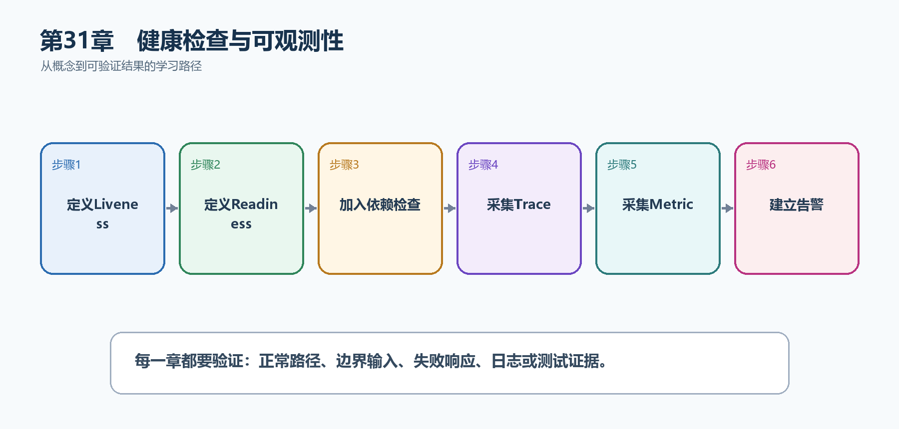

# 第32章　健康检查与可观测性

健康检查告诉编排系统能否继续接收流量；可观测性通过日志、指标和追踪解释为什么慢、哪里失败。三者需要共享Trace ID并围绕稳定业务语义。

  --------------------------------------------------------------------------------------------------------------------
  **先把三个问题说清楚　**这是什么：健康检查报告依赖状态；可观测性通过Logs、Metrics和Traces从外部推断系统内部行为。\
  目的是什么：让运维平台自动摘除故障实例，让开发者沿一次请求定位数据库和外部服务耗时。\
  最后得到什么：TaskHub提供/live和/ready，数据库检查只影响Readiness；OpenTelemetry导出ASP.NET Core和HttpClient追踪。
  --------------------------------------------------------------------------------------------------------------------

  --------------------------------------------------------------------------------------------------------------------

  ---------------------------------------------------------------------------------------------------
  **本章操作路线　**定义Liveness → 定义Readiness → 加入依赖检查 → 采集Trace → 采集Metric → 建立告警
  ---------------------------------------------------------------------------------------------------

  ---------------------------------------------------------------------------------------------------

{width="6.102362204724409in" height="2.915573053368329in"}

图32-1　健康检查与可观测性从概念到结果的实现路线

## 32.1 先看最终效果

TaskHub提供/live和/ready，数据库检查只影响Readiness；OpenTelemetry导出ASP.NET Core和HttpClient追踪。

本章仍然使用TaskHub任务协作API作为落点。请先完成最小成功路径，再故意制造一次失败；只有能解释状态码、日志或测试结果，才算真正掌握。

251. /health/live在进程健康时返回200。

252. 数据库不可用时/health/ready失败，但live仍可正常。

253. 一次外部调用在追踪后端显示父子Span。

254. 告警同时考虑错误率、延迟和持续时间，避免单点噪声。

## 32.2 本章核心示例：配置Liveness和Readiness

本节先展示本章核心写法。若代码定义了所用的全部类型，它可以独立运行；若引用TaskDbContext、TaskEntity、GetTasks等本节没有定义的名称，它就是加入前文TaskHub项目的增量代码，不能直接粘贴到空项目。附录A和附录B提供从空目录开始、能够完整复制运行的项目。

示例32-1　准备项目或安装依赖

```bash
dotnet add package Microsoft.Extensions.Diagnostics.HealthChecks.EntityFrameworkCore
```

示例32-2　配置Liveness和Readiness

```csharp
using Microsoft.AspNetCore.Diagnostics.HealthChecks;
using Microsoft.Extensions.Diagnostics.HealthChecks;

builder.Services.AddHealthChecks()
.AddDbContextCheck<TaskDbContext>(
"database",
failureStatus: HealthStatus.Unhealthy,
tags: ["ready"]);

var app = builder.Build();

app.MapHealthChecks("/health/live", new HealthCheckOptions
{
Predicate = _ => false
});

app.MapHealthChecks("/health/ready", new HealthCheckOptions
{
Predicate = registration => registration.Tags.Contains("ready")
});
```

-   live不执行外部依赖检查，只确认进程可响应。

-   ready只执行带ready标签的检查。

-   数据库故障使实例停止接收新流量，但不一定触发重启循环。

  -------------------------------------------------------------------------------------
  **运行后应该看到什么　**正常时两个端点均为200；断开数据库后ready失败而live仍为200。
  -------------------------------------------------------------------------------------

  -------------------------------------------------------------------------------------

## 32.3 为什么要这样做

把数据库短暂故障算成Liveness会导致实例反复重启；只看日志又难以发现整体趋势。健康探针和遥测各有职责。

在TaskHub中，本章把它应用到"报告应用存活、数据库就绪并关联请求追踪"。实现时要明确输入来自哪里、状态在哪里改变、失败怎样返回，以及运维或测试人员从哪里获得证据。

## 32.4 自定义Health Check

这是什么：实现IHealthCheck检查确实影响就绪状态的依赖，并设置短超时。不要把昂贵业务查询塞进每次健康检查。

## 32.5 可观测性三支柱

这是什么：日志、指标和Trace分别描述事件、趋势和调用链。统一资源名称、环境和TraceId后才能在工具中互相跳转。

## 32.6 分布式追踪

这是什么：Activity和OpenTelemetry为一次跨服务调用生成Trace与Span。HTTP和数据库客户端通常可自动埋点，业务关键步骤再补自定义Span。

## 32.7 指标

这是什么：指标是可聚合数字，如请求数、错误率和耗时直方图。标签只能使用有限枚举，不能把用户ID等高基数字段当标签。

## 32.8 日志关联

这是什么：把Activity.TraceId或HttpContext.TraceIdentifier加入日志作用域，错误响应也返回同一标识。用户报错后即可按ID定位记录。

## 32.9 采样与成本

这是什么：采样控制可观测性成本，但错误与高价值请求可能需要保留；头部采样无法预知请求最终是否失败。

## 32.10 告警

这是什么：告警应基于用户影响和持续时间，例如错误率或P95延迟连续超阈值。每个告警要有负责人、仪表板和处理步骤。

## 32.11 最终结果与注意事项

完成本章后，不要只确认项目能够编译。请按下面清单检查运行结果，并保留能够复现的请求、日志或测试。

255. /health/live在进程健康时返回200。

256. 数据库不可用时/health/ready失败，但live仍可正常。

257. 一次外部调用在追踪后端显示父子Span。

258. 告警同时考虑错误率、延迟和持续时间，避免单点噪声。

  ----------------------------------------------------------------------------------------------------------------------------------
  **特别注意　**Liveness不要依赖所有外部系统；健康端点不要泄露连接字符串；遥测字段要控制基数和成本；采样策略不能让关键错误完全消失
  ----------------------------------------------------------------------------------------------------------------------------------

  ----------------------------------------------------------------------------------------------------------------------------------
