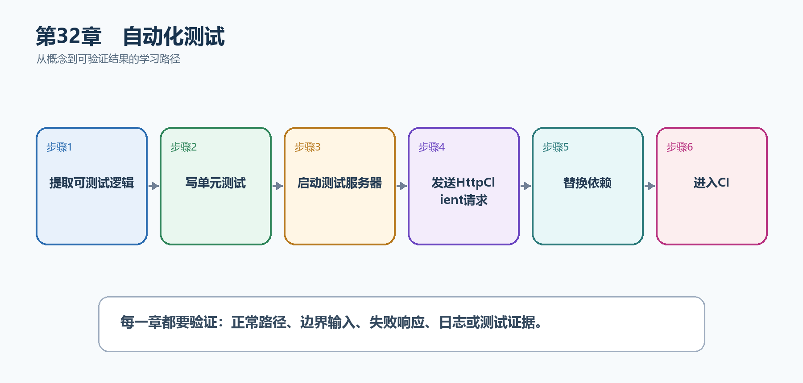

# 第33章　自动化测试

人工点击Swagger适合探索，但不能保证每次修改后所有契约仍正确。自动化测试把业务规则、HTTP管道、数据库和关键用户旅程分层验证，并在CI中重复执行。

  ---------------------------------------------------------------------------------------------------------------
  **先把三个问题说清楚　**这是什么：自动化测试是可重复执行的代码，用断言验证业务逻辑、端点契约和系统集成行为。\
  目的是什么：在代码合并和部署前发现路由、绑定、状态码、授权和数据库回归。\
  最后得到什么：TaskHub具有快速单元测试和WebApplicationFactory集成测试；测试会验证200、404、401和JSON契约。
  ---------------------------------------------------------------------------------------------------------------

  ---------------------------------------------------------------------------------------------------------------

  ---------------------------------------------------------------------------------------------------------
  **本章操作路线　**提取可测试逻辑 → 写单元测试 → 启动测试服务器 → 发送HttpClient请求 → 替换依赖 → 进入CI
  ---------------------------------------------------------------------------------------------------------

  ---------------------------------------------------------------------------------------------------------

{width="6.102362204724409in" height="2.915573053368329in"}

图33-1　自动化测试从概念到结果的实现路线

## 33.1 先看最终效果

TaskHub具有快速单元测试和WebApplicationFactory集成测试；测试会验证200、404、401和JSON契约。

本章仍然使用TaskHub任务协作API作为落点。请先完成最小成功路径，再故意制造一次失败；只有能解释状态码、日志或测试结果，才算真正掌握。

259. dotnet test在本机和CI中均通过。

260. 集成测试真实经过路由、绑定、Filter和JSON序列化。

261. 测试数据彼此隔离，不依赖执行顺序。

262. OpenAPI或公共DTO破坏性变化会使契约检查失败。

## 33.2 本章核心示例：使用WebApplicationFactory测试真实HTTP管道

本节先展示本章核心写法。若代码定义了所用的全部类型，它可以独立运行；若引用TaskDbContext、TaskEntity、GetTasks等本节没有定义的名称，它就是加入前文TaskHub项目的增量代码，不能直接粘贴到空项目。附录A和附录B提供从空目录开始、能够完整复制运行的项目。

示例33-1　准备项目或安装依赖

```bash
dotnet new xunit -n TaskHub.Api.Tests -f net10.0
dotnet add TaskHub.Api.Tests reference TaskHub.Api
dotnet add TaskHub.Api.Tests package Microsoft.AspNetCore.Mvc.Testing
```

示例33-2　使用WebApplicationFactory测试真实HTTP管道

```csharp
// API项目Program.cs末尾加入
public partial class Program { }

// 测试项目
using System.Net;
using System.Net.Http.Json;
using Microsoft.AspNetCore.Mvc.Testing;

public sealed class TaskApiTests
: IClassFixture<WebApplicationFactory<Program>>
{
private readonly HttpClient _client;

public TaskApiTests(WebApplicationFactory<Program> factory)
{
_client = factory.CreateClient();
}

[Fact]
public async Task Get_missing_task_returns_404()
{
var response = await _client.GetAsync("/api/tasks/99999");
Assert.Equal(HttpStatusCode.NotFound, response.StatusCode);
}

[Fact]
public async Task Create_task_returns_201_and_location()
{
var response = await _client.PostAsJsonAsync(
"/api/tasks",
new { title = "集成测试创建" });

Assert.Equal(HttpStatusCode.Created, response.StatusCode);
Assert.NotNull(response.Headers.Location);
}
}
```

-   partial Program让测试项目引用顶级语句生成的Program。

-   WebApplicationFactory在测试进程启动真实ASP.NET Core管道。

-   HttpClient验证状态码、路由和响应头。

-   测试不需要占用真实公网端口。

  ---------------------------------------------------------------------------------------
  **运行后应该看到什么　**dotnet test执行两个测试；404和201契约发生变化时测试明确失败。
  ---------------------------------------------------------------------------------------

  ---------------------------------------------------------------------------------------

## 33.3 为什么要这样做

端点代码编译通过不代表运行契约正确。测试金字塔用大量快速单元测试覆盖规则，较少集成测试覆盖框架和数据库，少量端到端测试覆盖关键旅程。

在TaskHub中，本章把它应用到"自动验证任务创建、读取和授权"。实现时要明确输入来自哪里、状态在哪里改变、失败怎样返回，以及运维或测试人员从哪里获得证据。

## 33.4 Handler测试

这是什么：把处理器写成命名方法后，可直接传入假依赖并断言TypedResults具体类型。它比集成测试快，但不覆盖路由和序列化。

## 33.5 替换依赖

这是什么：测试中通过WithWebHostBuilder删除真实外部服务并注册Fake。只替换不稳定边界，路由、绑定和中间件仍走真实管道。

怎样做：先加入下面的最小配置或处理代码，保存并重新启动应用，再按示例给出的地址或命令验证。

示例33-3　在测试中替换外部服务

```html
var factory = originalFactory.WithWebHostBuilder(builder =>
{
builder.ConfigureServices(services =>
{
services.RemoveAll<ITaskScoreClient>();
services.AddSingleton<ITaskScoreClient>(
new FakeTaskScoreClient(score: 80));
});
});

var client = factory.CreateClient();
```

-   测试服务器仍运行真实HTTP管道。

-   只替换不稳定的外部依赖。

-   Fake返回固定结果，使测试快速且可重复。

  -----------------------------------------------------------------------
  **预期结果　**测试不访问真实评分服务，并能稳定验证本API的结果转换。
  -----------------------------------------------------------------------

  -----------------------------------------------------------------------

## 33.6 数据库测试

这是什么：数据库测试要选择真实数据库容器、SQLite或专用测试库，并在每个测试前后隔离数据。EF InMemory不等同于关系数据库语义。

## 33.7 Testcontainers

这是什么：用短生命周期真实数据库容器提高SQL兼容性，测试间使用独立数据库、事务或唯一模式隔离数据。

## 33.8 认证授权测试

这是什么：至少覆盖匿名401、已登录无权403、合法用户成功和资源级越权。测试令牌应由测试专用认证方案生成。

## 33.9 OpenAPI契约测试

这是什么：在CI生成并比较OpenAPI，识别删除端点、收紧必填或改变类型等破坏性变更。

## 33.10 端到端测试

这是什么：端到端测试从浏览器或外部客户端经过部署环境验证关键旅程，数量应少而稳定。不要用它替代更快的单元和集成测试。

## 33.11 测试数据隔离

这是什么：每个测试使用唯一数据库、事务回滚或明确清理，不能依赖执行顺序。并行测试还要避免共享端口、文件和用户。

## 33.12 最终结果与注意事项

完成本章后，不要只确认项目能够编译。请按下面清单检查运行结果，并保留能够复现的请求、日志或测试。

263. dotnet test在本机和CI中均通过。

264. 集成测试真实经过路由、绑定、Filter和JSON序列化。

265. 测试数据彼此隔离，不依赖执行顺序。

266. OpenAPI或公共DTO破坏性变化会使契约检查失败。

  --------------------------------------------------------------------------------------------------------------------------------
  **特别注意　**不要只测试实现细节；集成测试必须隔离数据库和配置；避免依赖真实外部服务造成不稳定；失败测试要能说明哪个契约被破坏
  --------------------------------------------------------------------------------------------------------------------------------

  --------------------------------------------------------------------------------------------------------------------------------
