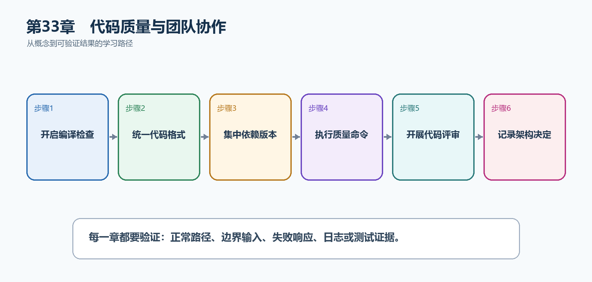

# 第34章　代码质量与团队协作

项目能运行只是起点。多人长期维护时，空引用、被忽略的警告、不同格式和随意升级的依赖，都会把小问题拖成生产故障。本章把质量要求变成编译器、格式化工具和团队流程能够自动检查的规则。

  -----------------------------------------------------------------------------------------------------------------------------------------------------------------------------------------
  **先把三个问题说清楚　**这是什么：代码质量工具是一组自动约束：Nullable检查可能的空引用，Analyzer检查代码规则，EditorConfig统一格式，集中包管理统一依赖版本，评审清单统一团队判断标准。\
  目的是什么：让问题尽量在编写、编译和合并代码时被发现，而不是上线以后依靠用户发现。\
  最后得到什么：TaskHub项目启用Nullable、最新分析规则和警告即错误，并能用固定命令完成格式、构建和测试检查。
  -----------------------------------------------------------------------------------------------------------------------------------------------------------------------------------------

  -----------------------------------------------------------------------------------------------------------------------------------------------------------------------------------------

  -----------------------------------------------------------------------------------------------------------
  **本章操作路线　**开启编译检查 → 统一代码格式 → 集中依赖版本 → 执行质量命令 → 开展代码评审 → 记录架构决定
  -----------------------------------------------------------------------------------------------------------

  -----------------------------------------------------------------------------------------------------------

{width="6.102362204724409in" height="2.915573053368329in"}

图34-1　代码质量与团队协作从概念到结果的实现路线

## 34.1 先看最终效果

TaskHub项目启用Nullable、最新分析规则和警告即错误，并能用固定命令完成格式、构建和测试检查。

本章仍然使用TaskHub任务协作API作为落点。请先完成最小成功路径，再故意制造一次失败；只有能解释状态码、日志或测试结果，才算真正掌握。

267. dotnet build在没有警告时成功，有警告时明确失败。

268. dotnet format \--verify-no-changes能够检查但不偷偷改动文件。

269. 所有项目从Directory.Packages.props读取同一个包版本。

270. 合并请求能够说明API兼容性、测试证据和安全影响。

## 34.2 本章核心示例：把基础质量规则写进项目文件

本节先展示本章核心写法。若代码定义了所用的全部类型，它可以独立运行；若引用TaskDbContext、TaskEntity、GetTasks等本节没有定义的名称，它就是加入前文TaskHub项目的增量代码，不能直接粘贴到空项目。附录A和附录B提供从空目录开始、能够完整复制运行的项目。

示例34-2　把基础质量规则写进项目文件

```xml
<PropertyGroup>
<TargetFramework>net10.0</TargetFramework>
<Nullable>enable</Nullable>
<ImplicitUsings>enable</ImplicitUsings>
<AnalysisLevel>latest</AnalysisLevel>
<TreatWarningsAsErrors>true</TreatWarningsAsErrors>
</PropertyGroup>
```

-   Nullable让编译器区分string和string?，提前发现可能的空引用。

-   AnalysisLevel=latest启用当前SDK提供的最新代码分析规则。

-   TreatWarningsAsErrors使本地构建和CI都不能忽略警告。

  ----------------------------------------------------------------------------------------
  **运行后应该看到什么　**保存项目文件后执行dotnet build；干净项目显示0个警告、0个错误。
  ----------------------------------------------------------------------------------------

  ----------------------------------------------------------------------------------------

## 34.3 为什么要这样做

只写在团队约定里的规则容易被忘记；写进项目文件、.editorconfig和流水线后，每台电脑都会用同一标准检查。警告即错误应先在新项目或清理完警告后开启，避免团队一次面对大量历史问题。

在TaskHub中，本章把它应用到"让每次任务API改动都通过同一套质量门禁"。实现时要明确输入来自哪里、状态在哪里改变、失败怎样返回，以及运维或测试人员从哪里获得证据。

## 34.4 EditorConfig

这是什么：用EditorConfig统一格式和诊断级别，使IDE与CI得到同一结果，减少代码审查中的风格噪声。

怎样做：先加入下面的最小配置或处理代码，保存并重新启动应用，再按示例给出的地址或命令验证。

示例34-3　在仓库根目录统一C#格式

```text
root = true

[*.cs]
charset = utf-8
indent_style = space
indent_size = 4
end_of_line = crlf
insert_final_newline = true

dotnet_sort_system_directives_first = true
dotnet_diagnostic.IDE0005.severity = warning
```

-   root=true表示不再继续向父目录查找规则。

-   IDE0005把多余using作为警告，由构建门禁统一处理。

  -----------------------------------------------------------------------------------
  **预期结果　**Visual Studio和VS Code会读取同一文件，dotnet format也使用这些规则。
  -----------------------------------------------------------------------------------

  -----------------------------------------------------------------------------------

## 34.5 NuGet管理

这是什么：只从可信源还原包，定期执行dotnet list package \--outdated和\--vulnerable。提交项目文件和锁定策略，避免开发机依赖不同。

## 34.6 Central Package Management

这是什么：在Directory.Packages.props集中定义版本，各项目只声明包名。升级一次即可让解决方案保持一致，并在CI验证。

怎样做：先加入下面的最小配置或处理代码，保存并重新启动应用，再按示例给出的地址或命令验证。

示例34-4　用一个文件管理整个解决方案的NuGet版本

```xml
<!-- Directory.Packages.props -->
<Project>
<PropertyGroup>
<ManagePackageVersionsCentrally>true</ManagePackageVersionsCentrally>
</PropertyGroup>
<ItemGroup>
<PackageVersion Include="Microsoft.EntityFrameworkCore.Sqlite" Version="10.0.0" />
<PackageVersion Include="Microsoft.AspNetCore.Mvc.Testing" Version="10.0.0" />
</ItemGroup>
</Project>

<!-- TaskHub.Api.csproj：只写包名，不重复写版本 -->
<ItemGroup>
<PackageReference Include="Microsoft.EntityFrameworkCore.Sqlite" />
</ItemGroup>
```

-   Directory.Packages.props放在解决方案根目录。

-   各项目只声明需要哪个包，版本由根文件统一决定。

  ----------------------------------------------------------------------------
  **预期结果　**dotnet restore成功，多个项目不会意外引用同一个包的不同版本。
  ----------------------------------------------------------------------------

  ----------------------------------------------------------------------------

## 34.7 Git工作流

这是什么：保持分支短小、提交可解释，并通过Pull Request合并。不要把密钥、bin、obj和本地数据库提交到仓库。

## 34.8 Code Review清单

这是什么：审查重点是正确性、安全、可维护性、契约兼容和测试证据，不只检查格式。

怎样做：先加入下面的最小配置或处理代码，保存并重新启动应用，再按示例给出的地址或命令验证。

示例34-5　提交前和评审时使用同一组检查命令

```bash
dotnet restore
dotnet format --verify-no-changes
dotnet build --no-restore
dotnet test --no-build
```

-   restore只解析一次依赖。

-   format检查格式，build检查编译和分析器，test检查行为。

-   评审还要确认接口是否兼容、是否泄露敏感信息、是否有测试证据。

  -----------------------------------------------------------------------
  **预期结果　**四条命令全部返回退出码0，才具备提交合并的基础条件。
  -----------------------------------------------------------------------

  -----------------------------------------------------------------------

## 34.9 架构决策记录

这是什么：ADR用一页记录背景、决定、备选和后果。它解释为什么这样设计，避免几个月后只剩代码却没人知道原因。

## 34.10 API兼容性

这是什么：删除路径、字段或收紧必填通常是破坏性变化。发布前比较OpenAPI并提供弃用期、版本或兼容转换。

## 34.11 最终结果与注意事项

完成本章后，不要只确认项目能够编译。请按下面清单检查运行结果，并保留能够复现的请求、日志或测试。

271. dotnet build在没有警告时成功，有警告时明确失败。

272. dotnet format \--verify-no-changes能够检查但不偷偷改动文件。

273. 所有项目从Directory.Packages.props读取同一个包版本。

274. 合并请求能够说明API兼容性、测试证据和安全影响。

  -----------------------------------------------------------------------------------------------------------------------------------------------------------
  **特别注意　**不要为了通过构建而全局关闭警告；格式规则要由工具执行，不要在评审中反复争论空格；依赖升级必须同时构建和测试；破坏性API改动需要版本或迁移方案
  -----------------------------------------------------------------------------------------------------------------------------------------------------------

  -----------------------------------------------------------------------------------------------------------------------------------------------------------
