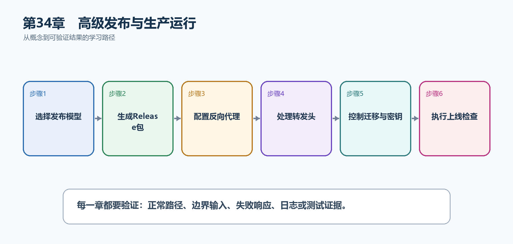

# 第35章　高级发布与生产运行

开发环境的dotnet run不是生产部署方案。生产发布要决定运行时是否随包携带、是否生成单文件、能否裁剪，并正确处理反向代理、退出信号、数据库迁移、配置和密钥。

  ---------------------------------------------------------------------------------------------------------------------------------------------
  **先把三个问题说清楚　**这是什么：发布是把源代码编译成目标机器可运行的文件；生产运行则负责代理转发、进程生命周期、配置、密钥和数据库变化。\
  目的是什么：得到可重复、可审计、能够安全启动和停止的部署包，而不是把开发目录复制到服务器。\
  最后得到什么：TaskHub能够生成Release发布目录，在反向代理后识别真实协议，并在停止时完成有序退出。
  ---------------------------------------------------------------------------------------------------------------------------------------------

  ---------------------------------------------------------------------------------------------------------------------------------------------

  ------------------------------------------------------------------------------------------------------------
  **本章操作路线　**选择发布模型 → 生成Release包 → 配置反向代理 → 处理转发头 → 控制迁移与密钥 → 执行上线检查
  ------------------------------------------------------------------------------------------------------------

  ------------------------------------------------------------------------------------------------------------

{width="6.102362204724409in" height="2.915573053368329in"}

图35-1　高级发布与生产运行从概念到结果的实现路线

## 35.1 先看最终效果

TaskHub能够生成Release发布目录，在反向代理后识别真实协议，并在停止时完成有序退出。

本章仍然使用TaskHub任务协作API作为落点。请先完成最小成功路径，再故意制造一次失败；只有能解释状态码、日志或测试结果，才算真正掌握。

275. 发布目录中的应用可以在一个干净目录启动。

276. 经反向代理访问时生成的HTTPS链接和客户端IP正确。

277. 停止服务时新请求被停止接收，正在执行的请求有机会完成。

278. 生产配置不包含提交到仓库的明文密钥。

## 35.2 本章核心示例：选择一种发布模型并生成部署包

本节先展示本章核心写法。若代码定义了所用的全部类型，它可以独立运行；若引用TaskDbContext、TaskEntity、GetTasks等本节没有定义的名称，它就是加入前文TaskHub项目的增量代码，不能直接粘贴到空项目。附录A和附录B提供从空目录开始、能够完整复制运行的项目。

示例35-2　选择一种发布模型并生成部署包

```bash
# 方案A：框架依赖发布，服务器需要.NET 10运行时
dotnet publish -c Release -o .\publish\framework-dependent

# 方案B：Windows x64自包含单文件
dotnet publish -c Release -r win-x64 --self-contained true `
-p:PublishSingleFile=true -o .\publish\win-x64

# 方案C：Linux x64自包含并启用ReadyToRun
dotnet publish -c Release -r linux-x64 --self-contained true `
-p:PublishReadyToRun=true -o .\publish\linux-x64
```

-   -c Release使用发布优化配置。

-   -r指定目标操作系统和CPU，目标必须与服务器一致。

-   单文件便于分发；ReadyToRun可减少部分启动JIT时间，但包会变大。

  ------------------------------------------------------------------------------------------
  **运行后应该看到什么　**三个输出目录分别出现可部署文件；选择与服务器匹配的一种进行交付。
  ------------------------------------------------------------------------------------------

  ------------------------------------------------------------------------------------------

## 35.3 为什么要这样做

框架依赖发布体积小但服务器要安装匹配运行时；自包含发布携带运行时但包更大；单文件、ReadyToRun、Trim和Native AOT各自解决不同问题，不能把所有开关同时打开后就认为更快。

在TaskHub中，本章把它应用到"把任务API从开发电脑可靠地交付到生产服务器"。实现时要明确输入来自哪里、状态在哪里改变、失败怎样返回，以及运维或测试人员从哪里获得证据。

## 35.4 反向代理

这是什么：Nginx、IIS或云入口处理公网TLS、域名和转发，Kestrel运行应用。应用要信任明确代理并正确读取转发头。

## 35.5 Forwarded Headers

这是什么：反向代理后Scheme和RemoteIp来自转发头，只信任已配置代理网络，防止客户端伪造。

怎样做：先加入下面的最小配置或处理代码，保存并重新启动应用，再按示例给出的地址或命令验证。

示例35-3　在已知反向代理后恢复真实协议和IP

```csharp
using System.Net;
using Microsoft.AspNetCore.HttpOverrides;

builder.Services.Configure<ForwardedHeadersOptions>(options =>
{
options.ForwardedHeaders =
ForwardedHeaders.XForwardedFor |
ForwardedHeaders.XForwardedProto;
options.KnownProxies.Add(IPAddress.Parse("10.0.0.10"));
});

var app = builder.Build();
app.UseForwardedHeaders(); // 应放在重定向、认证等依赖协议/IP的组件之前
app.UseHttpsRedirection();
```

-   反向代理终止HTTPS后，应用看到的内部连接可能是HTTP。

-   KnownProxies限制只有指定代理发送的转发头可信。

-   UseForwardedHeaders必须放在读取Scheme或RemoteIpAddress的逻辑之前。

  -----------------------------------------------------------------------------------------------
  **预期结果　**经10.0.0.10代理访问时，Request.Scheme为https，RemoteIpAddress为真实客户端地址。
  -----------------------------------------------------------------------------------------------

  -----------------------------------------------------------------------------------------------

## 35.6 优雅关闭

这是什么：收到终止信号后停止接收新流量、等待在途请求与后台任务到安全点，并设置有限关闭超时。

怎样做：先加入下面的最小配置或处理代码，保存并重新启动应用，再按示例给出的地址或命令验证。

示例35-4　让后台服务响应停止信号

```csharp
sealed class CleanupWorker(ILogger<CleanupWorker> logger)
: BackgroundService
{
protected override async Task ExecuteAsync(CancellationToken stoppingToken)
{
try
{
while (!stoppingToken.IsCancellationRequested)
await Task.Delay(TimeSpan.FromSeconds(10), stoppingToken);
}
catch (OperationCanceledException) when (stoppingToken.IsCancellationRequested)
{
logger.LogInformation("收到停止信号，后台任务正在退出");
}
}
}
```

-   主机停止时会取消stoppingToken。

-   所有可取消的异步操作都应接收这个令牌。

-   因正常停止产生的OperationCanceledException不应记录为系统故障。

  -----------------------------------------------------------------------
  **预期结果　**停止进程时出现有序退出日志，不再启动新一轮后台工作。
  -----------------------------------------------------------------------

  -----------------------------------------------------------------------

## 35.7 数据库迁移

这是什么：迁移记录模型到数据库的演进，生产应在发布阶段审查并应用，不要让所有应用实例争抢执行结构变更。

## 35.8 配置与密钥

这是什么：发布包应与环境无关；环境差异通过配置注入。普通配置可进部署清单，秘密值进入受控密钥存储。

## 35.9 发布检查表

这是什么：检查表覆盖构建、测试、配置、迁移、健康、监控和回滚。每项要有可重复命令或证据，不能只写'已确认'。

怎样做：先加入下面的最小配置或处理代码，保存并重新启动应用，再按示例给出的地址或命令验证。

示例35-5　发布前执行可重复检查

```bash
dotnet restore
dotnet build -c Release --no-restore
dotnet test -c Release --no-build
dotnet publish -c Release --no-build -o .\publish

# 在发布目录启动后检查存活端点
Invoke-WebRequest http://localhost:5000/health/live
```

-   本示例先使用普通restore，保证没有锁文件的新项目也能运行；团队若提交packages.lock.json，再在CI改用\--locked-mode阻止依赖漂移。

-   构建、测试和发布使用同一个Release产物。

-   健康检查验证的不只是文件存在，而是进程真正可响应。

  -------------------------------------------------------------------------------
  **预期结果　**命令全部成功，健康端点返回2xx；发布包、配置和回滚包都已准备好。
  -------------------------------------------------------------------------------

  -------------------------------------------------------------------------------

## 35.10 最终结果与注意事项

完成本章后，不要只确认项目能够编译。请按下面清单检查运行结果，并保留能够复现的请求、日志或测试。

279. 发布目录中的应用可以在一个干净目录启动。

280. 经反向代理访问时生成的HTTPS链接和客户端IP正确。

281. 停止服务时新请求被停止接收，正在执行的请求有机会完成。

282. 生产配置不包含提交到仓库的明文密钥。

  -----------------------------------------------------------------------------------------------------------------------------------------------
  **特别注意　**Trim可能删除反射需要的类型；Forwarded Headers只能信任已知代理；不要让每个实例同时自动迁移生产数据库；发布前要保留可回滚的旧版本
  -----------------------------------------------------------------------------------------------------------------------------------------------

  -----------------------------------------------------------------------------------------------------------------------------------------------
