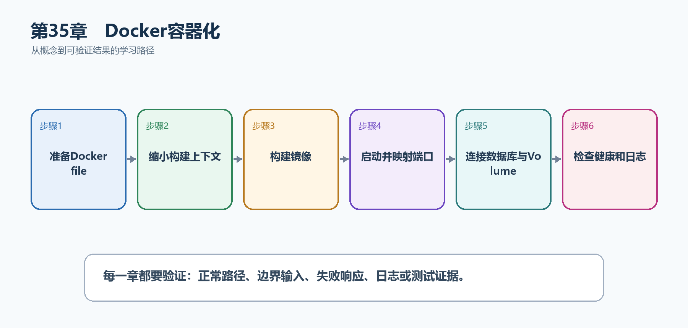

# 第36章　Docker容器化

容器把应用、运行时和启动方式装进同一个镜像，使开发、测试和生产使用同一交付物。Docker不是虚拟机，也不会自动解决安全和数据持久化问题；镜像分层、非Root运行、网络和Volume都要明确配置。

  ----------------------------------------------------------------------------------------------------------------------------------------------------------
  **先把三个问题说清楚　**这是什么：Docker镜像是只读的应用模板，容器是镜像启动后的隔离进程；Dockerfile描述如何构建镜像，Compose描述多个服务如何一起运行。\
  目的是什么：让TaskHub在任何安装了兼容容器运行时的机器上用相同命令启动，并把数据库等依赖编排在一起。\
  最后得到什么：使用.NET 10多阶段Dockerfile构建小型运行镜像，以非Root用户运行，并通过Compose连接PostgreSQL。
  ----------------------------------------------------------------------------------------------------------------------------------------------------------

  ----------------------------------------------------------------------------------------------------------------------------------------------------------

  ---------------------------------------------------------------------------------------------------------------------
  **本章操作路线　**准备Dockerfile → 缩小构建上下文 → 构建镜像 → 启动并映射端口 → 连接数据库与Volume → 检查健康和日志
  ---------------------------------------------------------------------------------------------------------------------

  ---------------------------------------------------------------------------------------------------------------------

{width="6.102362204724409in" height="2.915573053368329in"}

图36-1　Docker容器化从概念到结果的实现路线

## 36.1 先看最终效果

使用.NET 10多阶段Dockerfile构建小型运行镜像，以非Root用户运行，并通过Compose连接PostgreSQL。

本章仍然使用TaskHub任务协作API作为落点。请先完成最小成功路径，再故意制造一次失败；只有能解释状态码、日志或测试结果，才算真正掌握。

283. docker build成功且最终镜像使用aspnet:10.0。

284. 访问http://localhost:8080/health/live返回成功。

285. 容器内进程不是root用户。

286. 重建数据库容器后，命名Volume中的数据仍存在。

## 36.2 本章核心示例：创建.NET 10多阶段Dockerfile

本节先展示本章核心写法。若代码定义了所用的全部类型，它可以独立运行；若引用TaskDbContext、TaskEntity、GetTasks等本节没有定义的名称，它就是加入前文TaskHub项目的增量代码，不能直接粘贴到空项目。附录A和附录B提供从空目录开始、能够完整复制运行的项目。

示例36-2　创建.NET 10多阶段Dockerfile

```text
# 构建阶段：包含SDK，用来还原、编译和发布
FROM mcr.microsoft.com/dotnet/sdk:10.0 AS build
WORKDIR /src
COPY *.csproj ./
RUN dotnet restore
COPY . .
RUN dotnet publish -c Release -o /app/publish --no-restore

# 运行阶段：只包含ASP.NET Core运行时
FROM mcr.microsoft.com/dotnet/aspnet:10.0 AS final
WORKDIR /app
COPY --from=build /app/publish .
USER $APP_UID
ENV ASPNETCORE_HTTP_PORTS=8080
EXPOSE 8080
ENTRYPOINT ["dotnet", "TaskHub.Api.dll"]
```

-   先复制csproj并restore，使源代码变化时仍可复用依赖缓存层。

-   最终阶段不包含SDK，镜像更小。

-   官方.NET镜像提供APP_UID，USER让应用不以root运行。

-   程序集名要与实际项目名一致。

  ----------------------------------------------------------------------------------------------
  **运行后应该看到什么　**把Dockerfile放在.csproj同级目录后，docker build可以生成TaskHub镜像。
  ----------------------------------------------------------------------------------------------

  ----------------------------------------------------------------------------------------------

## 36.3 为什么要这样做

直接使用SDK镜像运行会带入编译工具并增大攻击面。多阶段构建在SDK阶段编译，在更小的ASP.NET运行时阶段启动；容器文件系统可被替换，持久数据必须放在数据库或Volume中。

在TaskHub中，本章把它应用到"把API和运行环境打包成可重复部署的容器镜像"。实现时要明确输入来自哪里、状态在哪里改变、失败怎样返回，以及运维或测试人员从哪里获得证据。

## 36.4 配置和密钥

这是什么：容器镜像保持不变，配置在启动时通过环境变量、挂载文件或密钥服务注入。不要把.env和密码COPY进镜像。

## 36.5 容器网络

这是什么：同一Compose网络中的服务用服务名互相访问，localhost只表示当前容器。宿主机端口映射与容器内部端口是两套概念。

## 36.6 Volume

这是什么：容器可随时替换，数据库和上传文件等持久数据必须放在Volume或外部服务。删除Volume通常意味着永久删除数据。

## 36.7 Docker Compose

这是什么：Compose适合本地编排API、数据库与缓存，配置和网络关系可复现但不等同生产编排平台。

怎样做：先加入下面的最小配置或处理代码，保存并重新启动应用，再按示例给出的地址或命令验证。

示例36-3　让API和PostgreSQL一起启动

```text
services:
api:
build: .
ports:
- "8080:8080"
environment:
ConnectionStrings__TaskDb: Host=db;Database=taskhub;Username=taskhub;Password=${TASKHUB_DB_PASSWORD}
depends_on:
db:
condition: service_healthy

db:
image: postgres:17
environment:
POSTGRES_DB: taskhub
POSTGRES_USER: taskhub
POSTGRES_PASSWORD: ${TASKHUB_DB_PASSWORD}
volumes:
- taskhub-data:/var/lib/postgresql/data
healthcheck:
test: ["CMD-SHELL", "pg_isready -U taskhub -d taskhub"]
interval: 5s
timeout: 3s
retries: 10

volumes:
taskhub-data:
```

-   服务名db会成为容器网络中的主机名，所以连接字符串使用Host=db。

-   双下划线把环境变量映射成配置层级。

-   密码从外部环境变量注入，不写死在Compose文件。

-   命名Volume保存数据库数据。

  ------------------------------------------------------------------------------------------------------
  **预期结果　**设置TASKHUB_DB_PASSWORD后执行docker compose up \--build，API等待数据库健康并开始运行。
  ------------------------------------------------------------------------------------------------------

  ------------------------------------------------------------------------------------------------------

## 36.8 健康检查

这是什么：健康端点面向编排器而不是用户；Liveness只判断进程能否继续，Readiness判断当前能否承接流量。

## 36.9 镜像安全

这是什么：使用受支持的精简基础镜像、非Root用户和固定版本，定期重建并扫描。镜像中不包含编译工具、密钥和调试文件。

## 36.10 日志与排错

这是什么：容器应用把结构化日志写到标准输出，平台负责收集。先看容器状态、退出码、健康检查和最近日志，再进入容器诊断。

怎样做：先加入下面的最小配置或处理代码，保存并重新启动应用，再按示例给出的地址或命令验证。

示例36-4　构建、启动和查看日志

```bash
$env:TASKHUB_DB_PASSWORD = "仅用于本机演示的密码"
docker compose up --build -d
docker compose ps
docker compose logs api --tail 100
Invoke-WebRequest http://localhost:8080/health/live
docker compose down
```

-   ps查看容器状态，logs查看应用标准输出。

-   down删除容器和网络，但默认保留命名Volume。

-   若确实要删除演示数据，必须明确知道down -v会删除Volume。

  -----------------------------------------------------------------------------------------
  **预期结果　**API和数据库均为running/healthy，健康检查返回2xx，日志中没有循环重启错误。
  -----------------------------------------------------------------------------------------

  -----------------------------------------------------------------------------------------

## 36.11 最终结果与注意事项

完成本章后，不要只确认项目能够编译。请按下面清单检查运行结果，并保留能够复现的请求、日志或测试。

287. docker build成功且最终镜像使用aspnet:10.0。

288. 访问http://localhost:8080/health/live返回成功。

289. 容器内进程不是root用户。

290. 重建数据库容器后，命名Volume中的数据仍存在。

  -----------------------------------------------------------------------------------------------------------------------------------------
  **特别注意　**不要把密钥COPY进镜像；不要把数据库写在API容器临时文件系统；镜像标签要可追溯，不要只用latest；生产环境应固定并扫描基础镜像
  -----------------------------------------------------------------------------------------------------------------------------------------

  -----------------------------------------------------------------------------------------------------------------------------------------
