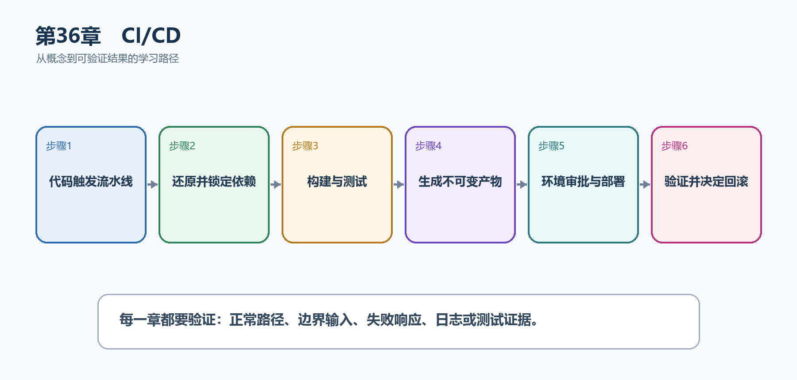

# 第37章　CI/CD

CI/CD把本地能够完成的还原、编译、测试、打包和部署检查变成服务器上的固定流水线。它的核心不是某个云平台，而是每次提交都得到同样、可追溯的验证结果。

  -----------------------------------------------------------------------------------------------------------------------------------------------------------
  **先把三个问题说清楚　**这是什么：CI持续集成负责在代码变化时自动构建和测试；CD持续交付或部署负责生成不可变产物，并按批准的规则把同一产物推进到不同环境。\
  目的是什么：减少人工漏项，让错误尽早失败，让每次部署都能追溯到提交、测试结果、镜像和配置。\
  最后得到什么：TaskHub的GitHub Actions流水线能够还原、构建、测试、发布并保存产物，部署后执行健康验证。
  -----------------------------------------------------------------------------------------------------------------------------------------------------------

  -----------------------------------------------------------------------------------------------------------------------------------------------------------

  -------------------------------------------------------------------------------------------------------------------
  **本章操作路线　**代码触发流水线 → 还原并锁定依赖 → 构建与测试 → 生成不可变产物 → 环境审批与部署 → 验证并决定回滚
  -------------------------------------------------------------------------------------------------------------------

  -------------------------------------------------------------------------------------------------------------------

{width="6.102362204724409in" height="2.915573053368329in"}

图37-1　CI/CD从概念到结果的实现路线

## 37.1 先看最终效果

TaskHub的GitHub Actions流水线能够还原、构建、测试、发布并保存产物，部署后执行健康验证。

本章仍然使用TaskHub任务协作API作为落点。请先完成最小成功路径，再故意制造一次失败；只有能解释状态码、日志或测试结果，才算真正掌握。

291. 推送或合并请求会自动触发流水线。

292. 任一构建或测试失败都会阻止后续发布。

293. 产物名称包含提交标识，能够追溯来源。

294. 部署后健康检查失败时停止晋级并保留回滚路径。

## 37.2 本章核心示例：创建最小但完整的GitHub Actions CI

本节先展示本章核心写法。若代码定义了所用的全部类型，它可以独立运行；若引用TaskDbContext、TaskEntity、GetTasks等本节没有定义的名称，它就是加入前文TaskHub项目的增量代码，不能直接粘贴到空项目。附录A和附录B提供从空目录开始、能够完整复制运行的项目。

示例37-2　创建最小但完整的GitHub Actions CI

```bash
name: taskhub-ci

on:
push:
branches: [ main ]
pull_request:

jobs:
build-test-publish:
runs-on: ubuntu-latest
steps:
- uses: actions/checkout@v4
- uses: actions/setup-dotnet@v4
with:
dotnet-version: '10.0.x'
- name: Restore
run: dotnet restore
- name: Build
run: dotnet build -c Release --no-restore
- name: Test
run: dotnet test -c Release --no-build
- name: Publish
run: dotnet publish src/TaskHub.Api/TaskHub.Api.csproj -c Release --no-build -o artifacts/api
- name: Upload artifact
uses: actions/upload-artifact@v4
with:
name: taskhub-api-${{ github.sha }}
path: artifacts/api
```

-   工作流文件保存为.github/workflows/ci.yml。

-   setup-dotnet提供干净的.NET 10环境。

-   每一步失败都会终止作业。

-   产物名带提交SHA，部署时能准确知道来源。

  ---------------------------------------------------------------------------------------------------
  **运行后应该看到什么　**推送代码后，仓库Actions页面出现一次运行；全部步骤为绿色并产生可下载产物。
  ---------------------------------------------------------------------------------------------------

  ---------------------------------------------------------------------------------------------------

## 37.3 为什么要这样做

在开发电脑上手工运行几条命令不能证明仓库在干净环境中可重现。CI从空白运行器开始；CD应部署CI已经验证过的同一产物，而不是到服务器重新拉代码和编译。

在TaskHub中，本章把它应用到"建立从提交到可回滚生产版本的自动交付链路"。实现时要明确输入来自哪里、状态在哪里改变、失败怎样返回，以及运维或测试人员从哪里获得证据。

## 37.4 生成OpenAPI

这是什么：CI可以启动刚发布的应用并下载OpenAPI，作为前端和契约检查产物。生成失败或契约意外变化应阻止发布。

怎样做：先加入下面的最小配置或处理代码，保存并重新启动应用，再按示例给出的地址或命令验证。

示例37-3　把接口契约作为流水线产物检查

```bash
- name: Start API
run: |
dotnet artifacts/api/TaskHub.Api.dll --urls http://127.0.0.1:5080 &
echo $! > api.pid
- name: Wait and download OpenAPI
run: |
for i in {1..30}; do
curl --fail http://127.0.0.1:5080/openapi/v1.json -o artifacts/openapi.json && break
sleep 1
done
test -s artifacts/openapi.json
```

-   先启动刚发布的应用，再通过真实HTTP地址下载文档。

-   循环等待解决应用启动与curl并发造成的偶发失败。

-   可把文档与基线比较，发现意外删除的路径或字段。

  ----------------------------------------------------------------------------
  **预期结果　**artifacts/openapi.json存在且非空，可交给前端或契约检查工具。
  ----------------------------------------------------------------------------

  ----------------------------------------------------------------------------

## 37.5 构建与扫描镜像

这是什么：镜像只构建一次，使用提交SHA和摘要标识，然后进行漏洞与秘密扫描。不同环境推进同一镜像，不能重新编译。

## 37.6 环境晋级

这是什么：同一镜像或发布包从测试晋级到生产，仅注入环境配置；不要在各环境重新编译不同二进制。

## 37.7 数据库迁移

这是什么：迁移记录模型到数据库的演进，生产应在发布阶段审查并应用，不要让所有应用实例争抢执行结构变更。

## 37.8 发布策略

这是什么：滚动、蓝绿和金丝雀在成本、回滚速度与流量控制上不同，选择必须结合状态兼容性。

## 37.9 部署后验证

这是什么：部署成功只表示平台接受了命令，还要检查Readiness和一个只读业务端点。失败时停止放量并按预案回滚。

怎样做：先加入下面的最小配置或处理代码，保存并重新启动应用，再按示例给出的地址或命令验证。

示例37-4　部署后检查健康和一个只读业务端点

```text
$baseUrl = "https://api.example.com"

$health = Invoke-WebRequest "$baseUrl/health/ready"
if ($health.StatusCode -ne 200) { throw "Readiness检查失败" }

$tasks = Invoke-RestMethod "$baseUrl/api/tasks?page=1&pageSize=1"
if ($null -eq $tasks) { throw "任务查询没有返回有效JSON" }
```

-   Readiness检查应用及关键依赖是否可接收流量。

-   再请求一个无副作用的业务端点，确认路由、认证外围和数据库读取链路。

-   任何失败都应阻止继续放量。

  ---------------------------------------------------------------------------------------------
  **预期结果　**健康端点返回200，任务端点返回可解析JSON；否则流水线失败并触发人工或自动回滚。
  ---------------------------------------------------------------------------------------------

  ---------------------------------------------------------------------------------------------

## 37.10 自动回滚

这是什么：回滚由错误率、延迟和健康指标触发，但数据库破坏性迁移通常无法仅靠旧版本二进制回滚。

怎样做：先加入下面的最小配置或处理代码，保存并重新启动应用，再按示例给出的地址或命令验证。

示例37-5　记录每次部署必须保留的信息

```text
版本：提交SHA或语义化版本
产物：不可变镜像摘要或发布包校验值
配置：配置版本号（不记录秘密值）
迁移：数据库迁移编号及向后兼容说明
验证：健康检查、冒烟测试、关键指标
回滚：上一稳定产物、执行人、触发条件
```

-   回滚不是重新构建旧代码，而是重新部署已验证的旧产物。

-   若新版本已执行不兼容数据库迁移，单纯回滚应用可能失败。

-   自动回滚需要以错误率、延迟和健康状态等客观条件触发。

  --------------------------------------------------------------------------------
  **预期结果　**任意生产版本都能回答从哪里来、验证过什么、怎样回到上一稳定版本。
  --------------------------------------------------------------------------------

  --------------------------------------------------------------------------------

## 37.11 最终结果与注意事项

完成本章后，不要只确认项目能够编译。请按下面清单检查运行结果，并保留能够复现的请求、日志或测试。

295. 推送或合并请求会自动触发流水线。

296. 任一构建或测试失败都会阻止后续发布。

297. 产物名称包含提交标识，能够追溯来源。

298. 部署后健康检查失败时停止晋级并保留回滚路径。

  --------------------------------------------------------------------------------------------------------------------------------------------
  **特别注意　**密钥只能放在CI平台的秘密存储；不要在日志打印令牌和连接字符串；数据库迁移要兼容滚动发布与回滚；生产部署应有环境审批和最小权限
  --------------------------------------------------------------------------------------------------------------------------------------------

  --------------------------------------------------------------------------------------------------------------------------------------------
