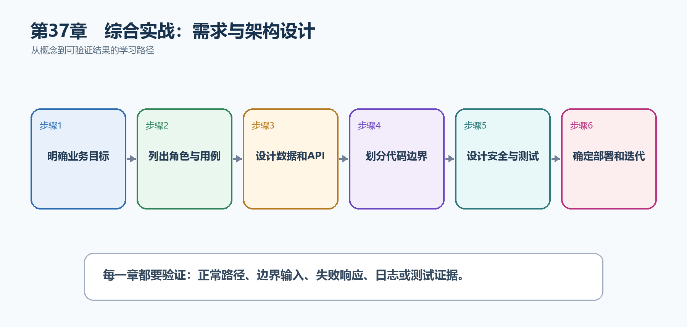

# 第38章　综合实战：需求与架构设计

综合实战不从Program.cs开始，而从'要解决什么问题、谁来使用、什么结果算成功'开始。本章设计TaskHub：用户加入项目，在项目中创建、分派和跟踪任务，并通过权限、审计和通知保证协作过程清楚可追溯。

  ----------------------------------------------------------------------------------------------------------------------------------
  **先把三个问题说清楚　**这是什么：需求与架构设计是把业务目标转换为角色、用例、数据模型、API契约、项目边界、质量要求和部署拓扑。\
  目的是什么：在编码前发现含糊规则和高成本冲突，让后面的实现、测试和交付都围绕同一组可验收目标。\
  最后得到什么：得到TaskHub的角色权限表、核心数据模型、API清单、分层目录、测试策略和两周迭代计划。
  ----------------------------------------------------------------------------------------------------------------------------------

  ----------------------------------------------------------------------------------------------------------------------------------

  ------------------------------------------------------------------------------------------------------------------
  **本章操作路线　**明确业务目标 → 列出角色与用例 → 设计数据和API → 划分代码边界 → 设计安全与测试 → 确定部署和迭代
  ------------------------------------------------------------------------------------------------------------------

  ------------------------------------------------------------------------------------------------------------------

{width="6.102362204724409in" height="2.915573053368329in"}

图38-1　综合实战：需求与架构设计从概念到结果的实现路线

## 38.1 先看最终效果

得到TaskHub的角色权限表、核心数据模型、API清单、分层目录、测试策略和两周迭代计划。

本章仍然使用TaskHub任务协作API作为落点。请先完成最小成功路径，再故意制造一次失败；只有能解释状态码、日志或测试结果，才算真正掌握。

299. 每个功能需求都有角色、前置条件、成功结果和失败结果。

300. 每个公开API都有方法、路径、输入、成功状态码和主要错误。

301. 数据模型能表达项目成员、任务负责人、评论和审计关系。

302. 第一迭代能够交付一条端到端的最小业务路径。

## 38.2 本章核心示例：先写清楚最小可交付需求

本节先展示本章核心写法。若代码定义了所用的全部类型，它可以独立运行；若引用TaskDbContext、TaskEntity、GetTasks等本节没有定义的名称，它就是加入前文TaskHub项目的增量代码，不能直接粘贴到空项目。附录A和附录B提供从空目录开始、能够完整复制运行的项目。

示例38-2　先写清楚最小可交付需求

```text
项目名称：TaskHub

业务目标：
让一个小团队在同一项目中创建、分派、更新和讨论任务。

第一版角色：
1. 系统用户：登录、查看自己参与的项目。
2. 项目成员：查看项目任务，创建任务和评论。
3. 项目管理员：邀请成员、分派任务、归档项目。

第一条端到端验收路径：
管理员创建项目 → 邀请成员 → 成员创建任务 →
管理员分派任务 → 负责人完成任务 → 系统保留审计记录。

明确不做：
即时聊天、甘特图、计费、多租户自定义域名。
```

-   目标说明系统带来的业务结果。

-   角色决定谁能执行哪些动作。

-   验收路径把多个页面和API串成可验证结果。

-   明确不做可以控制第一版范围。

  ----------------------------------------------------------------------------------------
  **运行后应该看到什么　**团队能够用同一句话解释第一版做什么，并能逐步演示完整业务路径。
  ----------------------------------------------------------------------------------------

  ----------------------------------------------------------------------------------------

## 38.3 为什么要这样做

如果直接围绕页面或数据库表写端点，权限边界、错误语义和事务规则会散落在代码里。先写可验收需求，再选择最简单的架构，可以避免为了'看起来先进'而增加不必要的层。

在TaskHub中，本章把它应用到"为多人任务协作系统建立可实现、可测试、可交付的蓝图"。实现时要明确输入来自哪里、状态在哪里改变、失败怎样返回，以及运维或测试人员从哪里获得证据。

## 38.4 数据模型

这是什么：从业务不变量和查询场景设计实体关系、唯一约束与并发令牌，而不是直接照抄页面字段。

怎样做：先加入下面的最小配置或处理代码，保存并重新启动应用，再按示例给出的地址或命令验证。

示例38-3　定义核心实体和关系

```text
User 1 ──< ProjectMember >── 1 Project
Project 1 ──< TaskItem
TaskItem 0..1 ──> User （负责人）
TaskItem 1 ──< Comment
TaskItem 1 ──< Attachment
Project 1 ──< AuditEntry

关键约束：
- 同一用户在同一项目只能有一条ProjectMember记录。
- 任务负责人必须是该项目成员。
- 已归档项目不能再创建任务。
- 审计记录只追加，不由普通业务接口修改。
```

-   ProjectMember不是多余中间表，它还保存角色和加入时间。

-   业务约束不能只依靠前端按钮隐藏，后端必须检查。

-   数据库唯一索引负责最终一致的唯一性保护。

  --------------------------------------------------------------------------------
  **预期结果　**任何核心业务规则都能指出由端点、领域服务或数据库中的哪一层负责。
  --------------------------------------------------------------------------------

  --------------------------------------------------------------------------------

## 38.5 API设计

这是什么：先写方法、路径、输入、状态码和错误，再开始编码。前端、后端和测试由同一契约并行工作。

怎样做：先加入下面的最小配置或处理代码，保存并重新启动应用，再按示例给出的地址或命令验证。

示例38-4　先列出资源路径和关键状态码

```text
POST /api/projects → 201 Created
GET /api/projects → 200 OK
GET /api/projects/{projectId} → 200 / 404
POST /api/projects/{projectId}/members → 201 / 403 / 409
GET /api/projects/{projectId}/tasks → 200
POST /api/projects/{projectId}/tasks → 201 / 400 / 403
PATCH /api/tasks/{taskId} → 200 / 400 / 403 / 404 / 409
POST /api/tasks/{taskId}/comments → 201 / 403 / 404
GET /api/projects/{projectId}/audit → 200 / 403
```

-   路径以资源关系表达归属，例如项目下的任务集合。

-   201表示创建成功并应提供Location。

-   403表示身份已知但无权操作，404表示资源不存在或策略要求隐藏存在性，409表示状态冲突。

  -----------------------------------------------------------------------
  **预期结果　**前端、后端和测试人员能在编码前根据同一API清单分工。
  -----------------------------------------------------------------------

  -----------------------------------------------------------------------

## 38.6 架构分层

这是什么：分层控制依赖方向：HTTP层调用应用用例，应用层调用领域和接口，基础设施实现数据库与外部服务。层数由复杂度决定。

## 38.7 项目结构

这是什么：综合项目按Api、Application、Domain、Infrastructure和Tests划分职责。小团队也可先放在一个项目的功能目录中，保持相同边界。

怎样做：先加入下面的最小配置或处理代码，保存并重新启动应用，再按示例给出的地址或命令验证。

示例38-5　用简单分层控制依赖方向

```text
TaskHub.sln
src/
TaskHub.Api/ HTTP端点、认证、中间件、OpenAPI
TaskHub.Application/ 用例、DTO、接口、验证
TaskHub.Domain/ 实体、值对象、核心业务规则
TaskHub.Infrastructure/ EF Core、外部服务、文件存储
tests/
TaskHub.UnitTests/
TaskHub.IntegrationTests/

依赖方向：
Api → Application → Domain
Infrastructure → Application / Domain
Api在启动时把接口与实现注册到DI容器。
```

-   Domain不引用ASP.NET Core或EF Core，核心规则更容易测试。

-   Application描述用例需要什么，不决定数据库和外部服务细节。

-   小项目可先放在一个项目的不同文件夹，边界比项目数量更重要。

  ----------------------------------------------------------------------------
  **预期结果　**打开任一文件就能判断它属于HTTP、用例、业务规则还是基础设施。
  ----------------------------------------------------------------------------

  ----------------------------------------------------------------------------

## 38.8 测试策略

这是什么：为业务规则安排单元测试，为HTTP与数据库安排集成测试，为关键用户旅程安排少量端到端测试。每层测试目的不同。

## 38.9 安全策略

这是什么：列出身份来源、权限矩阵、秘密管理、输入限制、审计和威胁边界。安全不是最后加一个中间件，而是贯穿设计。

## 38.10 部署拓扑

这是什么：画出浏览器、反向代理、API、数据库、缓存与外部服务的信任边界和失败传播路径。

## 38.11 迭代计划

这是什么：按可运行的纵向切片交付，例如'创建项目并能查询'，每个迭代都包含代码、测试、OpenAPI和部署验证。

怎样做：先加入下面的最小配置或处理代码，保存并重新启动应用，再按示例给出的地址或命令验证。

示例38-6　按可运行的纵向切片安排工作

```text
迭代1：项目与任务最小闭环
- 建库、迁移、项目创建、任务创建与查询
- OpenAPI、统一错误、集成测试

迭代2：身份与项目成员
- 登录、JWT、成员角色、项目级授权
- 未认证/无权限测试

迭代3：评论、附件、通知与审计
- 文件限制、后台通知、审计查询
- Docker、健康检查、CI

每个迭代的完成定义：
代码通过构建与测试；OpenAPI同步；可部署；有验收演示。
```

-   纵向切片每次都穿过API、业务和数据层，能产生可运行结果。

-   不要把所有数据库工作、所有后端工作和所有测试工作分别拖到最后。

  -----------------------------------------------------------------------
  **预期结果　**每个迭代结束都有可以启动、调用和演示的版本。
  -----------------------------------------------------------------------

  -----------------------------------------------------------------------

## 38.12 最终结果与注意事项

完成本章后，不要只确认项目能够编译。请按下面清单检查运行结果，并保留能够复现的请求、日志或测试。

303. 每个功能需求都有角色、前置条件、成功结果和失败结果。

304. 每个公开API都有方法、路径、输入、成功状态码和主要错误。

305. 数据模型能表达项目成员、任务负责人、评论和审计关系。

306. 第一迭代能够交付一条端到端的最小业务路径。

  ------------------------------------------------------------------------------------------------------------------------------------------
  **特别注意　**不要一开始拆成微服务；需求要可验收，不要只写'体验良好'；权限既要设计资源范围也要设计动作；数据删除与审计保留规则要提前确定
  ------------------------------------------------------------------------------------------------------------------------------------------

  ------------------------------------------------------------------------------------------------------------------------------------------
