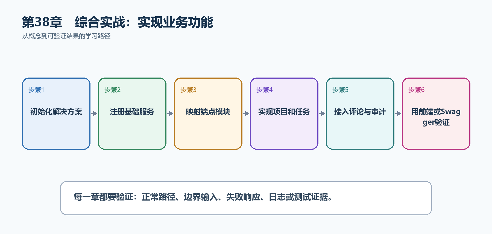

# 第39章　综合实战：实现业务功能

本章按照上一章的纵向切片真正组织TaskHub代码。重点不是把所有代码塞进一个示例，而是看清Program.cs怎样只负责装配，端点怎样接收HTTP输入，应用服务怎样执行业务规则，EF Core怎样保存状态。

  ------------------------------------------------------------------------------------------------------------------------------------------------------------------
  **先把三个问题说清楚　**这是什么：业务实现是把API契约逐条落到端点、DTO、应用服务、领域规则和基础设施，并用统一的认证、错误、日志和OpenAPI元数据把它们连接起来。\
  目的是什么：形成一套可继续扩展的项目骨架，并跑通'登录---建项目---加成员---建任务---评论---审计'主路径。\
  最后得到什么：TaskHub使用端点模块、应用服务和EF Core实现主要业务，Program.cs保持为清楚的组合入口。
  ------------------------------------------------------------------------------------------------------------------------------------------------------------------

  ------------------------------------------------------------------------------------------------------------------------------------------------------------------

  ------------------------------------------------------------------------------------------------------------------------
  **本章操作路线　**初始化解决方案 → 注册基础服务 → 映射端点模块 → 实现项目和任务 → 接入评论与审计 → 用前端或Swagger验证
  ------------------------------------------------------------------------------------------------------------------------

  ------------------------------------------------------------------------------------------------------------------------

{width="6.102362204724409in" height="2.915573053368329in"}

图39-1　综合实战：实现业务功能从概念到结果的实现路线

## 39.1 先看最终效果

TaskHub使用端点模块、应用服务和EF Core实现主要业务，Program.cs保持为清楚的组合入口。

本章仍然使用TaskHub任务协作API作为落点。请先完成最小成功路径，再故意制造一次失败；只有能解释状态码、日志或测试结果，才算真正掌握。

307. Program.cs只包含注册、中间件顺序和端点模块映射。

308. 创建任务会验证项目状态和负责人资格。

309. 业务写入和审计记录在同一数据库事务中提交。

310. Swagger UI或前端能够按主路径完成一次真实操作。

## 39.2 组合入口骨架：先看最终Program.cs（需要配套模块）

本节先展示本章核心写法。若代码定义了所用的全部类型，它可以独立运行；若引用TaskDbContext、TaskEntity、GetTasks等本节没有定义的名称，它就是加入前文TaskHub项目的增量代码，不能直接粘贴到空项目。附录A和附录B提供从空目录开始、能够完整复制运行的项目。

示例39-1　准备项目或安装依赖

```bash
dotnet new sln -n TaskHub
dotnet new web -n TaskHub.Api -o src/TaskHub.Api
dotnet new classlib -n TaskHub.Application -o src/TaskHub.Application
dotnet new classlib -n TaskHub.Domain -o src/TaskHub.Domain
dotnet new classlib -n TaskHub.Infrastructure -o src/TaskHub.Infrastructure
dotnet sln add src/TaskHub.Api src/TaskHub.Application src/TaskHub.Domain src/TaskHub.Infrastructure
```

示例39-2　让Program.cs只负责组合应用

```csharp
var builder = WebApplication.CreateBuilder(args);

builder.Services.AddOpenApi();
builder.Services.AddProblemDetails();
builder.Services.AddAuthentication().AddJwtBearer();
builder.Services.AddAuthorization();
builder.Services.AddApplication();
builder.Services.AddInfrastructure(builder.Configuration);

var app = builder.Build();

app.UseExceptionHandler();
app.UseHttpsRedirection();
app.UseAuthentication();
app.UseAuthorization();

if (app.Environment.IsDevelopment())
app.MapOpenApi();

app.MapProjectEndpoints();
app.MapTaskEndpoints();
app.MapCommentEndpoints();
app.MapAuditEndpoints();
app.MapHealthChecks("/health/live");

app.Run();

public partial class Program { }
```

-   AddApplication和AddInfrastructure是各层提供的扩展方法。

-   异常处理放在前面，才能统一捕获后续组件的异常。

-   先认证再授权。

-   public partial class Program让集成测试能够引用入口点。

  --------------------------------------------------------------------------------------------------
  **运行后应该看到什么　**Program.cs能从上到下读成：注册服务、构建应用、排列管道、映射端点、运行。
  --------------------------------------------------------------------------------------------------

  --------------------------------------------------------------------------------------------------

## 39.3 为什么要这样做

Minimal API的'最小'是减少样板代码，不是把所有职责都放在Program.cs。端点只做HTTP转换，业务规则进入应用服务或领域对象，数据库细节进入Infrastructure，才能分别测试和替换。

在TaskHub中，本章把它应用到"实现从用户请求到数据库与审计记录的完整业务功能"。实现时要明确输入来自哪里、状态在哪里改变、失败怎样返回，以及运维或测试人员从哪里获得证据。

## 39.4 任务功能

这是什么：任务功能从端点接收DTO，交给应用服务检查项目状态和成员资格，再由数据库事务保存。不要让端点直接承载全部规则。

怎样做：先加入下面的最小配置或处理代码，保存并重新启动应用，再按示例给出的地址或命令验证。

示例39-3　端点只接收HTTP输入并调用应用服务

```csharp
public static class TaskEndpoints
{
public static IEndpointRouteBuilder MapTaskEndpoints(this IEndpointRouteBuilder app)
{
var group = app.MapGroup("/api/projects/{projectId:guid}/tasks")
.RequireAuthorization()
.WithTags("Tasks");

group.MapPost("/", async (
Guid projectId,
CreateTaskRequest request,
ClaimsPrincipal user,
ITaskService service,
CancellationToken ct) =>
{
var userId = Guid.Parse(user.FindFirstValue("sub")!);
var result = await service.CreateAsync(projectId, userId, request, ct);

return TypedResults.Created(
$"/api/projects/{projectId}/tasks/{result.Id}", result);
})
.Produces<TaskResponse>(StatusCodes.Status201Created)
.ProducesProblem(StatusCodes.Status400BadRequest)
.ProducesProblem(StatusCodes.Status403Forbidden)
.WithName("CreateTask");

return app;
}
}

public sealed record CreateTaskRequest(
string Title, string? Description, Guid? AssigneeId, DateOnly? DueDate);
```

-   MapGroup复用项目路径、认证和OpenAPI标签。

-   ClaimsPrincipal提供当前用户身份，但业务权限仍由服务根据项目成员关系判断。

-   CancellationToken沿调用链传给数据库。

-   返回DTO并声明可能状态码。

  ----------------------------------------------------------------------------------------------------------
  **预期结果　**合法成员提交JSON后收到201、Location和任务DTO；非法输入或无权限请求得到统一ProblemDetails。
  ----------------------------------------------------------------------------------------------------------

  ----------------------------------------------------------------------------------------------------------

## 39.5 标签与评论

这是什么：标签通常是项目范围资源，评论是任务下的追加记录。要定义谁能编辑、是否允许删除以及审计保留规则。

怎样做：先加入下面的最小配置或处理代码，保存并重新启动应用，再按示例给出的地址或命令验证。

示例39-4　在应用服务中执行规则并记录审计

```csharp
public async Task<TaskResponse> CreateAsync(
Guid projectId,
Guid actorId,
CreateTaskRequest request,
CancellationToken ct)
{
var project = await db.Projects
.Include(p => p.Members)
.SingleOrDefaultAsync(p => p.Id == projectId, ct)
?? throw new NotFoundException("项目不存在");

if (project.IsArchived)
throw new ConflictException("已归档项目不能创建任务");
if (!project.Members.Any(m => m.UserId == actorId))
throw new ForbiddenException("你不是该项目成员");
if (request.AssigneeId is Guid assigneeId &&
!project.Members.Any(m => m.UserId == assigneeId))
throw new ValidationException("负责人必须是项目成员");

var task = TaskItem.Create(projectId, request.Title,
request.Description, request.AssigneeId, request.DueDate);
db.Tasks.Add(task);
db.AuditEntries.Add(AuditEntry.TaskCreated(task.Id, actorId));
await db.SaveChangesAsync(ct);

return TaskResponse.From(task);
}
```

-   先加载项目和成员，确保所有规则基于同一业务边界。

-   不同业务失败由统一异常处理转换成400、403、404或409。

-   任务与审计记录在一次SaveChanges中提交。

-   最终返回映射后的DTO。

  --------------------------------------------------------------------------
  **预期结果　**任务和对应审计记录同时出现；任何规则失败时两者都不会写入。
  --------------------------------------------------------------------------

  --------------------------------------------------------------------------

## 39.6 附件

这是什么：附件上传先验证大小、扩展名和内容类型，再保存到隔离存储；数据库只记录元数据。下载同样需要资源级授权。

## 39.7 通知

这是什么：核心事务提交后通过Outbox或持久队列异步发送通知。通知失败可重试，但不能回滚已经成功的核心业务。

怎样做：先加入下面的最小配置或处理代码，保存并重新启动应用，再按示例给出的地址或命令验证。

示例39-5　核心事务提交后发送可恢复通知

```csharp
// 与业务数据在同一事务中写入Outbox记录
db.OutboxMessages.Add(new OutboxMessage(
Guid.NewGuid(),
"task.created",
JsonSerializer.Serialize(new { task.Id, task.AssigneeId }),
DateTimeOffset.UtcNow));

await db.SaveChangesAsync(ct);

// BackgroundService定期读取未处理Outbox消息，发送成功后标记完成。
// 即使进程在SaveChanges后重启，消息仍保存在数据库中，可继续处理。
```

-   直接在请求中先发消息再保存数据库会产生不一致窗口。

-   Outbox把'需要发送的事实'与业务数据一起提交。

-   后台消费者必须幂等，因为失败重试可能再次处理同一消息。

  ------------------------------------------------------------------------------------
  **预期结果　**任务创建立即返回；随后后台发送通知。重启应用后，未处理消息不会丢失。
  ------------------------------------------------------------------------------------

  ------------------------------------------------------------------------------------

## 39.8 审计

这是什么：审计记录谁在何时对什么资源做了什么，数据应不可随普通业务更新被覆盖并避免记录秘密。

## 39.9 缓存

这是什么：只缓存读取频繁且允许短暂旧值的数据，Key必须包含租户和权限边界。写入后明确失效策略。

## 39.10 OpenAPI

这是什么：综合项目为每个端点声明名称、标签、输入和响应状态码，并在CI保存文档。受保护端点还要描述安全方案。

## 39.11 前端互动验证

这是什么：浏览器用fetch发送JSON和认证信息，在Network面板核对URL、方法、状态码和响应体。先处理非2xx，再解析成功DTO。

怎样做：先加入下面的最小配置或处理代码，保存并重新启动应用，再按示例给出的地址或命令验证。

示例39-6　用浏览器fetch串起登录和任务创建

```csharp
const loginResponse = await fetch("/api/auth/login", {
method: "POST",
headers: { "Content-Type": "application/json" },
body: JSON.stringify({ email, password })
});
if (!loginResponse.ok) throw new Error("登录失败");
const { accessToken } = await loginResponse.json();

const createResponse = await fetch(`/api/projects/${projectId}/tasks`, {
method: "POST",
headers: {
"Content-Type": "application/json",
"Authorization": `Bearer ${accessToken}`
},
body: JSON.stringify({ title: "完成发布文档", assigneeId })
});

if (!createResponse.ok) {
const problem = await createResponse.json();
throw new Error(problem.detail ?? problem.title);
}
const task = await createResponse.json();
```

-   登录响应取得访问令牌。

-   Authorization头把令牌带给受保护API。

-   先检查response.ok，再分别解析成功DTO或ProblemDetails。

-   同源前端不需要额外CORS配置。

  -------------------------------------------------------------------------------------------------
  **预期结果　**浏览器开发者工具Network页能看到登录200、创建任务201，以及响应头、JSON和Location。
  -------------------------------------------------------------------------------------------------

  -------------------------------------------------------------------------------------------------

## 39.12 最终结果与注意事项

完成本章后，不要只确认项目能够编译。请按下面清单检查运行结果，并保留能够复现的请求、日志或测试。

311. Program.cs只包含注册、中间件顺序和端点模块映射。

312. 创建任务会验证项目状态和负责人资格。

313. 业务写入和审计记录在同一数据库事务中提交。

314. Swagger UI或前端能够按主路径完成一次真实操作。

  -------------------------------------------------------------------------------------------------------------------------------------
  **特别注意　**端点不要直接返回EF实体；不要只在前端检查权限；跨多次SaveChanges的规则要考虑事务；附件和通知失败不能破坏核心数据一致性
  -------------------------------------------------------------------------------------------------------------------------------------

  -------------------------------------------------------------------------------------------------------------------------------------
