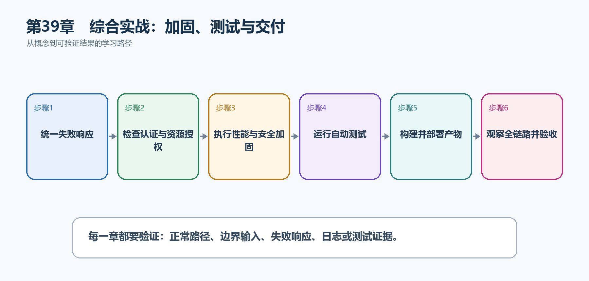

# 第40章　综合实战：加固、测试与交付

功能完成不等于可以上线。最后一章从攻击者、故障、流量、运维和接手维护者的角度检查TaskHub，并把输入、权限、性能、观测、自动测试、容器和流水线连接成最终交付证据。

  -----------------------------------------------------------------------------------------------------------------------------------------------------------
  **先把三个问题说清楚　**这是什么：加固是减少错误输入、越权、泄密和资源耗尽的风险；测试证明关键行为；交付则把经过验证的同一产物安全推进到生产并持续观察。\
  目的是什么：把'在我的电脑上能运行'提升为'可验证、可观测、可回滚、可交接的生产服务'。\
  最后得到什么：TaskHub具备统一错误、安全边界、关键集成测试、健康与遥测、非Root容器、CI/CD及生产检查清单。
  -----------------------------------------------------------------------------------------------------------------------------------------------------------

  -----------------------------------------------------------------------------------------------------------------------------------------------------------

  -----------------------------------------------------------------------------------------------------------------------------
  **本章操作路线　**统一失败响应 → 检查认证与资源授权 → 执行性能与安全加固 → 运行自动测试 → 构建并部署产物 → 观察全链路并验收
  -----------------------------------------------------------------------------------------------------------------------------

  -----------------------------------------------------------------------------------------------------------------------------

{width="6.102362204724409in" height="2.915573053368329in"}

图40-1　综合实战：加固、测试与交付从概念到结果的实现路线

## 40.1 先看最终效果

TaskHub具备统一错误、安全边界、关键集成测试、健康与遥测、非Root容器、CI/CD及生产检查清单。

本章仍然使用TaskHub任务协作API作为落点。请先完成最小成功路径，再故意制造一次失败；只有能解释状态码、日志或测试结果，才算真正掌握。

315. 匿名、越权、非法输入、冲突和不存在资源都返回预期状态码。

316. 集成测试使用真实HTTP管道并隔离测试数据。

317. 镜像、OpenAPI、测试报告和版本信息来自同一提交。

318. 生产健康、错误率、延迟和关键业务结果均可观察并配置告警。

## 40.2 加固配置增量：加入现有TaskHub项目

本节先展示本章核心写法。若代码定义了所用的全部类型，它可以独立运行；若引用TaskDbContext、TaskEntity、GetTasks等本节没有定义的名称，它就是加入前文TaskHub项目的增量代码，不能直接粘贴到空项目。附录A和附录B提供从空目录开始、能够完整复制运行的项目。

示例40-2　把统一错误、安全和限流接入请求管道

```csharp
builder.Services.AddProblemDetails();
builder.Services.AddAuthentication().AddJwtBearer();
builder.Services.AddAuthorization();
builder.Services.AddRateLimiter(options =>
{
options.AddFixedWindowLimiter("writes", limiter =>
{
limiter.PermitLimit = 30;
limiter.Window = TimeSpan.FromMinutes(1);
limiter.QueueLimit = 0;
});
options.RejectionStatusCode = StatusCodes.Status429TooManyRequests;
});

var app = builder.Build();
app.UseExceptionHandler();
app.UseHttpsRedirection();
app.UseAuthentication();
app.UseAuthorization();
app.UseRateLimiter();

app.MapPost("/api/tasks", (CreateTaskRequest request) =>
TypedResults.Created($"/api/tasks/{Guid.NewGuid()}", request))
.RequireAuthorization()
.RequireRateLimiting("writes");
```

-   ExceptionHandler和ProblemDetails统一不可预期错误的响应形状。

-   认证确认是谁，授权确认能否访问目标资源。

-   写操作限流降低暴力请求和资源耗尽风险。

-   中间件顺序决定后续组件能否看到身份及限流结果。

  -----------------------------------------------------------------------------------------------------------
  **运行后应该看到什么　**正常请求成功；匿名请求401；无权用户403；超过写入额度返回429；生产错误不暴露堆栈。
  -----------------------------------------------------------------------------------------------------------

  -----------------------------------------------------------------------------------------------------------

## 40.3 为什么要这样做

生产故障往往发生在组件交界：代理没有传对协议、令牌有效但资源越权、数据库变慢导致线程和连接耗尽、部署成功但流量请求失败。最终检查必须覆盖一条真实请求的全部路径。

在TaskHub中，本章把它应用到"把完整任务系统加固、验证并作为可运营产品交付"。实现时要明确输入来自哪里、状态在哪里改变、失败怎样返回，以及运维或测试人员从哪里获得证据。

## 40.4 自动化测试

这是什么：最终加固至少覆盖验证、401、403、404、409和成功路径，并让测试经过真实中间件与数据库边界。

怎样做：先加入下面的最小配置或处理代码，保存并重新启动应用，再按示例给出的地址或命令验证。

示例40-3　用真实HTTP管道验证资源级权限

```csharp
public sealed class TaskAuthorizationTests(
WebApplicationFactory<Program> factory)
: IClassFixture<WebApplicationFactory<Program>>
{
[Fact]
public async Task CreateTask_WhenUserIsNotProjectMember_ReturnsForbidden()
{
var client = factory.CreateClient();
client.DefaultRequestHeaders.Authorization =
new AuthenticationHeaderValue("Bearer", TestTokens.ForUser("outsider"));

var response = await client.PostAsJsonAsync(
$"/api/projects/{TestIds.Project}/tasks",
new { title = "不应被创建" });

Assert.Equal(HttpStatusCode.Forbidden, response.StatusCode);
var problem = await response.Content.ReadFromJsonAsync<ProblemDetails>();
Assert.NotNull(problem);
}
}
```

-   WebApplicationFactory启动真实ASP.NET Core管道。

-   测试身份已认证但不是项目成员，专门验证资源级授权。

-   同时检查状态码和统一错误格式。

-   测试环境应替换令牌签发和数据库，不能连接生产资源。

  ---------------------------------------------------------------------------------
  **预期结果　**dotnet test稳定通过，并证明越权请求既没有成功响应也没有写入数据。
  ---------------------------------------------------------------------------------

  ---------------------------------------------------------------------------------

## 40.5 Docker交付

这是什么：用多阶段Dockerfile发布Release产物，最终镜像非Root运行。启动最终镜像执行健康和业务冒烟测试。

怎样做：先加入下面的最小配置或处理代码，保存并重新启动应用，再按示例给出的地址或命令验证。

示例40-4　为镜像写入可追溯版本并执行冒烟测试

```bash
$commit = git rev-parse --short HEAD
docker build `
--label "org.opencontainers.image.revision=$commit" `
-t "taskhub-api:$commit" .

docker run --rm -d --name taskhub-smoke -p 8080:8080 `
--env-file .env.smoke "taskhub-api:$commit"

try {
Invoke-WebRequest http://localhost:8080/health/ready
Invoke-WebRequest http://localhost:8080/openapi/v1.json
}
finally {
docker stop taskhub-smoke
}
```

-   镜像标签和OCI标签都记录提交版本。

-   冒烟测试使用最终镜像，而不是开发服务器。

-   .env.smoke只能包含测试环境值并且不能提交真实秘密。

-   finally确保即使检查失败也停止临时容器。

  ---------------------------------------------------------------------------------
  **预期结果　**最终镜像能独立启动，健康和OpenAPI端点可访问，并能追溯到确切提交。
  ---------------------------------------------------------------------------------

  ---------------------------------------------------------------------------------

## 40.6 CI/CD

这是什么：流水线把还原、编译、测试、扫描、打包、部署和验证自动化，同一不可变产物逐环境晋级。

## 40.7 生产检查清单

这是什么：上线前逐项确认测试、密钥、迁移、监控、告警和回滚，并为每项保存证据。清单是发布门禁，不是事后记录。

怎样做：先加入下面的最小配置或处理代码，保存并重新启动应用，再按示例给出的地址或命令验证。

示例40-5　上线前逐项确认

```text
[ ] Release构建、单元测试、集成测试全部通过
[ ] OpenAPI与前端使用的接口契约一致
[ ] 密钥来自秘密存储，日志不含令牌、密码和连接字符串
[ ] 数据库迁移已评审、备份并验证回滚或向后兼容方案
[ ] 镜像非Root运行，基础镜像和依赖已扫描
[ ] /health/live 与 /health/ready语义正确
[ ] 错误率、P95/P99延迟、流量、饱和度和业务失败已配置告警
[ ] 部署后冒烟测试通过，旧稳定版本仍可部署
[ ] 值班人、仪表板、日志查询和故障处理文档可访问
```

-   清单中的每一项都要有链接、报告或命令输出作为证据。

-   健康检查只回答当前实例状态，不能代替业务冒烟测试。

-   回滚方案要在故障前验证。

  -----------------------------------------------------------------------
  **预期结果　**上线批准基于可查证的结果，而不是'应该没问题'。
  -----------------------------------------------------------------------

  -----------------------------------------------------------------------

## 40.8 最终请求全链路

这是什么：从DNS和TLS开始，依次验证代理、路由、认证、授权、验证、事务、缓存、遥测与响应契约。

怎样做：先加入下面的最小配置或处理代码，保存并重新启动应用，再按示例给出的地址或命令验证。

示例40-6　从浏览器到数据库再返回的完整路径

```text
1. 浏览器fetch发送HTTPS请求和Bearer令牌
2. 反向代理终止TLS，加入可信Forwarded Headers
3. ASP.NET Core记录TraceId并执行异常处理
4. 认证验证令牌，授权检查项目成员关系
5. 限流与验证拒绝过量或非法输入
6. Minimal API端点把HTTP输入转换为应用命令
7. 应用服务执行业务规则
8. EF Core在事务中保存任务、审计和Outbox消息
9. DTO被序列化成JSON，返回201与Location
10. 浏览器更新页面；后台消费者稍后发送通知
11. 日志、指标和Trace用同一个关联标识串起调用
12. 集成测试、冒烟测试和告警持续验证这条链路
```

-   每一层只承担明确职责。

-   任何失败都应转换为稳定HTTP语义，并留下不含敏感信息的诊断证据。

-   这条链路也是排障顺序：从入口逐层定位到依赖。

  ------------------------------------------------------------------------------------------------
  **预期结果　**读者能够指出一次请求经过哪些组件、状态在哪里改变、失败怎样返回、证据在哪里查看。
  ------------------------------------------------------------------------------------------------

  ------------------------------------------------------------------------------------------------

## 40.9 最终交付物

这是什么：交付不仅是源码，还包括迁移、OpenAPI、测试报告、镜像、配置说明、运行手册和回滚方案。

怎样做：先加入下面的最小配置或处理代码，保存并重新启动应用，再按示例给出的地址或命令验证。

示例40-7　完整项目应交付的文件和证据

```text
源代码与解决方案
数据库迁移与种子数据说明
OpenAPI JSON与Swagger UI访问说明
单元、集成、契约和冒烟测试报告
Dockerfile、Compose或部署清单
CI/CD工作流与环境审批规则
配置键说明（不包含秘密值）
监控仪表板、告警和日志查询示例
发布、迁移、回滚和故障处理手册
版本号、提交SHA、镜像摘要与变更记录
```

-   可执行文件只是交付物的一部分。

-   文档要让另一位开发者或运维人员能够独立部署和排障。

-   秘密值永远通过受控渠道提供，不写进交付文档。

  ---------------------------------------------------------------------------------------------
  **预期结果　**新的团队成员无需依赖原作者口头说明，也能构建、测试、部署、验证和回滚TaskHub。
  ---------------------------------------------------------------------------------------------

  ---------------------------------------------------------------------------------------------

## 40.10 最终结果与注意事项

完成本章后，不要只确认项目能够编译。请按下面清单检查运行结果，并保留能够复现的请求、日志或测试。

319. 匿名、越权、非法输入、冲突和不存在资源都返回预期状态码。

320. 集成测试使用真实HTTP管道并隔离测试数据。

321. 镜像、OpenAPI、测试报告和版本信息来自同一提交。

322. 生产健康、错误率、延迟和关键业务结果均可观察并配置告警。

  ----------------------------------------------------------------------------------------------------------------------------------------------
  **特别注意　**不要把详细异常堆栈返回给生产用户；限流不能替代身份和授权；压力测试必须在受控环境并保护依赖系统；数据库破坏性迁移会限制应用回滚
  ----------------------------------------------------------------------------------------------------------------------------------------------

  ----------------------------------------------------------------------------------------------------------------------------------------------
