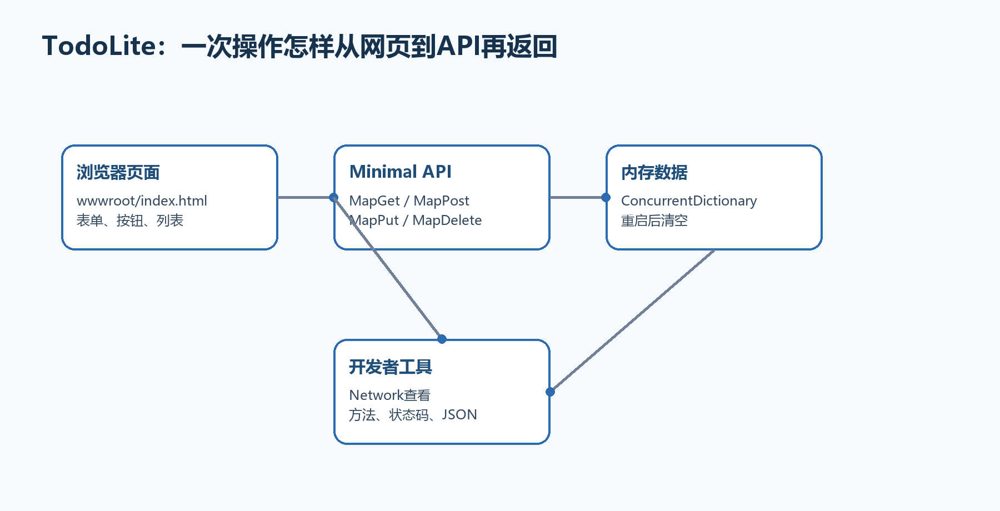

# 附录A　完整简单示例：TodoLite单文件任务清单

这个附录专门解决一个新手最常见的问题：每一章都看懂了，但还不知道怎样从空文件夹开始，把后端、网页、测试和发布真正连起来。TodoLite不使用数据库和登录，先把一次完整开发循环跑通。

  -------------------------------------------------------------------------------------------------------------------------------------------------------
  **完成后能得到什么　**一个可以在浏览器中新增、查看、修改和删除任务的同源应用；后端是.NET 10 Minimal API，前端是wwwroot/index.html，数据暂存在内存中。
  -------------------------------------------------------------------------------------------------------------------------------------------------------

  -------------------------------------------------------------------------------------------------------------------------------------------------------

{width="6.102362204724409in" height="3.1189851268591426in"}

图A-1　TodoLite同源前后端的完整请求流程

## A.1 先明确范围：这个项目做什么、不做什么

要做的功能只有五个：显示任务列表、创建任务、修改任务、切换完成状态、删除任务。每一步都能在浏览器Network面板看到对应HTTP请求。

本例暂时不做数据库、用户登录和复杂分层。这样做不是因为它们不重要，而是为了先让新手看清浏览器、Minimal API和数据之间最基本的协作。附录B再把同一思路升级为数据库和多文件项目。

-   前端类型：原生HTML、CSS和JavaScript，没有React/Vue构建工具。

-   部署方式：前端文件与API由同一个ASP.NET Core应用提供，因此属于同源方案。

-   数据位置：服务器进程内存；停止应用后数据会清空。

-   验收地址：浏览器打开终端显示的根地址，例如http://localhost:5187/。

## A.2 第一步：从父目录创建项目

打开PowerShell或VS Code终端，先进入准备保存项目的父目录。不要先手工创建TodoLite文件夹；dotnet new会创建它。

**示例A-1　创建并进入.NET 10空Web项目**

```bash
cd C:\Projects
dotnet new web -n TodoLite -f net10.0
cd TodoLite
dotnet --version
Get-ChildItem
```

  --------------------------------------------------------------------------------------------------------------
  **预期结果　**当前目录中能看到TodoLite.csproj、Program.cs、Properties和配置文件；dotnet \--version显示10.x。
  --------------------------------------------------------------------------------------------------------------

  --------------------------------------------------------------------------------------------------------------

## A.3 第二步：创建wwwroot并确认最终目录

在项目根目录创建wwwroot文件夹，再在其中创建index.html。wwwroot是ASP.NET Core默认的公开静态文件根目录；放在这里的文件可以由UseStaticFiles返回。

**示例A-2　完成后的目录结构**

```text
TodoLite/
├─ Program.cs
├─ TodoLite.csproj
├─ TodoLite.http
├─ appsettings.json
├─ appsettings.Development.json
├─ Properties/
│ └─ launchSettings.json
└─ wwwroot/
└─ index.html
```

  --------------------------------------------------------------------------------------------------------------------------------
  **位置不要放错　**Program.cs与TodoLite.csproj同级；index.html必须位于wwwroot内。若放在项目根目录，UseStaticFiles不会把它公开。
  --------------------------------------------------------------------------------------------------------------------------------

  --------------------------------------------------------------------------------------------------------------------------------

## A.4 第三步：完整编写Program.cs

下面代码可以完整替换模板生成的Program.cs。先整体复制运行，再按代码后的说明逐段理解。ConcurrentDictionary保证多个请求同时访问集合时不会损坏内部状态；它仍然不是数据库。

**示例A-3　可直接运行的完整Program.cs**

```csharp
using System.Collections.Concurrent;

var builder = WebApplication.CreateBuilder(args);
var app = builder.Build();

app.UseDefaultFiles();
app.UseStaticFiles();

var tasks = new ConcurrentDictionary<int, TodoItem>();
var nextId = 0;

app.MapGet("/api/tasks", () =>
Results.Ok(tasks.Values.OrderBy(item => item.Id)));

app.MapGet("/api/tasks/{id:int}", (int id) =>
tasks.TryGetValue(id, out var item)
? Results.Ok(item)
: Results.NotFound(new { message = "任务不存在" }));

app.MapPost("/api/tasks", (CreateTodoRequest request) =>
{
var title = request.Title?.Trim();
if (string.IsNullOrWhiteSpace(title))
{
return Results.ValidationProblem(new Dictionary<string, string[]>
{
["title"] = ["标题不能为空"]
});
}

var id = Interlocked.Increment(ref nextId);
var item = new TodoItem(id, title, false);
tasks[id] = item;

return Results.Created($"/api/tasks/{id}", item);
});

app.MapPut("/api/tasks/{id:int}", (int id, UpdateTodoRequest request) =>
{
if (!tasks.ContainsKey(id))
return Results.NotFound(new { message = "任务不存在" });

var title = request.Title?.Trim();
if (string.IsNullOrWhiteSpace(title))
{
return Results.ValidationProblem(new Dictionary<string, string[]>
{
["title"] = ["标题不能为空"]
});
}

var updated = new TodoItem(id, title, request.Completed);
tasks[id] = updated;
return Results.Ok(updated);
});

app.MapDelete("/api/tasks/{id:int}", (int id) =>
tasks.TryRemove(id, out _)
? Results.NoContent()
: Results.NotFound(new { message = "任务不存在" }));

app.MapGet("/health", () => Results.Ok(new { status = "ok" }));

app.Run();

record TodoItem(int Id, string Title, bool Completed);
record CreateTodoRequest(string? Title);
record UpdateTodoRequest(string? Title, bool Completed);
```

-   UseDefaultFiles把根地址/改写为默认文件index.html；UseStaticFiles负责返回实际文件内容。

-   MapGet、MapPost、MapPut和MapDelete分别处理查询、创建、整体更新和删除。

-   POST成功返回201 Created，并通过Location指出新资源地址。

-   空标题返回400 ValidationProblem，前端可以读取errors.title。

-   DELETE成功返回204，所以前端不能无条件调用response.json()。

## A.5 第四步：完整编写wwwroot/index.html

这个页面没有编译步骤。浏览器加载HTML后，JavaScript通过fetch调用同源/api/tasks。代码中的api函数先统一处理非2xx响应，避免每个按钮重复写错误逻辑。

**示例A-4　可直接使用的wwwroot/index.html**

```xml
<!doctype html>
<html lang="zh-CN">
<head>
<meta charset="utf-8">
<meta name="viewport" content="width=device-width, initial-scale=1">
<title>TodoLite</title>
<style>
body { font-family: system-ui, sans-serif; max-width: 760px; margin: 40px auto; padding: 0 16px; }
form, li { display: flex; gap: 10px; align-items: center; }
input[type=text] { flex: 1; padding: 10px; }
button { padding: 8px 12px; cursor: pointer; }
ul { padding: 0; }
li { list-style: none; padding: 12px 0; border-bottom: 1px solid #ddd; }
li span { flex: 1; }
.done { text-decoration: line-through; color: #777; }
#message { min-height: 24px; color: #b42318; }
</style>
</head>
<body>
<h1>TodoLite任务清单</h1>
<form id="createForm">
<input id="title" type="text" maxlength="100" placeholder="输入任务标题" required>
<button type="submit">新增</button>
</form>
<p id="message" role="alert"></p>
<ul id="taskList"></ul>

<script>
const list = document.querySelector("#taskList");
const message = document.querySelector("#message");
const titleInput = document.querySelector("#title");

async function api(url, options = {}) {
const response = await fetch(url, options);
if (response.status === 204) return null;

const data = await response.json();
if (!response.ok) {
const detail = data.errors?.title?.[0] ?? data.message ?? data.title ?? "请求失败";
throw new Error(detail);
}
return data;
}

async function loadTasks() {
try {
message.textContent = "";
const tasks = await api("/api/tasks");
list.replaceChildren(...tasks.map(createRow));
} catch (error) {
message.textContent = error.message;
}
}

function createRow(task) {
const li = document.createElement("li");
const checkbox = document.createElement("input");
checkbox.type = "checkbox";
checkbox.checked = task.completed;

const text = document.createElement("span");
text.textContent = task.title;
text.className = task.completed ? "done" : "";

checkbox.addEventListener("change", async () => {
try {
await api(`/api/tasks/${task.id}`, {
method: "PUT",
headers: { "Content-Type": "application/json" },
body: JSON.stringify({ title: task.title, completed: checkbox.checked })
});
await loadTasks();
} catch (error) {
message.textContent = error.message;
checkbox.checked = task.completed;
}
});

const remove = document.createElement("button");
remove.textContent = "删除";
remove.addEventListener("click", async () => {
try {
await api(`/api/tasks/${task.id}`, { method: "DELETE" });
await loadTasks();
} catch (error) {
message.textContent = error.message;
}
});

li.append(checkbox, text, remove);
return li;
}

document.querySelector("#createForm").addEventListener("submit", async event => {
event.preventDefault();
try {
await api("/api/tasks", {
method: "POST",
headers: { "Content-Type": "application/json" },
body: JSON.stringify({ title: titleInput.value })
});
titleInput.value = "";
await loadTasks();
} catch (error) {
message.textContent = error.message;
}
});

loadTasks();
</script>
</body>
</html>
```

## A.6 第五步：运行并打开正确地址

在包含TodoLite.csproj的目录执行dotnet run。看到Now listening on后，不要照抄书中的端口；复制你终端实际显示的HTTP或HTTPS地址。

**示例A-5　启动应用并访问首页**

```bash
dotnet run

# 典型输出（端口以你的终端为准）
# Now listening on: http://localhost:5187

# 浏览器打开
http://localhost:5187/
```

  -----------------------------------------------------------------------------------------------------------------------------------------------
  **最终效果　**页面出现输入框和新增按钮。新增任务后列表立即刷新；勾选会发送PUT；删除会发送DELETE。刷新页面数据仍在，停止并重新运行后数据清空。
  -----------------------------------------------------------------------------------------------------------------------------------------------

  -----------------------------------------------------------------------------------------------------------------------------------------------

## A.7 第六步：用开发者工具看懂前后端互动

按F12打开开发者工具，选择Network。先清空记录，然后新增一个任务。你应该依次看到POST /api/tasks返回201和GET /api/tasks返回200。

点击POST记录：Headers页显示Request URL、Method、201和Location；Payload页显示发送的JSON；Response页显示后端返回的任务对象。前端不是直接访问C#变量，而是通过HTTP请求和JSON与后端交换信息。

-   页面空白：先看Console是否有JavaScript错误，再看Network中/或index.html是否404。

-   API返回404：确认请求是/api/tasks而不是相对地址api/tasks拼错。

-   JSON解析错误：确认DELETE 204路径没有继续调用response.json()。

-   HTTPS证书警告：回到第2章执行dotnet dev-certs https \--trust。

## A.8 第七步：创建TodoLite.http重复测试

在项目根目录创建TodoLite.http。把端口替换成终端实际端口；VS Code安装REST Client扩展或Visual Studio直接打开该文件即可逐条发送。

**示例A-6　完整TodoLite.http**

```text
@baseUrl = http://localhost:5187

### 查询全部
GET {{baseUrl}}/api/tasks

### 创建
POST {{baseUrl}}/api/tasks
Content-Type: application/json

{
"title": "完成TodoLite"
}

### 故意发送空标题，应返回400
POST {{baseUrl}}/api/tasks
Content-Type: application/json

{
"title": " "
}

### 更新（先把1替换为真实ID）
PUT {{baseUrl}}/api/tasks/1
Content-Type: application/json

{
"title": "完成TodoLite",
"completed": true
}

### 删除
DELETE {{baseUrl}}/api/tasks/1

### 健康检查
GET {{baseUrl}}/health
```

## A.9 第八步：设置断点并观察一次POST

在Program.cs的MapPost处理器第一行设置断点，以调试方式启动。页面提交后，观察request.Title、title、id和item怎样逐步得到值。继续运行后，浏览器才会收到201响应。

如果断点从未命中，先检查浏览器Network中的请求地址和方法；如果命中但前端报错，检查返回状态码和JSON形状。

## A.10 第九步：发布到本机文件夹

先停止dotnet run，再在项目目录发布Release版本。发布完成后进入输出目录，用发布产物实际启动一次。

**示例A-7　发布并验证最终产物**

```bash
dotnet publish -c Release -o .\publish
cd .\publish
dotnet TodoLite.dll --urls http://localhost:5090

# 浏览器打开
http://localhost:5090/
http://localhost:5090/health
```

## A.11 什么时候应该从这个例子升级

当数据需要跨重启保留时，引入数据库；当代码超过一个人容易理解的长度时，拆出DTO、服务和端点模块；当存在不同用户时，引入正式认证授权；当准备交付时，加入日志、异常、健康检查、测试和部署脚本。附录B按这个顺序升级。

## A.12 验收清单：做到这些才算真正完成

323. 能够从空父目录重新创建项目，而不是只会运行现成文件。

324. 能够解释Program.cs、wwwroot/index.html和TodoLite.http分别属于哪一层。

325. 能够在Network面板指出POST、PUT、DELETE的请求体、状态码和响应体。

326. 能够故意制造400与404，并解释错误来自哪里。

327. 能够发布到独立文件夹，并从发布目录成功启动。
