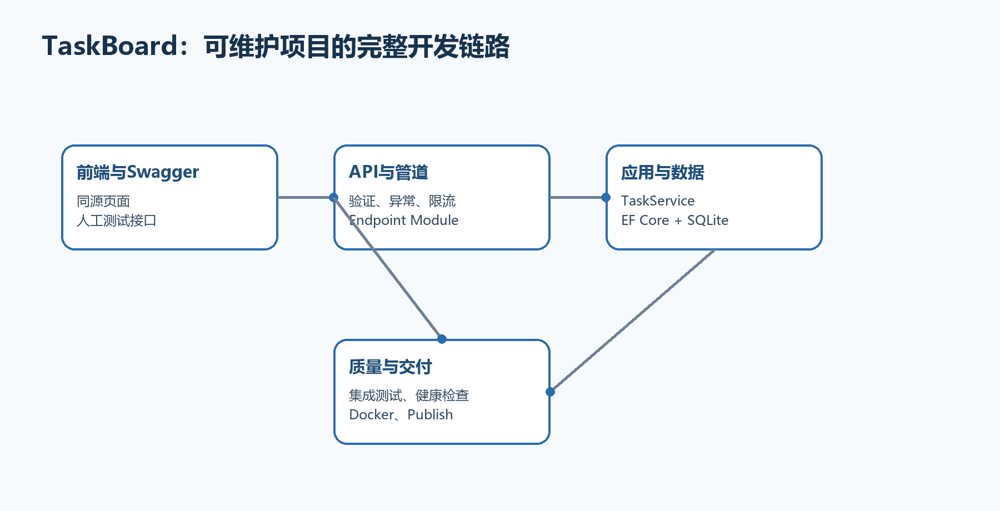

# 附录B　完整综合示例：TaskBoard数据库任务系统

TaskBoard把附录A升级为更接近真实工作的项目：SQLite持久化、EF Core迁移、.NET 10验证、统一错误、日志、限流、OpenAPI/Swagger UI、同源前端、集成测试和Docker发布。每一步都说明文件放在哪里、为什么这样拆、怎样验证。

  ----------------------------------------------------------------------------------------------------------------------------------------------------------------
  重要边界　本例为了集中讲清业务开发流程，接口默认匿名。生产项目必须按第24～26章接入正式身份提供商、认证和资源级授权；不能把'没有登录'的教学项目直接暴露到公网。
  ----------------------------------------------------------------------------------------------------------------------------------------------------------------

  ----------------------------------------------------------------------------------------------------------------------------------------------------------------

{width="6.102362204724409in" height="3.1189851268591426in"}

图B-1　TaskBoard从请求、业务、数据库到测试交付的架构

## B.1 需求和验收结果

TaskBoard支持查询、创建、完成和删除任务。标题必须是2～100个字符，数据保存在SQLite中，应用重启后仍存在；错误返回Problem Details；Swagger UI和网页都能操作同一API。

-   GET /api/tasks：分页查询任务。

-   GET /api/tasks/{id}：查询一个任务，不存在返回404。

-   POST /api/tasks：创建任务，成功返回201和Location。

-   PUT /api/tasks/{id}：更新标题和完成状态。

-   DELETE /api/tasks/{id}：删除任务，成功返回204。

-   GET /health/live：确认进程可以响应。

## B.2 创建项目并安装依赖

在父目录执行以下命令。包命令不写死补丁版本，让NuGet选择与net10.0兼容的稳定版本；项目文件会记录实际版本。团队项目应在验证后统一锁定版本。

**示例B-1　创建TaskBoard并准备数据库、验证和接口文档**

```bash
cd C:\Projects
dotnet new sln -n TaskBoard --format sln
dotnet new web -n TaskBoard.Api -f net10.0
dotnet sln TaskBoard.sln add TaskBoard.Api/TaskBoard.Api.csproj
cd TaskBoard.Api

dotnet add package Microsoft.EntityFrameworkCore.Sqlite
dotnet add package Microsoft.EntityFrameworkCore.Design
dotnet add package Microsoft.AspNetCore.OpenApi
dotnet add package Swashbuckle.AspNetCore.SwaggerUI

dotnet tool install --global dotnet-ef --version 10.0.10
dotnet restore
```

  ---------------------------------------------------------------------------------------------------------------------------------------
  **命令执行位置　**这些命令都在包含TaskBoard.Api.csproj的目录执行。若dotnet add package提示找不到项目，先用Get-ChildItem确认当前目录。
  ---------------------------------------------------------------------------------------------------------------------------------------

  ---------------------------------------------------------------------------------------------------------------------------------------

## B.3 建立最终目录，不要把所有代码留在Program.cs

**示例B-2　TaskBoard最终目录**

```text
TaskBoard工作目录/
├─ TaskBoard.sln
├─ TaskBoard.Api/
│ ├─ Program.cs
│ ├─ TaskBoard.Api.csproj
│ ├─ appsettings.json
│ ├─ TaskBoard.http
│ ├─ Data/
│ │ └─ TaskDbContext.cs
│ ├─ Features/
│ │ └─ Tasks/
│ │ └─ TaskFeature.cs
│ ├─ Migrations/ # dotnet ef生成
│ ├─ wwwroot/index.html
│ ├─ Dockerfile
│ └─ .dockerignore
└─ TaskBoard.Api.Tests/ # B.11创建
```

Program.cs只组合服务和请求管道；Data保存EF Core上下文；Features/Tasks集中任务实体、DTO、服务和端点。这个规模不需要一开始拆四个类库，但职责已经分开。

## B.4 编写Data/TaskDbContext.cs

**示例B-3　数据库上下文与任务实体**

```csharp
using Microsoft.EntityFrameworkCore;

namespace TaskBoard.Api.Data;

public sealed class TaskDbContext(DbContextOptions<TaskDbContext> options)
: DbContext(options)
{
public DbSet<TaskItem> Tasks => Set<TaskItem>();

protected override void OnModelCreating(ModelBuilder modelBuilder)
{
modelBuilder.Entity<TaskItem>(entity =>
{
entity.ToTable("Tasks");
entity.HasKey(item => item.Id);
entity.Property(item => item.Title).HasMaxLength(100).IsRequired();
entity.HasIndex(item => item.CreatedAt);
});
}
}

public sealed class TaskItem
{
public int Id { get; set; }
public required string Title { get; set; }
public bool Completed { get; set; }
public DateTimeOffset CreatedAt { get; set; }
}
```

-   DbContext按请求使用，不能在多个并行线程间共享。

-   HasMaxLength与IsRequired是数据库模型约束；请求DTO还会在进入处理器前验证。

-   API不会直接返回TaskItem实体，后面映射为TaskResponse。

## B.5 编写Features/Tasks/TaskFeature.cs

为便于第一次完整复制，本例把DTO、服务和端点模块放在一个功能文件中。实际项目变大后，可以在同一Features/Tasks目录内继续拆成TaskDtos.cs、TaskService.cs和TaskEndpoints.cs。

**示例B-4　任务DTO、应用服务与端点模块**

```csharp
using System.ComponentModel.DataAnnotations;
using Microsoft.EntityFrameworkCore;
using TaskBoard.Api.Data;

namespace TaskBoard.Api.Features.Tasks;

public sealed record CreateTaskRequest(
[property: Required]
[property: StringLength(100, MinimumLength = 2)]
string Title);

public sealed record UpdateTaskRequest(
[property: Required]
[property: StringLength(100, MinimumLength = 2)]
string Title,
bool Completed);

public sealed record TaskResponse(
int Id, string Title, bool Completed, DateTimeOffset CreatedAt);

public sealed class TaskService(TaskDbContext db, ILogger<TaskService> logger)
{
public async Task<IReadOnlyList<TaskResponse>> ListAsync(
int page, int pageSize, CancellationToken ct) =>
await db.Tasks.AsNoTracking()
.OrderByDescending(item => item.CreatedAt)
.Skip((page - 1) * pageSize)
.Take(pageSize)
.Select(item => new TaskResponse(
item.Id, item.Title, item.Completed, item.CreatedAt))
.ToListAsync(ct);

public async Task<TaskResponse?> GetAsync(int id, CancellationToken ct) =>
await db.Tasks.AsNoTracking()
.Where(item => item.Id == id)
.Select(item => new TaskResponse(
item.Id, item.Title, item.Completed, item.CreatedAt))
.SingleOrDefaultAsync(ct);

public async Task<TaskResponse> CreateAsync(
CreateTaskRequest request, CancellationToken ct)
{
var item = new TaskItem
{
Title = request.Title.Trim(),
Completed = false,
CreatedAt = DateTimeOffset.UtcNow
};
db.Tasks.Add(item);
await db.SaveChangesAsync(ct);
logger.LogInformation("创建任务 {TaskId}", item.Id);
return new(item.Id, item.Title, item.Completed, item.CreatedAt);
}

public async Task<TaskResponse?> UpdateAsync(
int id, UpdateTaskRequest request, CancellationToken ct)
{
var item = await db.Tasks.SingleOrDefaultAsync(x => x.Id == id, ct);
if (item is null) return null;

item.Title = request.Title.Trim();
item.Completed = request.Completed;
await db.SaveChangesAsync(ct);
return new(item.Id, item.Title, item.Completed, item.CreatedAt);
}

public async Task<bool> DeleteAsync(int id, CancellationToken ct)
{
var item = await db.Tasks.SingleOrDefaultAsync(x => x.Id == id, ct);
if (item is null) return false;
db.Tasks.Remove(item);
await db.SaveChangesAsync(ct);
return true;
}
}

public static class TaskEndpoints
{
public static IEndpointRouteBuilder MapTaskEndpoints(
this IEndpointRouteBuilder app)
{
var group = app.MapGroup("/api/tasks")
.WithTags("Tasks")
.RequireRateLimiting("writes");

group.MapGet("/", async (
int page,
int pageSize,
TaskService service,
CancellationToken ct) =>
{
page = Math.Max(page, 1);
pageSize = Math.Clamp(pageSize, 1, 100);
return Results.Ok(await service.ListAsync(page, pageSize, ct));
})
.DisableRateLimiting()
.WithName("ListTasks");

group.MapGet("/{id:int}", async (
int id, TaskService service, CancellationToken ct) =>
{
var item = await service.GetAsync(id, ct);
return item is null
? Results.NotFound(new { message = "任务不存在" })
: Results.Ok(item);
})
.DisableRateLimiting()
.WithName("GetTask");

group.MapPost("/", async (
CreateTaskRequest request,
TaskService service,
CancellationToken ct) =>
{
var item = await service.CreateAsync(request, ct);
return Results.Created($"/api/tasks/{item.Id}", item);
})
.WithName("CreateTask");

group.MapPut("/{id:int}", async (
int id,
UpdateTaskRequest request,
TaskService service,
CancellationToken ct) =>
{
var item = await service.UpdateAsync(id, request, ct);
return item is null
? Results.NotFound(new { message = "任务不存在" })
: Results.Ok(item);
})
.WithName("UpdateTask");

group.MapDelete("/{id:int}", async (
int id, TaskService service, CancellationToken ct) =>
await service.DeleteAsync(id, ct)
? Results.NoContent()
: Results.NotFound(new { message = "任务不存在" }))
.WithName("DeleteTask");

return app;
}
}
```

  --------------------------------------------------------------------------------------------------------------------------------------------------------------
  **为什么读取端点禁用写入限流　**路由组先统一应用writes策略，GET再用DisableRateLimiting排除；更清楚的生产写法通常是把读写分成两个子组。这里故意展示覆盖规则。
  --------------------------------------------------------------------------------------------------------------------------------------------------------------

  --------------------------------------------------------------------------------------------------------------------------------------------------------------

## B.6 完整编写Program.cs

**示例B-5　TaskBoard完整Program.cs**

```csharp
using System.Threading.RateLimiting;
using Microsoft.AspNetCore.RateLimiting;
using Microsoft.EntityFrameworkCore;
using TaskBoard.Api.Data;
using TaskBoard.Api.Features.Tasks;

var builder = WebApplication.CreateBuilder(args);

var connectionString = builder.Configuration
.GetConnectionString("TaskDb") ?? "Data Source=taskboard.db";

builder.Services.AddDbContext<TaskDbContext>(options =>
options.UseSqlite(connectionString));
builder.Services.AddScoped<TaskService>();

builder.Services.AddValidation();
builder.Services.AddProblemDetails();
builder.Services.AddOpenApi();
builder.Services.AddHealthChecks();
builder.Services.AddRateLimiter(options =>
{
options.RejectionStatusCode = StatusCodes.Status429TooManyRequests;
options.AddFixedWindowLimiter("writes", limiter =>
{
limiter.PermitLimit = 30;
limiter.Window = TimeSpan.FromMinutes(1);
limiter.QueueLimit = 0;
limiter.QueueProcessingOrder = QueueProcessingOrder.OldestFirst;
});
});

var app = builder.Build();

app.UseExceptionHandler();
app.UseHttpsRedirection();
app.UseDefaultFiles();
app.UseStaticFiles();
app.UseRateLimiter();

if (app.Environment.IsDevelopment())
{
app.MapOpenApi();
app.UseSwaggerUI(options =>
{
options.RoutePrefix = "swagger";
options.SwaggerEndpoint("/openapi/v1.json", "TaskBoard v1");
});
}

app.MapHealthChecks("/health/live");
app.MapTaskEndpoints();

if (app.Environment.IsDevelopment() || app.Environment.IsEnvironment("Testing"))
{
using var scope = app.Services.CreateScope();
var db = scope.ServiceProvider.GetRequiredService<TaskDbContext>();
await db.Database.MigrateAsync();
}

app.Run();

public partial class Program { }
```

-   所有AddXxx在Build之前注册服务；所有UseXxx和MapXxx在Build之后配置管道与端点。

-   UseExceptionHandler位于前面，才能统一处理后续未捕获异常。

-   UseRateLimiter必须存在，端点上的RequireRateLimiting策略才会执行。

-   OpenAPI与Swagger UI只在Development开放。

-   示例为便于本地学习自动迁移；生产迁移应由受控发布步骤执行。

## B.7 配置appsettings.json并创建迁移

**示例B-6　appsettings.json**

```json
{
"ConnectionStrings": {
"TaskDb": "Data Source=taskboard.db"
},
"Logging": {
"LogLevel": {
"Default": "Information",
"Microsoft.AspNetCore": "Warning",
"Microsoft.EntityFrameworkCore.Database.Command": "Information"
}
},
"AllowedHosts": "*"
}
```

**示例B-7　生成迁移、创建数据库并运行**

```bash
dotnet ef migrations add InitialCreate
dotnet ef database update
dotnet run
```

  -------------------------------------------------------------------------------------------------------------------------------------------------------
  **预期结果　**项目中出现Migrations目录和taskboard.db；终端显示Now listening on；访问/swagger能看到Tasks端点，访问/openapi/v1.json能看到OpenAPI JSON。
  -------------------------------------------------------------------------------------------------------------------------------------------------------

  -------------------------------------------------------------------------------------------------------------------------------------------------------

## B.8 添加同源前端wwwroot/index.html

前端可以直接沿用附录A的页面，只需把标题改为TaskBoard；API路径和JSON形状保持一致。为了核对数据库持久化，新增任务后停止并重新运行应用，任务仍应存在。

真实项目应把重复fetch封装、加入加载状态，并根据Problem Details的errors字段显示验证错误。第8章与附录A已经给出完整页面代码，这里不重复粘贴同一大段HTML。

  ----------------------------------------------------------------------------------------------------------------------------------------------------------
  **这里为什么不重复完整HTML　**附录A的index.html可以原样复制到本项目wwwroot。这个附录新增的重点是数据库、分层、验证、测试和交付；重复代码会遮住真正变化。
  ----------------------------------------------------------------------------------------------------------------------------------------------------------

  ----------------------------------------------------------------------------------------------------------------------------------------------------------

## B.9 用Swagger UI按固定顺序完成CRUD

328. 打开终端实际地址加/swagger，例如https://localhost:7123/swagger。

329. 展开POST /api/tasks，点击Try it out，输入{\"title\":\"完成综合示例\"}并Execute；确认201和Location。

330. 展开GET /api/tasks，page填1、pageSize填20；确认列表包含新任务并记住id。

331. 用PUT /api/tasks/{id}把completed改为true；确认200。

332. 用GET /api/tasks/{id}重新读取；确认数据库中的状态已更新。

333. 最后用DELETE删除；确认204，再GET同一id得到404。

334. 把title改成一个字符再次POST；确认.NET 10自动验证返回400，并且TaskService断点不触发。

## B.10 创建TaskBoard.http作为可重复验收脚本

**示例B-8　TaskBoard.http**

```text
@baseUrl = http://localhost:5187

### 健康检查
GET {{baseUrl}}/health/live

### 创建任务
POST {{baseUrl}}/api/tasks
Content-Type: application/json

{ "title": "完成数据库任务系统" }

### 分页查询
GET {{baseUrl}}/api/tasks?page=1&pageSize=20

### 更新：把1替换为创建响应中的真实id
PUT {{baseUrl}}/api/tasks/1
Content-Type: application/json

{ "title": "完成数据库任务系统", "completed": true }

### 删除
DELETE {{baseUrl}}/api/tasks/1
```

## B.11 增加集成测试项目

回到TaskBoard.Api的父目录创建测试项目。测试使用唯一SQLite文件，既经过真实HTTP管道，也避免连接开发数据库。

**示例B-9　创建集成测试项目并加入解决方案**

```bash
dotnet new xunit -n TaskBoard.Api.Tests -f net10.0
dotnet add TaskBoard.Api.Tests reference TaskBoard.Api
dotnet add TaskBoard.Api.Tests package Microsoft.AspNetCore.Mvc.Testing
dotnet add TaskBoard.Api.Tests package Microsoft.EntityFrameworkCore.Sqlite
dotnet sln TaskBoard.sln add TaskBoard.Api.Tests/TaskBoard.Api.Tests.csproj
```

**示例B-10　TaskApiTests.cs完整集成测试**

```csharp
using System.Net;
using System.Net.Http.Json;
using Microsoft.AspNetCore.Hosting;
using Microsoft.AspNetCore.Mvc.Testing;
using Microsoft.Extensions.Configuration;

public sealed class TaskBoardFactory : WebApplicationFactory<Program>
{
private readonly string _dbPath = Path.Combine(
Path.GetTempPath(), $"taskboard-{Guid.NewGuid():N}.db");

protected override void ConfigureWebHost(IWebHostBuilder builder)
{
builder.UseEnvironment("Testing");
builder.ConfigureAppConfiguration((_, configuration) =>
configuration.AddInMemoryCollection(
new Dictionary<string, string?>
{
["ConnectionStrings:TaskDb"] = $"Data Source={_dbPath}"
}));
}

protected override void Dispose(bool disposing)
{
base.Dispose(disposing);
if (File.Exists(_dbPath)) File.Delete(_dbPath);
}
}

public sealed class TaskApiTests(TaskBoardFactory factory)
: IClassFixture<TaskBoardFactory>
{
[Fact]
public async Task Create_then_get_returns_saved_task()
{
var client = factory.CreateClient();

var create = await client.PostAsJsonAsync(
"/api/tasks", new { title = "集成测试任务" });
Assert.Equal(HttpStatusCode.Created, create.StatusCode);

var created = await create.Content.ReadFromJsonAsync<TaskDto>();
Assert.NotNull(created);

var saved = await client.GetFromJsonAsync<TaskDto>(
$"/api/tasks/{created.Id}");
Assert.Equal("集成测试任务", saved!.Title);
}

private sealed record TaskDto(
int Id, string Title, bool Completed, DateTimeOffset CreatedAt);
}
```

**示例B-11　从解决方案或父目录运行测试**

```bash
dotnet test
```

  -----------------------------------------------------------------------------------------------------------------------
  **预期结果　**测试创建临时数据库、启动真实ASP.NET Core应用、POST后再GET，并在结束时删除临时数据库。测试应显示Passed。
  -----------------------------------------------------------------------------------------------------------------------

  -----------------------------------------------------------------------------------------------------------------------

## B.12 Dockerfile和.dockerignore

**示例B-12　多阶段Dockerfile**

```text
FROM mcr.microsoft.com/dotnet/sdk:10.0 AS build
WORKDIR /src
COPY *.csproj ./
RUN dotnet restore
COPY . .
RUN dotnet publish -c Release -o /app/publish --no-restore

FROM mcr.microsoft.com/dotnet/aspnet:10.0 AS final
WORKDIR /app
COPY --from=build /app/publish .
USER $APP_UID
ENV ASPNETCORE_HTTP_PORTS=8080
EXPOSE 8080
ENTRYPOINT ["dotnet", "TaskBoard.Api.dll"]
```

**示例B-13　.dockerignore**

```text
bin/
obj/
.git/
.vs/
.vscode/
TestResults/
*.db
publish/
```

**示例B-14　构建、运行并验证镜像**

```bash
cd .\TaskBoard.Api
docker build -t taskboard-api:dev .
docker run --rm -p 8080:8080 -e ASPNETCORE_ENVIRONMENT=Development taskboard-api:dev

# 另开终端验证
Invoke-WebRequest http://localhost:8080/health/live
```

  --------------------------------------------------------------------------------------------------------------------------------------------------------------------------
  **SQLite容器注意　**本例镜像内的taskboard.db随容器删除。若确实在容器中使用SQLite，要把数据库目录挂载为Volume；正式多实例系统通常改用外部PostgreSQL、SQL Server等数据库。
  --------------------------------------------------------------------------------------------------------------------------------------------------------------------------

  --------------------------------------------------------------------------------------------------------------------------------------------------------------------------

## B.13 发布到文件夹并按顺序验收

**示例B-15　构建、测试、发布并运行产物**

```bash
# 在包含TaskBoard.sln的父目录执行
dotnet restore TaskBoard.sln
dotnet build TaskBoard.sln -c Release --no-restore
dotnet test TaskBoard.sln -c Release --no-build
dotnet publish TaskBoard.Api/TaskBoard.Api.csproj -c Release --no-build -o .\publish\api

cd .\publish\api
dotnet TaskBoard.Api.dll --urls http://localhost:5091
```

335. 先请求/health/live，确认进程可响应。

336. 再请求GET /api/tasks，确认数据库连接和JSON正常。

337. 生产环境默认没有/swagger；这是Program.cs中的环境边界，不是故障。

338. 查看日志，确认没有密码、连接字符串和完整请求体。

339. 保留上一版本发布包和数据库备份，再执行正式切换。

## B.14 把匿名示例升级为生产认证授权

不要在本例中随手加入一个硬编码用户名或自制JWT签发端点。生产系统应选择Microsoft Entra ID、IdentityServer、ASP.NET Core Identity或其他成熟身份提供商。API验证Access Token后，对/api/tasks路由组调用RequireAuthorization，并在任务实体中加入OwnerUserId或ProjectId做资源级授权。

升级时至少补齐：401与403测试、令牌过期、权限矩阵、资源越权、Swagger Authorize配置、前端安全存储策略、HTTPS以及日志脱敏。

## B.15 从需求到交付的完整顺序

340. 写出需求、状态码和验收路径。

341. 创建项目、安装依赖并建立目录。

342. 设计实体、DTO和数据库迁移。

343. 先实现一条端到端路径，再扩展CRUD。

344. 加入验证、统一错误、日志、限流和健康检查。

345. 用Swagger UI、.http和同源前端人工验证。

346. 加入集成测试并在Release配置运行。

347. 发布到文件夹和Docker镜像，验证最终产物。

348. 生产前接入认证授权、秘密管理、监控、备份和回滚。

  ------------------------------------------------------------------------------------------------------------------------------------------------------------------------------------------------------------------------------------------------------
  **读完本教程应达到的能力　**能够从空目录创建一般CRUD项目，设计HTTP接口，连接数据库，处理输入和错误，完成前后端互动，编写基本测试，并把经过验证的产物发布到服务器或容器。遇到更复杂的认证、消息队列和分布式系统时，能够知道应回到哪一专题章继续深入。
  ------------------------------------------------------------------------------------------------------------------------------------------------------------------------------------------------------------------------------------------------------

  ------------------------------------------------------------------------------------------------------------------------------------------------------------------------------------------------------------------------------------------------------
