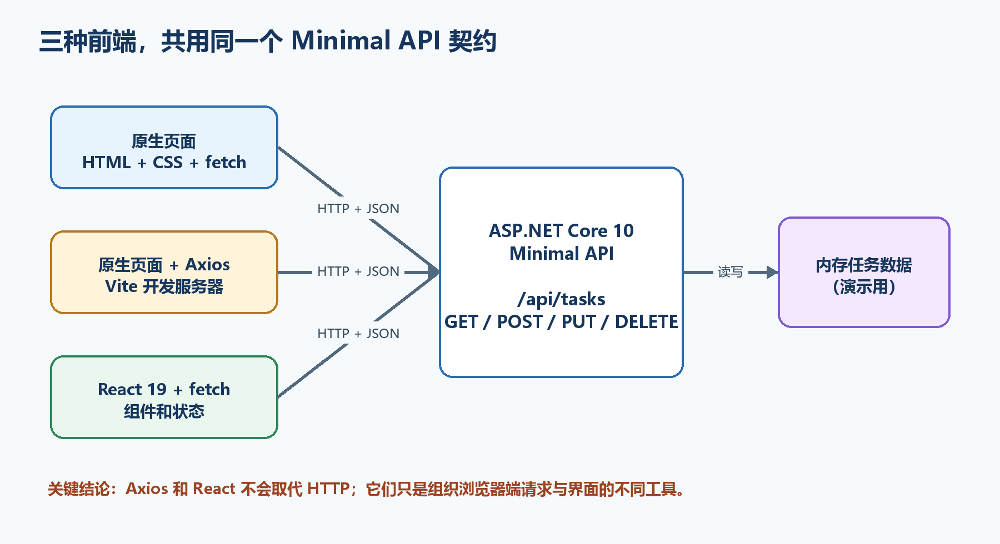
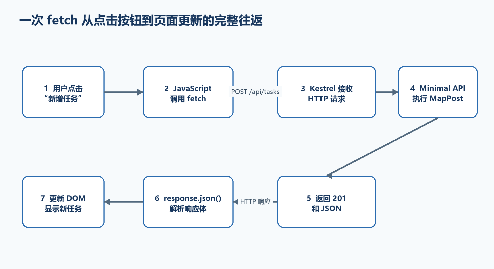
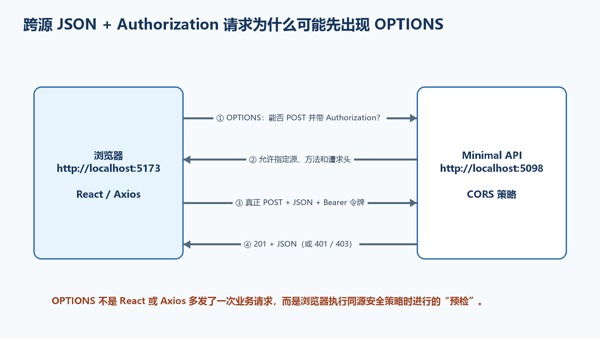
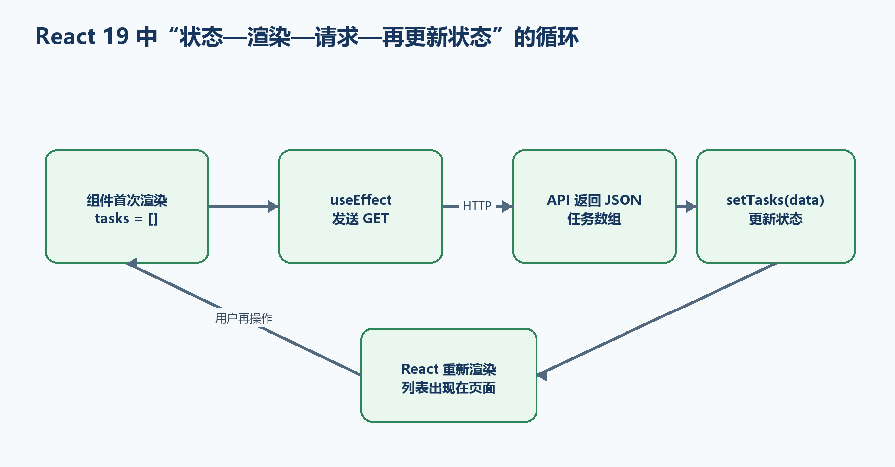

# 附录C　从原生fetch到Axios与React 19：前端连接Minimal API完整流程

本附录从浏览器最基础的工作方式开始，不假定读者已经理解前端框架。我们先用原生HTML、CSS、JavaScript和fetch完成一个任务页面，亲眼观察浏览器怎样发送HTTP请求；随后把JSON、状态码、CORS、认证与授权逐个讲清楚；最后让Axios页面和React 19页面连接同一个.NET 10 Minimal API。

  ----------------------------------------------------------------------------------------------------------------------------------------------------------------------------------------------------------------------------------------
  **读完后应当真正会什么　**能够从空文件夹建立后端和三种前端；知道每个文件放在哪里；能在Network面板解释请求方法、URL、请求头、JSON请求体、状态码和响应体；能判断失败属于代码、CORS、认证还是服务器；能完成一般的查询、新增、修改和删除。
  ----------------------------------------------------------------------------------------------------------------------------------------------------------------------------------------------------------------------------------------

  ----------------------------------------------------------------------------------------------------------------------------------------------------------------------------------------------------------------------------------------

{width="6.299212598425197in" height="3.4295713035870516in"}

图C-1　三种前端共用同一个Minimal API及HTTP契约

## C.1 先分清五个容易混在一起的名词

HTML决定页面里有什么，例如标题、输入框、按钮和列表；CSS决定这些元素看起来怎样；JavaScript负责响应点击、读取输入、发送请求和更新页面。三者都是浏览器原生能力，不需要React也能完成一个真正可用的前端。

fetch是浏览器原生的HTTP请求API。Axios是安装到JavaScript项目中的HTTP客户端库，它把常用配置、JSON处理、超时、拦截器和错误对象封装得更方便。Axios不是一种前端框架，也不会让服务器多出新的接口。

React 19是组织界面和状态的UI库。React负责根据状态生成界面；至于怎样访问后端，可以继续使用fetch，也可以安装Axios。本附录的React示例故意使用fetch，以便清楚看见：React和HTTP客户端是两个不同层次的工具。

  ---------------------------------------------------------------------------------------------
  **名词**      **它解决什么问题**           **运行在哪里**         **本附录中的角色**
  ------------- ---------------------------- ---------------------- ---------------------------
  HTML          页面结构和语义               浏览器                 表单、按钮、任务列表

  CSS           布局和外观                   浏览器                 让三个页面清楚可用

  JavaScript    交互逻辑                     浏览器                 读取输入、更新DOM

  fetch         发送HTTP请求                 浏览器                 原生版和React版的请求工具

  Axios         封装HTTP请求的常用工作       浏览器中的JavaScript   第二种客户端

  React 19      组件、状态与渲染             浏览器                 第三种客户端

  Minimal API   执行业务逻辑并返回HTTP响应   服务器/Kestrel         三个客户端共同访问的后端
  ---------------------------------------------------------------------------------------------

## C.2 最终目录和运行拓扑

为了让比较有意义，三个前端使用同一个TaskApi后端。原生fetch页面放在TaskApi/wwwroot中，由Kestrel一起提供，所以它与API同源；Axios和React项目由Vite开发服务器提供，端口与后端不同，所以开发时属于跨源访问。

下面的FrontendClients只是父文件夹名称，可以换成其他名称。命令必须在父文件夹中执行；项目创建后再进入相应目录。不要把三个package.json或三个Program.cs混在同一层。

**示例C-1　完成后的总目录结构**

```text
FrontendClients/
├─ TaskApi/ # .NET 10后端，同时提供原生fetch页面
│ ├─ Program.cs
│ ├─ TaskApi.csproj
│ ├─ appsettings.json
│ ├─ Properties/launchSettings.json
│ └─ wwwroot/
│ ├─ index.html
│ ├─ styles.css
│ └─ app.js
├─ task-axios-client/ # 原生DOM + Axios + Vite
│ ├─ index.html
│ ├─ package.json
│ └─ src/
│ ├─ api.js
│ ├─ main.js
│ └─ style.css
└─ task-react-client/ # React 19 + fetch + Vite
├─ .env.development
├─ index.html
├─ package.json
└─ src/
├─ App.jsx
├─ api.js
├─ main.jsx
└─ index.css
```

  ----------------------------------------------------------------------------------------
  **应用**        **典型地址**                      **与API的关系**     **是否需要CORS**
  --------------- --------------------------------- ------------------- ------------------
  原生fetch页面   http://localhost:5098/            页面和API同为5098   不需要

  Minimal API     http://localhost:5098/api/tasks   后端资源            ---

  Axios页面       http://localhost:5173/            端口不同            需要

  React 19页面    http://localhost:5174/            端口不同            需要
  ----------------------------------------------------------------------------------------

## C.3 浏览器究竟怎样发送一次HTTP请求

用户点击按钮时，JavaScript并不是直接调用服务器中的C#函数。fetch先把方法、URL、请求头和请求体交给浏览器网络层；浏览器建立或复用TCP连接，通过HTTP把字节发给Kestrel；Kestrel创建HttpContext，ASP.NET Core匹配MapPost等端点；端点产生状态码、响应头和响应体，再沿相反方向返回。

浏览器得到响应后，fetch返回一个Response对象。这个对象的status和ok告诉你HTTP是否成功，headers保存响应头，json()或text()才会读取并解析响应体。最后，JavaScript修改DOM或React状态，用户才在页面上看见结果。

{width="6.299212598425197in" height="3.4295713035870516in"}

图C-2　一次fetch请求从点击到页面更新的完整往返

**示例C-2　浏览器可能发出的HTTP请求（为了讲解而简化）**

```text
POST /api/tasks HTTP/1.1
Host: localhost:5098
Content-Type: application/json
Authorization: Bearer eyJhbGciOi...

{
"title": "学习fetch"
}
```

**示例C-3　Minimal API可能返回的HTTP响应**

```text
HTTP/1.1 201 Created
Content-Type: application/json; charset=utf-8
Location: /api/tasks/3

{
"id": 3,
"title": "学习fetch",
"completed": false
}
```

-   请求行说明方法和资源：POST表示创建，/api/tasks表示任务集合。

-   Content-Type说明请求体按JSON解释；没有它，服务器可能无法按预期绑定对象。

-   Authorization携带Bearer令牌；令牌不应放在URL查询字符串中。

-   201表示已创建；Location指出新资源地址；响应体给出服务器最终保存的数据。

## C.4 用开发者工具亲眼看见请求

Chrome、Edge和Firefox都提供开发者工具。先打开页面，再按F12，选择Network（网络）面板；勾选Preserve log可在页面跳转时保留记录，点击清空按钮后再执行一次操作。不要只看Console，因为CORS、状态码、请求头和响应体主要在Network中。

349. 第一步：在页面新增一个任务。Network列表应出现POST /api/tasks；如果代码随后刷新列表，还会出现GET /api/tasks。

350. 第二步：点开POST记录，在Headers中核对Request URL、Request Method、Status Code和Remote Address。

351. 第三步：在Request Headers中核对Content-Type和Authorization；在Payload中核对实际发送的JSON。

352. 第四步：在Response或Preview中核对后端返回的JSON；在Timing中查看等待服务器和下载分别用了多久。

353. 第五步：跨源写操作若出现OPTIONS，先点开OPTIONS检查CORS响应头，再检查后面的真正POST。

  ---------------------------------------------------------------------------------------------------------------------------------------------------------------------------------------------------------------------------------------------------
  **一个极有用的判断　**Network中完全没有请求，问题通常在按钮事件或JavaScript执行之前；有请求但状态码是4xx/5xx，说明浏览器已经联系到服务器；只有"Failed to fetch"而服务器日志没有业务请求，则应优先检查地址、HTTPS证书、CORS、网络或Mixed Content。
  ---------------------------------------------------------------------------------------------------------------------------------------------------------------------------------------------------------------------------------------------------

  ---------------------------------------------------------------------------------------------------------------------------------------------------------------------------------------------------------------------------------------------------

## C.5 JSON是什么，前后端为什么都要关心它

JSON是一种文本数据格式，不是C#对象，也不是JavaScript对象。JavaScript用JSON.stringify把对象变成JSON文本；fetch响应的json()读取响应体并把JSON文本解析成JavaScript值。ASP.NET Core则把请求JSON反序列化成CreateTaskRequest，并把TaskItem序列化为JSON响应。

JSON属性名必须使用双引号，字符串也使用双引号；不能写注释，不能在最后一个属性后保留逗号。日期在JSON中通常只是约定格式的字符串。属性名称、类型和是否允许为空必须与接口契约一致。

**示例C-4　对象、JSON.stringify与response.json()的关系**

```csharp
// JavaScript对象：存在于浏览器内存中
const requestObject = { title: "学习JSON" };

// JSON文本：可以作为HTTP请求体发送
const jsonText = JSON.stringify(requestObject);
// 结果：{"title":"学习JSON"}

const response = await fetch("/api/tasks", {
method: "POST",
headers: { "Content-Type": "application/json" },
body: jsonText
});

// 把响应中的JSON文本解析成JavaScript对象
const savedTask = await response.json();
console.log(savedTask.id);
```

  ---------------------------------------------------------------------------------------------------------------------------------------------------------------------------------
  **204响应没有JSON　**DELETE成功常返回204 No Content。此时响应体为空，继续执行response.json()会抛出解析错误。因此统一请求函数应当先判断response.status === 204，再决定是否解析。
  ---------------------------------------------------------------------------------------------------------------------------------------------------------------------------------

  ---------------------------------------------------------------------------------------------------------------------------------------------------------------------------------

## C.6 状态码不是装饰：前端要按它决定下一步

HTTP状态码是服务器对本次请求结果的机器可读概括。fetch遇到404、400或500时通常不会自动抛出异常；只要网络往返完成，它仍会返回Response。因此原生fetch代码必须检查response.ok。Axios默认会把非2xx状态转到catch，但仍应读取error.response.status和后端返回的错误体。

  -----------------------------------------------------------------------------------------------------
  **状态码**                  **最直白的意思**       **任务API中的场景**   **前端应做什么**
  --------------------------- ---------------------- --------------------- ----------------------------
  200 OK                      成功，并有响应内容     查询、修改成功        解析JSON并更新界面

  201 Created                 新资源创建成功         POST新增任务          读取JSON和Location

  204 No Content              成功，但没有响应体     DELETE成功            不要调用json()

  400 Bad Request             输入或请求格式不合法   标题为空、JSON错误    显示可理解的验证信息

  401 Unauthorized            没有有效身份凭据       未带令牌或令牌无效    要求重新取得令牌/登录

  403 Forbidden               身份有效但没有权限     缺少所需角色或策略    说明无权操作，不要反复登录

  404 Not Found               资源不存在             任务ID不存在          提示已不存在并刷新列表

  409 Conflict                与当前资源状态冲突     并发版本冲突          提示刷新后重试

  500 Internal Server Error   服务器内部失败         未处理异常            显示通用提示并记录追踪信息
  -----------------------------------------------------------------------------------------------------

**示例C-5　同时处理空响应、JSON、文本和非2xx状态**

```csharp
async function readResponse(response) {
if (response.status === 204) return null;

const contentType = response.headers.get("content-type") ?? "";
const data = contentType.includes("application/json")
? await response.json()
: await response.text();

if (!response.ok) {
const message = data?.detail ?? data?.message ?? `请求失败：${response.status}`;
throw new Error(message);
}
return data;
}
```

## C.7 同源、跨源与CORS的完整原理

浏览器把协议、主机和端口完全相同的两个地址视为同源。http://localhost:5098/与http://localhost:5098/api/tasks同源；http://localhost:5173与http://localhost:5098端口不同，因此跨源；http与https不同协议，也属于跨源。路径不同不会造成跨源。

同源策略是浏览器保护用户数据的安全边界。CORS是服务器通过响应头明确告诉浏览器"哪些其他源可以由页面JavaScript读取我的响应"。CORS不会验证用户身份，也不会阻止curl、Swagger或服务器程序直接发请求，所以不能把CORS当成认证或防火墙。

带application/json或Authorization等条件的跨源请求可能触发预检。浏览器先发送OPTIONS，询问服务器是否允许该源、方法和请求头；预检通过后才发送真正的POST、PUT或DELETE。页面代码通常不需要手写OPTIONS。

{width="6.299212598425197in" height="3.5695538057742784in"}

图C-3　跨源写请求的CORS预检与真正业务请求

**示例C-6　只允许两个明确开发源的CORS配置**

```csharp
const string FrontendCors = "FrontendCors";

builder.Services.AddCors(options =>
{
options.AddPolicy(FrontendCors, policy =>
policy.WithOrigins(
"http://localhost:5173",
"http://localhost:5174")
.AllowAnyHeader()
.AllowAnyMethod());
});

// Build之后、映射端点之前启用策略
app.UseCors(FrontendCors);
```

-   WithOrigins中的地址末尾不要加斜杠；协议、主机和端口必须与浏览器地址栏一致。

-   本例使用Bearer请求头，不使用跨站Cookie，所以前端无需设置credentials，后端也无需AllowCredentials。

-   不要组合AllowAnyOrigin与AllowCredentials。生产环境应把开发地址替换成真实前端域名。

-   UseCors要放在需要跨源访问的端点之前；若同时显式调用认证授权中间件，顺序通常为UseCors、UseAuthentication、UseAuthorization。

## C.8 认证、授权、Bearer令牌、401和403

认证回答"你是谁"；授权回答"已经知道你是谁后，你能不能执行这项操作"。Bearer令牌是一段由受信任身份系统签发的字符串。浏览器把它放入Authorization请求头，后端验证签名、签发者、受众和有效期，再建立当前用户身份。RequireAuthorization要求端点必须有通过验证的身份。

401通常表示没有令牌、令牌无效或已过期；403表示令牌有效，用户也已经被识别，但不满足角色或策略。二者不能混为"接口坏了"。.NET 10的已知API端点在认证失败时返回401/403，而不是把浏览器重定向到HTML登录页。

**示例C-7　Bearer令牌应放在Authorization请求头**

```csharp
const token = sessionStorage.getItem("access_token");
const headers = { "Content-Type": "application/json" };

if (token) {
headers.Authorization = `Bearer ${token}`;
}

await fetch("http://localhost:5098/api/tasks", {
method: "POST",
headers,
body: JSON.stringify({ title: "带令牌的请求" })
});
```

  ----------------------------------------------------------------------------------------------------------------------------------------------------------------------------------------------------------------------------------------------------------------------------------------
  **本附录为什么用开发令牌　**dotnet user-jwts适合本机学习和接口调试，可以让我们专注于浏览器如何携带、后端如何验证令牌。正式系统不要让用户复制粘贴令牌，也不要自己发明JWT登录流程；应使用可靠身份提供商、OpenID Connect授权码+PKCE，或采用BFF与安全HttpOnly Cookie等经过威胁建模的方案。
  ----------------------------------------------------------------------------------------------------------------------------------------------------------------------------------------------------------------------------------------------------------------------------------------

  ----------------------------------------------------------------------------------------------------------------------------------------------------------------------------------------------------------------------------------------------------------------------------------------

  --------------------------------------------------------------------------------------------------------------------------------------------------------------------------------------------------------------------------------
  **sessionStorage也不是保险箱　**示例把令牌放入sessionStorage只是为了便于学习，关闭标签页后通常会清除；任何能在页面中执行的恶意脚本仍可能读取它。VITE_环境变量也会进入浏览器包，绝不能存放客户端密钥、数据库密码或JWT签名密钥。
  --------------------------------------------------------------------------------------------------------------------------------------------------------------------------------------------------------------------------------

  --------------------------------------------------------------------------------------------------------------------------------------------------------------------------------------------------------------------------------

## C.9 第一步：创建共享的.NET 10 Minimal API后端

先在一个准备好的父目录中创建TaskApi。web模板比webapi模板更空，适合看清我们究竟加入了什么。JwtBearer包负责读取和验证Authorization: Bearer请求头；CORS和静态文件能力来自ASP.NET Core共享框架。

**示例C-8　从空父目录创建后端项目**

```bash
cd C:/Projects
mkdir FrontendClients
cd FrontendClients

dotnet new web -n TaskApi -f net10.0
cd TaskApi
dotnet add package Microsoft.AspNetCore.Authentication.JwtBearer --version 10.0.9
mkdir wwwroot

dotnet restore
dotnet build
```

-   dotnet new web创建项目文件、Program.cs和配置文件；-f net10.0明确目标框架。

-   dotnet add package修改TaskApi.csproj并还原NuGet包；如果未来使用较新的.NET 10修补版本，应让包的主版本保持10，并与项目依赖统一升级。

-   wwwroot是公开静态文件根目录，稍后保存原生HTML、CSS和JavaScript。

-   dotnet build必须先成功；若此时失败，不要继续建立前端。

## C.10 第二步：完整编写Program.cs

下面代码可完整替换TaskApi/Program.cs。先整体复制并编译，再按"服务注册---中间件---数据---端点---DTO"的顺序理解。GET允许匿名读取，POST、PUT和DELETE通过RequireAuthorization要求有效令牌。数据只保存在内存中，重启后恢复为两条种子任务。

**示例C-9　三个前端共同使用的完整Program.cs**

```csharp
using System.Collections.Concurrent;
using Microsoft.AspNetCore.Authentication.JwtBearer;

var builder = WebApplication.CreateBuilder(args);

const string FrontendCors = "FrontendCors";

builder.Services.AddCors(options =>
{
options.AddPolicy(FrontendCors, policy =>
policy.WithOrigins(
"http://localhost:5173",
"http://localhost:5174")
.AllowAnyHeader()
.AllowAnyMethod());
});

builder.Services
.AddAuthentication(JwtBearerDefaults.AuthenticationScheme)
.AddJwtBearer();
builder.Services.AddAuthorization();

var app = builder.Build();

app.UseDefaultFiles();
app.UseStaticFiles();
app.UseCors(FrontendCors);
app.UseAuthentication();
app.UseAuthorization();

var tasks = new ConcurrentDictionary<int, TaskItem>();
tasks[1] = new TaskItem(1, "看懂HTTP请求", false);
tasks[2] = new TaskItem(2, "连接Minimal API", false);
var nextId = 2;

app.MapGet("/api/tasks", () =>
Results.Ok(tasks.Values.OrderBy(task => task.Id)));

app.MapGet("/api/tasks/{id:int}", (int id) =>
tasks.TryGetValue(id, out var task)
? Results.Ok(task)
: Results.NotFound(new { message = "任务不存在" }));

app.MapPost("/api/tasks", (CreateTaskRequest request) =>
{
var title = request.Title?.Trim();
if (string.IsNullOrWhiteSpace(title))
{
return Results.ValidationProblem(new Dictionary<string, string[]>
{
["title"] = ["标题不能为空"]
});
}

var id = Interlocked.Increment(ref nextId);
var task = new TaskItem(id, title, false);
tasks[id] = task;
return Results.Created($"/api/tasks/{id}", task);
}).RequireAuthorization();

app.MapPut("/api/tasks/{id:int}", (int id, UpdateTaskRequest request) =>
{
if (!tasks.ContainsKey(id))
return Results.NotFound(new { message = "任务不存在" });

var title = request.Title?.Trim();
if (string.IsNullOrWhiteSpace(title))
{
return Results.ValidationProblem(new Dictionary<string, string[]>
{
["title"] = ["标题不能为空"]
});
}

var updated = new TaskItem(id, title, request.Completed);
tasks[id] = updated;
return Results.Ok(updated);
}).RequireAuthorization();

app.MapDelete("/api/tasks/{id:int}", (int id) =>
tasks.TryRemove(id, out _)
? Results.NoContent()
: Results.NotFound(new { message = "任务不存在" }))
.RequireAuthorization();

app.MapGet("/health", () => Results.Ok(new { status = "ok" }));

app.Run();

record TaskItem(int Id, string Title, bool Completed);
record CreateTaskRequest(string? Title);
record UpdateTaskRequest(string? Title, bool Completed);
```

  ----------------------------------------------------------------------------------------------
  **代码位置**                      **目的**               **为什么需要**
  --------------------------------- ---------------------- -------------------------------------
  AddCors                           声明允许的前端源       Axios和React开发服务器与API端口不同

  AddAuthentication/AddJwtBearer    注册Bearer认证处理器   把令牌验证为用户身份

  AddAuthorization                  注册授权服务           RequireAuthorization需要它

  UseDefaultFiles/UseStaticFiles    返回wwwroot页面        原生fetch客户端与API同源

  UseCors                           对跨源请求应用策略     让浏览器通过预检并读取响应

  UseAuthentication                 读取并验证凭据         先建立User身份

  UseAuthorization                  检查端点访问规则       再判断是否允许执行

  MapGet/MapPost/MapPut/MapDelete   定义HTTP端点           形成CRUD接口契约

  record DTO                        定义JSON形状           模型绑定和序列化依据
  ----------------------------------------------------------------------------------------------

  -------------------------------------------------------------------------------------------------------------------------------------------------------------------------------------------------------------------------------
  **为什么中间件顺序这样写　**静态文件先处理原生页面；CORS先为跨源响应准备许可头；认证先建立用户；授权再检查RequireAuthorization。端点最终执行。顺序写反时，常见结果是预检失败、401/403缺少CORS响应头，或授权无法得到用户身份。
  -------------------------------------------------------------------------------------------------------------------------------------------------------------------------------------------------------------------------------

  -------------------------------------------------------------------------------------------------------------------------------------------------------------------------------------------------------------------------------

## C.11 第三步：生成开发令牌并先独立测试API

进入包含TaskApi.csproj的目录，用.NET SDK自带的dotnet user-jwts生成本机开发令牌。命令会为项目配置开发验证参数并在终端输出Token。复制完整令牌时不要包含引号、Token标签或换行。令牌只用于本机，不要提交到Git。

**示例C-10　生成开发JWT并启动后端**

```bash
cd C:/Projects/FrontendClients/TaskApi

# 生成一个开发用Bearer令牌
dotnet user-jwts create

# 启动后端，并固定本附录使用的HTTP端口
dotnet run --urls http://localhost:5098
```

  ------------------------------------------------------------------------------------------------------------------------------------------------------------------------------------------------------------
  **预期结果　**终端先显示一段很长的Token；启动后显示Now listening on: http://localhost:5098。浏览器打开http://localhost:5098/health应得到status为ok的JSON。HTTP仅用于localhost教学，生产环境必须使用HTTPS。
  ------------------------------------------------------------------------------------------------------------------------------------------------------------------------------------------------------------

  ------------------------------------------------------------------------------------------------------------------------------------------------------------------------------------------------------------

**示例C-11　TaskApi.http：连接前端前先验证匿名与认证请求**

```text
@baseUrl = http://localhost:5098
@token = 把dotnet user-jwts输出的完整令牌粘贴到这里

### 匿名查询，应为200
GET {{baseUrl}}/api/tasks

### 不带令牌创建，应为401
POST {{baseUrl}}/api/tasks
Content-Type: application/json

{
"title": "这次故意不带令牌"
}

### 带令牌创建，应为201
POST {{baseUrl}}/api/tasks
Content-Type: application/json
Authorization: Bearer {{token}}

{
"title": "先确认后端正常"
}
```

  ------------------------------------------------------------------------------------------------------------------------------------------------------------------------------------------------------
  **为什么一定先测后端　**如果GET、401和201都符合预期，说明路由、JSON绑定和认证基本正常；此后页面失败，排查重点才应转向前端URL、CORS和请求头。把所有层一次启动再猜错误，会让新手不知道失败来自哪一层。
  ------------------------------------------------------------------------------------------------------------------------------------------------------------------------------------------------------

  ------------------------------------------------------------------------------------------------------------------------------------------------------------------------------------------------------

## C.12 原生fetch客户端：先写index.html

在TaskApi/wwwroot中创建index.html、styles.css和app.js。HTML只描述结构：令牌输入框、新增表单、消息区域和任务列表；具体请求放在app.js，外观放在styles.css。使用defer可让浏览器先解析HTML，再执行脚本。

**示例C-12　TaskApi/wwwroot/index.html**

```xml
<!doctype html>
<html lang="zh-CN">
<head>
<meta charset="utf-8">
<meta name="viewport" content="width=device-width, initial-scale=1">
<title>原生fetch任务清单</title>
<link rel="stylesheet" href="/styles.css">
<script src="/app.js" defer></script>
</head>
<body>
<main class="panel">
<h1>原生fetch任务清单</h1>
<p class="muted">GET允许匿名；写操作需要开发令牌。</p>

<label for="token">Bearer令牌</label>
<textarea id="token" rows="3"
placeholder="粘贴dotnet user-jwts生成的令牌"></textarea>
<button id="saveToken" type="button">本标签页保存令牌</button>

<form id="createForm">
<label for="title">新任务标题</label>
<div class="row">
<input id="title" maxlength="100" required>
<button type="submit">新增</button>
</div>
</form>

<p id="message" role="status" aria-live="polite"></p>
<ul id="taskList"></ul>
</main>
</body>
</html>
```

-   label的for与输入元素id对应，方便鼠标和辅助技术定位。

-   form的submit同时支持点击按钮和在输入框按Enter；JavaScript中要preventDefault，避免页面刷新。

-   role=status和aria-live让动态消息更容易被辅助技术感知。

-   路径以/开头，表示从当前站点根地址请求；本例页面与API同源。

## C.13 原生fetch客户端：再写CSS

CSS不参与HTTP，但清楚的加载、错误和完成状态会直接影响可用性。下面样式故意保持简单，重点是让输入、按钮、任务行和错误信息容易辨认。

**示例C-13　TaskApi/wwwroot/styles.css**

```text
* { box-sizing: border-box; }
body {
margin: 0;
font-family: system-ui, "Microsoft YaHei", sans-serif;
background: #f4f7fb;
color: #1f2937;
}
.panel {
width: min(760px, calc(100% - 32px));
margin: 40px auto;
padding: 28px;
background: white;
border-radius: 14px;
box-shadow: 0 8px 30px rgb(15 23 42 / 10%);
}
label { display: block; margin-top: 16px; font-weight: 700; }
textarea, input {
width: 100%;
padding: 10px;
border: 1px solid #b8c2cc;
border-radius: 8px;
}
.row, li { display: flex; gap: 10px; align-items: center; }
.row input { flex: 1; }
button {
padding: 10px 14px;
border: 0;
border-radius: 8px;
background: #1769aa;
color: white;
cursor: pointer;
}
button:disabled { opacity: .55; cursor: wait; }
ul { padding: 0; }
li { list-style: none; padding: 12px 0; border-bottom: 1px solid #e5e7eb; }
li span { flex: 1; }
.done { color: #6b7280; text-decoration: line-through; }
.muted { color: #64748b; }
#message { min-height: 24px; color: #b42318; }
```

## C.14 原生fetch客户端：统一请求函数是核心

不要立刻把所有按钮逻辑混在一起。先写一个request函数，统一完成五件事：构造请求头、附加令牌、发送请求、按Content-Type读取响应、把非2xx状态变成带说明的异常。这样每个业务操作只关心自己的方法、路径和JSON。

**示例C-14　app.js第一部分：统一fetch请求函数**

```csharp
const tokenInput = document.querySelector("#token");
tokenInput.value = sessionStorage.getItem("access_token") ?? "";

async function request(path, options = {}) {
const headers = new Headers(options.headers);
const token = tokenInput.value.trim();

if (options.body && !headers.has("Content-Type")) {
headers.set("Content-Type", "application/json");
}
if (token) {
headers.set("Authorization", `Bearer ${token}`);
}

const response = await fetch(path, { ...options, headers });

if (response.status === 204) return null;

const type = response.headers.get("content-type") ?? "";
const data = type.includes("application/json")
? await response.json()
: await response.text();

if (!response.ok) {
const validation = data?.errors?.title?.[0];
const message = validation ?? data?.detail ?? data?.message
?? `请求失败：${response.status}`;
throw new Error(message);
}

return data;
}
```

-   new Headers让代码不必猜options.headers是否存在，并以统一方式设置请求头。

-   只有存在body时才自动设置application/json；GET和DELETE不需要凭空声明JSON请求体。

-   fetch的path使用/api/tasks，因此浏览器自动补为当前同源http://localhost:5098/api/tasks。

-   响应体只能读取一次；代码先决定json()还是text()，然后把data同时用于成功和错误分支。

## C.15 原生fetch客户端：实现查询、新增、修改和删除

把下面代码接在示例C-14之后，仍然位于app.js。loadTasks执行GET并重新生成列表；createRow为每个任务创建复选框和删除按钮；submit事件发送POST。每次写操作成功后重新GET，代码最容易理解，也能保证页面以服务器结果为准。

**示例C-15　app.js第二部分：完整CRUD与DOM更新**

```csharp
const list = document.querySelector("#taskList");
const message = document.querySelector("#message");
const titleInput = document.querySelector("#title");

function showMessage(text = "") {
message.textContent = text;
}

async function loadTasks() {
try {
showMessage("正在加载......");
const tasks = await request("/api/tasks");
list.replaceChildren(...tasks.map(createRow));
showMessage("");
} catch (error) {
showMessage(error.message);
}
}

function createRow(task) {
const li = document.createElement("li");
const checkbox = document.createElement("input");
const text = document.createElement("span");
const remove = document.createElement("button");

checkbox.type = "checkbox";
checkbox.checked = task.completed;
text.textContent = task.title;
text.className = task.completed ? "done" : "";
remove.textContent = "删除";

checkbox.addEventListener("change", async () => {
try {
await request(`/api/tasks/${task.id}`, {
method: "PUT",
body: JSON.stringify({
title: task.title,
completed: checkbox.checked
})
});
await loadTasks();
} catch (error) {
checkbox.checked = task.completed;
showMessage(error.message);
}
});

remove.addEventListener("click", async () => {
try {
await request(`/api/tasks/${task.id}`, { method: "DELETE" });
await loadTasks();
} catch (error) {
showMessage(error.message);
}
});

li.append(checkbox, text, remove);
return li;
}

document.querySelector("#saveToken").addEventListener("click", () => {
sessionStorage.setItem("access_token", tokenInput.value.trim());
showMessage("令牌已保存在当前标签页会话中");
});

document.querySelector("#createForm").addEventListener("submit", async event => {
event.preventDefault();
try {
await request("/api/tasks", {
method: "POST",
body: JSON.stringify({ title: titleInput.value })
});
titleInput.value = "";
await loadTasks();
} catch (error) {
showMessage(error.message);
}
});

loadTasks();
```

  ----------------------------------------------------------------------------------------------------------------------------------------------------------------------------------------------------------------------------------------
  **最终运行结果　**保持TaskApi正在运行，在浏览器打开http://localhost:5098/。页面会显示两条种子任务。匿名刷新可以成功；未粘贴令牌时新增应得到401；粘贴开发令牌并保存后，新增返回201，勾选返回200，删除返回204。Network面板能看到每一步。
  ----------------------------------------------------------------------------------------------------------------------------------------------------------------------------------------------------------------------------------------

  ----------------------------------------------------------------------------------------------------------------------------------------------------------------------------------------------------------------------------------------

## C.16 用五次故意失败真正理解原生前端

学习HTTP最快的方法之一，是一次只改变一个条件并观察结果。每次试验后恢复正确代码，记录Network中的方法、状态码和响应体。

  ----------------------------------------------------------------------------------------
  **故意改变什么**            **预期现象**               **说明了什么**
  --------------------------- -------------------------- ---------------------------------
  清空令牌后POST              401                        写端点需要认证

  标题只输入空格              400，errors.title有信息    后端验证不能由HTML required代替

  把/api/tasks改成/api/task   404                        URL路径必须匹配端点

  删除Content-Type后POST      可能绑定失败或415/400      服务器需要知道请求体格式

  停止dotnet run后刷新        Failed to fetch/连接失败   服务器没有监听，不是业务状态码
  ----------------------------------------------------------------------------------------

## C.17 Axios是什么：它简化HTTP代码，但不改变HTTP

Axios是基于Promise的HTTP客户端库。它可以建立带baseURL和timeout的实例，自动把JavaScript对象序列化为JSON并把JSON响应放在response.data中；默认把非2xx状态当作拒绝，错误对象可区分"服务器返回错误状态""已发请求但没有响应"和"请求配置失败"。

拦截器可在每个请求发送前统一附加令牌，也可在响应失败后统一转换错误。它的作用类似客户端管道；后端仍然只看见普通HTTP请求。对于只有一两个请求的页面，fetch足够；当项目需要统一基地址、超时、认证头和错误格式时，Axios实例会更整洁。

  ---------------------------------------------------------------------------------
  **任务**           **fetch**                     **Axios**
  ------------------ ----------------------------- --------------------------------
  解析JSON           显式await response.json()     结果通常在response.data

  非2xx              仍返回Response，必须检查ok    默认进入catch

  超时               配合AbortController自行实现   实例可直接设置timeout

  统一基地址         自己封装函数                  axios.create({ baseURL })

  统一令牌           自己封装Headers               请求拦截器

  网络/响应错误      自己定义错误形状              error.request / error.response
  ---------------------------------------------------------------------------------

## C.18 创建Axios客户端并确认目录

返回FrontendClients父目录，使用Vite的vanilla模板建立一个原生JavaScript项目，再安装Axios。Vite只负责开发服务器和构建；Axios负责HTTP；页面仍然是HTML、CSS和JavaScript。当前Vite版本要求受支持的Node.js版本，若创建命令提示版本过低，应先按Vite官方要求升级Node。

**示例C-16　创建并启动Vite + Axios客户端**

```bash
cd C:/Projects/FrontendClients

node --version
npm --version

npm create vite@latest task-axios-client -- --template vanilla
cd task-axios-client
npm install
npm install axios

npm run dev -- --port 5173
```

-   先确认Node.js版本。按当前Vite官方要求，应为20.19+或22.12+；如果终端版本更低，先升级Node再继续。

-   npm create vite@latest创建脚手架；\--template vanilla明确不要React。

-   npm install安装package.json已有依赖；npm install axios再加入HTTP客户端。

-   \-- \--port 5173把额外参数交给Vite，确保与后端CORS白名单一致。

-   终端显示Local: http://localhost:5173/后，保持窗口运行；另一个终端继续运行TaskApi。

## C.19 Axios客户端的api.js：实例、令牌、拦截器和错误

在task-axios-client/src创建api.js。baseURL只写到/api，业务代码只传/tasks。请求拦截器每次发送前读取最新令牌，避免在应用启动时把旧令牌永久固定；响应拦截器把不同Axios错误统一成普通Error，页面只显示message。

**示例C-17　task-axios-client/src/api.js**

```text
import axios from "axios";

export const api = axios.create({
baseURL: "http://localhost:5098/api",
timeout: 10000
});

api.interceptors.request.use(config => {
const token = sessionStorage.getItem("access_token");
if (token) {
config.headers.Authorization = `Bearer ${token}`;
}
return config;
});

api.interceptors.response.use(
response => response,
error => {
if (error.response) {
const data = error.response.data;
const message = data?.errors?.title?.[0]
?? data?.detail
?? data?.message
?? `请求失败：${error.response.status}`;
return Promise.reject(new Error(message));
}

if (error.request) {
return Promise.reject(
new Error("没有收到服务器响应，请检查API地址、CORS和后端进程")
);
}

return Promise.reject(new Error(error.message));
}
);
```

-   timeout为10秒，防止请求无限等待；它不是服务器业务超时策略。

-   error.response存在，表示服务器确实返回了非2xx状态，例如400、401或500。

-   error.request存在但response不存在，表示请求已发出但浏览器没有可交给代码的响应；CORS、证书和网络都可能造成这种现象。

-   拦截器必须return config或Promise.reject(error)，否则请求链会得到错误值。

## C.20 Axios客户端的main.js：同一CRUD变得怎样

把Vite模板的src/main.js替换为下面代码。为节省篇幅，页面结构由main.js一次写入；实际大型项目可把结构留在index.html或拆成组件。重点观察Axios调用：GET返回data；POST直接接收对象；DELETE的204无需手工解析。

**示例C-18　task-axios-client/src/main.js**

```xml
import "./style.css";
import { api } from "./api.js";

document.querySelector("#app").innerHTML = `
<main class="panel">
<h1>Axios任务清单</h1>
<label>Bearer令牌</label>
<textarea id="token" rows="3"></textarea>
<button id="saveToken">保存令牌</button>
<form id="createForm">
<label>新任务标题</label>
<div class="row">
<input id="title" required maxlength="100">
<button>新增</button>
</div>
</form>
<p id="message"></p>
<ul id="taskList"></ul>
</main>`;

const token = document.querySelector("#token");
const title = document.querySelector("#title");
const list = document.querySelector("#taskList");
const message = document.querySelector("#message");
token.value = sessionStorage.getItem("access_token") ?? "";

async function loadTasks() {
try {
message.textContent = "正在加载......";
const { data: tasks } = await api.get("/tasks");
list.replaceChildren(...tasks.map(createRow));
message.textContent = "";
} catch (error) {
message.textContent = error.message;
}
}

function createRow(task) {
const li = document.createElement("li");
const check = document.createElement("input");
const text = document.createElement("span");
const remove = document.createElement("button");
check.type = "checkbox";
check.checked = task.completed;
text.textContent = task.title;
text.className = task.completed ? "done" : "";
remove.textContent = "删除";

check.onchange = async () => {
try {
await api.put(`/tasks/${task.id}`, {
title: task.title,
completed: check.checked
});
await loadTasks();
} catch (error) {
check.checked = task.completed;
message.textContent = error.message;
}
};

remove.onclick = async () => {
try {
await api.delete(`/tasks/${task.id}`);
await loadTasks();
} catch (error) {
message.textContent = error.message;
}
};

li.append(check, text, remove);
return li;
}

document.querySelector("#saveToken").onclick = () => {
sessionStorage.setItem("access_token", token.value.trim());
message.textContent = "令牌已保存";
};

document.querySelector("#createForm").onsubmit = async event => {
event.preventDefault();
try {
await api.post("/tasks", { title: title.value });
title.value = "";
await loadTasks();
} catch (error) {
message.textContent = error.message;
}
};

loadTasks();
```

把原生示例C-13的CSS复制到task-axios-client/src/style.css即可。打开http://localhost:5173/，先确认匿名列表，再粘贴令牌测试新增、勾选和删除。此时Network中可能先出现OPTIONS，因为5173与5098跨源；真正业务请求仍是GET、POST、PUT和DELETE。

  ----------------------------------------------------------------------------------------------------------------------------------------------------------------------------------------------------
  **Axios不会绕过CORS　**Axios最终仍让浏览器发送HTTP请求，所以受到同源策略约束。出现Network Error时，不要反复改Axios语法；先检查后端是否运行、baseURL是否正确、控制台是否报告CORS、OPTIONS是否成功。
  ----------------------------------------------------------------------------------------------------------------------------------------------------------------------------------------------------

  ----------------------------------------------------------------------------------------------------------------------------------------------------------------------------------------------------

## C.21 React 19是什么，为什么学习顺序不能倒过来

原生DOM代码需要我们手工创建li、设置文本、绑定事件和替换列表。React让界面成为状态的函数：tasks数组变化后，React重新计算列表，不再手工同步每个DOM节点。它特别适合状态多、组件多、多人协作的界面。

但React不会替你定义HTTP方法、理解状态码、修好CORS或取得认证令牌。如果先学React而不理解Network中发生了什么，一旦出现Failed to fetch、401或预检失败，就很难判断问题。前面的原生fetch部分正是React调试的基础。

{width="6.299212598425197in" height="3.289588801399825in"}

图C-4　React状态、渲染与HTTP请求形成的循环

## C.22 创建React 19项目并固定开发端口

回到FrontendClients父目录，用Vite的react模板创建项目。模板可能随时间升级，所以随后显式安装React 19主版本，并在package.json中核对react与react-dom都是19.x。Vite开发服务器使用5174，与Program.cs中的第二个CORS源一致。

**示例C-19　创建并启动React 19 + Vite项目**

```bash
cd C:/Projects/FrontendClients

npm create vite@latest task-react-client -- --template react
cd task-react-client
npm install
npm install react@19 react-dom@19

npm run dev -- --port 5174
```

**示例C-20　package.json中应核对的React主版本（省略其他字段）**

```json
{
"dependencies": {
"react": "^19.0.0",
"react-dom": "^19.0.0"
}
}
```

  ------------------------------------------------------------------------------------------------------------------------------------------------------------------------------------------------------------------------------
  **实际修补版本可能更高　**上面是一个有效的主版本示意。npm install react@19 react-dom@19会把当时实际安装的19.x修补版本写入package.json和锁文件；重点是react与react-dom保持同一19主版本，并提交package-lock.json以便重复安装。
  ------------------------------------------------------------------------------------------------------------------------------------------------------------------------------------------------------------------------------

  ------------------------------------------------------------------------------------------------------------------------------------------------------------------------------------------------------------------------------

## C.23 用环境变量保存API基地址

在task-react-client根目录创建.env.development。Vite只把以VITE_开头的变量暴露给浏览器代码；修改后必须停止并重新npm run dev。这个文件保存公开的API地址可以，但不能保存任何秘密。

**示例C-21　task-react-client/.env.development**

```text
VITE_API_BASE_URL=http://localhost:5098/api
```

  --------------------------------------------------------------------------------------------------------------------------------------------------------------------------------------------
  **环境变量的真正含义　**构建工具会把VITE_API_BASE_URL的值放进浏览器可下载的JavaScript中，用户可以查看。它是配置，不是保险箱。JWT签名密钥、数据库连接密码和第三方客户端密钥绝不能放在这里。
  --------------------------------------------------------------------------------------------------------------------------------------------------------------------------------------------

  --------------------------------------------------------------------------------------------------------------------------------------------------------------------------------------------

## C.24 React的api.js：继续使用fetch，保持边界清楚

在src创建api.js。这个模块不知道页面有多少按钮，只负责HTTP。React组件调用getTasks、createTask、updateTask和deleteTask；统一request函数处理基地址、令牌、JSON和错误。signal参数允许组件卸载时取消尚未完成的GET。

**示例C-22　task-react-client/src/api.js**

```csharp
const baseUrl = import.meta.env.VITE_API_BASE_URL;

async function request(path, options = {}) {
const headers = new Headers(options.headers);
const token = sessionStorage.getItem("access_token");

if (options.body) headers.set("Content-Type", "application/json");
if (token) headers.set("Authorization", `Bearer ${token}`);

const response = await fetch(`${baseUrl}${path}`, {
...options,
headers
});

if (response.status === 204) return null;

const type = response.headers.get("content-type") ?? "";
const data = type.includes("application/json")
? await response.json()
: await response.text();

if (!response.ok) {
const message = data?.errors?.title?.[0]
?? data?.detail
?? data?.message
?? `请求失败：${response.status}`;
throw new Error(message);
}
return data;
}

export const getTasks = signal =>
request("/tasks", { signal });

export const createTask = title =>
request("/tasks", {
method: "POST",
body: JSON.stringify({ title })
});

export const updateTask = task =>
request(`/tasks/${task.id}`, {
method: "PUT",
body: JSON.stringify({
title: task.title,
completed: task.completed
})
});

export const deleteTask = id =>
request(`/tasks/${id}`, { method: "DELETE" });
```

## C.25 React的App.jsx：状态分别代表什么

组件至少需要四类状态：tasks保存服务器数据，title保存输入框，tokenDraft保存尚未确认的令牌文本，message保存加载或错误提示。useEffect在组件进入页面后查询一次列表；清理函数abort未完成请求，避免组件已离开后继续处理旧结果。

React开发模式的StrictMode可能为了发现副作用问题而额外执行一次Effect的设置与清理，所以Network中偶尔看见开发期GET被启动两次并不等于生产环境会重复。正确做法是让GET可取消、让写操作具备清晰幂等或防重复策略，而不是关闭所有检查来掩盖问题。

**示例C-23　task-react-client/src/App.jsx**

```xml
import { useEffect, useState } from "react";
import {
createTask,
deleteTask,
getTasks,
updateTask
} from "./api.js";

export default function App() {
const [tasks, setTasks] = useState([]);
const [title, setTitle] = useState("");
const [tokenDraft, setTokenDraft] = useState(
() => sessionStorage.getItem("access_token") ?? ""
);
const [message, setMessage] = useState("正在加载......");

async function refresh(signal) {
try {
const data = await getTasks(signal);
setTasks(data);
setMessage("");
} catch (error) {
if (error.name !== "AbortError") setMessage(error.message);
}
}

useEffect(() => {
const controller = new AbortController();
refresh(controller.signal);
return () => controller.abort();
}, []);

function saveToken() {
sessionStorage.setItem("access_token", tokenDraft.trim());
setMessage("令牌已保存在当前标签页会话中");
}

async function handleSubmit(event) {
event.preventDefault();
try {
await createTask(title);
setTitle("");
await refresh();
} catch (error) {
setMessage(error.message);
}
}

async function toggle(task) {
try {
await updateTask({ ...task, completed: !task.completed });
await refresh();
} catch (error) {
setMessage(error.message);
}
}

async function remove(id) {
try {
await deleteTask(id);
await refresh();
} catch (error) {
setMessage(error.message);
}
}

return (
<main className="panel">
<h1>React 19任务清单</h1>
<p className="muted">界面来自状态，HTTP仍由fetch完成。</p>

<label htmlFor="token">Bearer令牌</label>
<textarea
id="token"
rows="3"
value={tokenDraft}
onChange={event => setTokenDraft(event.target.value)}
/>
<button type="button" onClick={saveToken}>保存令牌</button>

<form onSubmit={handleSubmit}>
<label htmlFor="title">新任务标题</label>
<div className="row">
<input
id="title"
required
maxLength="100"
value={title}
onChange={event => setTitle(event.target.value)}
/>
<button type="submit">新增</button>
</div>
</form>

<p id="message" role="status">{message}</p>
<ul>
{tasks.map(task => (
<li key={task.id}>
<input
type="checkbox"
checked={task.completed}
onChange={() => toggle(task)}
/>
<span className={task.completed ? "done" : ""}>
{task.title}
</span>
<button type="button" onClick={() => remove(task.id)}>
删除
</button>
</li>
))}
</ul>
</main>
);
}
```

-   value与onChange组成受控输入：React状态是输入框当前值的依据。

-   tasks.map把每个任务变成一个li；key必须稳定，本例使用后端ID。

-   toggle使用{ \...task, completed: !task.completed }建立新对象，不直接修改原状态对象。

-   写操作成功后refresh最容易理解；更复杂项目可做乐观更新，但必须设计失败回滚。

## C.26 main.jsx和CSS：React怎样真正挂到页面

Vite模板已经有id为root的元素。main.jsx用createRoot把App组件渲染到该元素。StrictMode只在开发阶段帮助暴露不安全副作用。CSS可以复用示例C-13；React中class属性写成className，但CSS选择器不变。

**示例C-24　task-react-client/src/main.jsx**

```xml
import { StrictMode } from "react";
import { createRoot } from "react-dom/client";
import "./index.css";
import App from "./App.jsx";

createRoot(document.getElementById("root")).render(
<StrictMode>
<App />
</StrictMode>
);
```

把示例C-13的CSS保存为task-react-client/src/index.css。然后确认TaskApi仍在5098运行、React开发服务器在5174运行，浏览器打开http://localhost:5174/。若GET成功但写操作401，说明CORS和地址基本正常，下一步只需检查令牌；若OPTIONS失败，检查Program.cs的5174源和中间件顺序。

## C.27 两个终端怎样同时运行，按什么顺序验收

前后端分离开发至少需要两个长期运行的进程。不要在一个终端启动后端后又直接输入npm命令；dotnet run正在占用该终端。打开两个终端标签页，分别进入准确目录。

**示例C-25　React与Minimal API同时运行**

```bash
# 终端A：后端
cd C:/Projects/FrontendClients/TaskApi
dotnet run --urls http://localhost:5098

# 终端B：React 19前端
cd C:/Projects/FrontendClients/task-react-client
npm run dev -- --port 5174

# 浏览器打开
http://localhost:5174/

# API健康检查
http://localhost:5098/health
```

354. 先看后端终端是否显示Now listening on，再看前端终端是否显示Local地址。

355. 先打开/health，排除后端未启动；再打开React页面，排除前端构建错误。

356. 先观察匿名GET；再粘贴令牌测试POST；再测试PUT和DELETE。一次只验证一层。

357. 停止进程时回到对应终端按Ctrl+C。关闭浏览器标签页不会停止Vite或Kestrel。

## C.28 Vite开发代理：另一种本地连接方法

除了让后端开放CORS，还可以让浏览器只访问Vite同源地址，由Vite开发服务器把/api请求代理到5098。浏览器看见的是http://localhost:5174/api/tasks，因此开发期不触发跨源；Vite在服务器端转发。代理适合本地开发，但生产部署仍要由Nginx、IIS、云网关或同源Kestrel配置真正的路由。

**示例C-26　task-react-client/vite.config.js开发代理**

```text
import { defineConfig } from "vite";
import react from "@vitejs/plugin-react";

export default defineConfig({
plugins: [react()],
server: {
port: 5174,
proxy: {
"/api": {
target: "http://localhost:5098",
changeOrigin: true
}
}
}
});
```

**示例C-27　代理方案的.env.development**

```text
# 使用Vite代理时，开发环境基地址改为相对地址
VITE_API_BASE_URL=/api
```

  ------------------------------------------------------------------------------------------------------------------------------------------------------------------------------------------------------------------------------------------------
  **CORS与代理二选一理解，但可同时存在　**直连API时浏览器负责跨源检查，需要后端CORS；代理时浏览器只连接Vite，Vite再作为服务器程序访问API，不受浏览器同源策略限制。项目可以保留后端CORS供其他客户端使用，但不要误以为Vite代理会自动成为生产代理。
  ------------------------------------------------------------------------------------------------------------------------------------------------------------------------------------------------------------------------------------------------

  ------------------------------------------------------------------------------------------------------------------------------------------------------------------------------------------------------------------------------------------------

## C.29 生产构建：分离部署与同源部署

npm run dev只用于开发。交付前必须npm run build，Vite把生产文件写入dist。生产有两种常见拓扑：前端静态文件部署到独立站点并通过公开API域名访问，需要准确CORS；或把dist内容交给同一ASP.NET Core应用/反向代理，以/api为接口、其余路径为前端，形成同源。

**示例C-28　构建并预览React生产文件**

```bash
cd C:/Projects/FrontendClients/task-react-client
npm run build

# 先用Vite预览构建结果（只用于验收，不是正式生产服务器）
npm run preview
```

**示例C-29　同源发布的基地址与SPA回退**

```csharp
// 同源部署时，前端请求地址使用相对路径
VITE_API_BASE_URL=/api

// Program.cs中API端点映射之后，SPA需要客户端路由时再加入：
app.MapFallbackToFile("index.html");
```

-   先执行npm run build，再把dist中的内容复制或由流水线发布到静态站点；不要发布src目录当作生产结果。

-   若复制到TaskApi/wwwroot，应在复制前明确清理策略，避免误删用户文件；API端点先映射，MapFallbackToFile放最后。

-   React应用只有客户端路由时才需要SPA回退；简单单页任务清单不一定需要。

-   生产必须使用HTTPS。HTTPS页面调用HTTP API会被浏览器按Mixed Content阻止。

-   令牌获取、刷新、注销和吊销属于完整身份方案，不应靠手工粘贴令牌上线。

## C.30 最常见问题的分层排查表

排查原则是先确认进程，再确认地址，再确认HTTP，再确认业务。每次只改变一个变量，并保留后端日志与Network记录。

  --------------------------------------------------------------------------------------------
  **现象**                 **优先检查**            **具体动作**
  ------------------------ ----------------------- -------------------------------------------
  浏览器连接被拒绝         后端进程/端口           看Now listening on；打开/health；核对5098

  页面空白                 前端编译/Console        看Vite终端和Console第一条错误

  GET 404                  baseURL和路径           核对/api/tasks，避免重复/api/api

  POST 400                 Payload和Content-Type   看JSON属性、空标题、后端错误体

  POST 401                 Authorization           确认Bearer后有空格、令牌完整且未过期

  POST 403                 角色/策略               确认令牌已认证但是否满足授权要求

  OPTIONS失败              CORS源与顺序            核对5173/5174、无尾斜杠、UseCors位置

  Axios Network Error      CORS/证书/网络          看Console与Network，不只看error.message

  Unexpected end of JSON   204空响应               先判断status===204再解析

  React开发期GET两次       StrictMode和Effect      确保可取消、无副作用；用生产构建验证

  HTTPS页面调HTTP失败      Mixed Content           让API也使用HTTPS并信任开发证书

  修改.env没有生效         Vite进程缓存            停止并重新npm run dev
  --------------------------------------------------------------------------------------------

## C.31 三种实现怎样选择

原生fetch最适合学习原理、体积小的页面、嵌入式管理页和不需要复杂构建的同源应用。Axios适合需要统一baseURL、超时、认证头、错误和拦截器的JavaScript项目；它可以与任何UI方式组合。React 19适合状态较多、组件复用明显、交互复杂或团队协作的前端，但会带来Node、构建、组件设计和依赖升级成本。

选择不是"越复杂越专业"。如果一个内部页面只有一个表单和一个列表，原生方案可能最容易维护；如果是大型交互式业务系统，React的组件和状态模型通常更有价值。无论选择哪一种，HTTP方法、URL、JSON、状态码、CORS和认证契约都必须先设计清楚。

  ----------------------------------------------------------------------------------
  **比较项**     **原生fetch**      **原生DOM + Axios**       **React 19 + fetch**
  -------------- ------------------ ------------------------- ----------------------
  构建工具       可不需要           本例使用Vite              本例使用Vite

  HTTP工具       浏览器fetch        Axios                     浏览器fetch

  界面更新       手工操作DOM        手工操作DOM               状态变化触发渲染

  统一请求配置   自己封装           实例和拦截器              本例封装api.js

  学习重点       HTTP本质           请求工程化                组件与状态

  适合           简单页面/学习      已有DOM项目或统一请求层   中大型交互界面
  ----------------------------------------------------------------------------------

## C.32 从零到最终效果的验收顺序

下面不是练习题，而是完成项目时的验收顺序。只有前一步得到明确结果，才进入下一步。它把"前端打不开"拆成可验证的小问题。

358. dotnet build为0错误；dotnet run显示http://localhost:5098。

359. 浏览器打开/health得到200；TaskApi.http的匿名GET得到200。

360. 无令牌POST得到401；带dotnet user-jwts令牌POST得到201。

361. 打开http://localhost:5098/，原生fetch页面能完成GET、POST、PUT、DELETE；Network显示正确状态码。

362. 启动5173的Axios页面；确认OPTIONS（若出现）通过，Axios CRUD全部成功。

363. 启动5174的React 19页面；确认状态加载、表单受控、CRUD和错误提示正确。

364. 停止后端，三个页面都能显示可理解的网络错误；重启后端可恢复。

365. 清空令牌后写操作显示401；输入空标题显示后端400验证信息。

366. npm run build成功生成dist；没有把秘密写进VITE_变量或提交令牌。

367. 能够用自己的话说明：浏览器前端发送HTTP，JSON承载数据，状态码概括结果，CORS控制跨源读取，认证确认身份，Minimal API才执行真正业务。

  ------------------------------------------------------------------------------------------------------------------------------------------------------------------------------------------------------------------------------
  **附录C的最终结论　**先掌握原生fetch，不是为了永远拒绝框架，而是为了建立稳定的HTTP心智模型。Axios只是更方便的请求层；React 19只是更系统的界面层；两者最终都必须通过浏览器、HTTP、JSON、状态码、CORS和认证与Minimal API协作。
  ------------------------------------------------------------------------------------------------------------------------------------------------------------------------------------------------------------------------------

  ------------------------------------------------------------------------------------------------------------------------------------------------------------------------------------------------------------------------------
