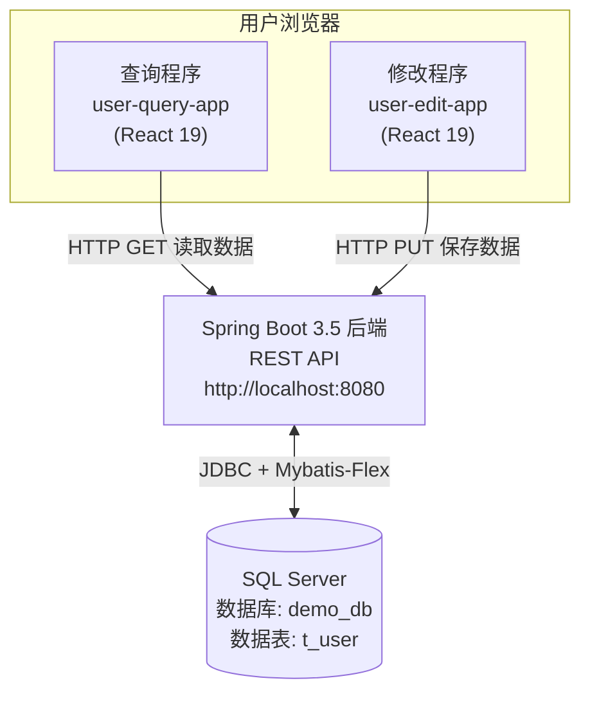
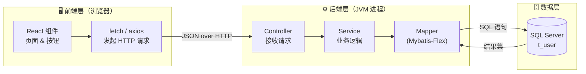
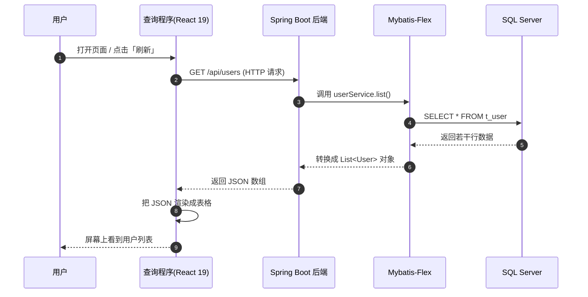
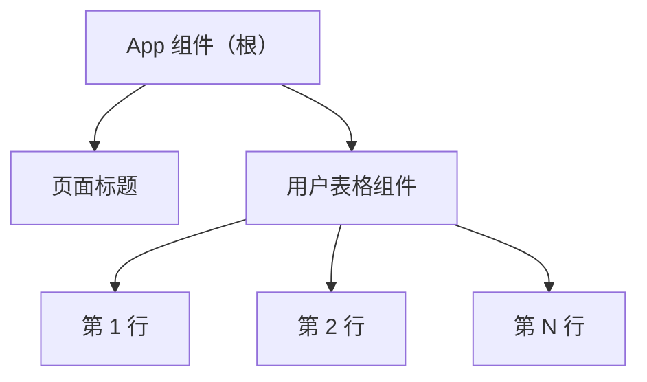
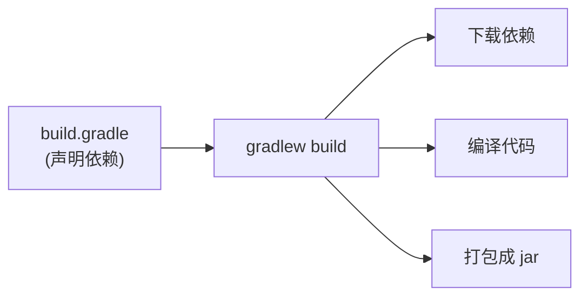
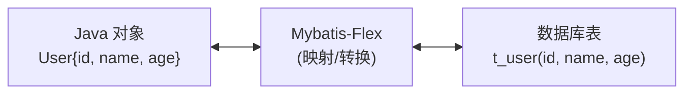
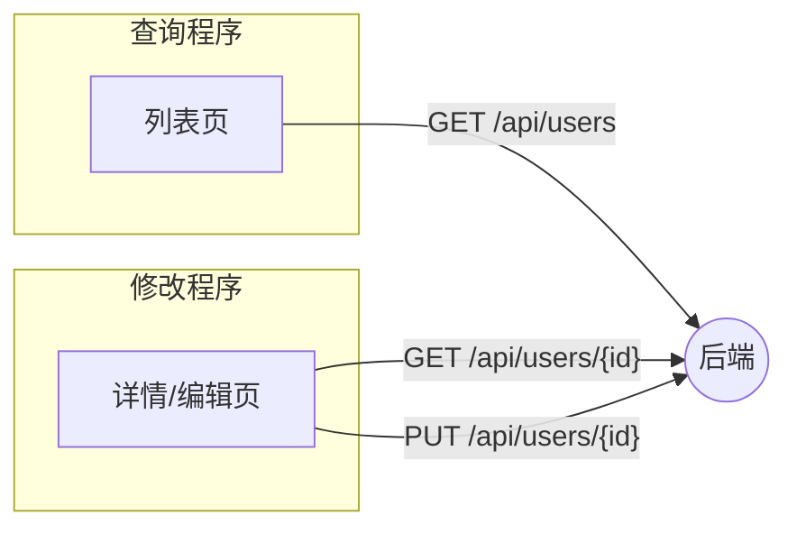
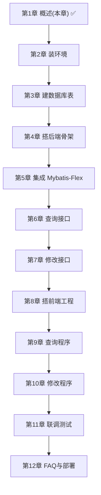

# 第 1 章 技术栈概述与整体架构

> 本章目标：在动手写代码之前，先建立**整体认知**。你将理解——我们要做什么、每个技术负责什么、数据是如何在前端、后端、数据库之间流动的。读完本章，你脑海里会有一张清晰的「全景地图」。

---

## 1.1 我们要做一个什么样的程序？

我们要做一个最小化的「**用户信息管理**」示例。它非常简单，只围绕数据库里的**一张表**做两件事：

1. **查询**：把数据库中的用户列表读出来，展示到网页上。
2. **修改**：在网页上编辑某个用户的信息，保存回数据库。

按照题目要求，「查询」和「修改」是**两个独立的 React 19 程序**（两个前端工程），它们共用**同一个** Spring Boot 后端。



> 💡 **为什么前后端要分离？**
> 前端（React）只负责「界面和交互」，后端（Spring Boot）只负责「业务和数据」。两者通过 HTTP 接口通信。这样前端工程师和后端工程师可以独立开发，也是当今主流的开发模式。

---

## 1.2 三层结构：前端、后端、数据库

我们的系统在物理上分成三块，每一块的职责非常清晰：

| 层 | 用什么技术 | 干什么活 | 通俗比喻 |
| --- | --- | --- | --- |
| **前端（表现层）** | React 19 + Vite | 画界面、和用户交互、发请求 | 餐厅的「服务员和菜单」 |
| **后端（应用层）** | Spring Boot 3.5 + Mybatis-Flex | 处理请求、执行业务逻辑、读写数据库 | 餐厅的「后厨」 |
| **数据库（数据层）** | SQL Server | 持久化保存数据 | 餐厅的「食材仓库」 |



---

## 1.3 一次完整请求的「旅程」

以「**查询用户列表**」为例，看看一次点击背后到底发生了什么。理解这条链路，是理解整个项目的关键。



**用大白话解释这 9 步：**

1. 用户打开网页。
2. React 程序向后端发一个「我要用户列表」的请求。
3. 后端的 Controller 收到请求，交给 Service 处理。
4. Mybatis-Flex 把这个请求翻译成 SQL 语句，发给 SQL Server。
5. 数据库把符合条件的数据行返回。
6. Mybatis-Flex 把数据行「变成」Java 对象（`User` 类的列表）。
7. Spring Boot 把 Java 对象自动转成 **JSON** 文本返回给前端。
8. React 拿到 JSON，把它渲染成表格。
9. 用户在屏幕上看到结果。

> 💡 **JSON 是什么？** 它是前后端之间约定的「数据交换格式」，长得像这样：
> ```json
> [
>   { "id": 1, "name": "张三", "age": 20, "email": "zhangsan@example.com" },
>   { "id": 2, "name": "李四", "age": 22, "email": "lisi@example.com" }
> ]
> ```

---

## 1.4 逐个认识我们的技术栈

### 1.4.1 React 19（前端框架）

React 是由 Meta（Facebook）开源的前端框架，用来构建**用户界面**。它的核心思想是「**组件化**」——把页面拆成一个个可复用的小积木。

- **React 19** 是当前主版本，带来了 `Actions`、`use` Hook、更好的表单处理等新特性。
- 我们用 **Vite** 作为脚手架来创建和运行 React 工程（比老的 Create React App 快很多）。



> 上图：React 用「组件树」来组织界面，每个方框都是一个可复用的组件。

### 1.4.2 Spring Boot 3.5（后端框架）

Spring Boot 是 Java 生态里最流行的后端框架，能让你**快速**搭建一个能对外提供接口的服务。

- 「**开箱即用**」：内置 Tomcat 服务器，一个 `main` 方法就能启动一个 Web 服务。
- **3.5.x** 版本要求 **JDK 17 及以上**（本教程用 JDK 21）。
- 负责：接收前端请求 → 执行业务逻辑 → 调用数据库 → 返回 JSON。

### 1.4.3 Gradle（构建工具）

Gradle 是一个**构建/依赖管理工具**，作用类似前端的 npm：

- 帮你**下载并管理** Java 依赖（比如 Spring Boot、Mybatis-Flex、数据库驱动）。
- 帮你**编译、测试、打包**成可运行的 jar 文件。
- 我们使用 **Gradle Wrapper（`gradlew`）**，这样即使电脑没装 Gradle 也能构建，团队版本还能统一。



### 1.4.4 Mybatis-Flex（持久层框架）

Mybatis-Flex 是新一代的 **MyBatis 增强框架**，负责把 Java 对象和数据库表「连接」起来（即 ORM 的活）。

- **无侵入、体积小、性能好**。
- 提供 `BaseMapper`，**内置了常见的增删改查方法**，几乎不用手写 SQL 就能完成基础操作。
- 支持强类型的 **QueryWrapper** 构造复杂查询。



> 💡 简单说：**Mybatis-Flex 让你「操作 Java 对象」就等于「操作数据库表」**，不用天天手写 SQL 拼字符串。

### 1.4.5 SQL Server（数据库）

Microsoft SQL Server 是微软的关系型数据库。我们只用它存一张 `t_user` 表。

- 可以使用付费版，也可以用**免费的 Express 版**（学习足够用）。
- 用 **SSMS（SQL Server Management Studio）** 这个图形化工具来建库建表、查看数据。
- 后端通过微软官方的 **mssql-jdbc** 驱动连接它。

---

## 1.5 数据表设计（贯穿全教程）

整个教程只围绕一张最简单的表 `t_user`。先看它长什么样（第 3 章会真正创建它）：

| 字段名 | 类型 | 含义 | 说明 |
| --- | --- | --- | --- |
| `id` | INT | 主键 | 自增，唯一标识一个用户 |
| `name` | NVARCHAR(50) | 姓名 | 支持中文 |
| `age` | INT | 年龄 | 整数 |
| `email` | NVARCHAR(100) | 邮箱 | 字符串 |

对应的 Java 实体类（第 6 章会写）大致长这样：

```java
public class User {
    private Integer id;
    private String  name;
    private Integer age;
    private String  email;
    // getter / setter ...
}
```

> ⚠️ **命名对照**：数据库表名习惯用 `t_user`（下划线、小写），Java 类名用 `User`（大驼峰）。第 6 章会讲怎么通过 Mybatis-Flex 的 `@Table("t_user")` 注解把二者对应起来。

---

## 1.6 接口设计（前后端的「合同」）

前端和后端约定好以下几个 REST 接口，这就是它们之间的「合同」。后续章节都会围绕它们展开。

| 功能 | HTTP 方法 | 路径 | 请求体 | 返回 | 用在哪个前端 |
| --- | --- | --- | --- | --- | --- |
| 查询全部用户 | `GET` | `/api/users` | 无 | 用户数组 | 查询程序 |
| 按 id 查询单个 | `GET` | `/api/users/{id}` | 无 | 单个用户 | 修改程序 |
| 更新用户 | `PUT` | `/api/users/{id}` | 用户 JSON | 更新后的用户 | 修改程序 |



> 💡 REST 风格约定：`GET` 表示「读」，`PUT` 表示「整体更新」，`POST` 表示「新增」，`DELETE` 表示「删除」。本教程只用到 `GET` 和 `PUT`。

---

## 1.7 最终工程目录预览

学完全部章节后，你会得到如下目录（现在看个大概即可）：

```text
fullstack-demo/
├── backend/                         # ⚙️ Spring Boot 后端（Gradle 工程）
│   ├── build.gradle                 # 依赖声明
│   ├── settings.gradle
│   ├── gradlew / gradlew.bat        # Gradle Wrapper
│   └── src/main/
│       ├── java/com/example/demo/
│       │   ├── DemoApplication.java # 启动类
│       │   ├── entity/User.java     # 实体类
│       │   ├── mapper/UserMapper.java
│       │   ├── service/UserService.java
│       │   └── controller/UserController.java
│       └── resources/
│           └── application.yml       # 数据库连接等配置
│
└── frontend/
    ├── user-query-app/              # 🖥️ React 19「查询程序」
    │   └── src/App.jsx
    └── user-edit-app/               # 🖥️ React 19「修改程序」
        └── src/App.jsx
```

---

## 1.8 学习路线图



---

## 1.9 本章小结

- 我们要做一个「查询」+「修改」的最小全栈项目，围绕 SQL Server 的一张 `t_user` 表。
- 系统分三层：**React 前端** ↔ **Spring Boot 后端** ↔ **SQL Server 数据库**。
- 各技术分工：React 画界面、Spring Boot 处理请求、Gradle 管构建、Mybatis-Flex 读写数据库、SQL Server 存数据。
- 前后端通过 **REST + JSON** 通信，接口「合同」已在 1.6 节定好。

✅ 现在你已经有了整体地图。下一章我们开始**安装并验证所有开发环境**。

👉 下一章：**[第 2 章 开发环境准备与安装](02-开发环境准备.md)**
