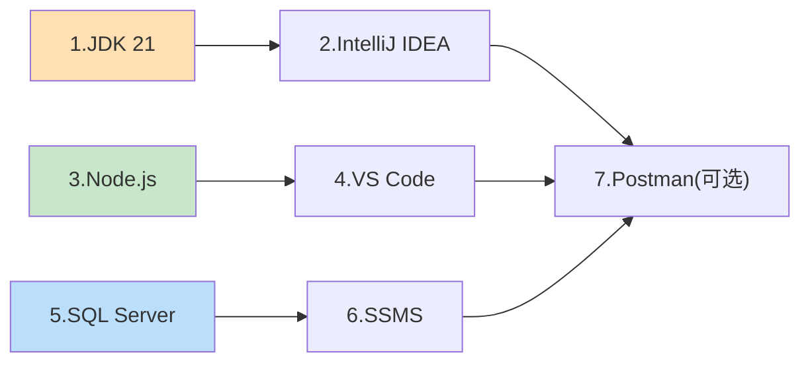
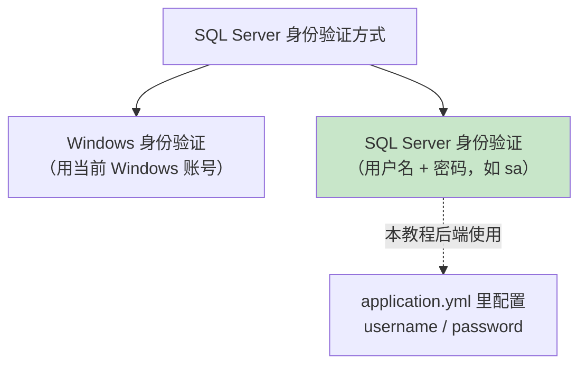

# 第 2 章 开发环境准备与安装

> 本章目标：把开发这套全栈程序所需的**全部软件**装好，并**逐一验证**它们确实能用。本章以 **Windows 10/11** 为主线讲解（因为 SQL Server 在 Windows 上最常用），同时给出 macOS 的关键差异。
>
> ⚠️ 请**严格按顺序**安装并在每一步都做验证。环境没配好就写代码，后面会遇到各种莫名其妙的问题。

---

## 2.1 需要安装哪些软件？

先看一张「购物清单」，做到心里有数：

| 序号 | 软件 | 用途 | 本教程版本 | 是否必装 |
| --- | --- | --- | --- | --- |
| 1 | **JDK 21** | 运行/编译 Java 后端 | Temurin JDK 21 (LTS) | ✅ 必装 |
| 2 | **IntelliJ IDEA** | 写后端代码的 IDE | Community 版（免费） | ✅ 必装 |
| 3 | **Node.js 20 LTS+** | 运行 React 前端 | Node 20 或 22 LTS | ✅ 必装 |
| 4 | **VS Code** | 写前端代码的编辑器 | 最新版 | ✅ 必装 |
| 5 | **SQL Server** | 数据库 | 2022 Developer / Express | ✅ 必装 |
| 6 | **SSMS** | 管理数据库的图形工具 | 最新版 | ✅ 必装 |
| 7 | **Postman** | 测试后端接口 | 最新版 | 🔶 推荐 |

> 💡 说明：Gradle **不需要**单独安装！我们后面用 **Gradle Wrapper（`gradlew`）**，第 4 章创建项目时会自动带上。

安装顺序建议如下：



> 上图三条线（橙=后端、绿=前端、蓝=数据库）可以并行安装，互不影响。

---

## 2.2 安装 JDK 21（Java 运行环境）

Spring Boot 3.5 要求 **JDK 17 及以上**。我们选用 **JDK 21（LTS 长期支持版）**，稳定且长期可用。这里推荐免费的 **Eclipse Temurin** 发行版。

### 步骤 1：下载

1. 打开浏览器访问 Adoptium 官网：<https://adoptium.net/>
2. 页面会自动识别你的操作系统。选择：
   - **Version：21 - LTS**
   - **Operating System：Windows**（或 macOS）
   - **Architecture：x64**（Apple 芯片的 Mac 选 `aarch64`）
3. 点击下载 `.msi`（Windows）或 `.pkg`（macOS）安装包。

> 🖼️ 
> *（截图占位：你应看到 Adoptium 首页的下载按钮，标注了 Temurin 21 - LTS）*

### 步骤 2：安装（Windows）

双击 `.msi` 文件，一路「Next」。⚠️ **在「Custom Setup」这一步，务必把以下两项设为启用**：

- **Set JAVA_HOME variable**（设置 JAVA_HOME 环境变量）→ 点击图标选 "Will be installed on local hard drive"
- **Add to PATH**（加入 PATH）→ 同样启用

> 🖼️ 
> *（截图占位：安装向导的 Custom Setup 界面，两个选项前的下拉图标变成硬盘图标即为启用）*

启用这两项能省去手动配置环境变量的麻烦。然后点击「Install」完成。

### 步骤 3：验证

打开一个**新的**命令行窗口（Windows 按 `Win + R`，输入 `cmd` 回车），执行：

```bash
java -version
```

如果看到类似下面的输出（版本号是 21.x.x），说明 Java 装好了：

```text
openjdk version "21.0.5" 2026-xx-xx LTS
OpenJDK Runtime Environment Temurin-21.0.5+11 (build 21.0.5+11-LTS)
OpenJDK 64-Bit Server VM Temurin-21.0.5+11 (build 21.0.5+11-LTS, mixed mode, sharing)
```

再验证 `JAVA_HOME` 环境变量：

```bash
echo %JAVA_HOME%
```

应输出 JDK 的安装路径，例如：`C:\Program Files\Eclipse Adoptium\jdk-21.0.5.11-hotspot\`

> ⚠️ **常见坑**：如果 `java -version` 提示「不是内部或外部命令」，通常是：① 安装时没勾选 Add to PATH；② 没有重新打开命令行窗口。重开一个 `cmd` 再试，或重新运行安装程序补勾选项。
>
> 💡 **macOS 提示**：装完后可用 `/usr/libexec/java_home -V` 查看已安装的 JDK；用 Homebrew 也可 `brew install --cask temurin@21`。

---

## 2.3 安装 IntelliJ IDEA（后端 IDE）

IntelliJ IDEA 是写 Java / Spring Boot 最好用的 IDE，社区版（Community Edition）**完全免费**且足够本教程使用。

### 步骤 1：下载安装

1. 访问 <https://www.jetbrains.com/idea/download/>
2. 向下找到 **Community Edition**（免费），下载对应系统的安装包。
   > ⚠️ 别下成了 **Ultimate**（付费版，有 30 天试用），Community 版就够了。
3. Windows 双击 `.exe` 安装，建议勾选「Add "bin" folder to the PATH」和「Create Desktop Shortcut」。

> 🖼️ 
> *（截图占位：下载页面两栏对比，需选右侧免费的 Community Edition）*

### 步骤 2：首次启动配置

第一次打开会让你选择主题（Light / Dark 随意）和插件。保持默认即可，后面创建项目时再细讲。

> 🖼️ 
> *（截图占位：IDEA 的 Welcome 窗口）*

> 💡 IDEA 内置了对 Gradle 和 Spring Boot 的完整支持，第 4 章我们会直接用它创建后端项目。

---

## 2.4 安装 Node.js（前端运行环境）

React 前端需要 Node.js 来运行开发服务器和安装依赖。选择 **LTS（长期支持）版本**，更稳定。

### 步骤 1：下载安装

1. 访问 Node.js 官网：<https://nodejs.org/>
2. 下载首页左侧标注 **LTS** 的版本（本教程用 Node 20 或 22 LTS 均可）。
3. Windows 双击 `.msi`，一路「Next」。⚠️ 保持默认勾选 **"Add to PATH"**。安装包会同时装好 `node` 和 `npm`。

> 🖼️ 
> *（截图占位：Node.js 首页，两个绿色按钮，选左边的 LTS）*

### 步骤 2：验证

打开**新的**命令行窗口，分别执行：

```bash
node -v
npm -v
```

应输出类似（版本号可能略有不同）：

```text
v20.18.0
10.8.2
```

> ⚠️ **npm 下载慢？** 国内网络可切换淘宝镜像加速：
> ```bash
> npm config set registry https://registry.npmmirror.com
> ```
> 验证是否设置成功：
> ```bash
> npm config get registry
> ```
> 输出 `https://registry.npmmirror.com/` 即成功。想改回官方源：`npm config set registry https://registry.npmjs.org`

> 💡 **提示**：本教程使用 npm。如果你更喜欢 pnpm 或 yarn 也可以，但命令要相应替换，初学者建议先跟着用 npm。

---

## 2.5 安装 VS Code（前端编辑器）

VS Code 是写前端代码最流行的编辑器，轻量、免费、插件丰富。

### 步骤 1：下载安装

1. 访问 <https://code.visualstudio.com/>
2. 下载对应系统版本并安装。Windows 安装时**建议全部勾选**下面几项，使用更顺手：
   - 「添加到 PATH」
   - 「将 "通过 Code 打开" 添加到 Windows 资源管理器文件/目录上下文菜单」

> 🖼️ 
> *（截图占位：VS Code 首页蓝色 Download 按钮）*

### 步骤 2：安装推荐插件

打开 VS Code，点击左侧「扩展」图标（或按 `Ctrl+Shift+X`），搜索并安装以下插件，写 React 会更舒服：

| 插件名 | 作用 |
| --- | --- |
| **ES7+ React/Redux/React-Native snippets** | React 代码片段快捷生成 |
| **ESLint** | 代码规范检查 |
| **Prettier - Code formatter** | 代码自动格式化 |
| **Chinese (Simplified) 中文语言包** | 界面中文化（可选） |

> 🖼️ 
> *（截图占位：扩展搜索框输入插件名，右侧出现 Install 按钮）*

---

## 2.6 安装 SQL Server（数据库）

我们用微软的 SQL Server 存数据。学习用途推荐 **Developer 版**（功能全、免费）或 **Express 版**（免费、轻量）。

### 步骤 1：下载

1. 访问 <https://www.microsoft.com/sql-server/sql-server-downloads>
2. 在「免费的专业版本」中选择 **Developer**（推荐）或 **Express**，点击下载。

> 🖼️ 
> *（截图占位：下载页面两个免费版本的卡片）*

### 步骤 2：安装

运行下载的安装器，选择安装类型：

- 选 **「基本(Basic)」** 类型：最简单，一路默认即可完成，适合初学者。

> 🖼️ 
> *（截图占位：三种安装类型的选择界面，选「基本」）*

安装完成后，界面会显示一个非常重要的信息 —— **连接字符串**，其中包含：

- **实例名称**：通常是 `MSSQLLOCALDB` 或 `SQLEXPRESS`，或默认实例（主机名即 `localhost`）。
- **连接字符串**：例如 `Server=localhost;...`

> 🖼️ 
> *（截图占位：安装成功页，记下 Instance Name 和 Connection String）*

> ⚠️ **务必记下**：实例名和你设置的登录方式。第 5 章配置后端连接数据库时要用到。

### 步骤 3：了解两种登录方式

SQL Server 有两种身份验证方式，本教程会用到 **SQL Server 身份验证**（用户名 + 密码），因为后端程序连接数据库需要一组账号密码：



第 3 章我们会用 SSMS 开启「混合验证模式」并设置 `sa` 账号密码。

---

## 2.7 安装 SSMS（数据库图形化管理工具）

SSMS（SQL Server Management Studio）是管理 SQL Server 的官方图形工具，用来建库、建表、写 SQL、看数据。它需要**单独下载**（不随 SQL Server 一起装）。

### 步骤 1：下载安装

1. 访问 <https://learn.microsoft.com/sql/ssms/download-sql-server-management-studio-ssms>
2. 下载 SSMS 安装包并运行，一路默认安装（体积较大，需耐心等待）。

> 🖼️ 
> *（截图占位：微软文档页里的 SSMS 下载链接）*

### 步骤 2：首次连接数据库（验证 SQL Server 能用）

安装完成后打开 SSMS，会弹出「连接到服务器」对话框：

- **服务器类型**：Database Engine（数据库引擎）
- **服务器名称**：`localhost`（默认实例）或 `localhost\SQLEXPRESS`（Express 实例）
- **身份验证**：先用 `Windows 身份验证` 连接（最简单）
- 点击「连接(Connect)」

> 🖼️ 
> *（截图占位：Connect to Server 弹窗）*

连接成功后，左侧「对象资源管理器」会显示服务器节点，说明 **SQL Server 正常运行、SSMS 也能连上**，本步骤验证通过。

> 🖼️ 
> *（截图占位：左侧出现 Databases、Security 等节点）*

> 💡 **macOS 用户怎么办？** SQL Server 和 SSMS 在 macOS 上不原生支持。推荐用 **Docker** 运行 SQL Server 容器，再用 **Azure Data Studio** 代替 SSMS。示例命令：
> ```bash
> docker run -e "ACCEPT_EULA=Y" -e "MSSQL_SA_PASSWORD=Your_Strong_Pass123" \
>   -p 1433:1433 --name sqlserver -d mcr.microsoft.com/mssql/server:2022-latest
> ```

---

## 2.8 安装 Postman（接口测试工具，推荐）

在前端还没写好之前，我们需要一个工具单独测试后端接口是否正常。Postman 就是干这个的。

1. 访问 <https://www.postman.com/downloads/> 下载安装。
2. 打开后可跳过登录（选择 "Skip and go to the app"）。

> 🖼️ 
> *（截图占位：Postman 主界面，可输入 URL 发请求）*

> 💡 第 5、7 章我们会用它发送 `GET`、`PUT` 请求测试后端接口。

---

## 2.9 环境验证总检查表

全部装完后，请对照下表**逐项验证**，全部打勾才算环境就绪：

| 检查项 | 验证命令 / 操作 | 期望结果 | ✅ |
| --- | --- | --- | --- |
| JDK 21 | `java -version` | 显示 version 21.x | ☐ |
| JAVA_HOME | `echo %JAVA_HOME%` | 显示 JDK 安装路径 | ☐ |
| Node.js | `node -v` | 显示 v20.x 或更高 | ☐ |
| npm | `npm -v` | 显示 10.x 或更高 | ☐ |
| IntelliJ IDEA | 打开软件 | 出现 Welcome 界面 | ☐ |
| VS Code | 打开软件 | 能打开并已装插件 | ☐ |
| SQL Server | 服务运行中 | Windows 服务里 SQL Server 为「正在运行」 | ☐ |
| SSMS 连接 | 用 SSMS 连 localhost | 连接成功，看到对象资源管理器 | ☐ |
| Postman | 打开软件 | 能进入主界面 | ☐ |

> 🖼️ 
> *（截图占位：`services.msc` 里找到 SQL Server(MSSQLSERVER)，状态=正在运行）*

**如何检查 SQL Server 服务是否在运行？**

1. 按 `Win + R`，输入 `services.msc` 回车。
2. 在列表里找到 `SQL Server (MSSQLSERVER)` 或 `SQL Server (SQLEXPRESS)`。
3. 状态应为「**正在运行**」。若未运行，右键 → 启动。

---

## 2.10 常见问题速查

| 问题现象 | 可能原因 | 解决办法 |
| --- | --- | --- |
| `java` 命令找不到 | 未加入 PATH / 没重开终端 | 重装勾选 Add to PATH，或重开命令行 |
| `node`/`npm` 命令找不到 | 未加入 PATH / 没重开终端 | 重开命令行；必要时重装 Node |
| npm 安装依赖极慢 | 默认走国外源 | 切换淘宝镜像（见 2.4） |
| SSMS 连不上服务器 | 服务未启动 / 实例名写错 | 检查服务状态；确认实例名 `localhost` 或 `localhost\SQLEXPRESS` |
| SQL Server 装了没有 SSMS | SSMS 需单独下载 | 见 2.7 单独安装 |
| Mac 无法装 SQL Server | 平台不支持 | 用 Docker 运行（见 2.7 提示） |

---

## 2.11 本章小结

- 我们安装并验证了六大件：**JDK 21、IntelliJ IDEA、Node.js、VS Code、SQL Server、SSMS**，外加可选的 **Postman**。
- **Gradle 无需单独安装**，后面用 Wrapper。
- 记住三个关键信息，第 3~5 章会反复用到：
  1. `JAVA_HOME` 路径；
  2. SQL Server 的**实例名**；
  3. 稍后要设置的**数据库账号密码**。
- 对照 2.9 的检查表，确保每一项都验证通过，再进入下一章。

✅ 环境已就绪！下一章我们将用 SSMS 创建数据库和 `t_user` 表，并插入测试数据。

👈 上一章：**[第 1 章 技术栈概述](01-技术栈概述.md)** ｜ 👉 下一章：**第 3 章 数据库准备与建表**（待编写）
