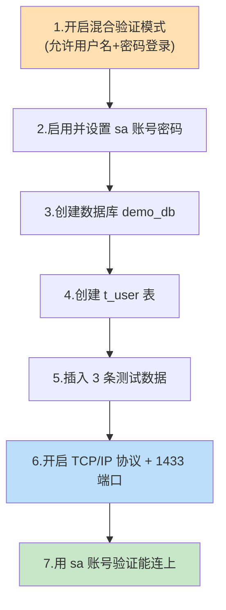
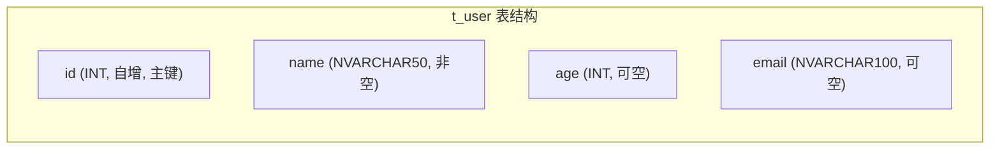
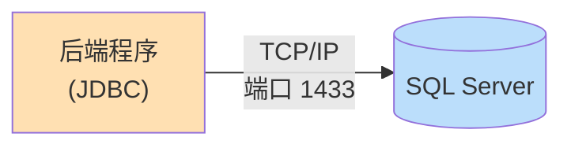

# 第 3 章 数据库准备与建表

> 本章目标：在 SQL Server 里把「地基」打好——**创建数据库、创建 `t_user` 表、插入测试数据**，并做两件后端连接时必须的准备：**开启账号密码登录（混合验证）** 和 **打开 TCP/IP 网络端口**。本章结束后，你会有一张装了几条数据、且能被外部程序连接的表。

---

## 3.1 本章要做什么？（先看全景）



- **前 5 步**：在 SSMS 里完成，属于「建库建表」。
- **第 6 步**：在「SQL Server 配置管理器」里完成，属于「打通网络」。
- **第 7 步**：验证，确保后端稍后能连上。

---

## 3.2 为什么要做这些？（理解动机）

一个刚装好的 SQL Server，默认状态下**后端程序是连不上的**，主要有两道「门」没打开：

| 需要做的事 | 为什么必须做 | 不做会怎样 |
| --- | --- | --- |
| **开启混合验证 + sa 密码** | 后端程序在 `application.yml` 里要用「用户名+密码」连接，而 SQL Server 默认只允许「Windows 身份」登录 | 后端报错：`Login failed for user 'sa'` |
| **开启 TCP/IP 协议** | Java 的 JDBC 驱动通过 **网络端口（1433）** 连数据库，而 SQL Server 默认可能只开了「共享内存」协议 | 后端报错：`连接超时` 或 `TCP/IP connection ... failed` |
| **建库建表插数据** | 程序要读写的对象必须先存在 | 后端报错：`Invalid object name 't_user'` |

> 💡 一句话总结：**先给数据库配好「账号」和「网络」，再把「表和数据」准备好**，后端才能顺利连上并操作它。

---

## 3.3 第一步：开启「混合验证模式」

「混合验证模式」= 同时允许「Windows 身份验证」和「SQL Server 账号密码验证」两种登录方式。我们后端要用 sa 账号密码，所以必须开启它。

### 操作步骤

1. 打开 **SSMS**，用「Windows 身份验证」连接到你的服务器（第 2 章已验证过）。
2. 在左侧「对象资源管理器」中，**右键点击最顶层的服务器节点**（就是显示你电脑名的那一行）→ 选择 **「属性(Properties)」**。

> 🖼️ 【待补图 3-1】SSMS 中右键服务器根节点，弹出菜单里选择「属性(Properties)」

3. 在弹出的窗口中，左侧选择 **「安全性(Security)」**页。
4. 在右侧「服务器身份验证」中，选中 **「SQL Server 和 Windows 身份验证模式(SQL Server and Windows Authentication mode)」**。
5. 点击「确定」。

> 🖼️ 【待补图 3-2】服务器属性 → 安全性页，选中「SQL Server 和 Windows 身份验证模式」单选按钮


> ⚠️ **关键：修改后必须重启 SQL Server 服务才能生效！**
> 右键服务器节点 → 「重新启动(Restart)」；或者按 `Win+R` 输入 `services.msc`，找到 `SQL Server (MSSQLSERVER)` 或 `SQL Server (SQLEXPRESS)`，右键「重新启动」。

> 🖼️ 【待补图 3-3】右键服务器节点选择「重新启动(Restart)」，或在 services.msc 中重启 SQL Server 服务

---

## 3.4 第二步：启用并设置 sa 账号密码

`sa` 是 SQL Server 内置的超级管理员账号（相当于 root）。它默认可能是**禁用**的，我们要启用它并设置一个密码。

### 方法一：用界面操作

1. 在对象资源管理器中展开 **「安全性(Security)」→「登录名(Logins)」**。
2. 右键 **`sa`** → 「属性(Properties)」。
3. 在「常规」页设置一个**强密码**（例如 `Your_Strong_Pass123`）并确认。
4. 切换到「状态(Status)」页，把「登录(Login)」设为 **「启用(Enabled)」**。
5. 点击「确定」。

> 🖼️ 【待补图 3-4】sa 属性窗口的「状态」页，将「登录」设置为「已启用(Enabled)」

### 方法二：用 SQL 命令（更快，推荐）

点击 SSMS 工具栏的 **「新建查询(New Query)」**，粘贴并执行下面的语句（`Ctrl+Enter` 或点「执行」）：

```sql
-- 启用 sa 账号
ALTER LOGIN sa ENABLE;
GO

-- 设置 sa 的密码（请自行替换成你自己的强密码）
ALTER LOGIN sa WITH PASSWORD = 'Your_Strong_Pass123';
GO
```

> ⚠️ **密码要求**：SQL Server 默认启用「密码策略」，密码必须足够复杂（至少 8 位，包含大小写字母 + 数字），否则会报错。示例 `Your_Strong_Pass123` 满足要求。
>
> 💡 **请牢记这个密码**，第 5 章配置后端 `application.yml` 时要用它。本教程后续统一使用 `Your_Strong_Pass123`，你换成自己的即可。

---

## 3.5 第三步：创建数据库 demo_db

现在创建我们要用的数据库。同样有两种方式，推荐用 SQL 命令。

### 方法一：界面操作

右键「数据库(Databases)」节点 → 「新建数据库(New Database)」→ 数据库名称填 `demo_db` → 确定。

> 🖼️ 【待补图 3-5】右键「数据库」→「新建数据库」，名称输入框填 demo_db

### 方法二：SQL 命令（推荐）

在「新建查询」窗口执行：

```sql
-- 如果已存在同名库可先跳过；这里创建一个新库
CREATE DATABASE demo_db;
GO
```

执行成功后，右键左侧「数据库」节点 → 「刷新(Refresh)」，就能看到 `demo_db` 出现在列表里。

> 🖼️ 【待补图 3-6】对象资源管理器中「数据库」节点下出现刚创建的 demo_db

---

## 3.6 第四步：创建 t_user 表

这是全教程唯一的一张表。回顾一下它的结构（第 1 章设计过）：

| 字段名 | 类型 | 含义 | 约束 |
| --- | --- | --- | --- |
| `id` | INT | 主键 | 自增、主键 |
| `name` | NVARCHAR(50) | 姓名 | 不为空，支持中文 |
| `age` | INT | 年龄 | 可空 |
| `email` | NVARCHAR(100) | 邮箱 | 可空 |

### 执行建表 SQL

⚠️ **重要**：执行前，先确保当前查询窗口连接的是 `demo_db` 数据库。可以在 SSMS 工具栏左上角的数据库下拉框选择 `demo_db`，**或**在脚本开头加一行 `USE demo_db;`（如下）。

在「新建查询」窗口执行完整脚本：

```sql
-- 切换到我们的数据库
USE demo_db;
GO

-- 创建 t_user 表
CREATE TABLE t_user (
    id    INT IDENTITY(1,1) PRIMARY KEY,   -- 主键，IDENTITY(1,1) 表示从1开始自动+1
    name  NVARCHAR(50)  NOT NULL,          -- 姓名，NVARCHAR 支持中文，不能为空
    age   INT           NULL,              -- 年龄，允许为空
    email NVARCHAR(100) NULL               -- 邮箱，允许为空
);
GO
```

**代码解释（给不熟悉的同学）：**

- `IDENTITY(1,1)`：SQL Server 的「自增列」，插入数据时 `id` 会自动生成（1、2、3……），不用手动填。
- `NVARCHAR`：能存 Unicode 字符（含中文）的变长字符串；括号里的数字是最大字符数。
- `NOT NULL` / `NULL`：这一列是否允许为空。
- `PRIMARY KEY`：主键，保证每行唯一。

> 🖼️ 【待补图 3-7】执行建表语句后，SSMS 下方显示「命令已成功完成」



---

## 3.7 第五步：插入测试数据

空表没法测试，我们插入 3 条数据。继续在查询窗口执行：

```sql
USE demo_db;
GO

-- 插入 3 条测试数据（注意 id 不用填，会自动生成）
-- 字符串前的 N 表示这是 Unicode 字符串，能正确保存中文
INSERT INTO t_user (name, age, email) VALUES
(N'张三', 20, N'zhangsan@example.com'),
(N'李四', 22, N'lisi@example.com'),
(N'王五', 25, N'wangwu@example.com');
GO
```

> ⚠️ **中文乱码防坑**：给 `NVARCHAR` 列插入中文时，字符串前一定要加 **`N`** 前缀（如 `N'张三'`）。不加 `N` 可能存进去变成问号 `??`。

### 验证数据

执行查询看看：

```sql
USE demo_db;
GO
SELECT * FROM t_user;
GO
```

下方结果网格应显示 3 行数据：

| id | name | age | email |
| --- | --- | --- | --- |
| 1 | 张三 | 20 | zhangsan@example.com |
| 2 | 李四 | 22 | lisi@example.com |
| 3 | 王五 | 25 | wangwu@example.com |

> 🖼️ 【待补图 3-8】SELECT 查询结果网格，显示 3 行用户数据，中文正常无乱码

看到这 3 行数据，说明**建库、建表、插数据全部成功**。

---

## 3.8 第六步：开启 TCP/IP 协议和 1433 端口

这一步**不在 SSMS 里做**，而是在「SQL Server 配置管理器」里做。这是新手最容易漏掉、导致后端连不上的一步。

### 为什么需要这一步？

Java 的 JDBC 驱动是通过 **网络（TCP/IP 协议）** 连接数据库的，走的是 **1433** 端口。但 SQL Server 默认可能把 TCP/IP 协议**禁用**了（尤其是 Express 版），必须手动打开。



### 操作步骤

1. 打开 **「SQL Server 配置管理器(SQL Server Configuration Manager)」**。
   - 找不到它？按 `Win+R`，根据你的版本输入对应命令回车：
     - `SQLServerManager16.msc`（SQL Server 2022）
     - `SQLServerManager15.msc`（SQL Server 2019）
2. 左侧展开 **「SQL Server 网络配置(SQL Server Network Configuration)」→「MSSQLSERVER 的协议」**（Express 版是「SQLEXPRESS 的协议」）。
3. 右侧找到 **「TCP/IP」**，如果状态是「已禁用(Disabled)」，右键 → **「启用(Enable)」**。

> 🖼️ 【待补图 3-9】配置管理器中「TCP/IP」协议右键菜单选择「启用(Enable)」

4. **（可选但推荐）确认端口是 1433**：双击「TCP/IP」→ 切到「IP 地址(IP Addresses)」页 → 拉到最下面的「IPAll」区域 → 确认「TCP 端口(TCP Port)」是 `1433`（若为空则填 `1433`）。

> 🖼️ 【待补图 3-10】TCP/IP 属性 →「IP 地址」页 → IPAll 区域，TCP 端口设置为 1433

5. ⚠️ **再次重启 SQL Server 服务**让配置生效（同 3.3 的重启方法）。


---

## 3.9 第七步：验证账号 + 网络是否就绪

最后做一次「模拟后端登录」，确保前面的配置都对。

1. 在 SSMS 中点击「连接(Connect)」→「数据库引擎(Database Engine)」，弹出连接窗口。
2. 这次改用 **SQL Server 身份验证**：
   - **服务器名称**：`localhost`（默认实例）或 `localhost\SQLEXPRESS`（Express 实例）
   - **身份验证**：选 `SQL Server Authentication`
   - **登录名**：`sa`
   - **密码**：`Your_Strong_Pass123`（你设置的那个）
3. 点击「连接」。

> 🖼️ 【待补图 3-11】SSMS 连接窗口，身份验证选 SQL Server Authentication，登录名 sa，输入密码

如果**连接成功**，说明「混合验证 + sa 密码」配置正确。这基本等于后端程序稍后要走的登录流程。

> 💡 **想更严格地验证网络端口？** 可以在命令行执行（Windows）：
> ```bash
> Test-NetConnection -ComputerName localhost -Port 1433
> ```
> 若返回 `TcpTestSucceeded : True`，说明 1433 端口已通。

---

## 3.10 完整脚本汇总（一键参考）

把本章所有 SQL 汇总如下，方便你一次性执行（登录相关的 sa 设置若已用界面完成可跳过）：

```sql
-- ① 启用并设置 sa（若已用界面设置可跳过）
ALTER LOGIN sa ENABLE;
GO
ALTER LOGIN sa WITH PASSWORD = 'Your_Strong_Pass123';
GO

-- ② 创建数据库
CREATE DATABASE demo_db;
GO

-- ③ 建表
USE demo_db;
GO
CREATE TABLE t_user (
    id    INT IDENTITY(1,1) PRIMARY KEY,
    name  NVARCHAR(50)  NOT NULL,
    age   INT           NULL,
    email NVARCHAR(100) NULL
);
GO

-- ④ 插入测试数据
INSERT INTO t_user (name, age, email) VALUES
(N'张三', 20, N'zhangsan@example.com'),
(N'李四', 22, N'lisi@example.com'),
(N'王五', 25, N'wangwu@example.com');
GO

-- ⑤ 验证
SELECT * FROM t_user;
GO
```

---

## 3.11 常见问题速查

| 问题现象 | 原因 | 解决办法 |
| --- | --- | --- |
| `Login failed for user 'sa'` | 没开混合验证 / sa 被禁用 / 密码错 | 回到 3.3、3.4，注意改完要**重启服务** |
| 密码设置报错「不满足密码策略」 | 密码太简单 | 用「大小写+数字、≥8位」的强密码 |
| 中文存进去变 `??` | 插入时字符串没加 `N` 前缀 / 列不是 NVARCHAR | 用 `N'张三'`，列用 `NVARCHAR` |
| 后端连接超时 / 连不上 | 没开 TCP/IP 或端口不对 | 回到 3.8 启用 TCP/IP、确认 1433、**重启服务** |
| 找不到配置管理器 | 入口隐蔽 | `Win+R` 运行 `SQLServerManager16.msc`（按版本号） |
| `Invalid object name 't_user'` | 没选对数据库 | 脚本开头加 `USE demo_db;` |

---

## 3.12 本章小结

- 我们开启了 **混合验证** 并设置了 **sa 密码**（后端要用账号密码登录）。
- 创建了数据库 **`demo_db`** 和表 **`t_user`**，并插入了 **3 条测试数据**。
- 开启了 **TCP/IP 协议 + 1433 端口**（后端 JDBC 要走网络），并重启服务生效。
- 用 sa 账号成功登录，验证了「账号 + 网络」两道门都已打开。

请记牢这三样，下一章配置后端会用到：
1. 服务器地址：`localhost`（或 `localhost\SQLEXPRESS`）与端口 `1433`
2. 数据库名：`demo_db`
3. 账号密码：`sa` / `Your_Strong_Pass123`

✅ 数据库地基已打好。下一章我们开始搭建 Spring Boot 后端项目骨架。

👈 上一章：**[第 2 章 开发环境准备](02-开发环境准备.md)** ｜ 👉 下一章：**[第 4 章 搭建 Spring Boot 后端项目](04-搭建SpringBoot后端项目.md)**
