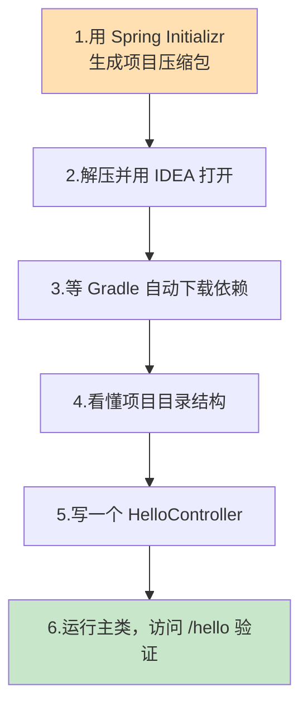
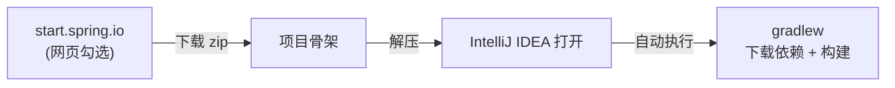
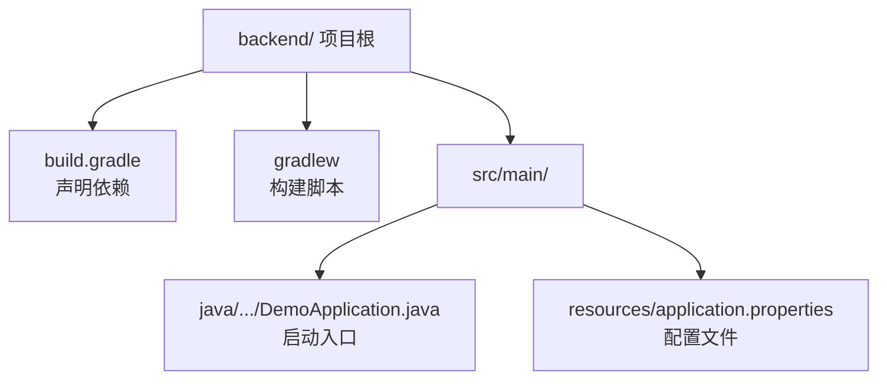
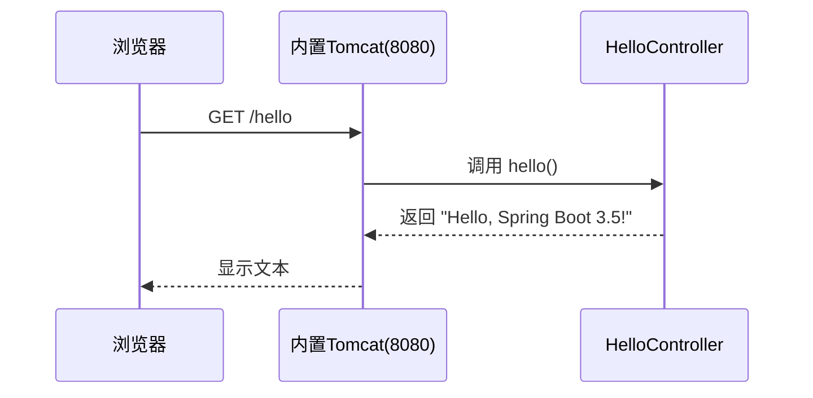

# 第 4 章 搭建 Spring Boot 3.5 后端项目

> 本章目标：用官方脚手架 **Spring Initializr** 生成一个基于 **Gradle** 的 Spring Boot 3.5 项目骨架，用 IntelliJ IDEA 打开它，**看懂每个文件是干什么的**，最后写一个最简单的 `/hello` 接口并成功运行。本章不碰数据库，专注把「能跑起来的后端」立起来。

---

## 4.1 本章要做什么？（全景）



---

## 4.2 为什么用 Spring Initializr + Gradle？

- **为什么用 Spring Initializr？** 手动配置一个 Spring Boot 项目要写很多样板文件，很容易出错。Spring 官方提供了一个网页版脚手架 <https://start.spring.io>，勾几个选项就能生成一个**结构标准、依赖版本匹配**的项目，一键下载。
- **为什么用 Gradle 而不是 Maven？** 两者都是构建工具，功能类似。本教程按你的要求用 **Gradle**：配置文件更简洁（`build.gradle` 用 Groovy 语法），构建速度通常更快。
- **为什么要 Gradle Wrapper？** 生成的项目自带 `gradlew` 脚本，别人拿到项目**即使没装 Gradle** 也能构建，且大家用的 Gradle 版本完全一致，避免「我这能跑你那不行」。



---

## 4.3 第一步：用 Spring Initializr 生成项目

打开浏览器访问 <https://start.spring.io>，按下表填写/勾选：

| 选项 | 选择的值 | 说明 |
| --- | --- | --- |
| **Project** | **Gradle - Groovy** | 用 Gradle 构建，Groovy 语法 |
| **Language** | **Java** | 用 Java 语言 |
| **Spring Boot** | **3.5.x**（选最新的 3.5 版本，如 3.5.16） | 不要选 3.6/4.x 的预览版 |
| **Group** | `com.example` | 组织标识（域名倒写风格） |
| **Artifact** | `demo` | 项目名 |
| **Name** | `demo` | 同上，自动填 |
| **Package name** | `com.example.demo` | 基础包名（自动生成） |
| **Packaging** | **Jar** | 打包成可执行 jar |
| **Java** | **21** | 对应我们装的 JDK 21 |

然后在右侧 **「Dependencies」** 点「ADD DEPENDENCIES」，搜索并添加：

- **Spring Web**（必选）：让项目能写 REST 接口、内置 Tomcat 服务器。

> 💡 Mybatis-Flex 和 SQL Server 驱动**不在** Spring Initializr 的列表里，我们放到第 5 章手动加到 `build.gradle`。本章先只加 Spring Web。

> 🖼️ 【待补图 4-1】start.spring.io 页面：左侧选 Gradle-Groovy / Java / Spring Boot 3.5.x，右侧已添加 Spring Web 依赖

填完后点击页面底部的 **「GENERATE」**（或按 `Ctrl+Enter`），浏览器会下载一个 `demo.zip`。

---

## 4.4 第二步：解压并用 IDEA 打开

1. 把 `demo.zip` 解压到你喜欢的目录，比如 `D:\code\fullstack-demo\backend`（解压后里面直接是 `build.gradle` 等文件）。
2. 打开 **IntelliJ IDEA** → 「Open」→ 选中刚解压的 `backend` 文件夹 → 「OK」。
3. IDEA 会识别这是一个 Gradle 项目，右下角可能弹出提示，选择信任并加载。

> 🖼️ 【待补图 4-2】IntelliJ IDEA 中 Open 选择解压后的 backend 目录

### ⚠️ 第一次打开要耐心等待

IDEA 打开后，右下角会显示进度条，Gradle 正在**下载所有依赖**（Spring Boot、Tomcat 等）。这一步：

- **第一次可能要几分钟**（取决于网速），请耐心等到进度条消失。
- 底部「Build」窗口出现 `BUILD SUCCESSFUL` 表示依赖就绪。

> 🖼️ 【待补图 4-3】IDEA 底部 Gradle 同步进度，完成后显示 BUILD SUCCESSFUL

> 💡 **国内下载依赖慢怎么办？** 可以给 Gradle 配置阿里云镜像。在项目根目录的 `build.gradle` 里，把 `repositories` 部分改成：
> ```groovy
> repositories {
>     maven { url 'https://maven.aliyun.com/repository/public' }
>     mavenCentral()
> }
> ```
> 改完点击 Gradle 面板的刷新按钮（🔄）重新同步。

---

## 4.5 第三步：看懂项目目录结构

依赖下载完后，项目结构长这样。我们逐个认识关键文件：

```text
backend/
├── build.gradle              ← ⭐ 依赖和构建配置（最重要）
├── settings.gradle           ← 项目名等设置
├── gradlew                   ← Gradle Wrapper 脚本（Linux/Mac）
├── gradlew.bat               ← Gradle Wrapper 脚本（Windows）
├── gradle/
│   └── wrapper/              ← Wrapper 用到的 jar 和版本配置
└── src/
    ├── main/
    │   ├── java/
    │   │   └── com/example/demo/
    │   │       └── DemoApplication.java   ← ⭐ 程序入口（main 方法）
    │   └── resources/
    │       ├── application.properties     ← ⭐ 配置文件（端口/数据库等）
    │       ├── static/                    ← 静态资源目录
    │       └── templates/                 ← 模板目录（本教程用不到）
    └── test/
        └── java/...                       ← 测试代码目录
```



### 关键文件 1：`build.gradle`（依赖清单）

打开它，内容大致如下（版本号可能略有不同）：

```groovy
plugins {
    id 'java'
    id 'org.springframework.boot' version '3.5.16'
    id 'io.spring.dependency-management' version '1.1.7'
}

group = 'com.example'
version = '0.0.1-SNAPSHOT'

java {
    toolchain {
        languageVersion = JavaLanguageVersion.of(21)
    }
}

repositories {
    mavenCentral()
}

dependencies {
    implementation 'org.springframework.boot:spring-boot-starter-web'
    testImplementation 'org.springframework.boot:spring-boot-starter-test'
    testRuntimeOnly 'org.junit.platform:junit-platform-launcher'
}

tasks.named('test') {
    useJUnitPlatform()
}
```

**逐段解释：**

- `plugins`：启用 Java 支持和 Spring Boot 插件（Spring Boot 插件负责打包成可执行 jar）。
- `java.toolchain ... 21`：指定用 JDK 21 编译。
- `repositories`：从哪里下载依赖（Maven 中央仓库）。
- `dependencies`：项目依赖。`spring-boot-starter-web` 就是我们在网页勾的 Spring Web，它自动带来了 Tomcat 和 Spring MVC。第 5 章我们会往这里**添加两行**：Mybatis-Flex 和 SQL Server 驱动。

### 关键文件 2：`DemoApplication.java`（程序入口）

```java
package com.example.demo;

import org.springframework.boot.SpringApplication;
import org.springframework.boot.autoconfigure.SpringBootApplication;

@SpringBootApplication
public class DemoApplication {

    public static void main(String[] args) {
        SpringApplication.run(DemoApplication.class, args);
    }
}
```

- `@SpringBootApplication`：一个「全家桶」注解，开启 Spring Boot 的自动配置。
- `main` 方法：**整个后端从这里启动**。运行它，就会启动一个内置的 Tomcat 服务器，默认监听 `8080` 端口。

### 关键文件 3：`application.properties`（配置文件）

现在它是空的。第 5 章我们会把它**改名成 `application.yml`**（YAML 格式更清晰），并在里面写数据库连接信息。

---

## 4.6 第四步：写第一个接口 HelloController

为了验证项目能跑，我们写一个最简单的接口。

### 创建包和类

在 `src/main/java/com/example/demo/` 下**新建一个子包** `controller`，再在里面新建一个类 `HelloController`：

- 右键 `com.example.demo` 包 → New → Package → 输入 `com.example.demo.controller`。
- 右键新建的 `controller` 包 → New → Java Class → 输入 `HelloController`。

> 🖼️ 【待补图 4-4】IDEA 中在 com.example.demo 下新建 controller 包与 HelloController 类

### 完整代码

```java
package com.example.demo.controller;

import org.springframework.web.bind.annotation.GetMapping;
import org.springframework.web.bind.annotation.RestController;

@RestController                       // 声明这是一个 REST 控制器，方法返回值直接作为响应内容
public class HelloController {

    @GetMapping("/hello")             // 映射 HTTP GET 请求，路径为 /hello
    public String hello() {
        return "Hello, Spring Boot 3.5!";
    }
}
```

**代码解释：**

- `@RestController`：告诉 Spring「这个类负责处理网络请求，返回值直接当作响应体（通常是 JSON 或文本）」。
- `@GetMapping("/hello")`：把浏览器对 `http://localhost:8080/hello` 的 GET 请求，交给下面这个 `hello()` 方法处理。
- 方法返回的字符串会直接显示在浏览器里。

此时项目结构变成：

```text
src/main/java/com/example/demo/
├── DemoApplication.java
└── controller/
    └── HelloController.java   ← 新增
```

---

## 4.7 第五步：运行并验证

### 运行

打开 `DemoApplication.java`，点击 `main` 方法左侧的**绿色三角箭头** ▶ → 选择「Run 'DemoApplication'」。

> 🖼️ 【待补图 4-5】IDEA 中 main 方法左侧绿色运行箭头，点击后选择 Run

### 看启动日志

IDEA 底部「Run」窗口会滚动打印启动日志。看到类似下面这行，代表启动成功：

```text
Tomcat started on port 8080 (http) with context path '/'
Started DemoApplication in 2.156 seconds (process running for 2.5)
```

> 🖼️ 【待补图 4-6】Run 窗口显示 Tomcat started on port 8080 与 Started DemoApplication

### 浏览器验证

打开浏览器访问：<http://localhost:8080/hello>

页面应显示：

```text
Hello, Spring Boot 3.5!
```



> 🖼️ 【待补图 4-7】浏览器访问 localhost:8080/hello 显示 Hello, Spring Boot 3.5!

看到这句话，说明**后端骨架已经能跑起来了**！ 🎉

### 如何停止程序？

点击 Run 窗口左上角的**红色方块** ⏹（Stop）即可停止后端。

---

## 4.8 补充：用命令行运行（了解即可）

除了在 IDEA 里点按钮，也可以用 Gradle Wrapper 在命令行运行。打开项目根目录的终端：

```bash
# Windows
gradlew.bat bootRun

# Linux / macOS
./gradlew bootRun
```

`bootRun` 是 Spring Boot 插件提供的任务，会编译并启动项目。看到 `Started DemoApplication` 即成功，按 `Ctrl+C` 停止。

> 💡 这说明「有没有装 IDEA」都能跑项目——这正是 Gradle Wrapper 的价值。

---

## 4.9 常见问题速查

| 问题现象 | 原因 | 解决办法 |
| --- | --- | --- |
| Gradle 同步一直转 / 失败 | 网络下载依赖慢 | 配阿里云镜像（见 4.4），刷新重试 |
| `Port 8080 was already in use` | 8080 端口被占用 | 关掉占用程序，或在配置里改端口（第 5 章讲） |
| 访问 /hello 报 404 | Controller 包位置不对 | 确保 `controller` 包在 `com.example.demo` **下面**，能被扫描到 |
| 运行报 JDK 版本错误 | IDEA 用了别的 JDK | File → Project Structure → SDK 选 JDK 21 |
| 绿色箭头点了没反应 | 没识别成 Spring Boot 主类 | 确认类上有 `@SpringBootApplication` 且有 `main` 方法 |

> ⚠️ **关于「包扫描」**：Spring Boot 默认只扫描**主类所在包及其子包**。`DemoApplication` 在 `com.example.demo`，所以我们所有代码（controller、service、mapper 等）都要放在 `com.example.demo.xxx` 下，否则 Spring 找不到它们。

---

## 4.10 本章小结

- 用 **Spring Initializr** 生成了 Gradle + Java 21 + Spring Boot 3.5 的项目骨架，只加了 **Spring Web** 依赖。
- 用 IDEA 打开并让 **Gradle 下载好依赖**。
- 认识了三个关键文件：`build.gradle`（依赖）、`DemoApplication.java`（入口）、`application.properties`（配置）。
- 写了 `HelloController`，运行后通过 <http://localhost:8080/hello> 验证后端**成功跑起来**。

✅ 后端骨架已就位。下一章我们给它加上 **Mybatis-Flex 和 SQL Server 驱动**，让它真正连上第 3 章建好的数据库。

👈 上一章：**[第 3 章 数据库准备与建表](03-数据库准备与建表.md)** ｜ 👉 下一章：**[第 5 章 集成 Mybatis-Flex 连接 SQL Server](05-集成Mybatis-Flex连接SQLServer.md)**
