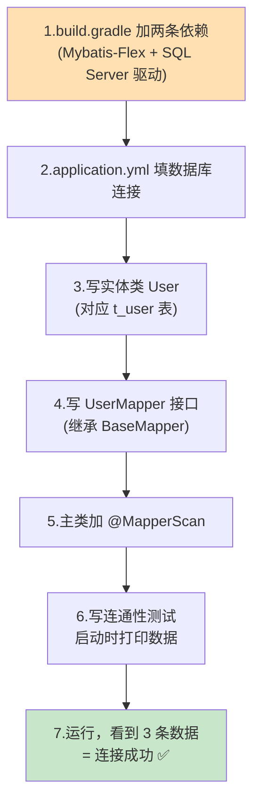
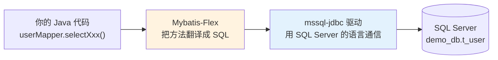
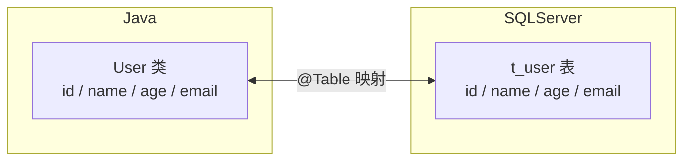
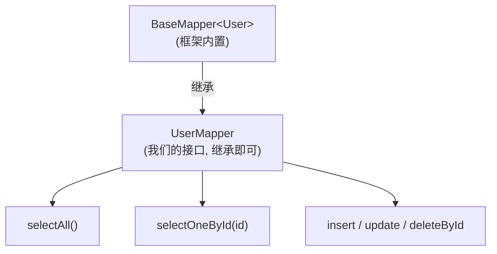
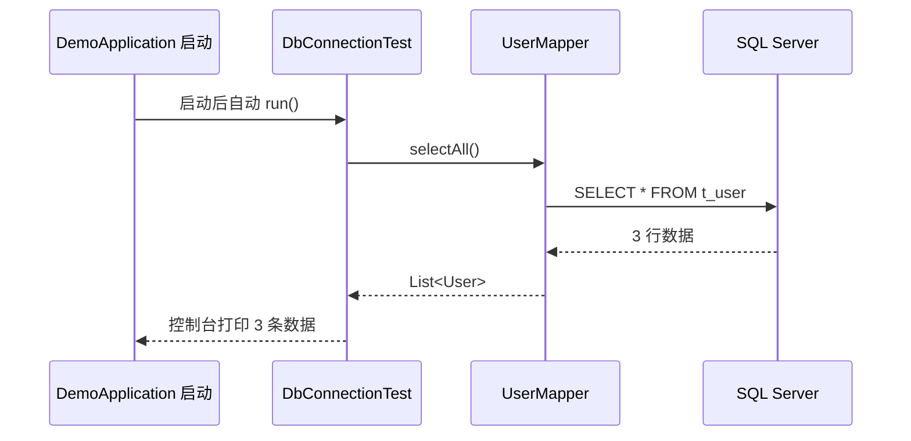

# 第 5 章 集成 Mybatis-Flex 连接 SQL Server

> 本章目标：给上一章的后端骨架**加上两条依赖**（Mybatis-Flex 和 SQL Server 驱动），在配置文件里填好**数据库连接信息**，创建**实体类 `User`** 和**数据访问接口 `UserMapper`**，最后写一段小测试代码，**打印出 `t_user` 表里的数据**，证明后端真的连上了数据库。这是整个后端最关键的一步——「打通到数据库的路」。

---

## 5.1 本章要做什么？（全景）



---

## 5.2 为什么需要这些东西？（理解每个部件的角色）

要让 Java 程序操作数据库，需要三样东西配合，缺一不可：



| 部件 | 角色 | 通俗比喻 |
| --- | --- | --- |
| **Mybatis-Flex** | 把你调用的 Java 方法「翻译」成 SQL 语句，并把查询结果「装」回 Java 对象 | 翻译官 |
| **mssql-jdbc 驱动** | 微软官方的连接器，负责用 SQL Server 能听懂的协议在网络上通信 | 电话线 |
| **实体类 / Mapper** | 你和翻译官沟通用的「词汇表」：告诉它哪个类对应哪张表 | 词汇对照表 |

---

## 5.3 第一步：添加依赖到 build.gradle

打开后端项目的 `build.gradle`，在 `dependencies { }` 代码块里**新增两行**：

```groovy
dependencies {
    implementation 'org.springframework.boot:spring-boot-starter-web'

    // ↓↓↓ 本章新增的两条依赖 ↓↓↓
    // 1) Mybatis-Flex 的 Spring Boot 3 启动器
    implementation 'com.mybatis-flex:mybatis-flex-spring-boot3-starter:1.11.6'
    // 2) SQL Server 官方 JDBC 驱动
    implementation 'com.microsoft.sqlserver:mssql-jdbc:12.8.1.jre11'
    // ↑↑↑ 新增结束 ↑↑↑

    testImplementation 'org.springframework.boot:spring-boot-starter-test'
    testRuntimeOnly 'org.junit.platform:junit-platform-launcher'
}
```

**解释：**

- `mybatis-flex-spring-boot3-starter`：Mybatis-Flex 专门给 **Spring Boot 3** 准备的启动器（注意是 `boot3`，别用错成 `boot`/`boot4`）。版本 `1.11.6` 是撰写时的稳定版。
- `mssql-jdbc:12.8.1.jre11`：微软官方 SQL Server 驱动。`jre11` 表示适配 Java 11 及以上（我们的 JDK 21 完全兼容）。

### 让依赖生效

修改 `build.gradle` 后，IDEA 右上角/右侧 Gradle 面板会出现一个**刷新提示（大象图标 🐘 或 🔄）**，点击它重新同步，等待把新依赖下载下来。

> 🖼️ 【待补图 5-1】IDEA 中修改 build.gradle 后点击 Gradle 刷新/同步按钮，下方显示 BUILD SUCCESSFUL

> 💡 下载慢的话同样可以用第 4 章讲的阿里云镜像加速。

---

## 5.4 第二步：配置数据库连接（application.yml）

### 把 properties 改成 yml

Spring Boot 生成的默认配置文件是 `src/main/resources/application.properties`。YAML 格式（`.yml`）层次更清晰，我们改用它：

- 在 `src/main/resources/` 下把 `application.properties` **重命名**为 `application.yml`（右键 → Refactor → Rename，或删掉旧的建新的）。

### 填写完整配置

把下面内容**完整**写入 `application.yml`（注意 YAML 用**空格缩进**，不能用 Tab）：

```yaml
server:
  # 后端服务端口
  port: 8080

spring:
  datasource:
    # SQL Server 的 JDBC 驱动类名
    driver-class-name: com.microsoft.sqlserver.jdbc.SQLServerDriver
    # 数据库连接地址：localhost=本机，1433=端口，databaseName=库名
    # encrypt=true 是新版驱动默认；trustServerCertificate=true 让本地开发跳过证书校验
    url: jdbc:sqlserver://localhost:1433;databaseName=demo_db;encrypt=true;trustServerCertificate=true
    # 第 3 章设置的账号密码
    username: sa
    password: Your_Strong_Pass123

# Mybatis-Flex 相关配置
mybatis-flex:
  configuration:
    # 在控制台打印执行的 SQL 语句，方便调试（学习阶段强烈建议开启）
    log-impl: org.apache.ibatis.logging.stdout.StdOutImpl
```

**逐行解释关键部分：**

- `driver-class-name`：告诉 Spring 用微软的 SQL Server 驱动。
- `url`：连接字符串，格式是 `jdbc:sqlserver://主机:端口;databaseName=库名;...`。
  - `localhost:1433`：连本机的 1433 端口（第 3 章开的）。
  - `databaseName=demo_db`：连我们建的库。
  - ⚠️ `encrypt=true;trustServerCertificate=true`：新版 mssql-jdbc **默认要求加密连接**。本地开发没有正式证书，加上 `trustServerCertificate=true` 才不会报 SSL 证书错误。
- `username` / `password`：第 3 章设置的 `sa` 账号密码。
- `log-impl: ...StdOutImpl`：让 Mybatis-Flex 把它执行的 SQL 打印到控制台，学习阶段非常有用。

> ⚠️ **实例名写法**：如果你用的是 **Express 版**且是命名实例，`url` 要写成：
> `jdbc:sqlserver://localhost\\SQLEXPRESS;databaseName=demo_db;encrypt=true;trustServerCertificate=true`
> （在 YAML 里反斜杠要写两个 `\\`）。也可以改用端口形式 `localhost:1433`（更简单，推荐）。

> 💡 **安全提示**：真实项目里不要把密码明文写进配置提交到仓库，应使用环境变量或配置中心。教程为方便直接写明文。

---

## 5.5 第三步：编写实体类 User

实体类就是「一行数据在 Java 里的样子」。我们让 `User` 类对应 `t_user` 表，每个字段对应一列。

### 创建 entity 包和 User 类

在 `com.example.demo` 下新建 `entity` 包，在里面新建 `User` 类：

```java
package com.example.demo.entity;

import com.mybatisflex.annotation.Id;
import com.mybatisflex.annotation.KeyType;
import com.mybatisflex.annotation.Table;

@Table("t_user")   // 告诉 Mybatis-Flex：这个类对应数据库里的 t_user 表
public class User {

    @Id(keyType = KeyType.Auto)   // 标记 id 为主键，Auto = 数据库自增（对应 IDENTITY）
    private Integer id;

    private String name;

    private Integer age;

    private String email;

    // ===== 无参构造方法 =====
    public User() {
    }

    // ===== getter / setter =====
    public Integer getId() {
        return id;
    }

    public void setId(Integer id) {
        this.id = id;
    }

    public String getName() {
        return name;
    }

    public void setName(String name) {
        this.name = name;
    }

    public Integer getAge() {
        return age;
    }

    public void setAge(Integer age) {
        this.age = age;
    }

    public String getEmail() {
        return email;
    }

    public void setEmail(String email) {
        this.email = email;
    }

    // ===== toString（方便打印调试）=====
    @Override
    public String toString() {
        return "User{id=" + id + ", name='" + name + "', age=" + age + ", email='" + email + "'}";
    }
}
```

**注解解释：**

- `@Table("t_user")`：类和表的对应关系。类名是 `User`（大驼峰），表名是 `t_user`（下划线），靠这个注解显式绑定。
- `@Id(keyType = KeyType.Auto)`：标记 `id` 是主键，且是**数据库自增**（对应第 3 章的 `IDENTITY(1,1)`）。这样插入时不用手动设 id。
- 字段名 `name`/`age`/`email` 和列名一致，Mybatis-Flex 会自动映射，无需额外注解。



> 💡 **偷懒技巧（可选）**：getter/setter 一大堆很啰嗦。可以引入 **Lombok** 依赖，用一个 `@Data` 注解自动生成它们。为了让初学者看清全貌，本教程**手写**这些方法，不依赖 Lombok。

---

## 5.6 第四步：编写 UserMapper 接口

Mapper 是「数据访问接口」，负责真正对表进行增删改查。Mybatis-Flex 提供了 `BaseMapper<T>`，**内置了大量常用方法**，我们只要继承它，一行方法都不用写就白得了增删改查能力。

### 创建 mapper 包和 UserMapper 接口

在 `com.example.demo` 下新建 `mapper` 包，新建 `UserMapper` **接口**（注意是 interface，不是 class）：

```java
package com.example.demo.mapper;

import com.example.demo.entity.User;
import com.mybatisflex.core.BaseMapper;

// 继承 BaseMapper<User> 后，自动拥有针对 User(t_user) 的增删改查方法
public interface UserMapper extends BaseMapper<User> {
    // 这里先留空。BaseMapper 已经提供了：
    //   selectAll()            查询全部
    //   selectOneById(id)      按主键查询
    //   insert(entity)         插入
    //   update(entity)         更新
    //   deleteById(id)         删除
    // 等一系列方法，基础功能足够用了。
}
```

**解释：**

- 继承 `BaseMapper<User>` 后，`UserMapper` 就自动具备了操作 `t_user` 表的能力，**无需手写任何 SQL**。
- 这正是 Mybatis-Flex 的核心优势：常见 CRUD「开箱即用」。



---

## 5.7 第五步：让 Spring 找到 Mapper（@MapperScan）

我们写了 `UserMapper` 接口，但要让 Spring 在启动时**扫描并管理**它，需要在主类上加一个 `@MapperScan` 注解，告诉它去哪个包找 Mapper。

打开 `DemoApplication.java`，改成：

```java
package com.example.demo;

import com.mybatisflex.spring.boot.annotation.MapperScan;
import org.springframework.boot.SpringApplication;
import org.springframework.boot.autoconfigure.SpringBootApplication;

@SpringBootApplication
@MapperScan("com.example.demo.mapper")   // 扫描这个包下的所有 Mapper 接口
public class DemoApplication {

    public static void main(String[] args) {
        SpringApplication.run(DemoApplication.class, args);
    }
}
```

> ⚠️ **注意 import 来源**：`@MapperScan` 有多个同名注解，这里要 import 的是 Mybatis-Flex 的：
> `com.mybatisflex.spring.boot.annotation.MapperScan`。IDEA 自动补全时别选成 MyBatis 官方或 MyBatis-Plus 的同名注解。

> 💡 **另一种写法**：也可以不写 `@MapperScan`，而在每个 Mapper 接口上加 `@Mapper` 注解。两者二选一即可，本教程用 `@MapperScan` 统一管理更省事。

---

## 5.8 第六步：写连通性测试

现在万事俱备，写一小段代码在**程序启动时自动执行**，查一下表里有多少条数据、并打印出来，用来验证「后端 ↔ 数据库」这条路通了。

我们用 Spring Boot 的 `CommandLineRunner`——它会在应用启动完成后自动运行一次。

在 `com.example.demo` 下新建一个类 `DbConnectionTest`：

```java
package com.example.demo;

import com.example.demo.entity.User;
import com.example.demo.mapper.UserMapper;
import org.springframework.boot.CommandLineRunner;
import org.springframework.stereotype.Component;

import java.util.List;

@Component   // 交给 Spring 管理，启动时会执行 run 方法
public class DbConnectionTest implements CommandLineRunner {

    private final UserMapper userMapper;

    // 通过构造方法注入 UserMapper（Spring 会自动传进来）
    public DbConnectionTest(UserMapper userMapper) {
        this.userMapper = userMapper;
    }

    @Override
    public void run(String... args) {
        System.out.println("========== 数据库连通性测试开始 ==========");

        // 调用 BaseMapper 内置的 selectAll()，查询 t_user 全部数据
        List<User> users = userMapper.selectAll();

        System.out.println("t_user 表当前共有 " + users.size() + " 条数据：");
        for (User user : users) {
            System.out.println("  " + user);
        }

        System.out.println("========== 数据库连通性测试结束 ==========");
    }
}
```

**代码解释：**

- `implements CommandLineRunner`：实现这个接口后，`run()` 方法会在应用启动后**自动被调用一次**。
- 构造方法参数 `UserMapper userMapper`：Spring 的「依赖注入」——它会自动把管理好的 `UserMapper` 实例传进来，我们直接用即可。
- `userMapper.selectAll()`：调用 `BaseMapper` 内置的方法，等价于 `SELECT * FROM t_user`。

---

## 5.9 第七步：运行验证

确保 SQL Server 正在运行（第 3 章），然后运行 `DemoApplication`（第 4 章的绿色箭头）。

观察 IDEA 底部「Run」控制台，你应该能看到**两部分**关键输出：

**① Mybatis-Flex 打印的 SQL（因为我们开了 SQL 日志）：**

```text
==>  Preparing: SELECT `id`, `name`, `age`, `email` FROM `t_user`
==> Parameters:
<==      Total: 3
```

**② 我们自己打印的结果：**

```text
========== 数据库连通性测试开始 ==========
t_user 表当前共有 3 条数据：
  User{id=1, name='张三', age=20, email='zhangsan@example.com'}
  User{id=2, name='李四', age=22, email='lisi@example.com'}
  User{id=3, name='王五', age=25, email='wangwu@example.com'}
========== 数据库连通性测试结束 ==========
```

> 🖼️ 【待补图 5-2】IDEA Run 控制台打印出 SQL 语句和 3 条用户数据



看到这 3 条数据，说明 **Mybatis-Flex + SQL Server 驱动 + 数据库连接** 全部配置成功！这是本教程后端最关键的里程碑。🎉

> 💡 **验证通过后**：这个 `DbConnectionTest` 只是用来验证连接的，第 6 章开始就用不到了。你可以**删掉它**，或在类上把 `@Component` 注释掉让它不再运行（避免每次启动都打印）。

---

## 5.10 常见问题速查（连接类报错重灾区）

| 报错关键字 | 原因 | 解决办法 |
| --- | --- | --- |
| `Login failed for user 'sa'` | 账号/密码错，或没开混合验证 | 核对 `application.yml` 密码；回第 3 章开混合验证并重启服务 |
| `The TCP/IP connection to the host ... failed` | TCP/IP 没开 / 端口不对 / 服务没启动 | 回第 3 章 3.8 开 TCP/IP、确认 1433、重启；确认 SQL Server 服务在运行 |
| `... failed ... SSL / certificate` | 新驱动默认要加密 | url 里加 `encrypt=true;trustServerCertificate=true` |
| `Cannot open database "demo_db"` | 库名写错或没建库 | 核对 `databaseName=demo_db`；确认第 3 章建库成功 |
| `Invalid object name 't_user'` | 表不存在或连错了库 | 确认建表成功且连的是 demo_db |
| 启动报 `Consider defining a bean ... UserMapper` | 没扫描到 Mapper | 主类加 `@MapperScan("com.example.demo.mapper")`，注意 import 来源 |
| 中文显示乱码 | 控制台编码问题 | 数据本身没问题（第 3 章验证过），调 IDEA 控制台编码为 UTF-8 |

---

## 5.11 本章小结

- 在 `build.gradle` 加了两条依赖：**Mybatis-Flex（boot3 starter）** 和 **SQL Server JDBC 驱动**。
- 在 `application.yml` 配好了**数据源**（url/账号/密码）和 **SQL 日志**。
- 写了实体类 **`User`**（`@Table` + `@Id`）和数据访问接口 **`UserMapper`**（继承 `BaseMapper`，白得增删改查）。
- 主类加 **`@MapperScan`** 让 Spring 找到 Mapper。
- 用 `CommandLineRunner` 测试，成功打印出 **3 条数据**，证明后端已连通数据库。

此时的后端目录：

```text
src/main/java/com/example/demo/
├── DemoApplication.java        (加了 @MapperScan)
├── DbConnectionTest.java       (连通性测试，验证后可删)
├── controller/HelloController.java
├── entity/User.java            ← 新增
└── mapper/UserMapper.java      ← 新增
src/main/resources/
└── application.yml             ← 新增/改名
```

✅ 数据库已连通。下一章我们基于它编写正式的**查询 REST 接口**，供前端调用。

👈 上一章：**[第 4 章 搭建 Spring Boot 后端项目](04-搭建SpringBoot后端项目.md)** ｜ 👉 下一章：**[第 6 章 后端查询接口](06-后端查询接口.md)**
