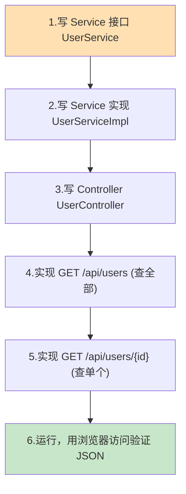
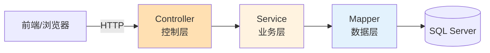
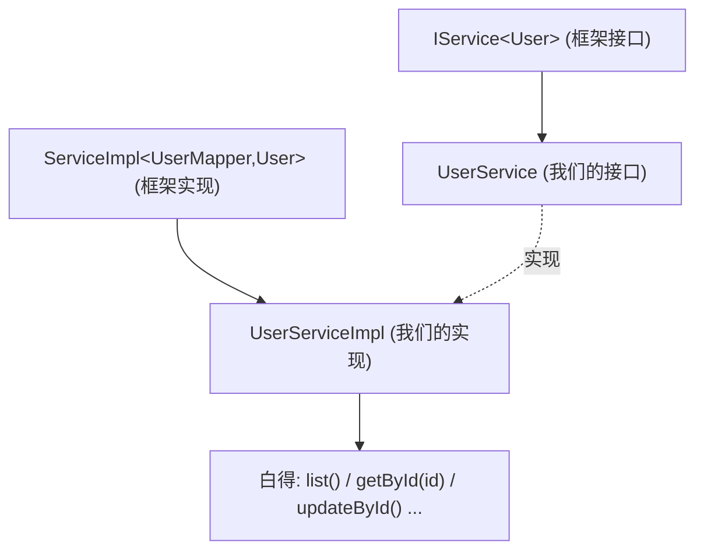
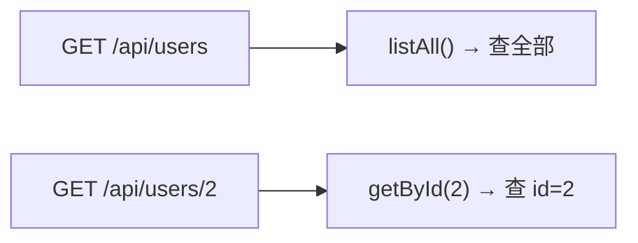
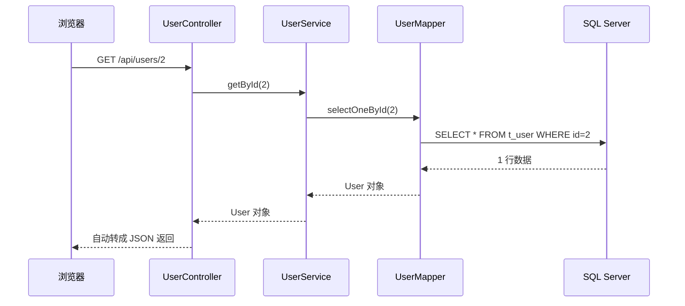

# 第 6 章 后端查询接口

> 本章目标：在上一章「连通数据库」的基础上，编写规范的**三层结构**（Controller → Service → Mapper），对外提供两个**查询 REST 接口**：查全部用户、按 id 查单个用户。最后用**浏览器**直接验证接口返回的 JSON。这两个接口就是第 9 章「React 查询程序」要调用的对象。

---

## 6.1 本章要做什么？（全景）



---

## 6.2 为什么要分「三层」？（Controller / Service / Mapper）

上一章我们在测试类里**直接**调用了 `userMapper`。能用，但不规范。正式项目会分成三层，各司其职：



| 层 | 类 | 职责 | 通俗比喻 |
| --- | --- | --- | --- |
| **控制层 Controller** | `UserController` | 接收 HTTP 请求、解析参数、返回结果 | 前台接待员 |
| **业务层 Service** | `UserService` | 处理业务逻辑（本例很简单，主要是转调） | 业务经理 |
| **数据层 Mapper** | `UserMapper` | 直接和数据库打交道（上一章已写好） | 仓库管理员 |

**为什么要这么分？**

- **职责清晰**：接待员不管仓库怎么摆货，仓管不管怎么接待客人。
- **好维护/好扩展**：以后业务变复杂（如加权限校验、数据加工），改 Service 就行，不影响 Controller 和 Mapper。
- **是行业标准写法**，看得懂它，就看得懂绝大多数 Spring Boot 项目。

> 💡 本教程业务极简单，Service 层看起来只是「转个手」，但保留它是为了让你养成规范的分层习惯。

---

## 6.3 借助 Mybatis-Flex 的 IService，少写代码

和 `BaseMapper` 类似，Mybatis-Flex 也为 Service 层准备了两个「半成品」：

- 接口 `IService<T>`：声明了 `list()`、`getById()`、`updateById()` 等一堆常用业务方法。
- 实现类 `ServiceImpl<M, T>`：已经把这些方法实现好了。

我们只要「继承 + 一点点粘合」，就能白得整套业务方法，不用自己写实现。



---

## 6.4 第一步：编写 Service 接口

在 `com.example.demo` 下新建 `service` 包，新建 `UserService` **接口**：

```java
package com.example.demo.service;

import com.example.demo.entity.User;
import com.mybatisflex.core.service.IService;

// 继承 IService<User>，白得 list()、getById() 等一系列业务方法
public interface UserService extends IService<User> {
    // 目前业务很简单，无需额外声明方法。
    // 以后若有复杂业务（如“查询年龄大于N的用户”），可以在这里声明。
}
```

**解释：** 继承 `IService<User>` 后，`UserService` 就拥有了 `list()`（查全部）、`getById(id)`（按主键查）、`updateById(entity)`（按主键更新，第 7 章用）等方法的**声明**。

---

## 6.5 第二步：编写 Service 实现类

在 `com.example.demo.service` 下新建 `impl` 子包，新建 `UserServiceImpl` 类：

```java
package com.example.demo.service.impl;

import com.example.demo.entity.User;
import com.example.demo.mapper.UserMapper;
import com.example.demo.service.UserService;
import com.mybatisflex.spring.service.ServiceImpl;
import org.springframework.stereotype.Service;

@Service   // 声明这是一个 Service 组件，交给 Spring 管理
public class UserServiceImpl
        extends ServiceImpl<UserMapper, User>   // 继承框架实现，泛型填 <你的Mapper, 你的实体>
        implements UserService {                 // 实现我们自己的接口
    // 一行方法都不用写！list()/getById()/updateById() 等已由 ServiceImpl 实现好。
}
```

**逐点解释：**

- `@Service`：告诉 Spring「这是业务层组件」，它会创建并管理这个类的实例。
- `extends ServiceImpl<UserMapper, User>`：继承框架的实现类，泛型第一个填我们的 `UserMapper`，第二个填实体 `User`。框架内部会自动用这个 Mapper 去操作数据库。
- `implements UserService`：实现我们自己的接口，这样 Controller 就能面向 `UserService` 接口编程。
- 类体是**空的**——因为所有基础方法都从 `ServiceImpl` 继承来了。

> ⚠️ **import 别选错**：`ServiceImpl` 要 import Mybatis-Flex 的 `com.mybatisflex.spring.service.ServiceImpl`。IDEA 补全时注意包名，别选成 MyBatis-Plus 的同名类。

---

## 6.6 第三步：编写 Controller，实现查询接口

这是本章的重点。在 `com.example.demo.controller` 下新建 `UserController`：

```java
package com.example.demo.controller;

import com.example.demo.entity.User;
import com.example.demo.service.UserService;
import org.springframework.web.bind.annotation.GetMapping;
import org.springframework.web.bind.annotation.PathVariable;
import org.springframework.web.bind.annotation.RequestMapping;
import org.springframework.web.bind.annotation.RestController;

import java.util.List;

@RestController                    // REST 控制器：方法返回值自动转成 JSON
@RequestMapping("/api/users")      // 这个类下所有接口都以 /api/users 开头
public class UserController {

    private final UserService userService;

    // 构造方法注入：Spring 自动把 UserService 实例传进来
    public UserController(UserService userService) {
        this.userService = userService;
    }

    /**
     * 查询全部用户
     * 请求：GET /api/users
     * 返回：用户数组的 JSON
     */
    @GetMapping
    public List<User> listAll() {
        return userService.list();   // list() 来自 IService，等价于 SELECT * FROM t_user
    }

    /**
     * 按 id 查询单个用户
     * 请求：GET /api/users/1
     * 返回：单个用户的 JSON（查不到则返回空）
     */
    @GetMapping("/{id}")
    public User getById(@PathVariable Integer id) {
        return userService.getById(id);   // 等价于 SELECT * FROM t_user WHERE id = ?
    }
}
```

**逐点解释（新手重点）：**

- `@RequestMapping("/api/users")`：给整个类设一个「路径前缀」。类里所有方法的路径都自动带上 `/api/users`。
- `@GetMapping`（不带路径）：匹配 `GET /api/users`，处理「查全部」。
- `@GetMapping("/{id}")`：匹配 `GET /api/users/{id}`，其中 `{id}` 是「路径变量」（占位符）。
- `@PathVariable Integer id`：把 URL 里 `{id}` 的值取出来，赋给方法参数 `id`。比如访问 `/api/users/2`，`id` 就是 `2`。
- 返回值 `List<User>` / `User`：Spring Boot 会**自动把它转成 JSON** 返回给浏览器（靠内置的 Jackson 库）。

### 请求路径与方法的对应关系



此时后端目录结构：

```text
src/main/java/com/example/demo/
├── DemoApplication.java
├── controller/
│   ├── HelloController.java
│   └── UserController.java        ← 新增
├── entity/User.java
├── mapper/UserMapper.java
└── service/
    ├── UserService.java           ← 新增
    └── impl/
        └── UserServiceImpl.java   ← 新增
```

---

## 6.7 第四步：运行并用浏览器验证

查询接口都是 `GET` 请求，**浏览器地址栏就能直接测**（`GET` 请求浏览器天然支持）。

1. 确保 SQL Server 在运行，然后运行 `DemoApplication`。
2. 打开浏览器，分别访问下面两个地址：

### 测试 1：查询全部用户

访问：<http://localhost:8080/api/users>

浏览器应返回 JSON 数组：

```json
[
  { "id": 1, "name": "张三", "age": 20, "email": "zhangsan@example.com" },
  { "id": 2, "name": "李四", "age": 22, "email": "lisi@example.com" },
  { "id": 3, "name": "王五", "age": 25, "email": "wangwu@example.com" }
]
```

> 🖼️ 【待补图 6-1】浏览器访问 /api/users 返回 3 个用户的 JSON 数组

### 测试 2：按 id 查询

访问：<http://localhost:8080/api/users/2>

应返回单个用户：

```json
{ "id": 2, "name": "李四", "age": 22, "email": "lisi@example.com" }
```

> 🖼️ 【待补图 6-2】浏览器访问 /api/users/2 返回李四的 JSON

同时，IDEA 控制台会打印 Mybatis-Flex 执行的 SQL（因为第 5 章开了 SQL 日志）：

```text
==>  Preparing: SELECT `id`, `name`, `age`, `email` FROM `t_user` WHERE `id` = ?
==> Parameters: 2(Integer)
<==      Total: 1
```

### 完整请求链路回顾



看到正确的 JSON，说明**后端查询接口全部完成**！🎉 第 9 章的 React 查询程序就是来调这两个接口的。

---

## 6.8 （选学）用 Postman 测试

浏览器只能方便地测 `GET`。为了给第 7 章的 `PUT` 打基础，这里先熟悉一下 Postman：

1. 打开 Postman，点「New」→「HTTP Request」。
2. 方法选 `GET`，URL 填 `http://localhost:8080/api/users`。
3. 点「Send」，下方「Body」区会显示返回的 JSON。

> 🖼️ 【待补图 6-3】Postman 中 GET http://localhost:8080/api/users，Send 后下方显示 JSON 结果

> 💡 Postman 相比浏览器的好处：能方便地发 `POST`/`PUT`/`DELETE`，能设置请求体和请求头，是后端接口调试的标准工具。

---

## 6.9 常见问题速查

| 问题现象 | 原因 | 解决办法 |
| --- | --- | --- |
| 访问接口 404 | 路径写错 / Controller 没被扫描 | 确认路径是 `/api/users`；Controller 在 `com.example.demo.controller` 下 |
| 启动报找不到 `UserService` Bean | `UserServiceImpl` 没加 `@Service` | 给实现类加 `@Service` 注解 |
| `ServiceImpl` 报类型错误 | 泛型顺序写反 | 必须是 `ServiceImpl<UserMapper, User>`（先 Mapper 后实体） |
| import 报错 / 方法找不到 | import 了错误的 `ServiceImpl`/`IService` | 用 `com.mybatisflex.*` 下的类 |
| 返回 JSON 中文乱码 | 少见，一般编码问题 | 确认响应为 UTF-8；数据本身第 3 章已验证正常 |
| `/api/users/abc` 报错 | id 传了非数字 | `{id}` 需为整数；这是正常的参数类型校验 |

---

## 6.10 本章小结

- 建立了规范的**三层结构**：`UserController`（接待）→ `UserService`/`UserServiceImpl`（业务）→ `UserMapper`（数据）。
- 借助 Mybatis-Flex 的 **`IService` + `ServiceImpl`**，几乎不写代码就得到 `list()`、`getById()` 等方法。
- 实现了两个查询接口：
  - `GET /api/users` → 查全部
  - `GET /api/users/{id}` → 按 id 查单个
- 用浏览器验证返回了正确的 JSON。

✅ 查询接口完成。下一章我们实现**修改（更新）接口** `PUT /api/users/{id}`，并用 Postman 测试它。

👈 上一章：**[第 5 章 集成 Mybatis-Flex 连接 SQL Server](05-集成Mybatis-Flex连接SQLServer.md)** ｜ 👉 下一章：**[第 7 章 后端修改接口](07-后端修改接口.md)**
