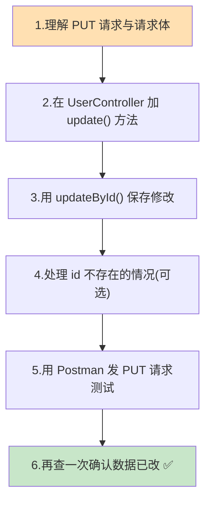
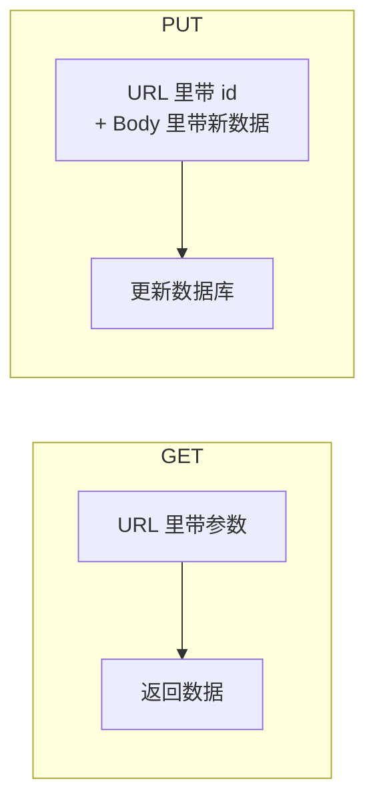
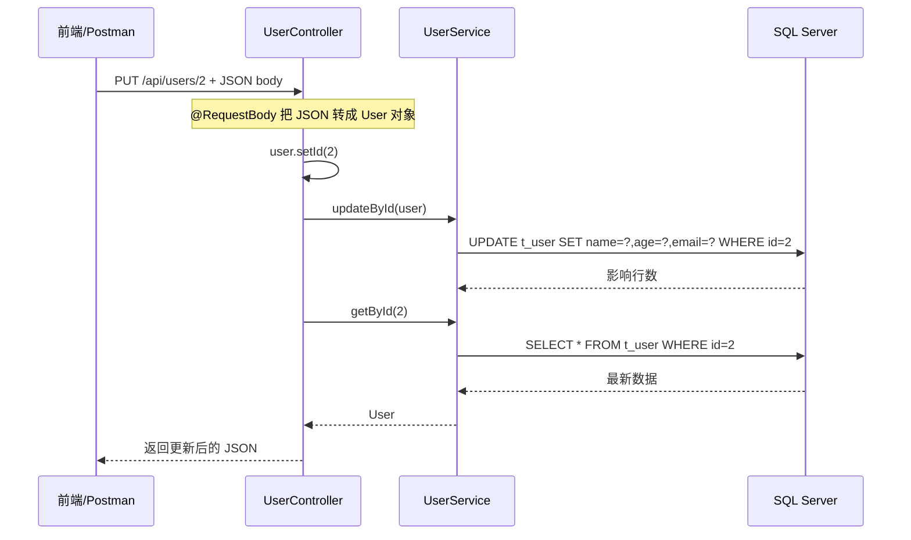
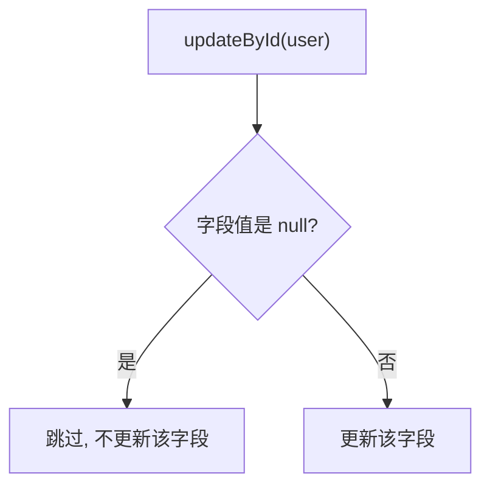
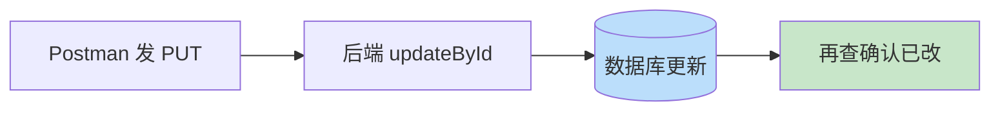

# 第 7 章 后端修改接口

> 本章目标：给上一章的 `UserController` 再加一个**修改（更新）接口** `PUT /api/users/{id}`，让前端能把改好的用户数据保存回数据库。由于修改请求带「请求体」，浏览器地址栏测不了，本章用 **Postman** 来测试。这个接口就是第 10 章「React 修改程序」要调用的对象。

---

## 7.1 本章要做什么？（全景）



---

## 7.2 为什么用 PUT？和 GET 有什么不同？

第 6 章的查询用 `GET`。修改数据要用 `PUT`。它们的核心区别：

| 对比项 | GET（查询） | PUT（修改） |
| --- | --- | --- |
| 语义 | 「读」数据 | 「整体更新」数据 |
| 有没有请求体(Body) | 没有 | **有**（把新数据放在 body 里） |
| 浏览器地址栏能测吗 | 能 | **不能**（要用 Postman 等工具） |
| 会不会改变数据 | 不会 | **会** |



**我们的修改接口设计（第 1 章定的合同）：**

- **方法**：`PUT`
- **路径**：`/api/users/{id}`（`{id}` 表示要改哪个用户）
- **请求体**：改好的用户 JSON，例如 `{ "name": "张三丰", "age": 99, "email": "new@example.com" }`
- **返回**：更新后的完整用户对象

---

## 7.3 第一步：给 UserController 添加修改方法

打开第 6 章写的 `UserController`，在类里**新增**一个 `update` 方法。下面给出**完整的 UserController**（含第 6 章的查询方法 + 本章新增的修改方法），直接替换即可：

```java
package com.example.demo.controller;

import com.example.demo.entity.User;
import com.example.demo.service.UserService;
import org.springframework.web.bind.annotation.GetMapping;
import org.springframework.web.bind.annotation.PathVariable;
import org.springframework.web.bind.annotation.PutMapping;
import org.springframework.web.bind.annotation.RequestBody;
import org.springframework.web.bind.annotation.RequestMapping;
import org.springframework.web.bind.annotation.RestController;

import java.util.List;

@RestController
@RequestMapping("/api/users")
public class UserController {

    private final UserService userService;

    public UserController(UserService userService) {
        this.userService = userService;
    }

    // ===== 第 6 章：查询全部 =====
    @GetMapping
    public List<User> listAll() {
        return userService.list();
    }

    // ===== 第 6 章：按 id 查询 =====
    @GetMapping("/{id}")
    public User getById(@PathVariable Integer id) {
        return userService.getById(id);
    }

    // ===== 第 7 章：更新用户（本章新增）=====
    /**
     * 更新指定 id 的用户
     * 请求：PUT /api/users/2
     * 请求体：{ "name": "李四改", "age": 30, "email": "new@example.com" }
     * 返回：更新后的用户对象
     */
    @PutMapping("/{id}")
    public User update(@PathVariable Integer id, @RequestBody User user) {
        // 以 URL 上的 id 为准，防止请求体里的 id 与路径不一致
        user.setId(id);

        // 调用 IService 内置的 updateById()，按主键更新
        userService.updateById(user);

        // 返回更新后的最新数据（重新查一次）
        return userService.getById(id);
    }
}
```

**新增部分逐点解释（新手重点）：**

- `@PutMapping("/{id}")`：匹配 `PUT /api/users/{id}` 请求，专门处理更新。
- `@PathVariable Integer id`：取出 URL 里的 id（要改哪个用户）。
- `@RequestBody User user`：**把请求体里的 JSON 自动转成 `User` 对象**。这是和查询接口最大的不同——前端把改好的数据放在 body 里发过来，Spring 帮我们「反序列化」成 Java 对象。
- `user.setId(id)`：用 URL 上的 id 覆盖对象里的 id，保证「改的是 URL 指定的那个人」，避免不一致。
- `userService.updateById(user)`：`IService` 内置方法，等价于 `UPDATE t_user SET ... WHERE id = ?`。
- 最后 `return userService.getById(id)`：把更新后的最新数据返回给前端，方便前端刷新显示。

### 请求处理链路



---

## 7.4 关于 updateById 的一个重要细节：null 字段

`updateById(user)` 有一个**默认行为**你必须知道：

> **默认情况下，实体里值为 `null` 的字段不会被更新。**

举例：如果请求体只传了 `{ "age": 30 }`（没传 name、email），那么 `name` 和 `email` 在对象里是 `null`，`updateById` 会**跳过它们**，只更新 `age`。生成的 SQL 类似：

```sql
UPDATE t_user SET age = 30 WHERE id = 2   -- name、email 不动
```

**这对我们是好事**：第 10 章的前端「修改程序」是先查出完整用户、改动后整体提交，所以每个字段都有值，能正常整体更新；同时这个特性也天然支持「只改部分字段」。

> 💡 如果你**就是想把某个字段更新为 null**（清空它），需要用带参数的重载：`userService.updateById(user, false)`（`false` 表示不忽略 null）。本教程用不到，了解即可。



---

## 7.5 （可选增强）处理「要改的用户不存在」

上面的代码足够跑通。但如果传了一个不存在的 id（比如 `/api/users/999`），`updateById` 不会报错，只是没有任何行被更新，最后返回 `null`。为了更友好，可以加一个判断：

```java
@PutMapping("/{id}")
public User update(@PathVariable Integer id, @RequestBody User user) {
    // 先查：这个用户存不存在
    User existing = userService.getById(id);
    if (existing == null) {
        // 不存在就抛出异常（这里用最简单的方式，返回 500 并带提示）
        throw new RuntimeException("id=" + id + " 的用户不存在，无法更新");
    }

    user.setId(id);
    userService.updateById(user);
    return userService.getById(id);
}
```

> 💡 更规范的做法是返回 HTTP 404 状态码并用统一异常处理，属于进阶内容。**初学阶段用 7.3 的基础版本即可**，本节仅作了解。

---

## 7.6 第二步：用 Postman 测试修改接口

`PUT` 带请求体，浏览器地址栏测不了，我们用 Postman。

### 操作步骤

1. 确保 SQL Server 在运行，重新运行 `DemoApplication`（改了代码要重启）。
2. 打开 Postman，新建一个请求：
   - **方法**：选择 `PUT`
   - **URL**：`http://localhost:8080/api/users/2`（这里以修改 id=2 的李四为例）
3. 切到 **「Body」** 标签 → 选择 **「raw」** → 右侧格式下拉选 **「JSON」**。
4. 在下方文本框填入要更新的数据：

```json
{
  "name": "李四改",
  "age": 30,
  "email": "lisi-new@example.com"
}
```

5. 点击 **「Send」**。

> 🖼️ 【待补图 7-1】Postman：方法选 PUT，URL 为 /api/users/2，Body 选 raw+JSON，填入更新数据

### 期望结果

下方响应区应返回**更新后**的用户 JSON：

```json
{
  "id": 2,
  "name": "李四改",
  "age": 30,
  "email": "lisi-new@example.com"
}
```

> 🖼️ 【待补图 7-2】Postman 发送 PUT 后，响应区显示更新后的用户数据，状态 200 OK

IDEA 控制台会打印更新和查询两条 SQL：

```text
==>  Preparing: UPDATE `t_user` SET `name` = ?, `age` = ?, `email` = ? WHERE `id` = ?
==> Parameters: 李四改(String), 30(Integer), lisi-new@example.com(String), 2(Integer)
<==    Updates: 1
==>  Preparing: SELECT `id`, `name`, `age`, `email` FROM `t_user` WHERE `id` = ?
==> Parameters: 2(Integer)
<==      Total: 1
```

---

## 7.7 第三步：确认数据真的改了

再验证一次，确保修改**持久化**到了数据库，有两种方式任选：

**方式一：浏览器再查一次**

访问 <http://localhost:8080/api/users>，李四那条应已变成「李四改 / 30 / lisi-new@example.com」。

**方式二：回 SSMS 查**

```sql
USE demo_db;
SELECT * FROM t_user WHERE id = 2;
```

结果应显示更新后的值。

> 🖼️ 【待补图 7-3】SSMS 中查询 id=2，显示已更新为「李四改 / 30 / lisi-new@example.com」

看到数据确实变了，说明**修改接口完整跑通**！🎉 第 10 章的 React 修改程序就是来调这个 `PUT` 接口的。



---

## 7.8 后端阶段完整回顾

到这里，**整个后端已经全部完成**！我们回顾一下后端提供的三个接口（第 1 章的「合同」已全部兑现）：

| 功能 | 方法 | 路径 | 用在哪个前端 | 状态 |
| --- | --- | --- | --- | --- |
| 查询全部 | GET | `/api/users` | 查询程序（第 9 章） | ✅ |
| 按 id 查询 | GET | `/api/users/{id}` | 修改程序（第 10 章，进入编辑前先查出旧值） | ✅ |
| 更新用户 | PUT | `/api/users/{id}` | 修改程序（第 10 章，保存） | ✅ |

后端最终目录结构：

```text
src/main/java/com/example/demo/
├── DemoApplication.java          (含 @MapperScan)
├── controller/
│   ├── HelloController.java      (可保留或删除)
│   └── UserController.java       (查询 + 修改接口)
├── entity/User.java
├── mapper/UserMapper.java
└── service/
    ├── UserService.java
    └── impl/UserServiceImpl.java
src/main/resources/
└── application.yml
```

---

## 7.9 常见问题速查

| 问题现象 | 原因 | 解决办法 |
| --- | --- | --- |
| Postman 返回 415 Unsupported Media Type | 没把 Body 设为 raw + JSON | Body → raw → 右侧选 JSON |
| 返回 400 Bad Request | JSON 格式错误（多逗号/引号） | 检查 JSON 语法是否正确 |
| 更新后某些字段变没了/没变 | null 字段被跳过（见 7.4） | 提交完整对象；或用 `updateById(user, false)` |
| 数据没变化 | id 不存在，没有匹配行 | 确认 URL 里的 id 在表中存在 |
| 改了代码不生效 | 没重启后端 | 修改 Java 代码后需重新运行 DemoApplication |
| 中文更新后乱码 | 编码问题 | 确认列为 NVARCHAR（第 3 章已保证），请求为 UTF-8 |

---

## 7.10 本章小结

- 用 `@PutMapping` + `@RequestBody` 实现了更新接口 `PUT /api/users/{id}`。
- 理解了 `PUT` 与 `GET` 的区别，以及 `@RequestBody` 如何把 JSON 转成 Java 对象。
- 掌握了 `updateById` **默认跳过 null 字段**的行为。
- 用 **Postman** 发 `PUT` 请求成功更新数据，并二次验证数据已持久化。
- **后端三个接口全部完成**，为前端开发做好了准备。

✅ 后端部分到此结束。从下一章开始，我们进入**前端**：先搭建 React 19 工程，再分别实现「查询程序」和「修改程序」。

> 💡 **选读加餐**：前面第 5~7 章我们手写了后端各层代码。如果你想知道「实战里怎么用工具一键生成这些代码」，可以看 **[附录 A：用 Mybatis-Flex 代码生成器自动生成后端](07A-附录A-代码生成器自动生成后端.md)**（可选，不影响后续学习）。

👈 上一章：**[第 6 章 后端查询接口](06-后端查询接口.md)** ｜ 📎 选读：**[附录 A 代码生成器](07A-附录A-代码生成器自动生成后端.md)** ｜ 👉 下一章：**[第 8 章 搭建 React 19 前端工程](08-搭建React19前端工程.md)**
