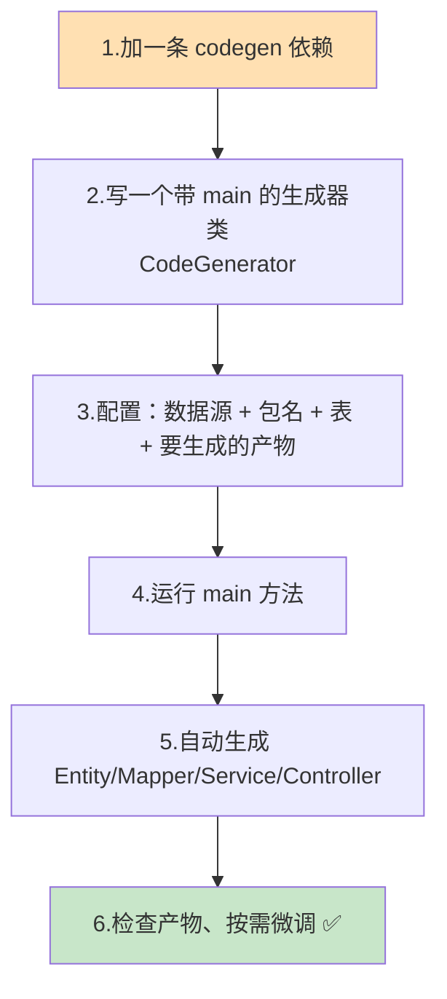
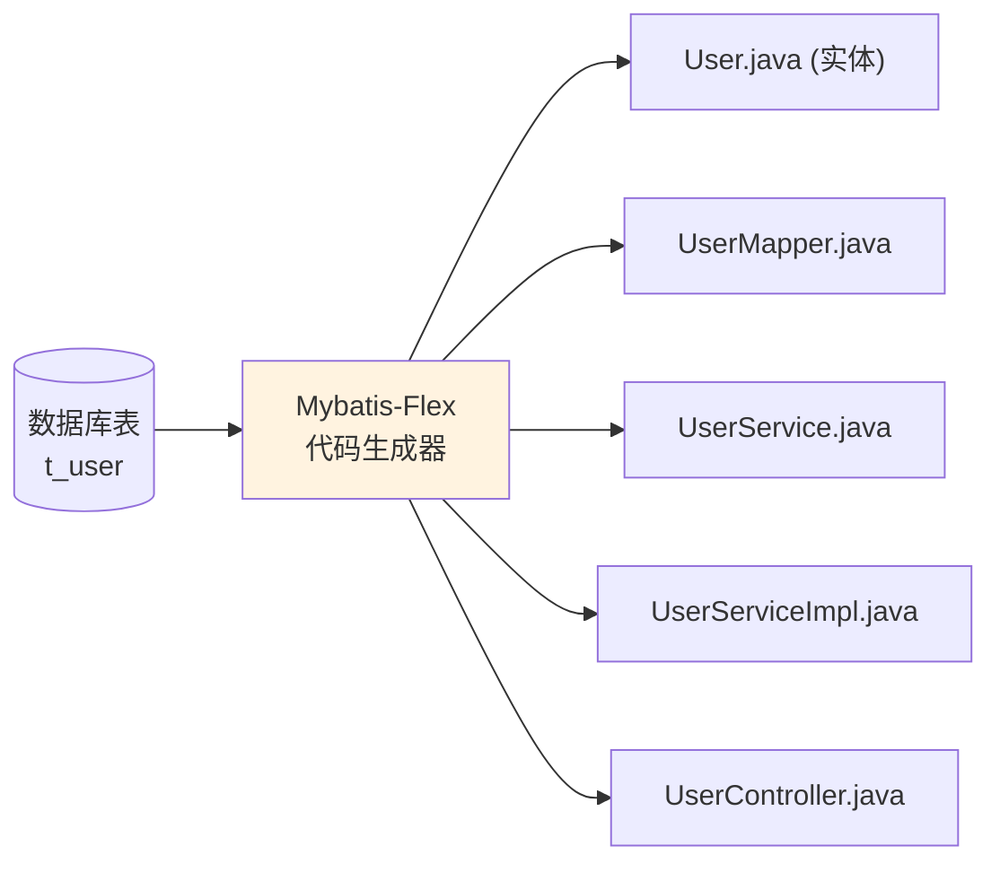
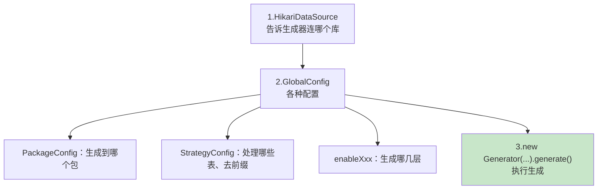

# 附录 A 用 Mybatis-Flex 代码生成器自动生成后端

> 本附录目标：教你用 **Mybatis-Flex 自带的代码生成器**，从数据库表 `t_user` **一键生成**第 5~7 章我们手写的那些后端代码（Entity、Mapper、Service、ServiceImpl、Controller）。
>
> ⚠️ **阅读顺序说明**：本附录是**可选**的加餐内容，放在第 7 章之后阅读最合适。**建议你先按第 5~7 章手写一遍**，理解每一层是什么、为什么这么写；理解之后再看本附录，学会「实战里怎么偷懒」。跳过本附录**完全不影响**后续第 8 章及之后的学习。

---

## A.1 本附录要做什么？（全景）



---

## A.2 为什么需要代码生成器？（手写 vs 生成）

在第 5~7 章，我们**一个字一个字**地写了 `User`、`UserMapper`、`UserService`、`UserServiceImpl`、`UserController`。只有一张表还好，但真实项目里往往有**几十上百张表**，每张表都手写这一套，既枯燥又容易出错。

**代码生成器**的作用：读取数据库表结构，按模板**自动产出**这些「样板代码」，你只需在生成后补充真正的业务逻辑。



| 对比 | 手写（第 5~7 章） | 代码生成器（本附录） |
| --- | --- | --- |
| 适合场景 | **学习理解**、少量表 | 表多、追求效率 |
| 优点 | 每行都懂、可控 | 快、统一、少出错 |
| 缺点 | 表多时枯燥重复 | 需先理解产物、可能要微调 |

> 💡 一句话：**手写是为了「看懂」，生成是为了「高效」。** 先学会手写，再用生成器提速，才是正确的顺序。

---

## A.3 有哪些代码生成工具？

除了 Mybatis-Flex 自带的生成器，业界还有别的工具。下表帮你选型（本附录聚焦第一个）：

| 工具 | 能生成什么 | 是否适合本教程 | 说明 |
| --- | --- | --- | --- |
| **Mybatis-Flex 代码生成器**（`mybatis-flex-codegen`） | Entity / Mapper / Service / ServiceImpl / Controller / MapperXml / TableDef | ⭐ **最推荐** | 与本教程框架完全匹配，一次生成全部分层 |
| **Mybatis-Flex 在线 AI 生成器** | 整个 SpringBoot + MyBatisFlex 项目 + SQL 脚本 | ✅ 可试 | 按需求描述自动生成，地址见 A.9 |
| MyBatis Generator（MBG） | 仅 Entity + Mapper + XML | 🔶 部分 | MyBatis 官方工具，**不生成 Service/Controller** |
| MyBatis-Plus Generator | Entity/Mapper/Service/Controller | ❌ | 属于另一个框架 MyBatis-Plus，和 Flex 不通用 |
| IDEA 插件 **MyBatisX / EasyCode** | 按模板从表生成各层 | ✅ 可选 | 图形化操作，不用写生成代码 |
| 低代码脚手架 **若依(RuoYi) / JeecgBoot** | 连前端页面都生成 | 🔶 偏重 | 适合企业级项目，学习阶段偏重量级 |

> 本附录内容依据 [Mybatis-Flex 官方文档](https://mybatis-flex.com/zh/others/codegen.html) 整理，已按合规要求改写。

---

## A.4 第一步：添加代码生成器依赖

打开后端项目的 `build.gradle`，在 `dependencies { }` 里**临时添加**一条依赖：

```groovy
dependencies {
    implementation 'org.springframework.boot:spring-boot-starter-web'
    implementation 'com.mybatis-flex:mybatis-flex-spring-boot3-starter:1.11.6'
    implementation 'com.microsoft.sqlserver:mssql-jdbc:12.8.1.jre11'

    // ↓↓↓ 本附录新增：代码生成器（用完可移除）↓↓↓
    implementation 'com.mybatis-flex:mybatis-flex-codegen:1.11.6'
    // ↑↑↑ 新增结束 ↑↑↑

    testImplementation 'org.springframework.boot:spring-boot-starter-test'
    testRuntimeOnly 'org.junit.platform:junit-platform-launcher'
}
```

**解释：**

- `mybatis-flex-codegen`：代码生成器模块，版本和第 5 章的 `mybatis-flex-spring-boot3-starter` 保持一致（`1.11.6`）。
- **HikariCP 连接池** 和 **SQL Server 驱动** 我们前面已经有了（Spring Boot 自带 HikariCP，SQL Server 驱动第 5 章已加），所以不用重复添加。

> 💡 代码生成器只在「生成代码」这一次用到，**生成完可以把这条依赖删掉**，它不需要参与正式运行。

改完记得点 IDEA 的 Gradle 刷新按钮同步依赖。

---

## A.5 第二步：编写生成器类 CodeGenerator

在 `com.example.demo` 下新建一个类 `CodeGenerator`（它是一个独立的、带 `main` 方法的工具类，和 Spring Boot 启动无关）：

```java
package com.example.demo;

import com.mybatisflex.codegen.Generator;
import com.mybatisflex.codegen.config.GlobalConfig;
import com.zaxxer.hikari.HikariDataSource;

/**
 * Mybatis-Flex 代码生成器
 * 运行这个类的 main 方法，即可根据数据库表自动生成后端各层代码。
 */
public class CodeGenerator {

    public static void main(String[] args) {

        // ===== 1. 配置数据源（连第 3 章建的 SQL Server / demo_db）=====
        HikariDataSource dataSource = new HikariDataSource();
        dataSource.setJdbcUrl("jdbc:sqlserver://localhost:1433;databaseName=demo_db;encrypt=true;trustServerCertificate=true");
        dataSource.setUsername("sa");
        dataSource.setPassword("Your_Strong_Pass123");

        // ===== 2. 全局配置 =====
        GlobalConfig globalConfig = new GlobalConfig();

        // 2.1 包配置：生成到 com.example.demo 下（会自动分出 entity/mapper/service/controller 子包）
        globalConfig.getPackageConfig()
                .setBasePackage("com.example.demo");

        // 2.2 表策略：
        //   setTablePrefix("t_")：去掉表名的 t_ 前缀，这样 t_user 生成的类叫 User（而不是 TUser）
        //   setGenerateTable("t_user")：只生成 t_user 这张表（不写则生成所有表）
        globalConfig.getStrategyConfig()
                .setTablePrefix("t_")
                .setGenerateTable("t_user");

        // 2.3 注释配置（可选）：给生成的类加上作者名
        globalConfig.getJavadocConfig()
                .setAuthor("你的名字");

        // 2.4 选择要生成哪些产物（想要哪层就 enable 哪层）
        globalConfig.enableEntity()      // 生成实体类 User
                .setJdkVersion(21);       // 告诉生成器我们用 JDK 21
        globalConfig.enableMapper();      // 生成 UserMapper
        globalConfig.enableService();     // 生成 UserService 接口
        globalConfig.enableServiceImpl(); // 生成 UserServiceImpl 实现
        globalConfig.enableController();  // 生成 UserController

        // ===== 3. 创建生成器并执行 =====
        Generator generator = new Generator(dataSource, globalConfig);
        generator.generate();

        System.out.println("✅ 代码生成完成！请刷新项目查看生成的文件。");
    }
}
```

### 逐段讲解



- **数据源**：和第 5 章 `application.yml` 里配的是同一个库（`demo_db`）、同一个账号（`sa`）。生成器要连数据库才能读到表结构。
- **`setBasePackage("com.example.demo")`**：生成的文件会自动分门别类放进 `entity`、`mapper`、`service`、`service.impl`、`controller` 子包，和我们手写时的结构一致。
- **`setTablePrefix("t_")`**：非常关键。数据库表叫 `t_user`，去掉前缀 `t_` 后，实体类才会命名为 `User`（否则会生成 `TUser`）。这正是第 1 章讲的「表名下划线、类名大驼峰」的对应。
- **`setGenerateTable("t_user")`**：只处理这一张表。项目里表多时，可以传多个：`setGenerateTable("t_user", "t_order")`。
- **`enableXxx()`**：像开关一样，决定生成哪几层。我们把 5 层全打开。

---

## A.6 第三步：运行并查看生成的文件

1. 确保 **SQL Server 正在运行**（生成器要连库读表结构）。
2. 打开 `CodeGenerator.java`，点击 `main` 方法左侧的绿色三角 ▶ 运行。
3. 控制台打印 `✅ 代码生成完成！` 后，**右键项目根目录 → Reload from Disk / 刷新**，就能看到自动生成的文件。

> 🖼️ 【待补图 A-1】IDEA 运行 CodeGenerator 的 main 方法，控制台输出「代码生成完成」

生成后的目录结构（和第 7 章手写的几乎一模一样）：

```text
src/main/java/com/example/demo/
├── entity/
│   └── User.java              ← 自动生成
├── mapper/
│   └── UserMapper.java        ← 自动生成
├── service/
│   ├── UserService.java       ← 自动生成
│   └── impl/
│       └── UserServiceImpl.java  ← 自动生成
└── controller/
    └── UserController.java    ← 自动生成
```

> 🖼️ 【待补图 A-2】项目结构树中出现自动生成的 entity/mapper/service/controller 各文件

---

## A.7 生成产物长什么样？（和手写对比）

生成的代码和我们手写的高度一致。以实体类为例，生成的 `User.java` 大致是：

```java
package com.example.demo.entity;

import com.mybatisflex.annotation.Id;
import com.mybatisflex.annotation.Table;
import java.io.Serializable;

/**
 * 实体类。
 *
 * @author 你的名字
 * @since 2026-07-09
 */
@Table("t_user")
public class User implements Serializable {

    @Id(keyType = KeyType.Auto)
    private Integer id;
    private String name;
    private Integer age;
    private String email;

    // 生成器会自动生成 getter / setter ...
}
```

生成的 `UserServiceImpl.java` 也和第 6 章一样，是继承框架 `ServiceImpl` 的空壳：

```java
package com.example.demo.service.impl;

import com.example.demo.entity.User;
import com.example.demo.mapper.UserMapper;
import com.example.demo.service.UserService;
import com.mybatisflex.spring.service.ServiceImpl;
import org.springframework.stereotype.Service;

@Service
public class UserServiceImpl extends ServiceImpl<UserMapper, User> implements UserService {
}
```

> 💡 是不是很眼熟？这正说明——**你在第 5~7 章手写的东西，本质就是生成器帮你产出的那套样板。** 理解了手写版，再看生成版就一目了然。

生成的 `UserController` 会带一套基础的增删改查接口，路径通常基于实体名（如 `/user`）。它和我们第 6、7 章手写的 `/api/users` 路径可能**略有不同**——这没关系，生成后按需改成你想要的路径即可（见 A.8）。

---

## A.8 重要注意事项（务必看）

### ① 默认不覆盖已有文件

生成器的 `OverwriteEnable` 默认为 `false`，也就是**不会覆盖**你已经写好的文件。

- 如果你已经按第 5~7 章手写了 `User.java` 等，直接运行生成器**不会动它们**。
- 想让它重新覆盖生成，需要显式打开覆盖开关，例如：

```java
globalConfig.getEntityConfig().setOverwriteEnable(true);       // 覆盖实体类
globalConfig.getControllerConfig().setOverwriteEnable(true);   // 覆盖 Controller
// mapper/service/serviceImpl 同理，各有对应的 XxxConfig.setOverwriteEnable(true)
```

> ⚠️ 打开覆盖前请先备份或提交 Git，避免手写的业务代码被冲掉。

### ② 避免和 APT 生成的 Mapper 重复

Mybatis-Flex 有一个 APT（注解处理器）功能，某些配置下也会自动生成 Mapper 类。如果**生成器**也生成了一份 Mapper，可能会和 APT 生成的**重复**。若遇到「同名 Mapper 冲突」，按官方 APT 设置关闭其中一个来源即可（参考官方文档的「APT 设置」章节）。

### ③ SQL Server 用默认方言

生成器内置了 MySQL / Oracle / SQLite 等方言，**SQL Server 走默认方言**即可（通过 JDBC 读取表结构），一般能正常工作，无需额外指定。

### ④ 生成的路径/命名可能要微调

生成的 Controller 路径、类名后缀等是按默认规则来的，可能和你的约定不完全一致。可以通过配置调整，例如给 Controller 统一加前缀：

```java
globalConfig.getControllerConfig()
        .setControllerRequestMappingPrefix("/api");  // 让接口带上 /api 前缀
```

---

## A.9 进阶：其他常用配置速查

生成器还有很多可调项，按需使用：

| 需求 | 配置写法 |
| --- | --- |
| 实体类启用 Lombok（省去 getter/setter） | `globalConfig.enableEntity().setWithLombok(true)` |
| 生成所有表（不指定单表） | 不调用 `setGenerateTable(...)` 即可 |
| 指定生成到某个 schema | `globalConfig.getStrategyConfig().setGenerateSchema("dbo")` |
| 自定义源码输出目录 | `globalConfig.getPackageConfig().setSourceDir("D:\\code\\...\\src\\main\\java")` |
| 同时生成 MapperXml 文件 | `globalConfig.enableMapperXml()` |
| 给类加作者/日期注释 | `globalConfig.getJavadocConfig().setAuthor("张三").setSince("2026-07-09")` |

> 💡 **在线 AI 生成器**：Mybatis-Flex 还提供了一个在线 AI 代码生成器，可根据你的项目需求描述，自动生成整套 SpringBoot + MyBatisFlex 项目代码和 SQL 脚本。地址：`ai.mybatis-flex.com`（以官方最新为准）。

---

## A.10 常见问题速查

| 问题现象 | 原因 | 解决办法 |
| --- | --- | --- |
| 运行报连接失败 | 数据库没开 / 连接串错 | 确认 SQL Server 运行，核对 url/账号/密码（同第 5 章） |
| 生成的类叫 `TUser` 而不是 `User` | 没去表前缀 | 加 `setTablePrefix("t_")` |
| 运行后看不到生成的文件 | IDEA 没刷新 | 右键项目 → Reload from Disk / 刷新 |
| 提示找不到 `HikariDataSource` | 连接池不在类路径 | 一般 Spring Boot 已自带；否则加 HikariCP 依赖 |
| 出现两份 Mapper | 生成器与 APT 都生成了 | 关闭其中一个来源（见 A.8 ②） |
| 生成的 Controller 路径不对 | 默认命名规则 | 生成后手动改，或用 `setControllerRequestMappingPrefix` |
| 找不到 `mybatis-flex-codegen` 类 | 依赖没加/没同步 | 加依赖（A.4）并刷新 Gradle |

---

## A.11 本附录小结

- 代码生成器能根据数据库表**一键生成** Entity / Mapper / Service / ServiceImpl / Controller，省去大量重复手写。
- 用法三步：**加依赖 → 写 `CodeGenerator` 配置类 → 运行 main**。
- 关键配置：数据源、`setBasePackage`、`setTablePrefix("t_")`、`setGenerateTable("t_user")`、`enableXxx()`。
- 注意事项：默认**不覆盖**已有文件、避免与 APT 的 Mapper 重复、SQL Server 用默认方言、生成后按需微调路径。
- **学习顺序建议**：先手写（第 5~7 章）理解原理，再用生成器提效——这才是把工具用好的正确姿势。

👈 上一章：**[第 7 章 后端修改接口](07-后端修改接口.md)** ｜ 👉 下一章：**[第 8 章 搭建 React 19 前端工程](08-搭建React19前端工程.md)** ｜ 🏠 [返回目录](README.md)
