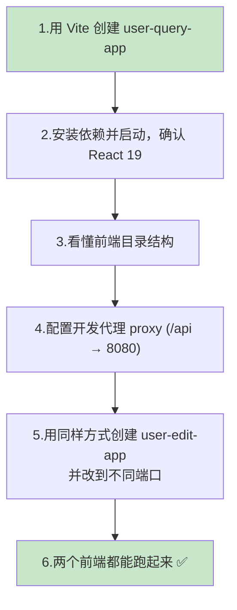
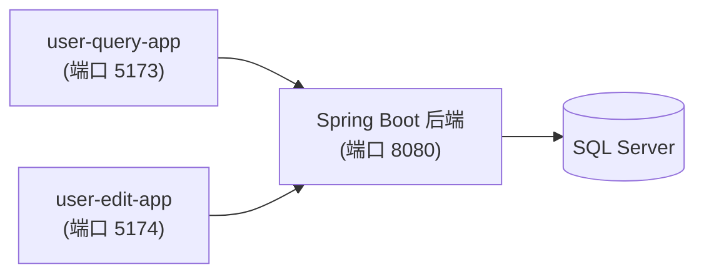
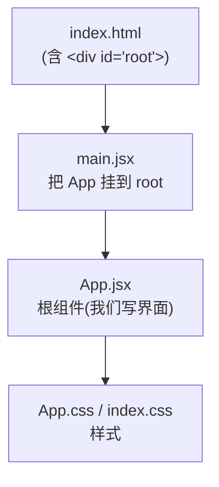
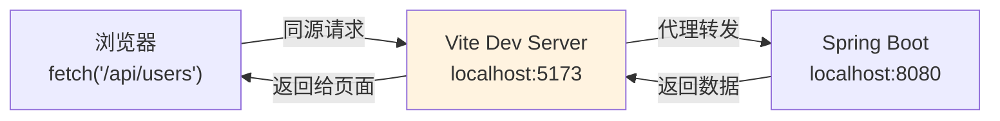
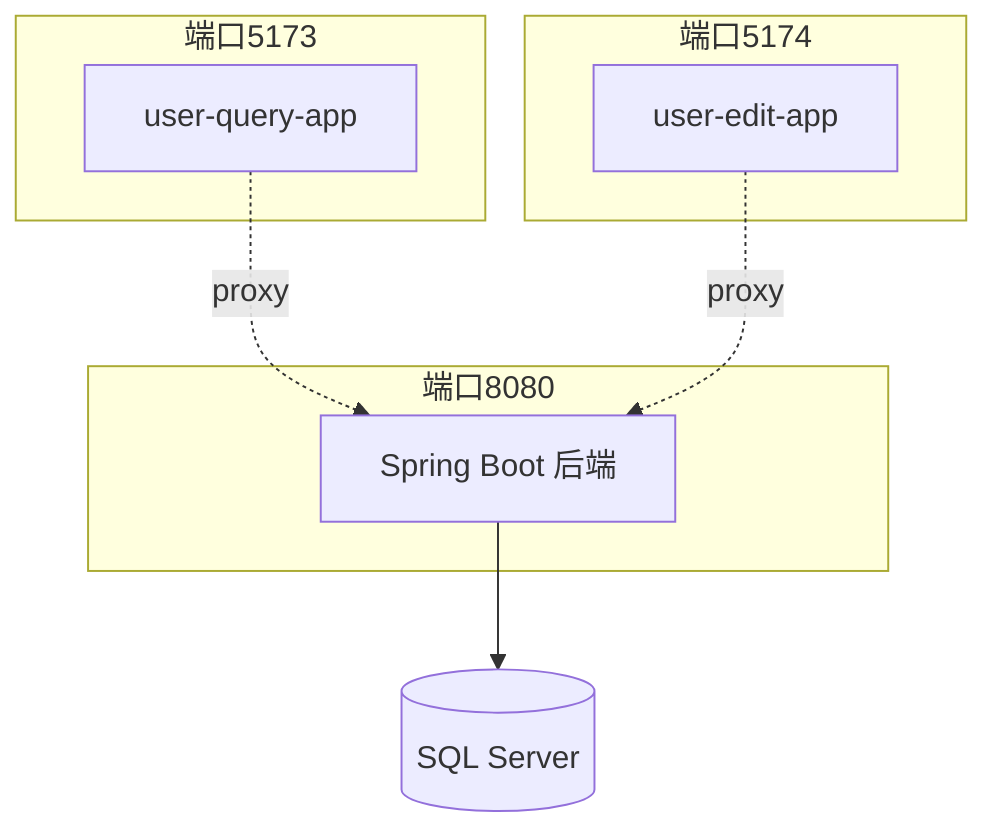

# 第 8 章 搭建 React 19 前端工程

> 本章目标：用 **Vite** 脚手架创建**两个独立的 React 19 工程**——`user-query-app`（查询程序）和 `user-edit-app`（修改程序），看懂前端工程的目录结构，并为两个工程都配好**开发代理（proxy）**，让它们在开发时能顺畅调用第 7 章完成的后端接口，而不用操心跨域问题。本章不写业务界面，专注把「两个能跑起来的前端骨架」立起来。

---

## 8.1 本章要做什么？（全景）



我们最终的前端目录布局：

```text
frontend/
├── user-query-app/     # 查询程序（本章创建，第 9 章写界面）→ 端口 5173
└── user-edit-app/      # 修改程序（本章创建，第 10 章写界面）→ 端口 5174
```

---

## 8.2 为什么用 Vite？为什么做两个工程？

**为什么用 Vite？**

- Vite 是目前最流行的前端构建工具，**启动快、热更新快**（改代码浏览器秒刷新）。
- 官方脚手架能一键生成 **React 19** 项目，开箱即用。
- 它替代了以前的 Create React App（CRA，已不再推荐）。

**为什么做两个独立工程？**

这是你最初的要求：「查询是一个 React 程序，修改是另一个 React 程序」。两个工程各自独立、互不干扰，共用同一个后端。这样也更清楚地展示——**多个前端可以共享一个后端**。



> ⚠️ **端口不能一样**：两个前端如果都用默认的 5173，第二个会启动失败或自动换端口。我们特意把修改程序设成 5174 以示区分。

---

## 8.3 第一步：创建 user-query-app 工程

打开命令行，`cd` 到你想放前端代码的目录（比如 `D:\code\fullstack-demo\frontend`），执行创建命令：

```bash
npm create vite@latest user-query-app -- --template react
```

**命令解释：**

- `npm create vite@latest`：使用最新版 Vite 脚手架。
- `user-query-app`：工程文件夹名。
- `-- --template react`：使用 **React** 模板（会自动装 React 19）。注意中间的 `--` 不能省略。

执行后如果提示是否安装 `create-vite` 包，输入 `y` 回车即可。

> 🖼️ 【待补图 8-1】命令行执行 npm create vite@latest user-query-app -- --template react 的输出

创建完成后，按提示进入目录并安装依赖、启动：

```bash
cd user-query-app
npm install
npm run dev
```

- `npm install`：下载项目所需的所有依赖（React 等），会生成 `node_modules` 文件夹。
- `npm run dev`：启动开发服务器。

启动成功后，命令行会显示本地访问地址：

```text
  VITE v7.x.x  ready in 400 ms

  ➜  Local:   http://localhost:5173/
  ➜  Network: use --host to expose
```

> 🖼️ 【待补图 8-2】npm run dev 启动成功，显示 Local: http://localhost:5173/

用浏览器打开 <http://localhost:5173/>，能看到 Vite + React 的默认欢迎页（一个会计数的按钮）。

> 🖼️ 【待补图 8-3】浏览器显示 Vite + React 默认欢迎页面，含 count 按钮

看到这个页面，说明前端工程创建成功。按 `Ctrl+C` 可停止开发服务器。

> 💡 **国内 npm install 慢？** 用第 2 章配过的淘宝镜像：`npm config set registry https://registry.npmmirror.com`，再重新 `npm install`。

---

## 8.4 第二步：确认这是 React 19

打开工程里的 `package.json`，在 `dependencies` 里应看到 React 版本是 **19.x**：

```json
{
  "dependencies": {
    "react": "^19.1.0",
    "react-dom": "^19.1.0"
  },
  "devDependencies": {
    "@vitejs/plugin-react": "^5.x.x",
    "vite": "^7.x.x"
  }
}
```

> 💡 只要 `react` 是 `19.x` 就对了（具体小版本号可能不同）。`@vitejs/plugin-react` 是 Vite 用来支持 React 的插件。

---

## 8.5 第三步：看懂前端目录结构

用 VS Code 打开 `user-query-app` 文件夹（`File → Open Folder`），结构如下：

```text
user-query-app/
├── index.html            ← ⭐ 页面入口 HTML（挂载点在这里）
├── package.json          ← ⭐ 依赖清单和脚本命令
├── vite.config.js        ← ⭐ Vite 配置（本章要改它加代理）
├── node_modules/         ← 依赖库（自动生成，不用管）
├── public/               ← 静态资源（图片等）
└── src/                  ← ⭐ 我们写代码的地方
    ├── main.jsx          ← ⭐ JS 入口，把 App 渲染到页面
    ├── App.jsx           ← ⭐ 根组件（第 9 章主要改这里）
    ├── App.css           ← App 的样式
    └── index.css         ← 全局样式
```



### 关键文件 1：`index.html`

整个页面只有一个「挂载点」，React 把界面渲染到这个 `<div id="root">` 里：

```html
<!doctype html>
<html lang="zh-CN">
  <head>
    <meta charset="UTF-8" />
    <meta name="viewport" content="width=device-width, initial-scale=1.0" />
    <title>用户查询程序</title>
  </head>
  <body>
    <div id="root"></div>
    <script type="module" src="/src/main.jsx"></script>
  </body>
</html>
```

> 💡 可以把 `<title>` 改成「用户查询程序」，浏览器标签页就会显示这个标题。

### 关键文件 2：`main.jsx`（程序入口）

```jsx
import { StrictMode } from 'react'
import { createRoot } from 'react-dom/client'
import './index.css'
import App from './App.jsx'

createRoot(document.getElementById('root')).render(
  <StrictMode>
    <App />
  </StrictMode>,
)
```

- `createRoot(...).render(...)`：React 19 的启动方式，把 `App` 组件渲染进 `id="root"` 的 div。
- `<StrictMode>`：开发时的「严格模式」，帮你提前发现潜在问题（会导致某些副作用执行两次，属正常现象）。

### 关键文件 3：`App.jsx`（根组件）

这是 Vite 生成的默认示例代码。**第 9 章我们会把它整个替换成查询界面**，现在了解它是「界面的根」即可。

---

## 8.6 第四步：配置开发代理（关键！避免跨域）

这是本章**最重要**的一步。

### 为什么需要代理？

前端跑在 `http://localhost:5173`，后端跑在 `http://localhost:8080`，**端口不同 = 浏览器认为是「不同的源」**。浏览器有个安全机制叫「同源策略」，默认会**拦截**跨源请求，报 **CORS 错误**（跨域错误）。

**Vite 代理**能解决这个问题：让前端只请求自己的地址（相对路径 `/api/xxx`），由 Vite 开发服务器在背后**转发**给后端。这样在浏览器看来，请求始终是「同源」的，不会触发跨域。



> 💡 简单说：**前端只管请求 `/api/users`，Vite 悄悄帮你转发到 8080 端口的后端**。开发阶段完全不用碰跨域配置。（生产环境的跨域方案见第 11 章。）

### 修改 vite.config.js

打开工程根目录的 `vite.config.js`，改成下面内容（新增 `server` 部分）：

```js
import { defineConfig } from 'vite'
import react from '@vitejs/plugin-react'

// https://vite.dev/config/
export default defineConfig({
  plugins: [react()],
  server: {
    port: 5173,                       // 查询程序用 5173 端口
    proxy: {
      // 所有以 /api 开头的请求，都转发到后端 8080
      '/api': {
        target: 'http://localhost:8080',
        changeOrigin: true,           // 修改请求头的 Host，让后端以为请求来自它自己
      },
    },
  },
})
```

**解释：**

- `server.port: 5173`：明确指定查询程序的端口。
- `server.proxy['/api']`：凡是前端发出的、路径以 `/api` 开头的请求，Vite 都转发到 `http://localhost:8080`。
- `changeOrigin: true`：转发时把请求头里的 Host 改成目标地址，避免后端识别异常。

> ⚠️ **改完 `vite.config.js` 要重启 `npm run dev`** 才生效（配置文件的修改不会热更新）。

---

## 8.7 第五步：创建第二个工程 user-edit-app

回到 `frontend` 目录（`cd ..`），用同样的方式创建修改程序：

```bash
npm create vite@latest user-edit-app -- --template react
cd user-edit-app
npm install
```

然后修改它的 `vite.config.js`，**注意端口改成 5174**（避免和查询程序冲突）：

```js
import { defineConfig } from 'vite'
import react from '@vitejs/plugin-react'

export default defineConfig({
  plugins: [react()],
  server: {
    port: 5174,                       // 修改程序用 5174 端口（和查询程序区分）
    proxy: {
      '/api': {
        target: 'http://localhost:8080',
        changeOrigin: true,
      },
    },
  },
})
```

启动验证：

```bash
npm run dev
```

浏览器打开 <http://localhost:5174/>，应能看到默认欢迎页。

> 🖼️ 【待补图 8-4】user-edit-app 启动在 http://localhost:5174/，浏览器显示默认页

---

## 8.8 三个服务的关系与端口速查

到这里，我们的系统一共会同时跑三个服务：

| 服务 | 技术 | 端口 | 启动命令 | 用途 |
| --- | --- | --- | --- | --- |
| 后端 | Spring Boot | 8080 | 运行 DemoApplication | 提供 API |
| 查询程序 | React 19 (Vite) | 5173 | `npm run dev` | 展示用户列表 |
| 修改程序 | React 19 (Vite) | 5174 | `npm run dev` | 编辑并保存用户 |



> 💡 **开发时的正确姿势**：三个都要开着——先启动后端（IDEA 里运行），再分别在两个前端目录 `npm run dev`。第 9、10 章写好界面后，就能真正联调了。

---

## 8.9 常见问题速查

| 问题现象 | 原因 | 解决办法 |
| --- | --- | --- |
| `npm create vite` 命令报错 | Node 版本太旧 | 升级到 Node 20 LTS+（第 2 章） |
| `npm install` 很慢/失败 | 默认走国外源 | 切淘宝镜像后重装（8.3 提示） |
| 端口 5173 被占用 | 已有程序占用 | 在 vite.config.js 改端口，或关掉占用程序 |
| 改了 vite.config.js 不生效 | 没重启 dev | 停掉 `npm run dev` 重新启动 |
| 两个前端只能开一个 | 端口冲突 | 确认一个 5173、一个 5174 |
| 页面白屏 | 通常是代码报错 | 看浏览器控制台（F12）和命令行报错 |

---

## 8.10 本章小结

- 用 `npm create vite@latest ... --template react` 创建了**两个 React 19 工程**：`user-query-app`（5173）和 `user-edit-app`（5174）。
- 认识了前端关键文件：`index.html`（挂载点）、`main.jsx`（入口）、`App.jsx`（根组件）、`vite.config.js`（配置）。
- 给两个工程都配置了**开发代理**，把 `/api` 请求转发到后端 8080，**开发阶段彻底免除跨域烦恼**。
- 明确了三个服务的端口分工。

✅ 前端骨架就位。下一章开始写第一个真正的界面——**查询程序**，把后端的用户列表展示到网页上。

👈 上一章：**[第 7 章 后端修改接口](07-后端修改接口.md)** ｜ 👉 下一章：**[第 9 章 React 19 查询程序](09-React19查询程序.md)**
