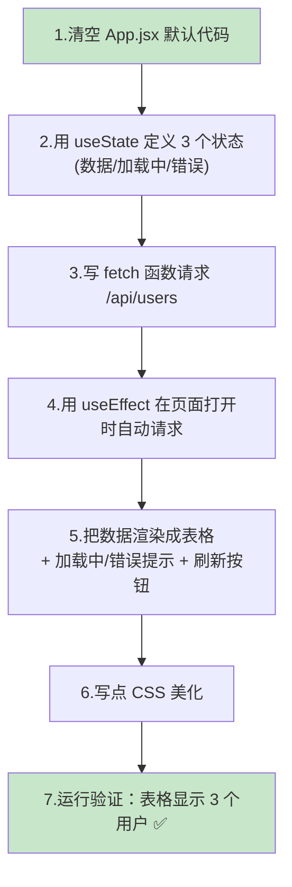
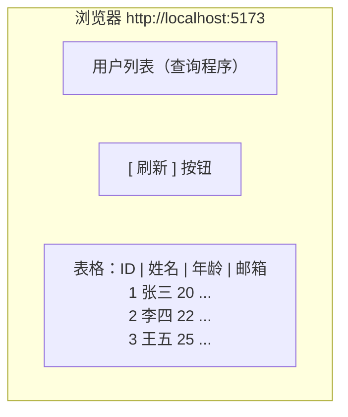
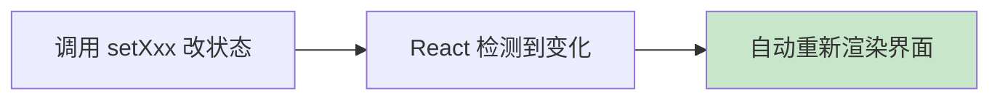
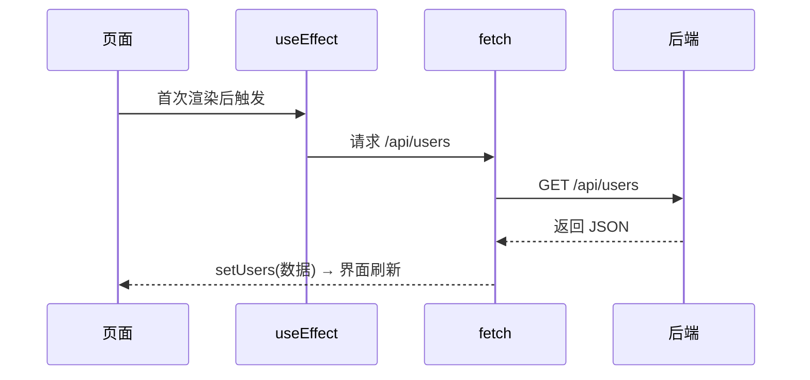
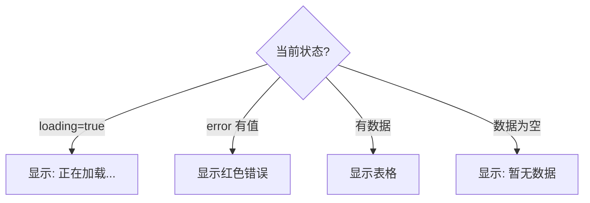
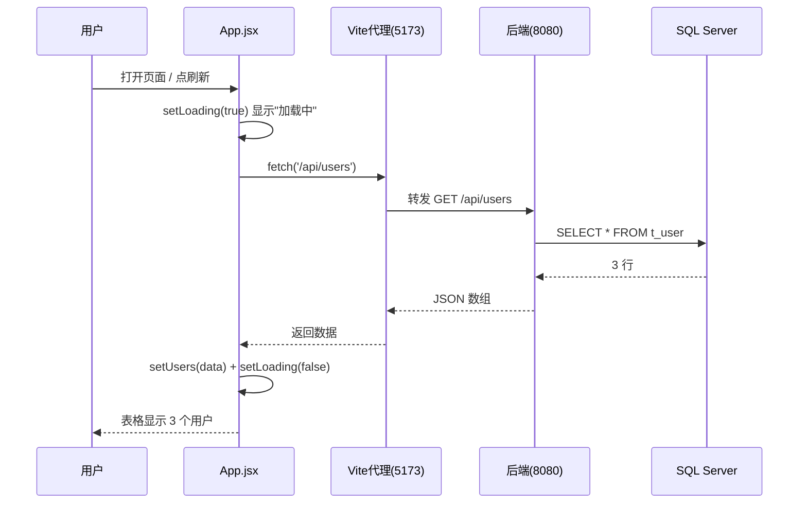

# 第 9 章 React 19 查询程序

> 本章目标：在第 8 章创建的 `user-query-app` 工程里，写出真正的**查询界面**——页面打开就自动调用后端 `GET /api/users`，把用户列表渲染成一张表格，并处理「加载中」「出错了」两种状态，再加一个「刷新」按钮。学完本章，你会理解 React 最核心的三件事：**状态（useState）、副作用（useEffect）、请求数据（fetch）**。

---

## 9.1 本章要做什么？（全景）



**最终效果预览：**



---

## 9.2 为什么需要「状态」和「副作用」这些概念？

在动手前，先用大白话理解 React 的两个核心概念，后面代码就不难懂了。

### 概念 1：状态（State）

**状态 = 会变化、且变化后需要刷新界面的数据。**

比如「用户列表」就是状态：一开始是空的，请求回来后变成 3 条，界面要跟着显示出来。React 用 `useState` 来管理状态——**只要状态一变，React 就自动重新渲染界面**，不用你手动操作 DOM。



### 概念 2：副作用（Effect）

**副作用 = 渲染界面之外的额外操作**，最典型的就是「向后端请求数据」。我们希望「页面一打开就自动请求一次」，这用 `useEffect` 实现。

### 概念 3：请求数据（fetch）

`fetch` 是浏览器内置的、用来发 HTTP 请求的函数。我们用它去调后端接口。因为请求需要时间，要用 `async/await` 等它返回。



---

## 9.3 第一步：改浏览器标签标题（可选）

先把 `index.html` 里的 `<title>` 改成有意义的名字：

```html
<title>用户查询程序</title>
```

---

## 9.4 第二步：编写 App.jsx（核心，完整代码）

打开 `user-query-app/src/App.jsx`，**删掉里面所有默认代码**，替换成下面的完整代码。这段代码有详细注释，请边读注释边理解：

```jsx
import { useState, useEffect } from 'react'
import './App.css'

function App() {
  // ===== 1. 定义状态 =====
  // users：用户列表数据，初始是空数组 []
  const [users, setUsers] = useState([])
  // loading：是否正在加载，初始 true（一进页面就要加载）
  const [loading, setLoading] = useState(true)
  // error：错误信息，初始 null（没有错误）
  const [error, setError] = useState(null)

  // ===== 2. 定义请求数据的函数 =====
  const loadUsers = async () => {
    setLoading(true)   // 开始加载
    setError(null)     // 清空上一次的错误
    try {
      // 请求后端接口（相对路径 /api/users，会被 Vite 代理转发到 8080）
      const response = await fetch('/api/users')
      // response.ok 为 false 表示 HTTP 状态码不是 2xx
      if (!response.ok) {
        throw new Error('请求失败，状态码：' + response.status)
      }
      // 把响应体解析成 JSON（就是用户数组）
      const data = await response.json()
      setUsers(data)   // 存入状态 → 触发界面刷新
    } catch (err) {
      // 网络错误或上面抛出的错误都会进到这里
      setError(err.message)
    } finally {
      setLoading(false)  // 无论成功失败，都结束加载状态
    }
  }

  // ===== 3. 页面首次渲染后，自动请求一次 =====
  useEffect(() => {
    loadUsers()
  }, [])  // 空数组 [] 表示只在「首次渲染后」执行一次

  // ===== 4. 渲染界面 =====
  return (
    <div className="container">
      <h1>用户列表（查询程序）</h1>

      {/* 刷新按钮：点击重新请求 */}
      <button className="refresh-btn" onClick={loadUsers} disabled={loading}>
        {loading ? '加载中...' : '刷新'}
      </button>

      {/* 加载中提示 */}
      {loading && <p className="tip">正在加载数据...</p>}

      {/* 错误提示（红色） */}
      {error && <p className="error">出错了：{error}</p>}

      {/* 数据表格：不在加载中、且没有错误时才显示 */}
      {!loading && !error && (
        <table className="user-table">
          <thead>
            <tr>
              <th>ID</th>
              <th>姓名</th>
              <th>年龄</th>
              <th>邮箱</th>
            </tr>
          </thead>
          <tbody>
            {/* 遍历 users 数组，每个用户渲染成一行 */}
            {users.map((user) => (
              <tr key={user.id}>
                <td>{user.id}</td>
                <td>{user.name}</td>
                <td>{user.age}</td>
                <td>{user.email}</td>
              </tr>
            ))}
          </tbody>
        </table>
      )}

      {/* 没有数据时的提示 */}
      {!loading && !error && users.length === 0 && (
        <p className="tip">暂无数据</p>
      )}
    </div>
  )
}

export default App
```

---

## 9.5 逐段讲解 App.jsx（给不懂的同学）

### ① 三个状态

```jsx
const [users, setUsers] = useState([])
const [loading, setLoading] = useState(true)
const [error, setError] = useState(null)
```

- `useState(初始值)` 返回一个数组：`[当前值, 修改它的函数]`。
- 例如 `users` 是当前的用户列表，`setUsers(新值)` 用来更新它。**一旦调用 `setUsers`，界面会自动重新渲染。**
- 我们用三个状态分别表示：**数据、是否加载中、有没有出错**——这正好覆盖一次网络请求的三种界面情况。

### ② fetch 请求函数

```jsx
const response = await fetch('/api/users')
if (!response.ok) throw new Error(...)
const data = await response.json()
setUsers(data)
```

- `await fetch('/api/users')`：发请求并等待响应。注意用的是**相对路径** `/api/users`——第 8 章配的 Vite 代理会把它转发到 `http://localhost:8080/api/users`。
- `response.ok`：布尔值，`true` 表示请求成功（状态码 2xx）。
- `response.json()`：把返回的 JSON 文本解析成 JavaScript 数组/对象。
- `try/catch/finally`：`try` 里放正常逻辑，`catch` 捕获错误存进 `error`，`finally` 里无论如何都关掉 loading。

### ③ useEffect 自动加载

```jsx
useEffect(() => {
  loadUsers()
}, [])
```

- `useEffect(函数, 依赖数组)`：在渲染后执行「函数」。
- 第二个参数 `[]`（空数组）表示：**只在组件首次渲染后执行一次**——正好实现「打开页面就自动加载」。

> ⚠️ **严格模式下会请求两次？** 开发环境 `<StrictMode>` 会故意让 effect 执行两次以帮你发现问题，所以你可能在控制台看到两次请求，这是**正常的**，生产环境不会这样。

### ④ 条件渲染与列表渲染

- **条件渲染**：`{loading && <p>...</p>}` 意思是「`loading` 为 true 时才显示这段」。这是 React 里根据状态显示不同内容的常用写法。
- **列表渲染**：`{users.map(user => <tr key={user.id}>...</tr>)}` 把数组的每一项转成一行 `<tr>`。
- ⚠️ **`key` 很重要**：给每行加 `key={user.id}`，React 用它高效地识别每一行，`key` 要唯一（用 id 最合适）。



---

## 9.6 第三步：写点 CSS 让它好看

打开 `user-query-app/src/App.css`，**清空**并替换成下面的样式：

```css
.container {
  max-width: 720px;
  margin: 40px auto;
  padding: 0 16px;
  font-family: -apple-system, "Segoe UI", "Microsoft YaHei", sans-serif;
  color: #333;
}

h1 {
  font-size: 22px;
  margin-bottom: 16px;
}

.refresh-btn {
  padding: 8px 20px;
  font-size: 14px;
  color: #fff;
  background-color: #1677ff;
  border: none;
  border-radius: 6px;
  cursor: pointer;
  margin-bottom: 16px;
}

.refresh-btn:disabled {
  background-color: #9cc4ff;
  cursor: not-allowed;
}

.user-table {
  width: 100%;
  border-collapse: collapse;
}

.user-table th,
.user-table td {
  border: 1px solid #e5e5e5;
  padding: 10px 12px;
  text-align: left;
}

.user-table th {
  background-color: #fafafa;
  font-weight: 600;
}

.user-table tr:hover {
  background-color: #f5faff;
}

.tip {
  color: #888;
}

.error {
  color: #d4380d;
  font-weight: 600;
}
```

> 💡 CSS 决定「长什么样」，不影响功能。你可以随意调整颜色、间距。上面的样式做出一个简洁的蓝色主题表格。

`index.css` 里如果有默认的居中样式可能会影响布局，可以把它清空或只保留 `body { margin: 0; }`。

---

## 9.7 第四步：运行验证

现在联调这一步需要**后端也开着**：

1. 先在 IDEA 里**运行后端** `DemoApplication`（确保 SQL Server 也在运行）。
2. 在 `user-query-app` 目录执行 `npm run dev`。
3. 浏览器打开 <http://localhost:5173/>。

页面应显示一张表格，列出第 3 章插入的 3 个用户：

| ID | 姓名 | 年龄 | 邮箱 |
| --- | --- | --- | --- |
| 1 | 张三 | 20 | zhangsan@example.com |
| 2 | 李四 | 22 | lisi@example.com |
| 3 | 王五 | 25 | wangwu@example.com |

> 🖼️ 【待补图 9-1】浏览器 5173 显示「用户列表（查询程序）」标题、蓝色刷新按钮和 3 行用户表格

点击「刷新」按钮，会重新请求一次（如果你在 SSMS 里改过数据，刷新后就能看到最新值）。

> 🖼️ 【待补图 9-2】浏览器 F12 → Network 面板，能看到对 /api/users 的请求，状态 200，返回 JSON

### 完整数据流回顾



---

## 9.8 动手验���「加载中」和「错误」状态（加深理解）

为了亲眼看到另外两种状态，可以做两个小实验：

- **看「出错了」**：把后端停掉（IDEA 里点红色 ⏹），再刷新页面。因为请求失败，页面会显示红色的「出错了：...」。这说明我们的错误处理生效了。

> 🖼️ 【待补图 9-3】后端关闭时页面显示红色错误提示

- **看「加载中」**：如果网络快，加载中一闪而过。可以在 `loadUsers` 里临时加一行人为延迟来观察（实验完记得删）：
  ```jsx
  await new Promise(r => setTimeout(r, 1500))  // 故意等 1.5 秒
  ```

> 💡 这三种状态（加载中 / 错误 / 数据）是所有「请求数据的页面」都要考虑的，养成习惯很重要。

---

## 9.9 常见问题速查

| 问题现象 | 原因 | 解决办法 |
| --- | --- | --- |
| 页面一直「加载中」 | 后端没开 / 代理没配 | 启动后端；检查第 8 章 vite.config.js 代理，改后重启 dev |
| 红色「出错了：请求失败 500」 | 后端报错 | 看后端控制台报错（多半是数据库没连上） |
| 控制台报 CORS 错误 | 没走代理（用了绝对地址） | fetch 用相对路径 `/api/users`，确认代理已配 |
| 表格空白但无报错 | 表里没数据 | 回第 3 章确认插入了测试数据 |
| 控制台 warning: unique "key" | map 没写 key | 给 `<tr>` 加 `key={user.id}` |
| 请求发了两次 | StrictMode 开发行为 | 正常现象，生产不会（见 9.5） |
| 中文乱码 | 少见 | 确认 index.html 有 `<meta charset="UTF-8">` |

---

## 9.10 本章小结

- 掌握了 React 三大核心：`useState`（状态）、`useEffect`（副作用/首次加载）、`fetch`（请求数据）。
- 用三个状态 `users / loading / error` 完整覆盖了一次请求的三种界面情况。
- 学会了**条件渲染**（`{条件 && ...}`）和**列表渲染**（`map` + `key`）。
- 完成了查询程序：打开页面自动展示用户表格，并支持刷新和错误提示。

`user-query-app` 目录现状：

```text
user-query-app/
├── vite.config.js       (第 8 章配的代理)
├── index.html           (改了 title)
└── src/
    ├── main.jsx
    ├── App.jsx          ← 本章重写（查询界面）
    ├── App.css          ← 本章重写（样式）
    └── index.css
```

✅ 查询程序完成。下一章我们写第二个前端——**修改程序**：先按 id 查出用户，编辑后通过 `PUT` 保存回数据库。

👈 上一章：**[第 8 章 搭建 React 19 前端工程](08-搭建React19前端工程.md)** ｜ 👉 下一章：**[第 10 章 React 19 修改程序](10-React19修改程序.md)**
