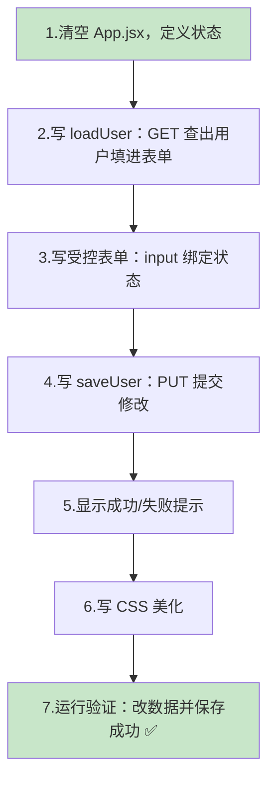
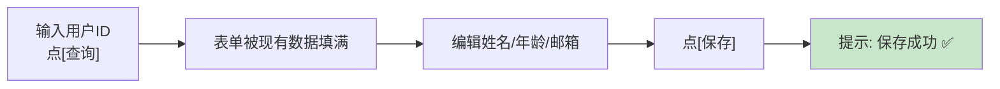
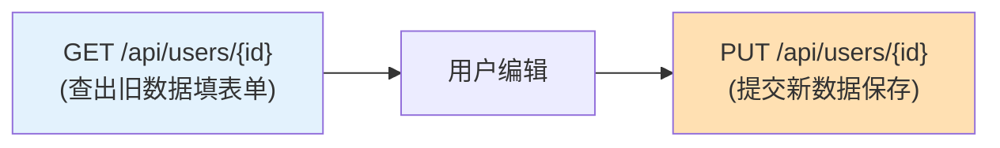
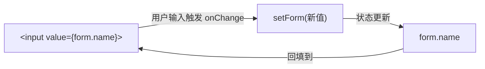
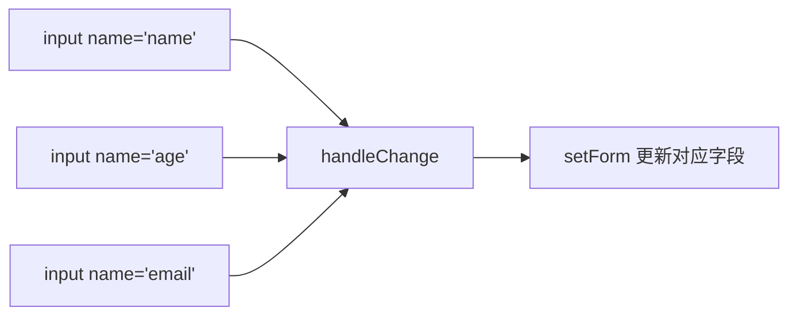
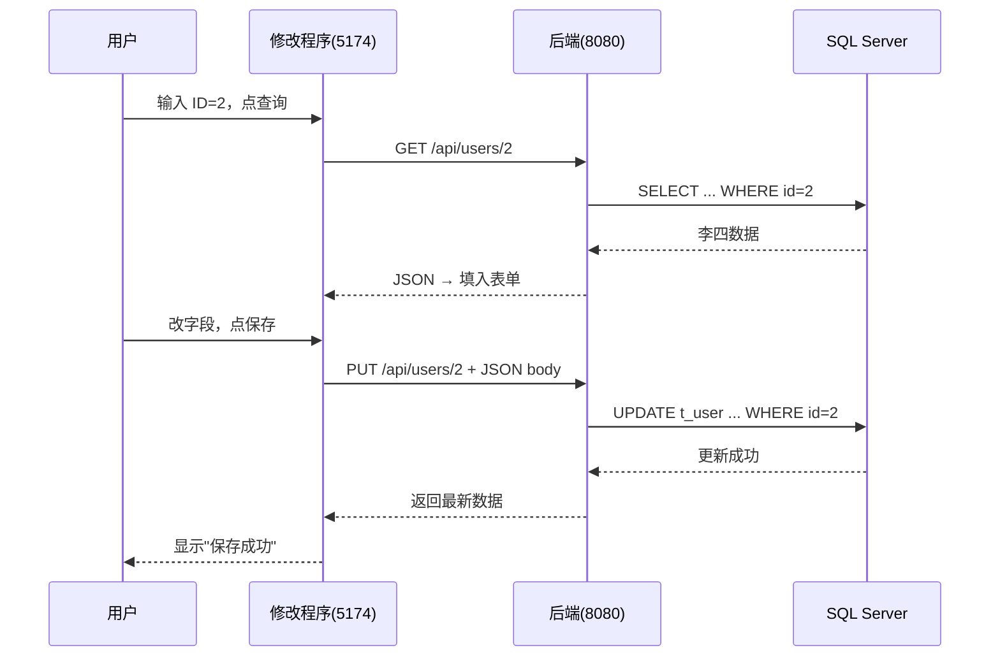

# 第 10 章 React 19 修改程序

> 本章目标：在第 8 章创建的 `user-edit-app` 工程里，写出**修改界面**——输入一个用户 ID，点「查询」把该用户的现有信息（通过 `GET /api/users/{id}`）填进表单；编辑姓名/年龄/邮箱后，点「保存」通过 `PUT /api/users/{id}` 把新数据写回数据库，并显示成功/失败提示。学完本章，你会理解 React 里最重要的交互模式：**受控表单**。

---

## 10.1 本章要做什么？（全景）



**最终交互流程预览：**



---

## 10.2 为什么是「先查，再改，后存」？

修改一条数据，符合直觉的流程是：**先看到它现在长什么样 → 在此基础上修改 → 提交保存**。所以修改程序需要用到后端的**两个接口**：



- **第 6 章**的 `GET /api/users/{id}`：查出要改的用户。
- **第 7 章**的 `PUT /api/users/{id}`：保存修改。

这也是修改程序和查询程序最大的不同：查询只「读」，修改要「读 + 写」，并且涉及**表单输入**。

---

## 10.3 关键概念：受控表单（Controlled Form）

这是本章的核心概念，务必理解。

在 React 里，输入框（`<input>`）的值**不由浏览器自己管，而是由 React 的状态管**。这叫「受控组件」：

- 输入框显示的值 = 某个状态变量的值（`value={form.name}`）。
- 用户每敲一个字，触发 `onChange`，我们在里面调 `setForm` 更新状态。
- 状态一变，输入框显示的值也跟着变。



> 💡 为什么要这么绕？因为这样 React 始终「知道」输入框里是什么，提交时直接拿状态就行，还能随时校验、联动。这是 React 表单的标准做法。

---

## 10.4 第一步：改标题并编写 App.jsx（完整代码）

先把 `user-edit-app/index.html` 的标题改为：

```html
<title>用户修改程序</title>
```

然后打开 `user-edit-app/src/App.jsx`，**删掉全部默认代码**，替换成下面的完整代码（注释很详细）：

```jsx
import { useState } from 'react'
import './App.css'

function App() {
  // ===== 状态定义 =====
  // 要修改的用户 ID（输入框里的值）
  const [userId, setUserId] = useState('')
  // 表单数据：姓名/年龄/邮箱
  const [form, setForm] = useState({ name: '', age: '', email: '' })
  // 是否已经查出用户（查出后才显示编辑表单）
  const [loaded, setLoaded] = useState(false)
  // 提示消息：{ type: 'success' | 'error', text: '...' }
  const [message, setMessage] = useState(null)

  // ===== 查询用户，把数据填进表单 =====
  const loadUser = async () => {
    setMessage(null)
    setLoaded(false)
    if (!userId) {
      setMessage({ type: 'error', text: '请先输入用户 ID' })
      return
    }
    try {
      const response = await fetch(`/api/users/${userId}`)
      if (!response.ok) {
        throw new Error('请求失败，状态码：' + response.status)
      }
      const data = await response.json()
      // 后端查不到时可能返回空，做个判断
      if (!data || data.id == null) {
        setMessage({ type: 'error', text: `找不到 ID 为 ${userId} 的用户` })
        return
      }
      // 用查到的数据填充表单（null 用空字符串兜底，避免受控组件报警告）
      setForm({
        name: data.name ?? '',
        age: data.age ?? '',
        email: data.email ?? '',
      })
      setLoaded(true)
    } catch (err) {
      setMessage({ type: 'error', text: err.message })
    }
  }

  // ===== 表单输入变化时更新状态（一个函数处理所有输入框）=====
  const handleChange = (e) => {
    const { name, value } = e.target
    setForm({ ...form, [name]: value })
  }

  // ===== 提交保存（PUT）=====
  const saveUser = async (e) => {
    e.preventDefault()   // 阻止表单默认提交（避免页面刷新）
    setMessage(null)
    try {
      const response = await fetch(`/api/users/${userId}`, {
        method: 'PUT',
        headers: { 'Content-Type': 'application/json' },
        body: JSON.stringify({
          name: form.name,
          // 年龄要转成数字；为空则传 null
          age: form.age === '' ? null : Number(form.age),
          email: form.email,
        }),
      })
      if (!response.ok) {
        throw new Error('保存失败，状态码：' + response.status)
      }
      const updated = await response.json()
      setMessage({
        type: 'success',
        text: `保存成功！最新数据：${updated.name} / ${updated.age} / ${updated.email}`,
      })
    } catch (err) {
      setMessage({ type: 'error', text: err.message })
    }
  }

  // ===== 渲染界面 =====
  return (
    <div className="container">
      <h1>用户修改（修改程序）</h1>

      {/* 第一步：输入 ID 查询 */}
      <div className="row">
        <label>用户 ID：</label>
        <input
          value={userId}
          onChange={(e) => setUserId(e.target.value)}
          placeholder="输入要修改的用户 ID，如 2"
        />
        <button className="btn" onClick={loadUser}>查询</button>
      </div>

      {/* 第二步：查到后显示编辑表单 */}
      {loaded && (
        <form className="edit-form" onSubmit={saveUser}>
          <div className="row">
            <label>姓名：</label>
            <input name="name" value={form.name} onChange={handleChange} />
          </div>
          <div className="row">
            <label>年龄：</label>
            <input name="age" type="number" value={form.age} onChange={handleChange} />
          </div>
          <div className="row">
            <label>邮箱：</label>
            <input name="email" value={form.email} onChange={handleChange} />
          </div>
          <button className="btn save-btn" type="submit">保存</button>
        </form>
      )}

      {/* 提示消息 */}
      {message && (
        <p className={message.type === 'error' ? 'error' : 'success'}>
          {message.text}
        </p>
      )}
    </div>
  )
}

export default App
```

---

## 10.5 逐段讲解 App.jsx

### ① 四个状态

| 状态 | 作用 |
| --- | --- |
| `userId` | 顶部输入框里的用户 ID |
| `form` | 编辑表单的数据（对象，含 name/age/email） |
| `loaded` | 是否已查出用户（控制编辑表单是否显示） |
| `message` | 操作结果提示（成功绿色 / 失败红色） |

### ② loadUser：查询并填表单

```jsx
const response = await fetch(`/api/users/${userId}`)
const data = await response.json()
setForm({ name: data.name ?? '', age: data.age ?? '', email: data.email ?? '' })
setLoaded(true)
```

- 用**模板字符串** `` `/api/users/${userId}` `` 把 ID 拼进 URL。
- `?? ''`（空值合并）：如果字段是 `null`，就用空字符串代替。**这一步很重要**——受控输入框的 `value` 不能是 `null`，否则 React 会警告。
- `setLoaded(true)`：查到后才显示下面的编辑表单。

### ③ handleChange：一个函数搞定所有输入框

```jsx
const handleChange = (e) => {
  const { name, value } = e.target
  setForm({ ...form, [name]: value })
}
```

- 每个 `<input>` 都有 `name` 属性（`"name"`/`"age"`/`"email"`），正好对应 `form` 对象的字段名。
- `{ ...form, [name]: value }`：先复制原来的 `form`（`...form`），再用**计算属性名** `[name]` 覆盖被修改的那个字段。
- 这样一个 `handleChange` 就能处理所有输入框，不用为每个框写一个函数。



### ④ saveUser：提交 PUT 请求

```jsx
const response = await fetch(`/api/users/${userId}`, {
  method: 'PUT',
  headers: { 'Content-Type': 'application/json' },
  body: JSON.stringify({ name, age, email }),
})
```

- `method: 'PUT'`：用 PUT 方法（对应第 7 章的更新接口）。
- `headers: { 'Content-Type': 'application/json' }`：**告诉后端「我发的是 JSON」**。缺了它后端可能不认（报 415）。
- `body: JSON.stringify({...})`：把 JavaScript 对象转成 JSON 字符串放进请求体。
- `age: form.age === '' ? null : Number(form.age)`：输入框拿到的都是字符串，年龄要转成数字再发给后端。
- `e.preventDefault()`：表单提交默认会刷新页面，必须阻止它，改由我们的 JS 处理。

### ⑤ 提示消息

```jsx
{message && (
  <p className={message.type === 'error' ? 'error' : 'success'}>{message.text}</p>
)}
```

根据 `message.type` 显示红色（错误）或绿色（成功）文字。

---

## 10.6 第二步：CSS 美化

打开 `user-edit-app/src/App.css`，清空并替换：

```css
.container {
  max-width: 560px;
  margin: 40px auto;
  padding: 0 16px;
  font-family: -apple-system, "Segoe UI", "Microsoft YaHei", sans-serif;
  color: #333;
}

h1 {
  font-size: 22px;
  margin-bottom: 20px;
}

.row {
  display: flex;
  align-items: center;
  margin-bottom: 14px;
}

.row label {
  width: 70px;
  flex-shrink: 0;
  text-align: right;
  margin-right: 10px;
  color: #555;
}

.row input {
  flex: 1;
  padding: 8px 10px;
  font-size: 14px;
  border: 1px solid #d9d9d9;
  border-radius: 6px;
}

.btn {
  padding: 8px 18px;
  font-size: 14px;
  color: #fff;
  background-color: #1677ff;
  border: none;
  border-radius: 6px;
  cursor: pointer;
  margin-left: 10px;
}

.edit-form {
  margin-top: 20px;
  padding: 20px;
  border: 1px solid #eee;
  border-radius: 8px;
  background: #fafafa;
}

.save-btn {
  background-color: #52c41a;
  margin-left: 80px;
}

.success {
  color: #389e0d;
  font-weight: 600;
}

.error {
  color: #d4380d;
  font-weight: 600;
}
```

---

## 10.7 第三步：运行验证（完整走一遍）

确保三件事都在跑：**SQL Server** → **后端 DemoApplication** → 在 `user-edit-app` 目录 `npm run dev`。

浏览器打开 <http://localhost:5174/>：

### ① 查询要修改的用户

在「用户 ID」框输入 `2`，点「查询」。下方出现编辑表单，已填入李四的现有信息。

> 🖼️ 【待补图 10-1】输入 ID 2 点查询后，表单填入「李四 / 22 / lisi@example.com」

### ② 修改并保存

把姓名改成「李四改」，年龄改成 `30`，邮箱改成 `lisi-new@example.com`，点「保存」。

页面显示绿色提示：`保存成功！最新数据：李四改 / 30 / lisi-new@example.com`

> 🖼️ 【待补图 10-2】修改字段后点保存，显示绿色"保存成功"提示

后端控制台会打印 PUT 对应的 `UPDATE` SQL（第 5 章开了 SQL 日志）。

### ③ 验证是否真的存进数据库

打开查询程序 <http://localhost:5173/> 点「刷新」，李四那行应变成新数据——**说明修改真的写进了数据库**，两个前端共享同一个后端和数据库。🎉

> 🖼️ 【待补图 10-3】切到查询程序刷新，李四的数据已更新为最新值

### 完整数据流



---

## 10.8 常见问题速查

| 问题现象 | 原因 | 解决办法 |
| --- | --- | --- |
| 点保存报 415 | 没设 Content-Type | 确认 headers 里有 `'Content-Type': 'application/json'` |
| 点保存报 400 | body 不是合法 JSON | 用 `JSON.stringify(...)` 包装请求体 |
| 保存后年龄变成异常值/报错 | age 传成了字符串 | 用 `Number(form.age)` 转数字 |
| 输入框报 warning: value is null | value 绑定了 null | 填充时用 `?? ''` 兜底（见 10.5） |
| 点查询无反应/报错 | 后端没开 / ID 不存在 | 启动后端；输入存在的 ID |
| 点保存整个页面刷新了 | 没阻止默认提交 | 在 saveUser 里加 `e.preventDefault()` |
| CORS 错误 | 没走代理 | fetch 用相对路径；确认 vite 代理已配（第 8 章） |

---

## 10.9 本章小结

- 掌握了 React 的**受控表单**：`value` 绑状态 + `onChange` 调 `setXxx`。
- 学会用一个 `handleChange` + 计算属性名 `[name]` 统一处理多个输入框。
- 用 `fetch` 发 **PUT** 请求：设 `method`、`headers`、`body`（`JSON.stringify`），并 `e.preventDefault()` 阻止默认提交。
- 完成了「先查 → 编辑 → 保存」的完整修改流程，并验证数据确实写回了数据库。
- 见证了**两个独立前端共享一个后端**：在修改程序改的数据，查询程序刷新就能看到。

✅ 两个前端都完成了！下一章我们把三个服务放在一起做**完整联调**，并深入讲解**跨域（CORS）**——理解为什么开发用代理能免跨域，以及生产环境该怎么配。

> 💡 **选读加餐**：第 9、10 章我们手写了前端界面。如果你想知道「实战里怎么用组件库和脚手架又快又美地开发前端」，可以看 **[附录 B：用组件库与脚手架加速前端开发](10A-附录B-组件库与脚手架加速前端.md)**（可选，不影响后续学习）。

👈 上一章：**[第 9 章 React 19 查询程序](09-React19查询程序.md)** ｜ 📎 选读：**[附录 B 组件库与脚手架](10A-附录B-组件库与脚手架加速前端.md)** ｜ 👉 下一章：**[第 11 章 前后端联调与跨域](11-前后端联调与测试.md)**
