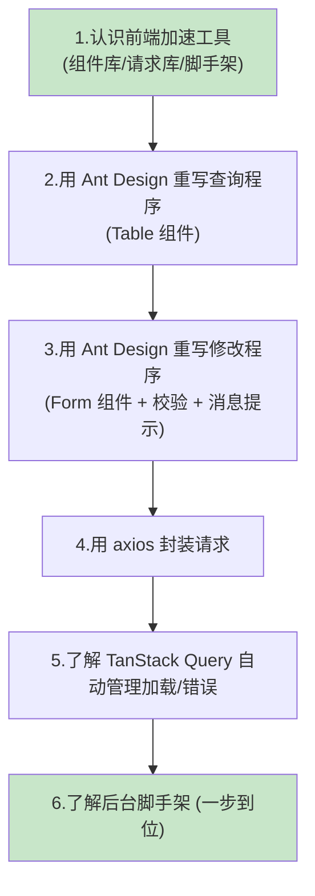
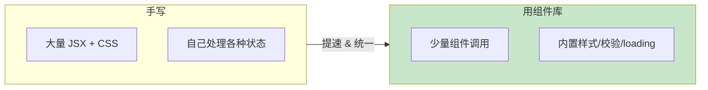
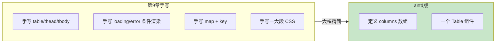
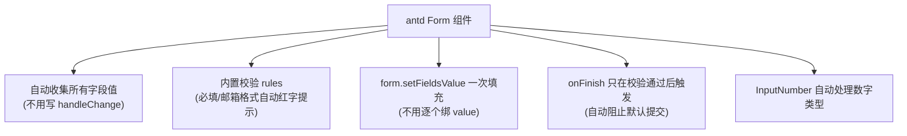
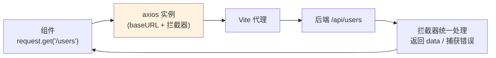
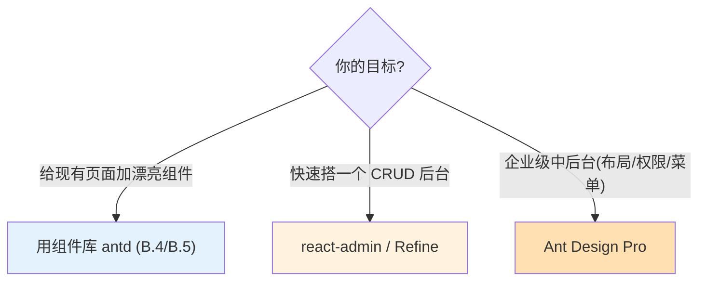

# 附录 B 用组件库与脚手架加速前端开发

> 本附录目标：教你用 **UI 组件库（Ant Design）** 和 **请求库（axios）** 等工具，把第 9、10 章手写的「查询程序」和「修改程序」**用更少的代码、更专业的界面**重写一遍；并了解能「一步到位」搭出整个后台系统的**脚手架**。
>
> ⚠️ **阅读顺序说明**：本附录是**可选**加餐，放在第 10 章之后阅读最合适。**建议你先按第 8~10 章手写一遍**，理解 React 的状态、请求、受控表单等原理；理解之后再看本附录，学会「实战里怎么用现成轮子提速」。跳过本附录**完全不影响**第 11、12 章。

---

## B.1 本附录要做什么？（全景）



---

## B.2 为什么要用组件库和脚手架？（手写 UI 的痛点）

第 9、10 章我们**从零手写**了表格、表单、加载/错误提示、还写了不少 CSS。这在学习阶段很好，但真实项目里问题很明显：

| 痛点（手写） | 组件库如何解决 |
| --- | --- |
| 表格要自己写 `<table>`、分页、排序、加载动画 | 一个 `<Table>` 组件全搞定，内置分页/排序/loading |
| 表单要自己写受控 `value`/`onChange`、校验、错误提示 | `<Form>` 自动收集数据、内置校验规则和错误显示 |
| 提示要自己写红绿文字 | 一行 `message.success()` 弹出统一风格的提示 |
| 样式要自己一点点调 CSS | 组件自带精美且统一的默认样式 |
| 请求要重复写 `fetch` + 判断 + JSON 解析 | axios 封装一次，处处简洁调用 |



> 💡 一句话：**手写是为了「懂原理」，组件库是为了「快且美」。** 先会手写，再用组件库提速。

---

## B.3 有哪些前端加速工具？

前端加速工具分三大类，按需选用：

### ① UI 组件库（最常用）

| 组件库 | 特点 | 适合 |
| --- | --- | --- |
| **Ant Design (antd)** | 中后台首选，组件最全，中文文档好 | ⭐ 管理系统、表格表单密集的应用 |
| **Material UI (MUI)** | 谷歌 Material 风格，国际化流行 | 偏 C 端、Material 风格产品 |
| **shadcn/ui** | 基于 Tailwind，可复制源码、极灵活 | 追求高度定制、现代风 |
| **Arco Design / Semi Design** | 字节跳动出品，风格现代 | 国内团队备选 |

> 本附录用 **Ant Design**，因为它的 `Table`/`Form` 组件和我们「查询表格 + 编辑表单」的需求完美契合。

### ② 数据请求库

| 库 | 作用 |
| --- | --- |
| **axios** | 更好用的 HTTP 请求库，替代原生 `fetch`，支持拦截器、统一配置 |
| **TanStack Query（React Query）/ SWR** | 自动管理请求的加载/错误/缓存/重试，少写大量状态代码 |

### ③ 脚手架 / 后台模板（一步到位）

| 脚手架 | 说明 |
| --- | --- |
| **Ant Design Pro** | 蚂蚁出品的中后台前端解决方案，自带布局、菜单、登录、权限 |
| **react-admin** | 声明式后台框架，配置数据源即自动生成 CRUD 页面 |
| **Refine** | 可对接 REST/GraphQL，快速搭 CRUD 后台 |

---

## B.4 实战一：用 Ant Design 重写「查询程序」

我们在 `user-query-app` 里用 antd 的 `Table` 组件重写查询界面，你会看到代码和 CSS 都大幅减少。

### 步骤 1：安装 Ant Design

在 `user-query-app` 目录执行：

```bash
npm install antd
```

> ⚠️ **React 19 兼容性（重要）**：
> - 本教程使用 **antd v6**（`npm install antd` 默认装最新版），它**原生支持 React 19**，无需任何补丁。
> - 如果你的项目锁定的是 **antd v5**，用 React 19 时需要额外装并引入补丁包：
>   ```bash
>   npm install antd@5 @ant-design/v5-patch-for-react-19
>   ```
>   然后在 `main.jsx` **最顶部**加一行：`import '@ant-design/v5-patch-for-react-19';`
> 具体以 [Ant Design 官方 React 19 兼容说明](https://ant.design/docs/react/v5-for-19) 为准。

### 步骤 2：配置 antd 的全局 Provider

打开 `user-query-app/src/main.jsx`，用 antd 的 `ConfigProvider`（配置中文语言）和 `App`（提供消息上下文）包裹根组件：

```jsx
import { StrictMode } from 'react'
import { createRoot } from 'react-dom/client'
import { ConfigProvider, App as AntdApp } from 'antd'
import zhCN from 'antd/locale/zh_CN'
import App from './App.jsx'

createRoot(document.getElementById('root')).render(
  <StrictMode>
    {/* ConfigProvider：全局配置，这里设为中文 */}
    <ConfigProvider locale={zhCN}>
      {/* AntdApp：为 message/notification 等提供上下文 */}
      <AntdApp>
        <App />
      </AntdApp>
    </ConfigProvider>
  </StrictMode>,
)
```

> 💡 `App as AntdApp`：因为我们自己的根组件也叫 `App`，为避免重名，把 antd 的 `App` 组件重命名成 `AntdApp` 导入。

### 步骤 3：用 Table 组件重写 App.jsx

把 `user-query-app/src/App.jsx` 替换成：

```jsx
import { useState, useEffect } from 'react'
import { Table, Button, Typography } from 'antd'

const { Title } = Typography

// 定义表格的列：dataIndex 对应数据字段名
const columns = [
  { title: 'ID', dataIndex: 'id', key: 'id', width: 80 },
  { title: '姓名', dataIndex: 'name', key: 'name' },
  { title: '年龄', dataIndex: 'age', key: 'age', width: 100 },
  { title: '邮箱', dataIndex: 'email', key: 'email' },
]

function App() {
  const [users, setUsers] = useState([])
  const [loading, setLoading] = useState(false)

  const loadUsers = async () => {
    setLoading(true)
    try {
      const res = await fetch('/api/users')
      const data = await res.json()
      setUsers(data)
    } finally {
      setLoading(false)
    }
  }

  useEffect(() => {
    loadUsers()
  }, [])

  return (
    <div style={{ maxWidth: 760, margin: '40px auto', padding: '0 16px' }}>
      <Title level={3}>用户列表（查询程序 · Ant Design 版）</Title>

      <Button type="primary" onClick={loadUsers} style={{ marginBottom: 16 }}>
        刷新
      </Button>

      {/* 一个 Table 组件搞定：表头、行、加载动画都内置 */}
      <Table
        rowKey="id"            // 用 id 作为每行的唯一 key（替代手写的 key）
        columns={columns}      // 列定义
        dataSource={users}     // 数据源
        loading={loading}      // 加载中自动显示转圈动画
        pagination={false}     // 数据少，先关掉分页；数据多时设为 true 即自动分页
      />
    </div>
  )
}

export default App
```

### 对比：省了多少事？



- **加载动画**：`loading` 属性自动显示转圈，不用手写「正在加载...」。
- **唯一 key**：`rowKey="id"` 替代手写的 `key={user.id}`。
- **分页/排序**：把 `pagination` 设为 `true`，或给列加 `sorter`，即自动获得分页和排序能力。
- **样式**：几乎不用写 CSS，表格自带精美样式。

> 🖼️ 【待补图 B-1】antd 版查询程序：带斑马纹/悬浮效果的专业表格，右上角刷新按钮，加载时显示转圈动画

---

## B.5 实战二：用 Ant Design 重写「修改程序」

antd 的 `Form` 组件是它最强大的部分之一——**自动收集表单数据、内置校验、自动显示错误提示**，比第 10 章的手写受控表单省太多代码。

### 步骤 1：在 user-edit-app 安装并配置

在 `user-edit-app` 目录 `npm install antd`，并同样修改 `main.jsx`（同 B.4 步骤 2）。

### 步骤 2：用 Form 组件重写 App.jsx

把 `user-edit-app/src/App.jsx` 替换成：

```jsx
import { useState } from 'react'
import { Form, Input, InputNumber, Button, Typography, Space, App } from 'antd'

const { Title } = Typography

function EditApp() {
  // 从 antd App 上下文拿到 message（这样弹出的提示能正确应用主题/语言）
  const { message } = App.useApp()
  // Form 实例，用来手动给表单填值、校验等
  const [form] = Form.useForm()
  const [userId, setUserId] = useState('')
  const [loaded, setLoaded] = useState(false)

  // 查询用户并把数据填进表单
  const loadUser = async () => {
    if (!userId) {
      message.warning('请先输入用户 ID')
      return
    }
    try {
      const res = await fetch(`/api/users/${userId}`)
      const data = await res.json()
      if (!data || data.id == null) {
        message.error(`找不到 ID 为 ${userId} 的用户`)
        setLoaded(false)
        return
      }
      // 一行代码把数据填进表单（替代手写的 setForm + 每个字段 value 绑定）
      form.setFieldsValue({ name: data.name, age: data.age, email: data.email })
      setLoaded(true)
    } catch (err) {
      message.error('查询失败：' + err.message)
    }
  }

  // 点击保存、且校验通过后，antd 自动把表单数据作为 values 传进来
  const onFinish = async (values) => {
    try {
      const res = await fetch(`/api/users/${userId}`, {
        method: 'PUT',
        headers: { 'Content-Type': 'application/json' },
        body: JSON.stringify(values),   // values 已是 { name, age, email } 对象
      })
      if (!res.ok) throw new Error('状态码 ' + res.status)
      const updated = await res.json()
      message.success(`保存成功：${updated.name} / ${updated.age} / ${updated.email}`)
    } catch (err) {
      message.error('保存失败：' + err.message)
    }
  }

  return (
    <div style={{ maxWidth: 520, margin: '40px auto', padding: '0 16px' }}>
      <Title level={3}>用户修改（修改程序 · Ant Design 版）</Title>

      <Space style={{ marginBottom: 20 }}>
        <Input
          placeholder="输入要修改的用户 ID"
          value={userId}
          onChange={(e) => setUserId(e.target.value)}
          style={{ width: 220 }}
        />
        <Button type="primary" onClick={loadUser}>查询</Button>
      </Space>

      {loaded && (
        <Form form={form} layout="vertical" onFinish={onFinish}>
          {/* name 属性对应字段名；rules 是校验规则，出错会自动红字提示 */}
          <Form.Item label="姓名" name="name" rules={[{ required: true, message: '请输入姓名' }]}>
            <Input />
          </Form.Item>

          <Form.Item label="年龄" name="age">
            {/* InputNumber 自动把值当数字处理，无需手动 Number() 转换 */}
            <InputNumber style={{ width: '100%' }} min={0} max={200} />
          </Form.Item>

          <Form.Item label="邮箱" name="email" rules={[{ type: 'email', message: '邮箱格式不正确' }]}>
            <Input />
          </Form.Item>

          <Button type="primary" htmlType="submit">保存</Button>
        </Form>
      )}
    </div>
  )
}

export default EditApp
```

### Form 组件帮我们省掉了什么？



对比第 10 章的手写版：

| 手写版（第 10 章） | antd Form 版 |
| --- | --- |
| 自己写 `form` 状态 + `handleChange` | `Form` 自动收集，`onFinish(values)` 直接给你对象 |
| 自己 `?? ''` 兜底、逐个绑 `value` | `form.setFieldsValue({...})` 一次搞定 |
| 自己写 `Number(form.age)` 转数字 | `InputNumber` 自动是数字 |
| 自己 `e.preventDefault()` | `onFinish` 只在校验通过后触发，无需手动阻止 |
| 没有校验 | `rules` 内置必填、邮箱格式等校验 |
| 自己写红绿提示文字 | `message.success/error` 弹出统一提示 |

> 🖼️ 【待补图 B-2】antd 版修改程序：竖向表单、必填项校验红字、保存后右上角弹出绿色「保存成功」提示

---

## B.6 实战三：用 axios 封装请求

原生 `fetch` 每次都要判断 `res.ok`、手动 `res.json()`、PUT 时手写 header。用 **axios** 封装一次，之后调用非常简洁。

### 步骤 1：安装

```bash
npm install axios
```

### 步骤 2：新建 src/api.js 封装

```js
import axios from 'axios'

// 创建一个 axios 实例，统一配置
const request = axios.create({
  baseURL: '/api',   // 基础路径，之后写 '/users' 即请求 '/api/users'
  timeout: 8000,     // 超时时间（毫秒）
})

// 响应拦截器：统一在这里处理返回和错误
request.interceptors.response.use(
  (response) => response.data,   // 直接返回后端的数据体（省去每次 res.json()）
  (error) => {
    console.error('请求出错：', error)
    return Promise.reject(error) // 把错误继续抛出，交给调用处处理
  }
)

export default request
```

### 步骤 3：在组件里使用

```js
import request from './api'

// 查询全部：GET /api/users
const users = await request.get('/users')

// 按 id 查询：GET /api/users/2
const user = await request.get(`/users/${id}`)

// 更新：PUT /api/users/2（axios 自动设置 JSON 请求头、自动序列化）
const updated = await request.put(`/users/${id}`, { name, age, email })
```

**axios 相比 fetch 的好处：**

- 自动把返回解析成 JSON（拦截器里 `response.data`）。
- PUT/POST 自动设置 `Content-Type: application/json` 并序列化对象，不用手写 `JSON.stringify` 和 header。
- 拦截器可统一处理错误、加 token、显示全局 loading 等。



---

## B.7 （选讲）用 TanStack Query 自动管理加载/错误/缓存

第 9 章我们手写了 `loading`、`error` 状态。**TanStack Query**（旧名 React Query）能把这些**自动化**：它帮你管理请求的加载中、错误、缓存、自动重试、窗口聚焦重新请求等。

安装：

```bash
npm install @tanstack/react-query
```

用法示意（查询用户列表）：

```jsx
import { useQuery } from '@tanstack/react-query'
import request from './api'

function UserList() {
  // 一行搞定：isLoading / error / data / 重新请求 都由它管理
  const { data: users = [], isLoading, isError, refetch } = useQuery({
    queryKey: ['users'],                 // 缓存的键
    queryFn: () => request.get('/users') // 怎么获取数据
  })

  if (isLoading) return <p>加载中...</p>
  if (isError) return <p>出错了</p>

  return (
    <>
      <button onClick={() => refetch()}>刷新</button>
      {/* 用 users 渲染表格... */}
    </>
  )
}
```

> 💡 你不再需要手写 `useState` + `useEffect` + `try/catch/finally` 那一整套，`useQuery` 一次全包。数据多、请求多的项目里，它能显著减少样板代码。（需在应用外层包一个 `QueryClientProvider`，详见其官方文档。）

---

## B.8 更进一步：用脚手架一步搭出后台

如果你要做的是**完整的后台管理系统**（带登录、菜单、多页面、权限），可以直接用现成脚手架，省去从零搭建：



| 脚手架 | 一句话 | 适合 |
| --- | --- | --- |
| **Ant Design Pro** | 开箱即用的企业级中后台模板，自带布局、菜单、登录、权限、mock | 正式管理系统 |
| **react-admin** | 声明式：配置好数据源和资源，自动生成列表/详情/编辑页 | 快速 CRUD 后台 |
| **Refine** | 对接 REST/GraphQL，内置 CRUD、认证、路由 | 中后台快速开发 |

> ⚠️ 脚手架功能强大但也更「重」，需要一定基础才能驾驭。**学习阶段建议从组件库（antd）起步**，等熟悉后再上脚手架。

---

## B.9 注意事项

1. **React 19 兼容**：用 **antd v6** 最省心（原生支持 React 19）；若用 antd v5，务必按 B.4 装并引入 `@ant-design/v5-patch-for-react-19` 补丁，否则 `message`、`Modal` 等静态方法在 React 19 下可能异常。
2. **message 要能拿到上下文**：推荐用 `App.useApp()` 拿 `message`（如 B.5），而不是直接 `import { message } from 'antd'` 静态调用，这样提示才能正确应用主题和中文语言。
3. **代理不变**：antd 版仍然用第 8 章配好的 Vite 代理，`fetch`/axios 依旧请求相对路径 `/api/...`，无需改动跨域配置。
4. **按需引入无需手动配置**：antd v5/v6 默认已是按需加载样式，直接 `import { Table } from 'antd'` 即可，不用额外配插件。

---

## B.10 常见问题速查

| 问题现象 | 原因 | 解决办法 |
| --- | --- | --- |
| 控制台警告 `static function can not consume context` | 直接用了静态 `message` | 改用 `App.useApp()` 获取 `message`（B.5） |
| React 19 下 message/Modal 不显示或报错 | antd v5 未装补丁 | 升级到 v6，或装并引入 v5 补丁包（B.9） |
| 表格不显示数据 | 没设 `rowKey` 或 dataSource 为空 | 设 `rowKey="id"`；确认后端返回了数据 |
| 表单校验不触发 | 用了普通 button | 提交按钮设 `htmlType="submit"`，并写在 `<Form>` 内 |
| 年龄提交成字符串 | 用了普通 Input | 用 `<InputNumber>` |
| 界面是英文（如分页文案） | 没配语言 | 用 `ConfigProvider locale={zhCN}`（B.4） |
| 样式没生效/丑 | antd 版本过旧或引入错误 | 确认 `npm install antd` 成功、正确 `import` |

---

## B.11 本附录小结

- **组件库（Ant Design）** 能用 `Table`、`Form` 等现成组件，大幅减少查询表格和编辑表单的代码与 CSS，界面还更专业。
- **Form 组件**自动收集数据、内置校验、自动提示，替代了手写受控表单的一整套逻辑。
- **axios** 封装请求，比原生 `fetch` 更简洁；**TanStack Query** 能自动管理加载/错误/缓存。
- **脚手架**（Ant Design Pro / react-admin / Refine）可一步搭出完整后台，适合正式项目。
- **React 19 用 antd v6 最省心**；用 v5 需引入兼容补丁。
- **学习顺序建议**：先手写（第 8~10 章）懂原理，再用组件库和脚手架提速——和后端附录 A 是一样的道理。

👈 上一章：**[第 10 章 React 19 修改程序](10-React19修改程序.md)** ｜ 👉 下一章：**[第 11 章 前后端联调与跨域](11-前后端联调与测试.md)** ｜ 🏠 [返回目录](README.md)
