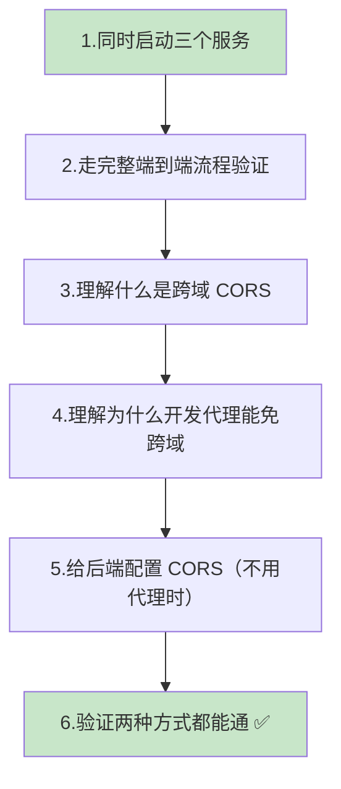
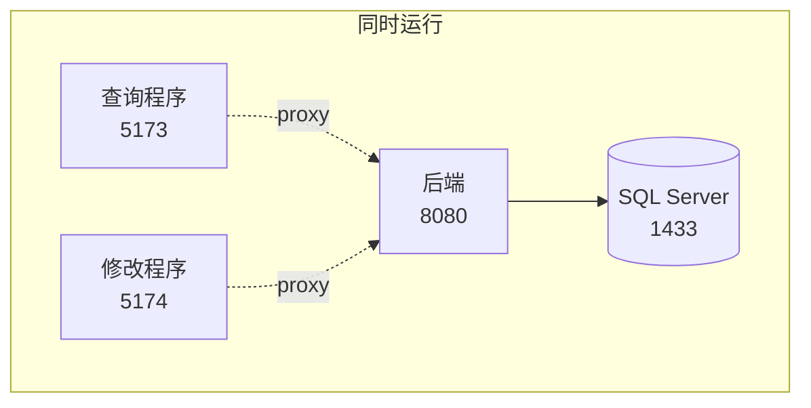
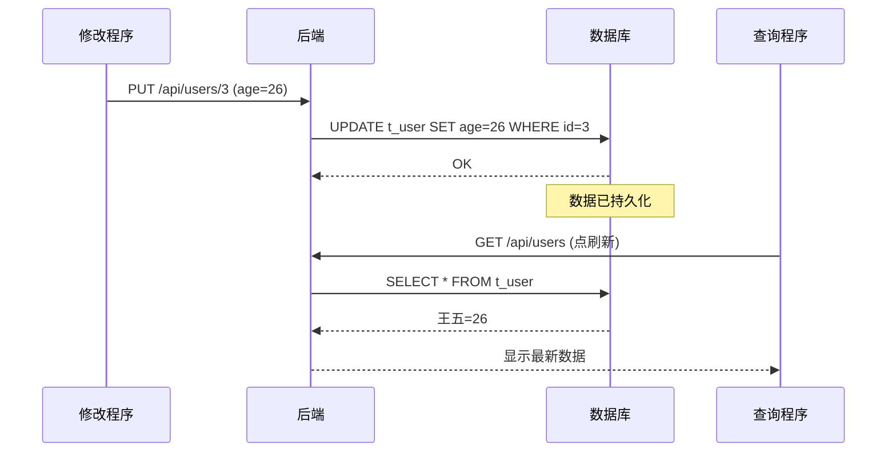
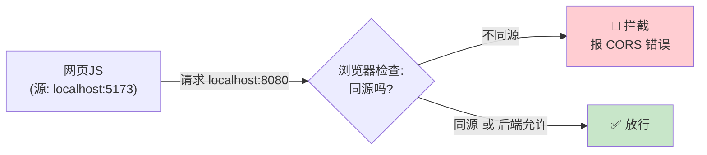
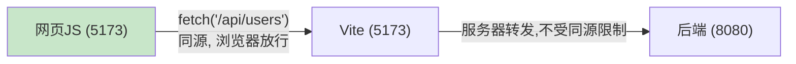
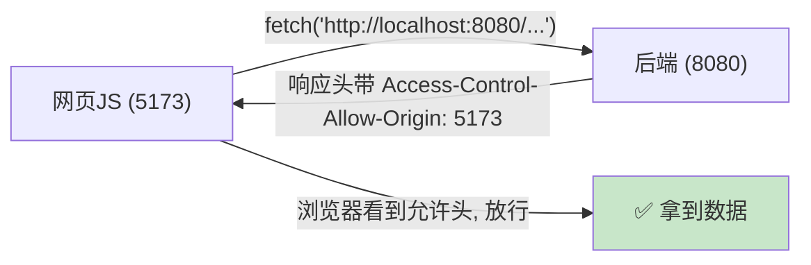
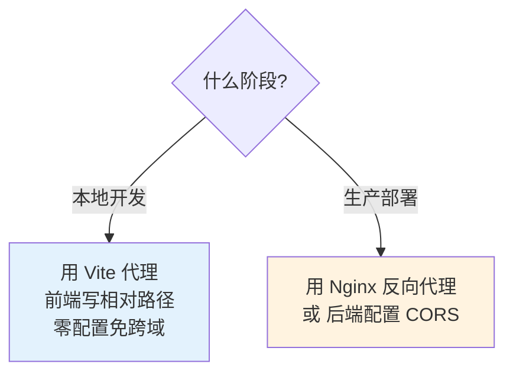
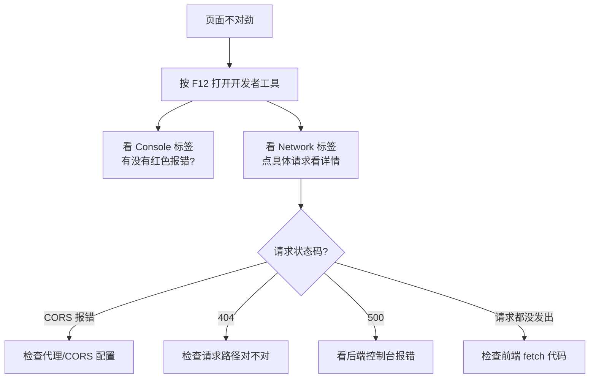

# 第 11 章 前后端联调与跨域（CORS）

> 本章目标：把**三个服务**（后端 + 两个前端）一起跑起来，走一遍完整的端到端流程；然后深入讲清楚困扰所有初学者的**跨域（CORS）**问题——为什么开发时用了代理就不会跨域，以及如果**不用代理**（比如生产环境），后端该如何配置 CORS 才能让前端正常访问。

---

## 11.1 本章要做什么？（全景）



---

## 11.2 第一步：同时启动三个服务

联调的前提是三个服务全部在线。按顺序启动：

| 顺序 | 服务 | 怎么启动 | 地址 |
| --- | --- | --- | --- |
| 1 | SQL Server | 确认服务在运行（第 3 章） | localhost:1433 |
| 2 | 后端 | IDEA 运行 `DemoApplication` | http://localhost:8080 |
| 3 | 查询程序 | `user-query-app` 目录 `npm run dev` | http://localhost:5173 |
| 4 | 修改程序 | `user-edit-app` 目录 `npm run dev` | http://localhost:5174 |

> 💡 **小技巧**：三个终端窗口分别开着，或用 VS Code 的多终端标签。后端建议放 IDEA 里跑，方便看 SQL 日志。



---

## 11.3 第二步：完整端到端流程验证

我们来验证「改一处，处处一致」——数据从数据库到两个前端是打通的。

**验证剧本：**

1. 打开查询程序 <http://localhost:5173/>，看到 3 个用户，记住王五（id=3）现在是 25 岁。
2. 打开修改程序 <http://localhost:5174/>，输入 ID `3` 点「查询」，把王五年龄改成 `26`，点「保存」，看到绿色成功提示。
3. 回到查询程序点「刷新」——王五变成 26 岁。
4. （可选）去 SSMS 执行 `SELECT * FROM t_user WHERE id=3;`，确认数据库里也是 26。

四处（数据库、后端、查询程序、修改程序）数据一致，说明**整条链路完全打通**。🎉



> 🖼️ 【待补图 11-1】左右并排两个浏览器窗口：修改程序保存后，查询程序刷新显示更新后的数据

---

## 11.4 第三步：搞懂「跨域 CORS」到底是什么

前面开发一直很顺，是因为第 8 章配了代理。但你迟早会遇到 CORS，必须理解它。

### 什么是「源（Origin）」？

一个「源」由 **协议 + 域名 + 端口** 三部分组成，**只要有一个不同，就是不同的源**：

| 地址 | 源是否相同 |
| --- | --- |
| `http://localhost:5173` 和 `http://localhost:8080` | ❌ 不同（端口不同） |
| `http://localhost:5173` 和 `http://localhost:5173` | ✅ 相同 |
| `http://a.com` 和 `https://a.com` | ❌ 不同（协议不同） |

### 什么是跨域？为什么被拦？

浏览器有个安全机制叫**「同源策略」**：一个网页里的 JS，默认**只能请求和它同源的地址**。如果去请求**不同源**的地址（比如前端 5173 直接请求后端 8080），浏览器就会拦截，这就是**跨域（CORS）问题**。



典型的 CORS 报错长这样（浏览器控制台 F12）：

```text
Access to fetch at 'http://localhost:8080/api/users' from origin
'http://localhost:5173' has been blocked by CORS policy:
No 'Access-Control-Allow-Origin' header is present on the requested resource.
```

> 💡 这个安全机制是**浏览器**强加的（保护用户）。用 Postman 或后端之间互相调用**不受**同源策略限制——所以第 6、7 章用 Postman 测接口从来没遇到跨域。

---

## 11.5 第四步：为什么开发代理能「免跨域」？

回顾第 8 章的方案：前端 fetch 用**相对路径** `/api/users`，请求先发给 Vite 自己（5173），Vite 再转发给后端（8080）。

**关键点**：在浏览器眼里，请求的目标是 `localhost:5173`（和网页同源！），根本没跨域。跨越端口的转发是 Vite 在**服务器端**做的，服务器之间通信不受同源策略约束。



所以**开发阶段用代理是最省事的方案**，前端后端都不用改 CORS。这也是为什么前面几章一路顺畅。

---

## 11.6 第五步：不用代理时，后端如何配置 CORS？

那什么时候会真正遇到跨域？——当前端**直接请求后端的绝对地址**时。比如：

- 你把 fetch 改成绝对地址 `fetch('http://localhost:8080/api/users')`；
- 或者**生产环境**里前端和后端部署在不同域名/端口，且没有用 Nginx 之类做反向代理。

这时就需要**后端主动声明「我允许某些源来访问我」**，即配置 CORS。

### 编写全局 CORS 配置

在后端 `com.example.demo` 下新建 `config` 包，新建 `CorsConfig` 类：

```java
package com.example.demo.config;

import org.springframework.context.annotation.Configuration;
import org.springframework.web.servlet.config.annotation.CorsRegistry;
import org.springframework.web.servlet.config.annotation.WebMvcConfigurer;

@Configuration   // 声明这是一个配置类
public class CorsConfig implements WebMvcConfigurer {

    @Override
    public void addCorsMappings(CorsRegistry registry) {
        registry.addMapping("/api/**")   // 对所有 /api 开头的接口生效
                // 允许这两个前端的源来访问（查询程序 5173、修改程序 5174）
                .allowedOrigins("http://localhost:5173", "http://localhost:5174")
                // 允许的 HTTP 方法
                .allowedMethods("GET", "POST", "PUT", "DELETE", "OPTIONS")
                // 允许携带任意请求头
                .allowedHeaders("*")
                // 是否允许携带 Cookie 等凭证（本教程用不到，设 false）
                .allowCredentials(false);
    }
}
```

**逐行解释：**

- `implements WebMvcConfigurer` + `addCorsMappings`：Spring MVC 提供的全局 CORS 配置入口。
- `addMapping("/api/**")`：对所有 `/api/**` 接口开启 CORS。
- `allowedOrigins(...)`：**白名单**，列出允许访问的前端源。我们把两个前端都加进去。
- `allowedMethods(...)`：允许的请求方法。注意要包含 `OPTIONS`——浏览器发 PUT 等请求前会先发一个 `OPTIONS` 预检请求。
- `allowedHeaders("*")`：允许任意请求头（比如我们 PUT 时带的 `Content-Type`）。

> ⚠️ **安全提醒**：`allowedOrigins` 生产环境要填**具体的前端域名**，不要图省事用 `*`（尤其在 `allowCredentials(true)` 时用 `*` 会直接报错且不安全）。

### 配好 CORS 后，前端可以直连后端

有了这个配置，即使前端不走代理、直接写绝对地址，也能访问成功：

```jsx
// 这样直连后端也不会被拦了（因为后端已声明允许 5173/5174）
const response = await fetch('http://localhost:8080/api/users')
```



---

## 11.7 两种方案怎么选？（代理 vs CORS）



| 方案 | 适用 | 优点 | 说明 |
| --- | --- | --- | --- |
| **Vite 代理** | 本地开发 | 零跨域配置、简单 | 只在开发服务器有效，打包后不存在 |
| **后端 CORS** | 生产 / 前端直连 | 灵活、前端可独立部署 | 要维护允许的源白名单 |
| **Nginx 反向代理** | 生产 | 前后端同源、性能好 | 需要会配 Nginx（第 12 章简介） |

> 💡 **本教程建议**：开发继续用第 8 章的代理即可；`CorsConfig` 加上作为「知识储备」和生产准备。两者**可以共存**，互不冲突。

---

## 11.8 联调排错通用方法（F12 是你最好的朋友）

联调出问题时，按这个顺序排查，能定位 90% 的问题：



| 在 Network 看到 | 含义 | 去哪查 |
| --- | --- | --- |
| 状态 200 | 成功 | 正常 |
| 状态 404 | 路径错/接口不存在 | 前端 URL、后端 `@RequestMapping` |
| 状态 500 | 后端内部错误 | **后端控制台**（多半是数据库问题） |
| 状态 (failed) + CORS | 跨域被拦 | 代理配置 / 后端 CorsConfig |
| 状态 415 | 没设 Content-Type | 前端 PUT 的 headers |

> 💡 **关键心法**：分清是**前端**还是**后端**的问题。看到 500，先去看后端控制台日志；看到 CORS/404，多半是前端请求配置或路径问题。这就是第 6、7 章坚持「先用 Postman 单独测通后端」的价值——出问题时能快速排除后端嫌疑。

---

## 11.9 常见问题速查

| 问题现象 | 原因 | 解决办法 |
| --- | --- | --- |
| 控制台大量 CORS 报错 | 前端直连后端且后端没配 CORS | 用代理（第 8 章）或加 `CorsConfig`（11.6） |
| PUT 报 CORS，GET 却正常 | 缺少对 OPTIONS 预检的支持 | `allowedMethods` 里加上 `OPTIONS` |
| 配了 CORS 还是报错 | 源写错（端口/协议不符） | `allowedOrigins` 精确匹配前端地址 |
| 一个前端能用一个不能用 | 白名单漏了某个源 | 两个源 5173、5174 都要加 |
| 改了后端 CORS 不生效 | 后端没重启 | 重新运行 DemoApplication |
| 数据改了前端不更新 | 前端没重新请求 | 点刷新 / 重新查询 |

---

## 11.10 本章小结

- 学会**同时运行三个服务**并完成端到端联调，验证了数据从修改程序 → 后端 → 数据库 → 查询程序的完整一致性。
- 理解了**跨域（CORS）**：源 = 协议+域名+端口，浏览器同源策略会拦截跨源请求。
- 明白了**开发代理免跨域**的原理：浏览器看到的是同源请求，转发在服务器端完成。
- 学会了给后端配置**全局 CORS**（`WebMvcConfigurer`），供不用代理或生产环境使用。
- 掌握了用 **F12 的 Console / Network** 分层排错的通用方法。

✅ 联调完成，功能全部跑通！最后一章我们讲**打包部署**（把后端打成 jar、前端打成静态文件）和一份**全书 FAQ 汇总**，并给出进阶学习方向。

👈 上一章：**[第 10 章 React 19 修改程序](10-React19修改程序.md)** ｜ 👉 下一章：**[第 12 章 常见问题 FAQ 与部署](12-常见问题FAQ与部署.md)**
