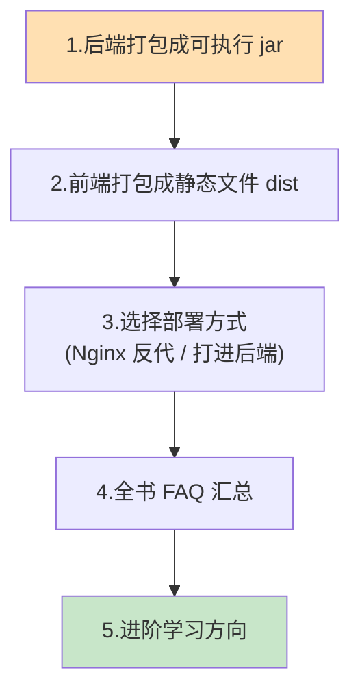
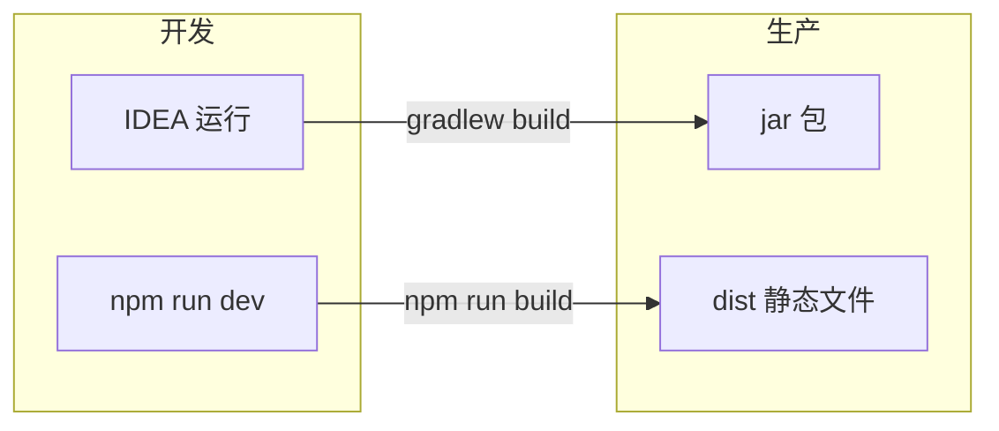
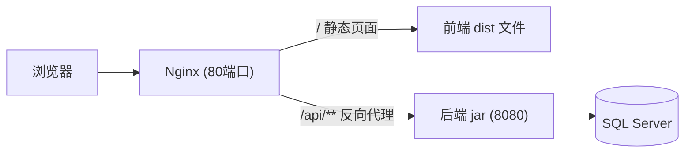
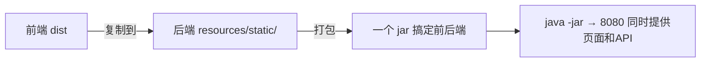
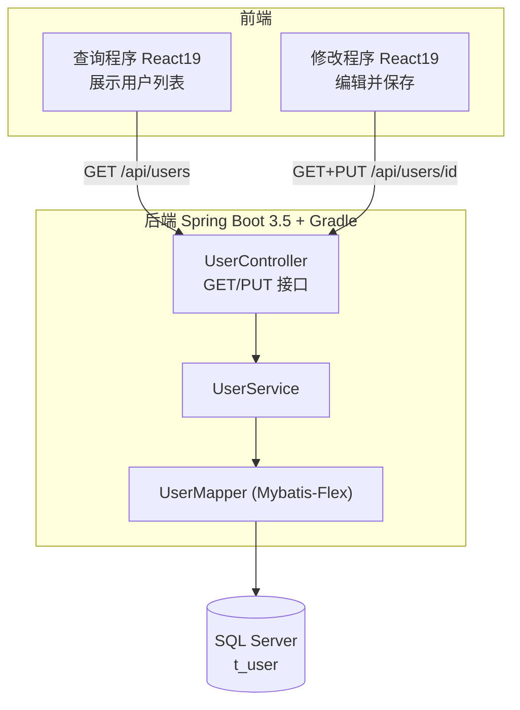
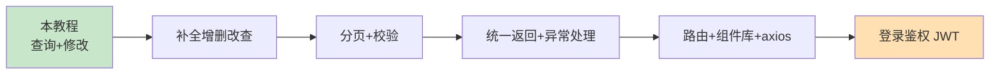

# 第 12 章 常见问题 FAQ 与打包部署

> 本章目标：这是全书最后一章。我们做三件事：① 把**后端打成 jar、前端打成静态文件**，理解怎么从「开发」走向「上线」；② 介绍两种主流的**部署方式**；③ 汇总一份**全书 FAQ**，并给出**进阶学习方向**。

---

## 12.1 本章要做什么？（全景）



> 💡 **说明**：部署是进阶内容，涉及服务器环境。本章重点让你**理解流程和原理**；真正上线时可按需深入。学习阶段用前面章节的开发模式即可。

---

## 12.2 开发模式 vs 生产模式的区别

先理解为什么要「打包」。开发时我们跑的是**开发服务器**（Vite dev、IDEA 里跑 Spring Boot），它们方便调试但不适合正式上线。上线要用**打包后的产物**：

| | 开发模式 | 生产模式 |
| --- | --- | --- |
| 后端 | IDEA 里点绿色箭头运行 | 打包成 `jar`，用 `java -jar` 跑 |
| 前端 | `npm run dev`（Vite 开发服务器） | `npm run build` 生成静态文件，由 Web 服务器托管 |
| 特点 | 热更新、有调试信息、慢 | 体积小、经过压缩优化、快 |



---

## 12.3 第一步：后端打包成 jar

Spring Boot 项目能打成一个**「可执行 jar」**——里面连 Tomcat 服务器都打包进去了，一条命令就能跑，不需要单独装服务器。

### 打包命令

在后端项目根目录（有 `gradlew` 的地方）打开终端执行：

```bash
# Windows
gradlew.bat clean bootJar

# Linux / macOS
./gradlew clean bootJar
```

- `clean`：先清理旧的构建产物。
- `bootJar`：Spring Boot 插件提供的任务，生成可执行 jar。

打包成功后，jar 文件在 `build/libs/` 目录下，名字类似 `demo-0.0.1-SNAPSHOT.jar`。

> 🖼️ 【待补图 12-1】终端执行 gradlew bootJar 显示 BUILD SUCCESSFUL，build/libs 下生成 jar

### 运行 jar

```bash
java -jar build/libs/demo-0.0.1-SNAPSHOT.jar
```

看到熟悉的 `Started DemoApplication` 和 `Tomcat started on port 8080`，说明打包后的后端能独立运行。

> ⚠️ **数据库配置怎么办？** jar 里已包含 `application.yml`。生产环境**不要**把数据库密码硬编码在里面，推荐用**环境变量**或启动参数覆盖，例如：
> ```bash
> java -jar demo.jar --spring.datasource.password=生产环境密码
> ```

---

## 12.4 第二步：前端打包成静态文件

React 项目开发时是一堆 `.jsx`，浏览器并不能直接运行；`npm run build` 会把它们**编译、压缩**成浏览器能直接跑的 HTML/CSS/JS。

### 打包命令

在每个前端工程目录（`user-query-app` 和 `user-edit-app` 各执行一次）：

```bash
npm run build
```

打包完成后，会生成一个 **`dist/`** 文件夹，里面就是可直接部署的静态文件：

```text
user-query-app/dist/
├── index.html
└── assets/
    ├── index-xxxxx.js     (压缩后的 JS)
    └── index-xxxxx.css    (压缩后的 CSS)
```

> 🖼️ 【待补图 12-2】npm run build 完成，生成 dist 目录及 assets 内的压缩文件

### 本地预览打包结果

Vite 提供了预览命令，可以在本地先看看打包后的效果：

```bash
npm run preview
```

> ⚠️ **注意**：打包后的静态文件**没有 Vite 开发代理了**！第 8 章的 proxy 只在 `npm run dev` 时有效。所以生产环境必须换用第 11 章讲的 **Nginx 反向代理** 或 **后端 CORS** 来解决前后端通信。这就是为什么第 11 章要讲 CORS。

---

## 12.5 第三步：两种主流部署方式

### 方式 A：Nginx 托管前端 + 反向代理后端（推荐，前后端分离标准做法）

用 Nginx 这个 Web 服务器：既托管前端静态文件，又把 `/api` 请求**反向代理**到后端 jar。这样浏览器看到的前端和 `/api` 是**同源**的，天然无跨域。



一个最简化的 Nginx 配置片段（概念示意）：

```nginx
server {
    listen 80;

    # 托管前端静态文件
    location / {
        root   /var/www/user-query-app/dist;
        index  index.html;
        try_files $uri $uri/ /index.html;   # 单页应用刷新兜底
    }

    # 把 /api 转发给后端
    location /api/ {
        proxy_pass http://localhost:8080;
    }
}
```

> 💡 两个前端可以部署到不同的 Nginx `server`（不同域名/端口），共用同一个后端。

### 方式 B：把前端打进后端 jar 里（简单，适合小项目）

把前端 `dist/` 里的文件**复制**到后端的 `src/main/resources/static/` 目录，再打包后端。这样后端 jar 一启动，访问 `http://localhost:8080/` 就是前端页面，前端和后端**同一个端口、天然同源**，也不用配跨域。



> ⚠️ 方式 B 每个前端要占一个路径，两个独立前端时略麻烦；适合单前端或演示。方式 A 更灵活，是企业主流。

### 两种方式对比

| 方式 | 优点 | 缺点 | 适合 |
| --- | --- | --- | --- |
| A. Nginx 反代 | 前后端独立部署、灵活、性能好 | 要会配 Nginx | 正式项目、多前端 |
| B. 打进 jar | 一个包搞定、无需跨域 | 前后端耦合、多前端不便 | 小项目、演示 |

---

## 12.6 全书 FAQ 汇总（按环节速查）

把各章的高频问题集中在这里，遇到问题先来这查。

### 环境与数据库（第 2、3 章）

| 问题 | 解决办法 |
| --- | --- |
| `java`/`node` 命令找不到 | 检查是否装了并加入 PATH，重开终端 |
| `Login failed for user 'sa'` | 开混合验证、启用 sa 并设密码，**重启 SQL Server 服务** |
| 后端连不上数据库/超时 | 开启 TCP/IP 协议、确认 1433 端口、重启服务（第 3 章 3.8） |
| SSL/证书报错 | url 加 `encrypt=true;trustServerCertificate=true` |
| 中文乱码 | 列用 `NVARCHAR`，插入用 `N'中文'` |

### 后端（第 4~7 章）

| 问题 | 解决办法 |
| --- | --- |
| Gradle 依赖下载慢 | 配阿里云镜像（第 4 章） |
| `Invalid object name 't_user'` | 确认建表成功、连对了 `demo_db` |
| 找不到 `UserMapper`/`UserService` Bean | 主类加 `@MapperScan`；实现类加 `@Service`；注意 import 是 `com.mybatisflex.*` |
| 接口 404 | 路径 `/api/users`；类在 `com.example.demo` 下（能被扫描） |
| PUT 报 415 | 请求头缺 `Content-Type: application/json` |
| 更新后 null 字段没变 | `updateById` 默认跳过 null（第 7 章 7.4） |

### 前端与联调（第 8~11 章）

| 问题 | 解决办法 |
| --- | --- |
| `npm create vite` 失败 | 升级 Node 到 20 LTS+ |
| 页面一直「加载中」 | 后端没开 / 代理没配 / 改了 vite.config 没重启 |
| 控制台 CORS 报错 | 开发用相对路径+代理；生产配后端 CORS 或 Nginx |
| 端口冲突 | 查询 5173、修改 5174，后端 8080，各不相同 |
| 表格 key warning | `map` 时加 `key={user.id}` |
| 提交后页面刷新了 | 表单提交加 `e.preventDefault()` |
| 请求发两次 | 开发 StrictMode 正常现象 |

---

## 12.7 回顾：我们究竟做了什么？

恭喜你走到这里！回顾整个项目的全貌：



你已经完整掌握了：

- **数据库**：SQL Server 建库建表、账号与网络配置。
- **后端**：用 Gradle 搭建 Spring Boot 3.5，用 Mybatis-Flex 连接 SQL Server，写出规范三层结构的查询与修改 REST 接口。
- **前端**：用 Vite 搭建两个 React 19 工程，掌握 `useState`/`useEffect`/`fetch`、条件与列表渲染、受控表单。
- **联调与部署**：跨域原理与解决、端到端调试、打包上线思路。

这就是一个**最小但五脏俱全的前后端分离全栈项目**。

---

## 12.8 进阶学习方向（接下来学什么）

这个项目是起点，想继续提升可以往这些方向走：

| 方向 | 具体内容 | 价值 |
| --- | --- | --- |
| **补全 CRUD** | 加「新增(POST)」「删除(DELETE)」接口和界面 | 完整增删改查 |
| **分页查询** | Mybatis-Flex 的分页 API + 前端分页组件 | 处理大量数据 |
| **表单校验** | 前端输入校验 + 后端 `@Valid` 参数校验 | 数据更健壮 |
| **统一返回格式** | 后端包装成 `{code, message, data}` | 规范的接口约定 |
| **全局异常处理** | `@RestControllerAdvice` 统一处理错误 | 更友好的错误响应 |
| **前端路由/组件库** | React Router 做多页面；引入 Ant Design 美化 | 更专业的界面 |
| **HTTP 封装** | 用 axios 封装请求、统一处理错误和 loading | 更好的前端架构 |
| **登录鉴权** | JWT + Spring Security | 真实项目必备 |



---

## 12.9 全书总结

从第 1 章的一张「全景地图」，到现在跑通一个完整的全栈应用，你已经把 **React 19 + Spring Boot 3.5 + Gradle + Mybatis-Flex + SQL Server** 这套技术栈串联了起来，并理解了每一层的职责与它们之间的数据流动。

- 核心心法：**前端管界面、后端管逻辑与数据、数据库管存储，三者通过 REST + JSON 通信**。
- 排错心法：**分清前后端，善用 Postman 和浏览器 F12，一层层定位问题**。
- 学习心法：**先跑通，再理解，最后扩展**。

希望这份教程帮你迈出了全栈开发扎实的第一步。祝编码愉快！🎉

👈 上一章：**[第 11 章 前后端联调与跨域](11-前后端联调与测试.md)** ｜ 🏠 返回：**[教程目录](README.md)**
