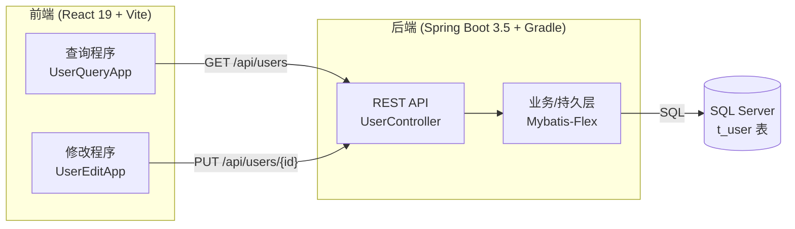

# React 19 + Spring Boot 3.5 + Mybatis-Flex + SQL Server 全栈入门教程

> 从零开始，手把手带你用 **React 19（前端）** + **Spring Boot 3.5（后端）** + **Gradle（构建工具）** + **Mybatis-Flex（持久层框架）** 连接 **SQL Server** 数据库中的一张表，完成最简单的「查询」和「修改」功能。
>
> - **查询程序**：一个独立的 React 19 页面，从数据库读取并展示数据。
> - **修改程序**：另一个独立的 React 19 页面，把修改后的数据写回数据库。

---

## 一、这份教程适合谁？

- 想学习 **前后端分离** 全栈开发的初学者。
- 已经会一点 Java 或 JavaScript，但没有把它们串起来做过完整项目的同学。
- 想快速上手 **Mybatis-Flex**（新一代 MyBatis 增强框架）连接 **SQL Server** 的开发者。

> 💡 本教程的目标是「**能跑起来 + 看得懂每一行**」，因此每一步都会给出**完整代码**，不省略任何片段，并配合大量图示说明。

---

## 二、我们最终要做出什么？

一个最小可用的「用户信息管理」小程序，包含两个前端页面和一个后端服务：



- **数据表**：一张最简单的 `t_user` 表（id、姓名、年龄、邮箱）。
- **后端接口**：查询全部用户、按 id 查询、更新用户。
- **前端页面**：查询页展示列表；修改页编辑并保存。

---

## 三、技术栈与版本一览

| 分类 | 技术 | 本教程使用版本 | 说明 |
| --- | --- | --- | --- |
| 前端框架 | React | **19.1** | 使用 Vite 脚手架创建 |
| 前端构建 | Vite | 5.x / 6.x | 前端开发服务器与打包 |
| 包管理器 | Node.js / npm | Node 20 LTS+ | 运行前端工程 |
| 后端框架 | Spring Boot | **3.5.16** | JDK 17~21 |
| 构建工具 | Gradle | 8.x（Wrapper） | 管理后端依赖与打包 |
| 编程语言 | Java (JDK) | **21 (LTS)** | Spring Boot 3.5 要求 17+ |
| 持久层框架 | Mybatis-Flex | **1.11.6** | `mybatis-flex-spring-boot3-starter` |
| 数据库 | Microsoft SQL Server | 2019 / 2022 | 也可用 Express 免费版 |
| 数据库驱动 | mssql-jdbc | 12.x | Microsoft 官方 JDBC 驱动 |

> ⚠️ 版本说明：Spring Boot 3.5.x 是撰写本教程时的稳定版本（最新补丁为 3.5.16）。如果你使用略有不同的补丁号（如 3.5.x），教程步骤依然适用。

---

## 四、教程目录（章节规划）

本教程按照「**从环境准备到功能完成**」的执行顺序编排，每一章都是一个独立的 Markdown 文件，可按顺序阅读。

| 章节 | 文件名 | 内容概要 | 状态 |
| --- | --- | --- | --- |
| **第 1 章** | `01-技术栈概述.md` | 教程概述、架构讲解、技术栈介绍、最终成品预览 | ✅ 已完成 |
| **第 2 章** | `02-开发环境准备.md` | 安装 JDK 21、Node.js、IDE、SQL Server 与 SSMS，并逐一验证 | ✅ 已完成 |
| **第 3 章** | `03-数据库准备与建表.md` | 创建数据库、创建 `t_user` 表、插入测试数据、开启 TCP/IP 端口 | ✅ 已完成 |
| **第 4 章** | `04-搭建SpringBoot后端项目.md` | 用 Spring Initializr / Gradle 创建后端骨架，运行第一个接口 | ✅ 已完成 |
| **第 5 章** | `05-集成Mybatis-Flex连接SQLServer.md` | 添加依赖、配置数据源、配置 Mybatis-Flex、连通性测试 | ✅ 已完成 |
| **第 6 章** | `06-后端查询接口.md` | 编写实体类、Mapper、Service、Controller，实现查询接口 | ✅ 已完成 |
| **第 7 章** | `07-后端修改接口.md` | 实现按 id 查询 + 更新接口，Postman 测试 | ✅ 已完成 |
| **第 8 章** | `08-搭建React19前端工程.md` | 用 Vite 创建 React 19 工程，理解目录结构，配置代理 | ✅ 已完成 |
| **第 9 章** | `09-React19查询程序.md` | 编写「查询程序」：调用后端、渲染表格、加载与错误处理 | ✅ 已完成 |
| **第 10 章** | `10-React19修改程序.md` | 编写「修改程序」：表单编辑、提交更新、结果反馈 | ✅ 已完成 |
| **第 11 章** | `11-前后端联调与测试.md` | 跨域（CORS）、联调排错、端到端验证 | ✅ 已完成 |
| **第 12 章** | `12-常见问题FAQ与部署.md` | 常见报错排查、打包部署建议 | ✅ 已完成 |

> 🎉 当前进度：**全部 12 章已完成！** 涵盖从环境准备、数据库、完整后端，到两个 React 19 前端、联调跨域与打包部署的全流程。

---

## 五、目录结构约定

阅读教程前，先了解本教程最终形成的工程目录（前后端分离，两个独立工程）：

```text
fullstack-demo/
├── backend/                     # Spring Boot 3.5 后端工程（Gradle）
│   ├── build.gradle
│   ├── settings.gradle
│   ├── gradlew / gradlew.bat
│   └── src/main/java/com/example/demo/
│       ├── DemoApplication.java
│       ├── entity/User.java
│       ├── mapper/UserMapper.java
│       ├── service/UserService.java
│       └── controller/UserController.java
│
└── frontend/
    ├── user-query-app/          # React 19「查询程序」
    └── user-edit-app/           # React 19「修改程序」
```

---

## 六、约定与图例说明

- 📁 **代码块**：所有代码均为**完整可运行**版本，可直接复制。
- 🖼️ **图示**：`` 为**截图占位**，标注了该处应看到的界面效果；`mermaid` 代码块为**可直接渲染的流程图/架构图**。
- ⚠️ **注意**：标注易踩坑的地方。
- 💡 **提示**：补充说明与最佳实践。

> 图片资源统一放在各章节同级的 `images/` 目录下。你在实际操作时看到的界面若与截图占位描述一致，即代表该步骤正确。

---

👉 现在开始阅读 **[第 1 章：技术栈概述](01-技术栈概述.md)**
