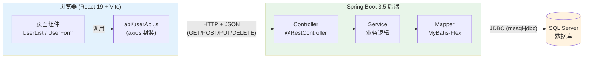
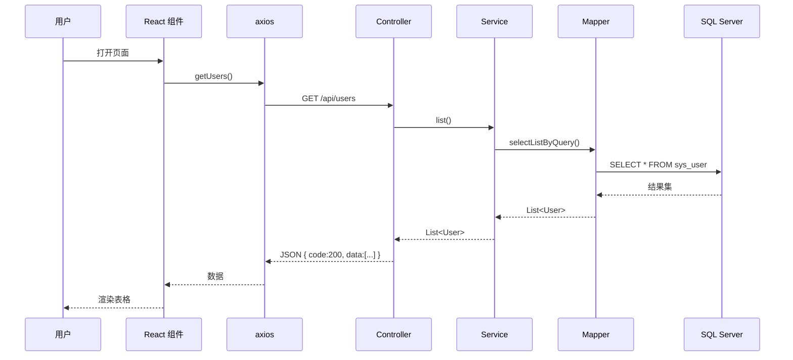

# 第 1 章 · 整体架构与技术选型

> 上一章：[README 目录](README.md) ｜ 下一章：[02-环境准备](02-环境准备.md)

## 1.1 为什么是这套组合？

| 层次 | 技术 | 作用 | 选它的理由 |
|------|------|------|-----------|
| 前端 | React 19 + Vite | 页面渲染、用户交互 | React 19 带来 Actions、`useActionState`、`use()` 等新特性；Vite 启动秒开 |
| 通信 | Axios（HTTP/JSON） | 前后端数据交换 | 拦截器、统一错误处理方便 |
| 后端 | Spring Boot 3.5 | REST API、业务逻辑 | 生态成熟，基于 Spring Framework 6 / Java 17+ |
| ORM | MyBatis-Flex 1.11.x | Java 对象 ↔ 数据库表映射 | 比 MyBatis-Plus 更轻量，`QueryWrapper` 强大，APT 生成类型安全的字段定义 |
| 数据库 | SQL Server | 数据持久化 | 企业常用，事务/存储过程能力强 |
| 构建 | Gradle | 依赖管理、打包 | 比 Maven 更快、脚本更灵活 |
| IDE | IntelliJ IDEA 2026 | 开发环境 | Spring / Gradle 支持一流 |

## 1.2 前后端分离架构图

**一句话理解**：React 负责「界面」，Spring Boot 负责「业务和数据」，两者通过 HTTP + JSON 通信，MyBatis-Flex 负责把 Java 对象翻译成 SQL 语句去操作 SQL Server。

## 1.3 一次「查询用户列表」的完整调用链（时序图）

---

> 下一章 👉 [02-环境准备](02-环境准备.md)
