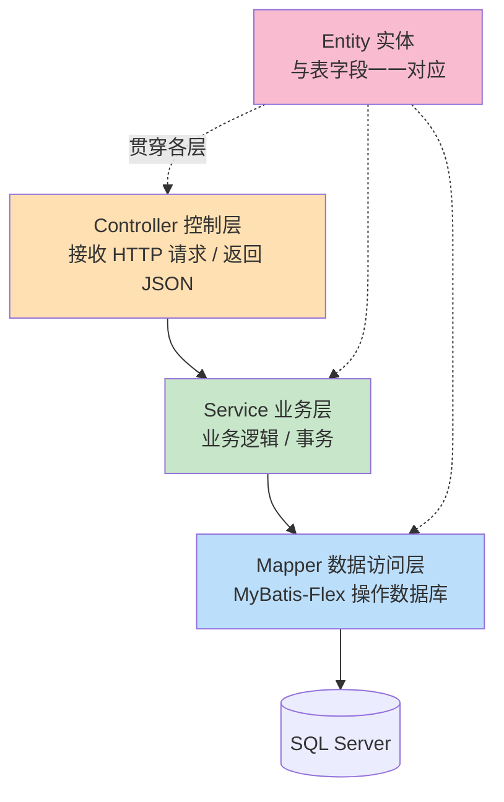

# 第 6 章 · 第四步：编写后端分层代码

> 上一章：[05-数据库连接与MyBatisFlex配置](05-数据库连接与MyBatisFlex配置.md) ｜ 下一章：[07-统一返回-跨域-异常](07-统一返回-跨域-异常.md)

分层是后端的灵魂。一次请求会「自上而下」穿过这几层，每层各司其职：



先把包结构建好：

```
src/main/java/com/example/crudbackend/
├── CrudBackendApplication.java
├── entity/
│   └── User.java
├── mapper/
│   └── UserMapper.java
├── service/
│   ├── UserService.java
│   └── impl/UserServiceImpl.java
├── controller/
│   └── UserController.java
└── common/
    └── Result.java        (第 7 章创建)
```

## 6.1 Entity 实体类

`entity/User.java`——用 MyBatis-Flex 的注解把 Java 类和 `sys_user` 表关联起来：

```java
package com.example.crudbackend.entity;

import com.mybatisflex.annotation.Id;
import com.mybatisflex.annotation.KeyType;
import com.mybatisflex.annotation.Table;
import lombok.Data;

import java.time.LocalDateTime;

@Data                       // Lombok：自动生成 getter/setter/toString
@Table("sys_user")          // 对应数据库表名
public class User {

    @Id(keyType = KeyType.Auto)   // 主键，Auto = 数据库自增（对应 SQL Server IDENTITY）
    private Long id;

    private String username;

    private Integer age;

    private String email;

    private LocalDateTime createTime;   // 驼峰 createTime ↔ 下划线 create_time（默认自动映射）
}
```

**讲解**：
- `@Table("sys_user")`：指定表名。
- `@Id(keyType = KeyType.Auto)`：主键自增，插入后 MyBatis-Flex 会自动回填生成的 `id`。
- **驼峰转下划线**：MyBatis-Flex 默认开启 `createTime` ↔ `create_time` 的自动映射，无需额外配置。
- 编译一次后，APT 处理器会生成一个 `UserTableDef`（静态字段 `USER`），后面写查询会用到。

## 6.2 Mapper 接口

`mapper/UserMapper.java`——**只需继承 `BaseMapper<User>`，即可白得一整套 CRUD 方法**：

```java
package com.example.crudbackend.mapper;

import com.mybatisflex.core.BaseMapper;
import com.example.crudbackend.entity.User;

public interface UserMapper extends BaseMapper<User> {
    // 无需写任何方法！
    // BaseMapper 已内置：insert、deleteById、update、selectOneById、selectListByQuery ...
    // 如需自定义复杂 SQL，可在此加方法并配 XML 或 @Select 注解
}
```

**这就是 MyBatis-Flex 的爽点**：`BaseMapper` 提供了 `insert / update / deleteById / selectOneById / selectListByQuery / paginate` 等几十个开箱即用的方法，简单 CRUD 一行 SQL 都不用写。

## 6.3 Service 层

Service 层承载业务逻辑。先定义接口，再写实现。

`service/UserService.java`：

```java
package com.example.crudbackend.service;

import com.example.crudbackend.entity.User;
import java.util.List;

public interface UserService {
    List<User> listAll();          // 查询全部
    User getById(Long id);         // 按 id 查询
    boolean save(User user);       // 新增
    boolean updateById(User user); // 修改
    boolean removeById(Long id);   // 删除
}
```

`service/impl/UserServiceImpl.java`：

```java
package com.example.crudbackend.service.impl;

import com.example.crudbackend.entity.User;
import com.example.crudbackend.mapper.UserMapper;
import com.example.crudbackend.service.UserService;
import com.mybatisflex.core.query.QueryWrapper;
import org.springframework.stereotype.Service;

import java.time.LocalDateTime;
import java.util.List;

import static com.example.crudbackend.entity.table.UserTableDef.USER;  // APT 生成的表定义

@Service
public class UserServiceImpl implements UserService {

    private final UserMapper userMapper;

    // 构造器注入（Spring 推荐方式）
    public UserServiceImpl(UserMapper userMapper) {
        this.userMapper = userMapper;
    }

    @Override
    public List<User> listAll() {
        // 类型安全的查询：SELECT * FROM sys_user ORDER BY id DESC
        QueryWrapper query = QueryWrapper.create()
                .orderBy(USER.ID.desc());
        return userMapper.selectListByQuery(query);
    }

    @Override
    public User getById(Long id) {
        return userMapper.selectOneById(id);
    }

    @Override
    public boolean save(User user) {
        user.setCreateTime(LocalDateTime.now());
        return userMapper.insert(user) > 0;   // insert 返回受影响行数
    }

    @Override
    public boolean updateById(User user) {
        return userMapper.update(user) > 0;
    }

    @Override
    public boolean removeById(Long id) {
        return userMapper.deleteById(id) > 0;
    }
}
```

**讲解**：
- `import static ... UserTableDef.USER`：这就是 APT 处理器生成的类。`USER.ID`、`USER.USERNAME` 是类型安全的字段引用。改了字段名，编译期就会报错，比手写字符串 `"username"` 安全得多。
- `QueryWrapper.create().orderBy(USER.ID.desc())`：链式构造查询条件，最终翻译成 SQL。
- 如果第一次找不到 `UserTableDef`，**先 Build 一次项目**（`Build → Build Project` 或 `./gradlew compileJava`），APT 才会生成它。

## 6.4 Controller 层（REST CRUD 接口）

`controller/UserController.java`——这是暴露给前端的 REST 接口，完整覆盖增删改查：

```java
package com.example.crudbackend.controller;

import com.example.crudbackend.common.Result;
import com.example.crudbackend.entity.User;
import com.example.crudbackend.service.UserService;
import org.springframework.web.bind.annotation.*;

import java.util.List;

@RestController                 // = @Controller + @ResponseBody，返回值自动转 JSON
@RequestMapping("/api/users")   // 该控制器统一前缀
public class UserController {

    private final UserService userService;

    public UserController(UserService userService) {
        this.userService = userService;
    }

    // 查询全部： GET /api/users
    @GetMapping
    public Result<List<User>> list() {
        return Result.ok(userService.listAll());
    }

    // 按 id 查询： GET /api/users/1
    @GetMapping("/{id}")
    public Result<User> getOne(@PathVariable Long id) {
        return Result.ok(userService.getById(id));
    }

    // 新增： POST /api/users  （请求体为 JSON）
    @PostMapping
    public Result<Boolean> create(@RequestBody User user) {
        return Result.ok(userService.save(user));
    }

    // 修改： PUT /api/users/1
    @PutMapping("/{id}")
    public Result<Boolean> update(@PathVariable Long id, @RequestBody User user) {
        user.setId(id);
        return Result.ok(userService.updateById(user));
    }

    // 删除： DELETE /api/users/1
    @DeleteMapping("/{id}")
    public Result<Boolean> delete(@PathVariable Long id) {
        return Result.ok(userService.removeById(id));
    }
}
```

**REST 风格与 HTTP 方法对应关系（务必记住这张表）**：

| 操作 | HTTP 方法 | URL | 说明 |
|------|-----------|-----|------|
| 查询列表 | `GET` | `/api/users` | 幂等、无副作用 |
| 查询单条 | `GET` | `/api/users/{id}` | 路径参数 |
| 新增 | `POST` | `/api/users` | 数据放请求体（JSON） |
| 修改 | `PUT` | `/api/users/{id}` | 数据放请求体 |
| 删除 | `DELETE` | `/api/users/{id}` | 按 id 删 |

- `@RequestBody`：把前端发来的 JSON 自动反序列化成 `User` 对象。
- `@PathVariable`：取 URL 路径里的变量（如 `{id}`）。
- `@RestController`：返回的对象会被 Jackson 自动转成 JSON。

---

> 下一章 👉 [07-统一返回-跨域-异常](07-统一返回-跨域-异常.md)
