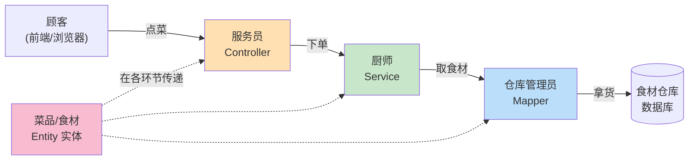
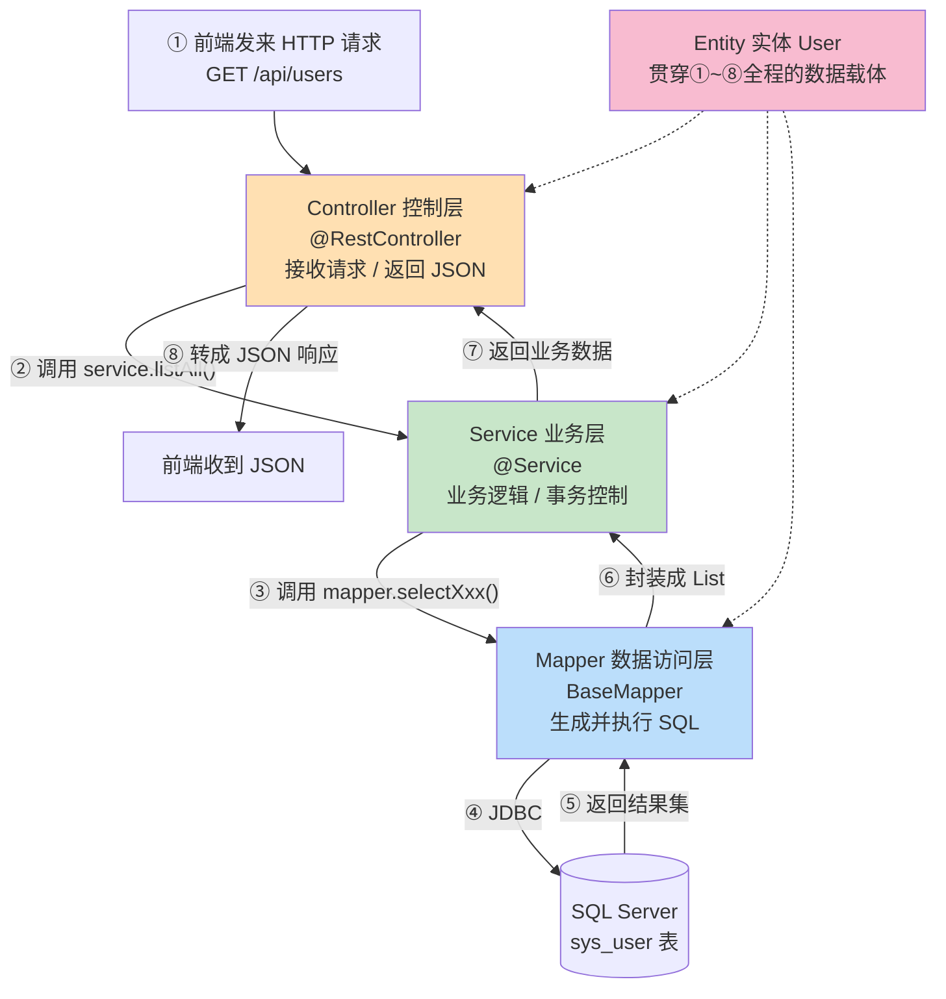

# 第 6 章 · 第四步：编写后端分层代码（详解版）

> 上一章：[05-数据库连接与MyBatisFlex配置](05-数据库连接与MyBatisFlex配置.md) ｜ 下一章：[07-统一返回-跨域-异常](07-统一返回-跨域-异常.md)

本章是整个后端的核心。我们不只贴代码，而是把 **Entity / Mapper / Service / Controller** 这四层——每一层「**是什么、有什么用、为什么要有它、写的时候要注意什么**」，以及它们**彼此之间的关系**，全部讲透。读完本章，你应该能独立回答："为什么一个简单的增删改查要写这么多类？"

---

## 6.0 先搞懂：什么是「分层架构」？为什么要分层？

### 6.0.1 一个生活化的比喻：餐厅

想象你去餐厅吃饭，整个流程是这样分工的：



| 餐厅角色 | 对应后端层 | 职责 |
|---------|-----------|------|
| **服务员** | Controller | 只负责「接待顾客、传话」。不做菜，也不进仓库 |
| **厨师** | Service | 负责「怎么做这道菜」的核心逻辑（业务规则） |
| **仓库管理员** | Mapper | 只负责「从仓库拿东西/放东西」（读写数据库） |
| **菜品/食材** | Entity | 在各环节之间传递的「东西」本身（数据） |

**关键点**：服务员不会跑进仓库拿食材，厨师也不会直接去招呼顾客。**各司其职、互不越界**——这就是分层。

### 6.0.2 为什么要这么麻烦地分层？

初学者常问："查个用户而已，Controller 里直接连数据库不就完了，干嘛分这么多层？"分层的好处正是在项目变大后才显现：

| 好处 | 说明 |
|------|------|
| **职责单一，好维护** | 改数据库表结构，只动 Mapper/Entity；改接口地址，只动 Controller；改业务规则，只动 Service。互不影响 |
| **可复用** | 同一个 `UserService.save()`，既能被网页接口调用，也能被定时任务、其他服务调用 |
| **可测试** | 可以单独测试 Service 的业务逻辑，而不用启动 Web 服务器 |
| **可替换** | 将来数据库从 SQL Server 换成 MySQL，理论上只改 Mapper 层，上面两层几乎不动 |
| **团队协作** | 前端只关心 Controller 暴露的接口，不用管你底层怎么存 |

一句话：**分层是用"多写几个类"的短期成本，换来"长期好改、好测、好协作"的收益。**

### 6.0.3 一次请求在四层之间的流动（务必理解这张图）



**调用方向永远是自上而下**：Controller → Service → Mapper → 数据库；**返回则原路返回**。**下层绝不能反过来调用上层**（Mapper 不能调 Service，Service 不能调 Controller）。

### 6.0.4 先把包结构建好

```
src/main/java/com/example/crudbackend/
├── CrudBackendApplication.java
├── entity/                       ← 数据载体
│   └── User.java
├── mapper/                       ← 数据访问层（连数据库）
│   └── UserMapper.java
├── service/                      ← 业务层
│   ├── UserService.java          ← 接口（定义"能做什么"）
│   └── impl/
│       └── UserServiceImpl.java  ← 实现（定义"具体怎么做"）
├── controller/                   ← 控制层（对外接口）
│   └── UserController.java
└── common/
    └── Result.java               ← 统一返回结构（第 7 章创建）
```

> **命名约定**：包名用小写；`entity`（也有人叫 `model`、`domain`、`po`）、`mapper`（也叫 `dao`）、`service`、`controller` 是 Java 后端约定俗成的分层包名，团队里保持一致即可。

---

## 6.1 Entity 实体类 —— 数据的「载体」

### 6.1.1 它是什么？

**Entity（实体类）是一个普通的 Java 类，用来对应数据库里的一张表**。表里的一行数据 = 这个类的一个对象；表里的一个字段（列）= 类里的一个属性。

```
数据库 sys_user 表                Java User 类
┌────┬──────────┬─────┐          class User {
│ id │ username │ age │    ⇄        Long id;
├────┼──────────┼─────┤             String username;
│ 1  │ 张三      │ 25  │  ← 一行       Integer age;
└────┴──────────┴─────┘          }   ← 一个对象
```

这种「一个类对应一张表、一个对象对应一行」的设计，就是 **ORM（对象关系映射，Object-Relational Mapping）** 的核心思想。MyBatis-Flex 就是帮你做这层「对象 ↔ 表」翻译的工具。

### 6.1.2 完整代码

`entity/User.java`：

```java
package com.example.crudbackend.entity;

import com.mybatisflex.annotation.Id;
import com.mybatisflex.annotation.KeyType;
import com.mybatisflex.annotation.Table;
import lombok.Data;

import java.time.LocalDateTime;

@Data                       // Lombok：自动生成 getter/setter/toString/equals/hashCode
@Table("sys_user")          // 告诉 MyBatis-Flex：这个类对应数据库的 sys_user 表
public class User {

    @Id(keyType = KeyType.Auto)   // 标记这是主键，Auto = 由数据库自增生成
    private Long id;

    private String username;      // 对应 username 列

    private Integer age;          // 对应 age 列

    private String email;         // 对应 email 列

    private LocalDateTime createTime;  // 对应 create_time 列（驼峰↔下划线自动映射）
}
```

### 6.1.3 它有什么用？（为什么需要它）

没有实体类会怎样？你就得用 `Map<String, Object>` 来装数据库返回的每一行，取字段要写 `map.get("username")`——**没有类型、没有提示、拼错字段名编译器也不报错**。有了实体类：

| 用途 | 说明 |
|------|------|
| **类型安全** | `user.getAge()` 明确是 `Integer`，写错了编译期就报错 |
| **代码提示** | IDE 能自动补全 `user.` 后面的所有字段 |
| **贯穿各层的"通用语言"** | Controller、Service、Mapper 之间传来传去的都是 `User` 对象，大家"说同一种话" |
| **自动映射** | MyBatis-Flex 自动把查询结果的每一行"塞进"一个 `User` 对象 |

### 6.1.4 逐个注解讲解

| 注解 | 作用 | 注意事项 |
|------|------|---------|
| `@Table("sys_user")` | 声明该类映射哪张表 | 表名不写默认按类名转下划线（`User`→`user`），**但我们表叫 `sys_user`，所以必须显式写** |
| `@Id(keyType = KeyType.Auto)` | 声明主键 + 主键生成策略 | `Auto` 对应 SQL Server 的 `IDENTITY` 自增；插入后框架会**自动把生成的 id 回填**到对象里 |
| `@Data`（Lombok） | 编译期自动生成 getter/setter 等 | 不是必须，但能少写几十行样板代码；需装 Lombok 依赖和 IDEA 插件 |

**主键策略 `KeyType` 常见取值**：

| 取值 | 含义 | 适用 |
|------|------|------|
| `KeyType.Auto` | 数据库自增 | SQL Server `IDENTITY`、MySQL `AUTO_INCREMENT` |
| `KeyType.None` | 不处理，由你自己赋值 | 手动指定主键 |
| `KeyType.Generator` | 用生成器（如雪花算法 flexId、UUID） | 分布式系统 |

### 6.1.5 ⚠️ 注意事项（踩坑点）

1. **驼峰 ↔ 下划线自动映射**：Java 里写 `createTime`，数据库里是 `create_time`，MyBatis-Flex **默认开启**这个转换，无需配置。但如果你的列名不规则（比如 `userName`），可能要用 `@Column("列名")` 显式指定。
2. **属性类型要和数据库列类型匹配**：`DATETIME` → `LocalDateTime`；`BIGINT` → `Long`；`INT` → `Integer`；`NVARCHAR` → `String`；`BIT` → `Boolean`；`DECIMAL` → `BigDecimal`。类型不匹配会在查询/插入时报错。
3. **用包装类型（`Integer`）而不是基本类型（`int`）**：因为数据库字段可能为 `NULL`，基本类型无法表示 null，会报错。
4. **一定要有无参构造函数**：框架靠它 `new` 出对象再填值。`@Data` 不会去掉它，但如果你手写了有参构造，记得补一个无参的。
5. **APT 生成的 `UserTableDef`**：编译一次后，`mybatis-flex-processor` 会自动生成一个 `UserTableDef` 类（含静态字段 `USER`），供 Service 层写类型安全查询用（见 6.3）。**找不到它就先 Build 一次项目。**

---

## 6.2 Mapper 接口 —— 数据访问层（只管读写数据库）

### 6.2.1 它是什么？

**Mapper（也叫 DAO，Data Access Object）是专门和数据库打交道的一层**。它是一个**接口**（注意：是 interface，不是 class），你不用写实现——MyBatis-Flex 在运行时会自动为它生成一个代理实现类，帮你执行 SQL。

`mapper/UserMapper.java`：

```java
package com.example.crudbackend.mapper;

import com.mybatisflex.core.BaseMapper;
import com.example.crudbackend.entity.User;

public interface UserMapper extends BaseMapper<User> {
    // 空的！一行方法都不用写
    // 继承 BaseMapper<User> 后，就白得一整套针对 User/sys_user 的增删改查方法
}
```

### 6.2.2 它有什么用？为什么用它

`BaseMapper<User>` 这个"泛型父接口"已经内置了几十个常用方法，你继承一下就能直接用：

| 方法 | 作用 | 对应 SQL |
|------|------|---------|
| `insert(user)` | 插入一条 | `INSERT INTO ...` |
| `deleteById(id)` | 按主键删 | `DELETE FROM ... WHERE id=?` |
| `update(user)` | 按主键改 | `UPDATE ... WHERE id=?` |
| `selectOneById(id)` | 按主键查一条 | `SELECT * FROM ... WHERE id=?` |
| `selectListByQuery(query)` | 按条件查列表 | `SELECT * FROM ... WHERE ...` |
| `selectAll()` | 查全部 | `SELECT * FROM ...` |
| `paginate(...)` | 分页查询 | 自动加分页语句 |

**这就是 MyBatis-Flex 最爽的地方**：简单 CRUD **一行 SQL 都不用写**。只有遇到特别复杂的查询，才需要在接口里自己加方法（配 `@Select` 注解或 XML）。

### 6.2.3 为什么它只是个「接口」？（原理）

因为 CRUD 的 SQL 是**有规律的**——插入、按 id 删、按 id 查……对任何表都长得差不多。MyBatis-Flex 通过「**动态代理**」技术，在运行时根据你的 `BaseMapper<User>` 自动生成这些方法的实现（把 `User` 对应的表名、字段名填进 SQL 模板）。所以你只需要**声明**"我要一个操作 User 的 Mapper"，具体实现框架代劳。

### 6.2.4 它怎么被"找到"并生效？

回顾第 5 章，启动类上有一句：

```java
@MapperScan("com.example.crudbackend.mapper")
```

它告诉 MyBatis-Flex：去 `mapper` 包里扫描所有接口，为它们生成代理实现并注册成 Spring 的 Bean。这样 Service 层就能通过依赖注入直接拿到 `UserMapper` 来用了。

> 💡 **「生成代理实现、注册成 Bean、依赖注入、动态代理」这些词是什么意思？** 它们是 Spring 的地基概念。为了不打断本章主线，我把它们单独写成了一篇详解：👉 **[附录 A · Spring 核心概念详解](附录A-Spring核心概念详解.md)**（强烈建议读一遍，读完你会明白"为什么打个 `@Service` 就能被注入""为什么 Mapper 只是接口却能干活"）。

### 6.2.5 ⚠️ 注意事项

1. **Mapper 是接口，不要写成 class**，也不要自己去 `new` 它。
2. **Mapper 只做"数据存取"，不放业务逻辑**。例如"新增前检查用户名是否重复"这种判断，应该放在 Service 层，而不是 Mapper。
3. 必须被 `@MapperScan` 扫描到（或在接口上加 `@Mapper` 注解），否则注入时会报"找不到 Bean"。

---

## 6.3 Service 层 —— 业务逻辑的「大脑」

### 6.3.1 它是什么？为什么要「接口 + 实现」两个文件？

**Service 层负责"业务逻辑"**——也就是"这件事具体该怎么办"的规则。比如"新增用户前要设置创建时间""转账要先扣 A 再加 B，且必须同时成功"这类逻辑，都放在这里。

Service 通常写成**一个接口 + 一个实现类**：

- **接口（`UserService`）**：只声明"能做什么"（有哪些方法），像一份"能力清单/合同"。
- **实现类（`UserServiceImpl`）**：写"具体怎么做"。

**为什么要拆成两个？** 这是"面向接口编程"：上层（Controller）只依赖接口，不关心具体实现。将来想换一套实现（比如加缓存版本），只要还实现同一个接口，Controller 一行都不用改。小项目里觉得啰嗦可以合并，但这是行业主流规范，建议养成习惯。

### 6.3.2 接口

`service/UserService.java`：

```java
package com.example.crudbackend.service;

import com.example.crudbackend.entity.User;
import java.util.List;

public interface UserService {
    List<User> listAll();          // 查询全部
    User getById(Long id);         // 按 id 查询
    boolean save(User user);       // 新增
    boolean updateById(User user); // 修改
    boolean removeById(Long id);   // 删除
}
```

### 6.3.3 实现类

`service/impl/UserServiceImpl.java`：

```java
package com.example.crudbackend.service.impl;

import com.example.crudbackend.entity.User;
import com.example.crudbackend.mapper.UserMapper;
import com.example.crudbackend.service.UserService;
import com.mybatisflex.core.query.QueryWrapper;
import org.springframework.stereotype.Service;

import java.time.LocalDateTime;
import java.util.List;

import static com.example.crudbackend.entity.table.UserTableDef.USER;  // APT 生成的表定义

@Service   // 告诉 Spring：这是一个 Service Bean，交给容器管理
public class UserServiceImpl implements UserService {

    // 依赖 Mapper：Service 通过 Mapper 去操作数据库
    private final UserMapper userMapper;

    // 构造器注入（Spring 推荐方式）：容器启动时自动把 UserMapper 塞进来
    public UserServiceImpl(UserMapper userMapper) {
        this.userMapper = userMapper;
    }

    @Override
    public List<User> listAll() {
        // 构造查询条件：SELECT * FROM sys_user ORDER BY id DESC
        QueryWrapper query = QueryWrapper.create()
                .orderBy(USER.ID.desc());
        return userMapper.selectListByQuery(query);
    }

    @Override
    public User getById(Long id) {
        return userMapper.selectOneById(id);
    }

    @Override
    public boolean save(User user) {
        // ★ 业务逻辑示例：新增前自动设置创建时间（这种逻辑就该放在 Service，而不是 Controller 或 Mapper）
        user.setCreateTime(LocalDateTime.now());
        return userMapper.insert(user) > 0;   // insert 返回受影响行数，>0 表示成功
    }

    @Override
    public boolean updateById(User user) {
        return userMapper.update(user) > 0;
    }

    @Override
    public boolean removeById(Long id) {
        return userMapper.deleteById(id) > 0;
    }
}
```

### 6.3.4 关键点讲解

- **`@Service`**：把这个类注册成 Spring 容器管理的 Bean，这样 Controller 才能注入它。（Bean、容器是什么？见 👉 [附录 A](附录A-Spring核心概念详解.md)）
- **构造器注入 `UserMapper`**：Service **依赖** Mapper 来真正读写数据库。Service 自己不写 SQL，而是"指挥" Mapper 干活。这体现了"Service 调用 Mapper"的层级关系。（依赖注入的三种方式及为什么推荐构造器注入，见 👉 [附录 A](附录A-Spring核心概念详解.md)）
- **`import static ...UserTableDef.USER`**：这就是 6.1.5 提到的 APT 生成类。`USER.ID`、`USER.USERNAME` 是**类型安全**的字段引用——列名写错编译期就报错，重构改字段名时 IDE 能自动跟着改，比手写字符串 `"username"` 安全得多。
- **`QueryWrapper`**：MyBatis-Flex 的"查询构造器"，用链式调用拼出 `WHERE`、`ORDER BY` 等条件，最终由框架翻译成 SQL。例如加个按用户名过滤：`query.where(USER.USERNAME.like("张"))`。
- **业务逻辑的归属**：注意 `save()` 里"设置创建时间"这行——这是典型的**业务规则**，放在 Service 最合适。Controller 不该管，Mapper 也不该管。

### 6.3.5 ⚠️ 注意事项

1. **业务逻辑集中在 Service**：校验、计算、多步操作的编排都放这里。Controller 只做"转发"，Mapper 只做"存取"。
2. **事务控制在 Service 层**：涉及多张表、多步写操作要保证"要么全成功要么全失败"时，在方法上加 `@Transactional`（Spring 的事务注解）。例如转账、下单减库存。
3. **找不到 `UserTableDef`？** 先 `Build → Build Project` 或 `./gradlew compileJava`，APT 处理器编译后才会生成它。

---

## 6.4 Controller 层 —— 对外的「门面」（REST 接口）

### 6.4.1 它是什么？

**Controller 是后端暴露给前端的"门"**。它负责：接收前端的 HTTP 请求 → 解析请求里的参数 → 调用 Service 处理 → 把结果转成 JSON 返回。**它本身不写业务逻辑，更不碰数据库**，只做"接待和转发"。

`controller/UserController.java`：

```java
package com.example.crudbackend.controller;

import com.example.crudbackend.common.Result;
import com.example.crudbackend.entity.User;
import com.example.crudbackend.service.UserService;
import org.springframework.web.bind.annotation.*;

import java.util.List;

@RestController                 // = @Controller + @ResponseBody，返回值自动转成 JSON
@RequestMapping("/api/users")   // 该控制器下所有接口的统一 URL 前缀
public class UserController {

    // 依赖 Service：Controller 通过 Service 完成业务
    private final UserService userService;

    public UserController(UserService userService) {
        this.userService = userService;
    }

    // 查询全部： GET /api/users
    @GetMapping
    public Result<List<User>> list() {
        return Result.ok(userService.listAll());
    }

    // 按 id 查询： GET /api/users/1
    @GetMapping("/{id}")
    public Result<User> getOne(@PathVariable Long id) {
        return Result.ok(userService.getById(id));
    }

    // 新增： POST /api/users  （数据在请求体 JSON 里）
    @PostMapping
    public Result<Boolean> create(@RequestBody User user) {
        return Result.ok(userService.save(user));
    }

    // 修改： PUT /api/users/1
    @PutMapping("/{id}")
    public Result<Boolean> update(@PathVariable Long id, @RequestBody User user) {
        user.setId(id);   // 把 URL 里的 id 塞进对象，确保改的是这一条
        return Result.ok(userService.updateById(user));
    }

    // 删除： DELETE /api/users/1
    @DeleteMapping("/{id}")
    public Result<Boolean> delete(@PathVariable Long id) {
        return Result.ok(userService.removeById(id));
    }
}
```

### 6.4.2 REST 风格与 HTTP 方法对应关系（务必记住）

REST 是一种接口设计风格：**用不同的 HTTP 方法表达不同的操作，用 URL 表达资源**。

| 操作 | HTTP 方法 | URL | 说明 |
|------|-----------|-----|------|
| 查询列表 | `GET` | `/api/users` | 幂等、无副作用 |
| 查询单条 | `GET` | `/api/users/{id}` | id 是路径参数 |
| 新增 | `POST` | `/api/users` | 数据放请求体（JSON） |
| 修改 | `PUT` | `/api/users/{id}` | 数据放请求体 |
| 删除 | `DELETE` | `/api/users/{id}` | 按 id 删 |

### 6.4.3 逐个注解讲解

| 注解 | 作用 |
|------|------|
| `@RestController` | 标记这是控制器，且每个方法的返回值都自动转成 JSON（= `@Controller` + `@ResponseBody`） |
| `@RequestMapping("/api/users")` | 类级别的 URL 前缀，下面所有方法都在这个前缀下 |
| `@GetMapping` / `@PostMapping` / `@PutMapping` / `@DeleteMapping` | 分别对应 GET/POST/PUT/DELETE 四种 HTTP 方法 |
| `@PathVariable` | 取 URL 路径里的变量，如 `/users/{id}` 里的 `id` |
| `@RequestBody` | 把前端发来的 JSON 请求体**自动反序列化**成 Java 对象（`User`） |

### 6.4.4 ⚠️ 注意事项

1. **Controller 保持"薄"**：只做参数接收、调用 Service、返回结果。不要在这里写 if-else 业务判断或 SQL。
2. **返回统一结构**：这里用了 `Result`（第 7 章讲），让前端拿到的每个响应都是 `{code, message, data}` 格式，便于统一处理。
3. **参数校验**：生产项目可在 `User` 字段上加 `@NotBlank` 等注解，配合方法参数上的 `@Valid` 自动校验（进阶内容）。
4. **`@RequestBody` 只能有一个**：一个方法最多一个请求体参数。

---

## 6.5 四层关系总结 —— 一张表看懂谁调用谁

| 层 | 角色比喻 | 依赖谁 | 关键注解 | 能做什么 | **绝不能做什么** |
|----|---------|--------|---------|---------|-----------------|
| **Controller** | 服务员 | Service | `@RestController` `@GetMapping`... | 收请求、转 JSON、调 Service | 写业务逻辑、直接连数据库 |
| **Service** | 厨师 | Mapper | `@Service` `@Transactional` | 业务规则、事务、编排 | 处理 HTTP、拼 SQL 细节 |
| **Mapper** | 仓库管理员 | （数据库） | `BaseMapper` `@MapperScan` | 读写数据库 | 写业务逻辑 |
| **Entity** | 食材/菜品 | —— | `@Table` `@Id` | 承载数据，在各层间传递 | 放方法逻辑 |

**依赖方向铁律**（单向向下，不可逆）：

```
Controller  ──依赖──▶  Service  ──依赖──▶  Mapper  ──▶  数据库
     │                    │                  │
     └────────────────────┴──────────────────┘
              都使用 Entity 作为数据载体
```

- ✅ 上层可以调用下层：Controller 调 Service，Service 调 Mapper。
- ❌ 下层不能调用上层：Mapper 不能调 Service，Service 不能调 Controller。
- ✅ Entity 被三层共同使用，是它们之间传递数据的"通用语言"。

理解了这套「各司其职 + 单向依赖」，你就真正理解了 Spring Boot 后端的骨架。后面无论加多少张表、多少接口，套路都一模一样。

---

> 下一章 👉 [07-统一返回-跨域-异常](07-统一返回-跨域-异常.md)
