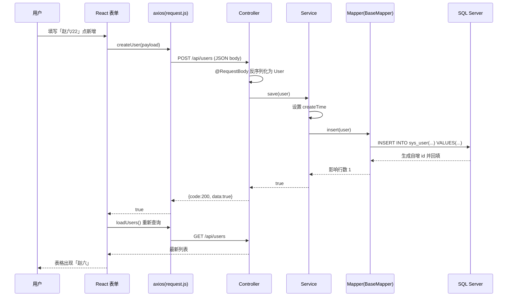

# 第 12 章 · 第十步：前后端联调与完整数据流

> 上一章：[11-React-CRUD页面](11-React-CRUD页面.md) ｜ 下一章：[13-常见问题FAQ](13-常见问题FAQ.md)

## 12.1 启动顺序

1. 确认 **SQL Server 服务已启动**。
2. 启动**后端**：IDEA 运行 `CrudBackendApplication`（端口 8080）。
3. 启动**前端**：`npm run dev`（端口 5173）。
4. 浏览器打开 `http://localhost:5173`，即可看到用户表格。

## 12.2 一次「新增用户」的端到端数据流

## 12.3 数据在各层的「形态变化」

| 位置 | 数据形态 |
|------|---------|
| React 表单 | JS 对象 `{ username, age, email }` |
| 网络传输 | JSON 字符串 |
| Controller | Java 对象 `User`（Jackson 反序列化） |
| Mapper → DB | SQL 语句 + 参数 |
| SQL Server | 表中的一行记录 |
| 返回时 | 逆向：行记录 → User → JSON → JS 对象 → 渲染 DOM |

理解这条「形态变化链」，就真正理解了全栈 CRUD 的本质。

---

> 下一章 👉 [13-常见问题FAQ](13-常见问题FAQ.md)
