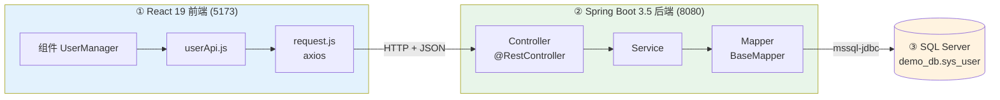

# React 19 + Spring Boot 3.5 + SQL Server 全栈 CRUD 实战教程

> 技术栈：**React 19（Vite）** + **Spring Boot 3.5** + **MyBatis-Flex 1.11** + **SQL Server** + **Gradle** + **IntelliJ IDEA 2026**
>
> 从零开始做一个前后端分离、可对 SQL Server 进行「增删改查」的完整项目。**本教程已按章拆分，每章一个文件，方便单独阅读与修改。**

---

## 📚 章节目录

| 章 | 文件 | 内容 |
|----|------|------|
| 1 | [01-架构与技术选型.md](01-架构与技术选型.md) | 技术选型、架构图、调用链时序图 |
| 2 | [02-环境准备.md](02-环境准备.md) | JDK / Node / SQL Server / IDEA 版本要求 |
| 3 | [03-SQLServer建库建表.md](03-SQLServer建库建表.md) | 开启网络、建库建表脚本 |
| 4 | [04-创建SpringBoot后端.md](04-创建SpringBoot后端.md) | Spring Initializr + 完整 build.gradle |
| 5 | [05-数据库连接与MyBatisFlex配置.md](05-数据库连接与MyBatisFlex配置.md) | application.yml、连接串、@MapperScan |
| 6 | [06-后端分层代码.md](06-后端分层代码.md) | Entity → Mapper → Service → Controller |
| 7 | [07-统一返回-跨域-异常.md](07-统一返回-跨域-异常.md) | Result、CORS、全局异常 |
| 8 | [08-启动与接口测试.md](08-启动与接口测试.md) | 启动后端、IDEA HTTP Client 测试 |
| 9 | [09-创建React19前端.md](09-创建React19前端.md) | Vite 创建项目、目录结构 |
| 10 | [10-封装axios与API层.md](10-封装axios与API层.md) | request.js 拦截器、userApi.js |
| 11 | [11-React-CRUD页面.md](11-React-CRUD页面.md) | 完整 UserManager 组件 |
| 12 | [12-前后端联调与数据流.md](12-前后端联调与数据流.md) | 启动顺序、端到端数据流 |
| 13 | [13-常见问题FAQ.md](13-常见问题FAQ.md) | 8 个高频报错排查 |

---

## 🗺️ 全流程一图总览

**一条链路**：React 页面 → axios → Spring Boot REST 接口 → Service → MyBatis-Flex Mapper → SQL Server → 原路返回渲染。

---

## ✅ 建议动手顺序

先跑通 **第 3 章数据库** → 再做 **后端(4~8 章)并用 `.http` 单独测通** → 最后接 **前端(9~11 章)**。分段验证，联调几乎不卡壳。

## 🚀 后续可扩展方向

分页查询（MyBatis-Flex `paginate`）、参数校验（`@Valid`）、登录鉴权（Spring Security + JWT）、前端换 Ant Design、Docker 部署等。
