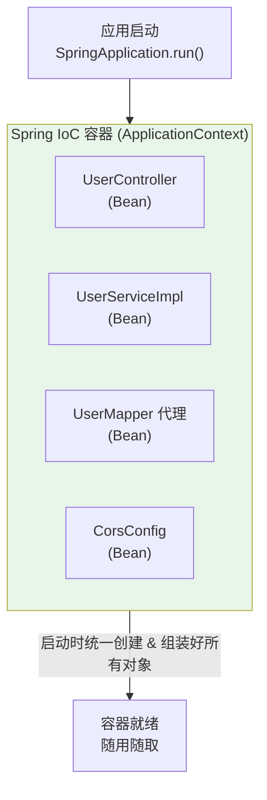
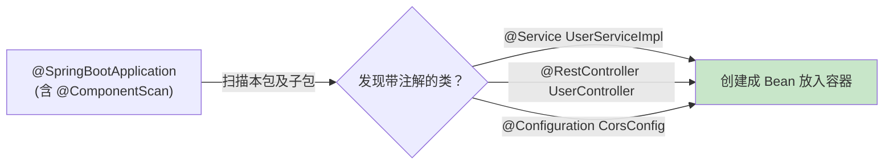
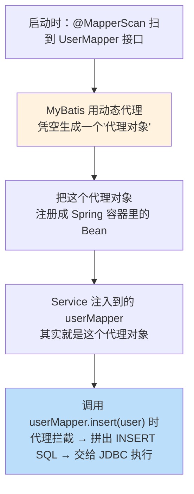
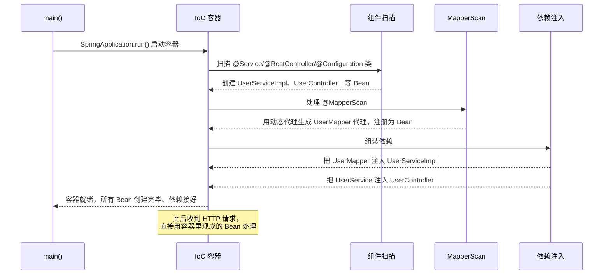

# 附录 A · Spring 核心概念详解（Bean / IoC 容器 / 依赖注入 / 动态代理）

> 回到：[README 目录](README.md) ｜ 相关：[06-后端分层代码](06-后端分层代码.md)

第 6 章里反复出现几个词：**「生成代理实现」「注册成 Spring 的 Bean」「依赖注入」「@Service / @MapperScan 让类被容器管理」**。它们是 Spring 框架的地基。本附录把这套机制从头讲清楚——理解了它，你才明白"为什么写个 `@Service` 就能被自动注入""为什么 Mapper 只是个接口却能干活"。

---

## A.1 一个核心问题：对象是谁 new 出来的？

先看**没有 Spring** 时，我们怎么用对象：

```java
// 传统写法：谁要用，谁自己 new
UserMapper userMapper = new UserMapperImpl();          // 自己造
UserService userService = new UserServiceImpl(userMapper); // 自己造，还要把依赖塞进去
UserController controller = new UserController(userService); // 层层手动组装
```

问题很明显：
- 对象之间的依赖关系要你**手动一层层 new 并组装**，类一多就是灾难。
- 每个地方都自己 new，同一个对象被造了很多份，浪费且难管理。
- 想换实现（比如给 Service 加缓存版），要改所有 new 它的地方。

**Spring 的解决思路**：把"创建对象"和"组装依赖"这件事，从你手里**交给框架**去做。你只需要"声明"和"索取"，不再自己 new。这就引出了下面三个概念。

---

## A.2 IoC 与 IoC 容器 —— 谁来管理对象

### A.2.1 什么是 IoC（控制反转）

**IoC = Inversion of Control，控制反转**。指的是：**创建对象、管理对象生命周期的"控制权"，从程序员手里"反转"给了框架。**

- 传统：**你**控制对象的创建（你来 `new`）。
- IoC：**框架**控制对象的创建，你只是"要"它。

用一个比喻：
- 传统 = 你自己买菜、洗菜、做饭（什么都自己动手 new）。
- IoC = 你去餐厅，跟服务员说"来一份宫保鸡丁"，厨房帮你做好端上来（你只"声明需求"，framework 负责produce）。

### A.2.2 什么是 IoC 容器

**IoC 容器**就是那个"帮你创建和管理所有对象的大管家"。在 Spring Boot 里，它叫 `ApplicationContext`。



应用一启动，容器就把项目里该管的对象**统统创建好、依赖关系也接好**，放在容器里待命。你要用哪个，直接向容器"要"即可。

---

## A.3 Bean —— 被容器管理的对象

### A.3.1 什么是 Bean

**Bean 就是"由 Spring 容器创建并管理的那个对象"**。普通你自己 `new` 的对象不算 Bean；只有交给容器管理的才叫 Bean。

- `UserServiceImpl` 的实例 → 是一个 Bean
- `UserController` 的实例 → 是一个 Bean
- `UserMapper` 的代理实例 → 是一个 Bean
- 你在方法里随手 `new User()` 的 user → **不是** Bean（只是普通对象）

### A.3.2 默认是「单例」

容器里的 Bean **默认是单例（Singleton）**：整个应用里同一种 Bean 只有**一个实例**，大家共用。所以不用担心"每次请求都创建一堆 Service 对象"——它只造一次，反复复用，省内存、好管理。

> 正因为默认单例，**不要在 Service / Controller 里放"会变化的成员变量"来存某个用户的临时数据**，否则多个请求会互相干扰（线程安全问题）。请求相关的数据用方法参数/局部变量传递。

### A.3.3 怎么让一个类变成 Bean？—— 靠注解 + 扫描

你不用手动"注册"，只要在类上打个"标记注解"，Spring 启动时会**自动扫描**并把它变成 Bean：

| 注解 | 打在什么类上 | 含义 |
|------|------------|------|
| `@Component` | 通用组件 | "我是一个 Bean，请管理我"（最基础的标记） |
| `@Service` | 业务层 | 本质就是 `@Component`，只是语义上表示"这是 Service" |
| `@RestController` / `@Controller` | 控制层 | 也是 `@Component` 的变体，额外带 Web 功能 |
| `@Configuration` | 配置类 | 也是 Bean，且里面可以用 `@Bean` 方法再产出别的 Bean |
| `@Repository` | 数据层 | `@Component` 变体，语义表示"数据访问" |

**「自动扫描」是怎么发生的？** 启动类上的 `@SpringBootApplication` 内含 `@ComponentScan`，它默认扫描**启动类所在包及其子包**下所有带上述注解的类，逐个创建成 Bean。这就是为什么我们把 `controller`、`service` 等包都放在 `com.example.crudbackend` 下——为了能被扫到。



---

## A.4 依赖注入（DI）—— 容器帮你把依赖"喂"进来

### A.4.1 什么是依赖注入

`UserController` 要用 `UserService`，我们说 Controller **依赖** Service。

**依赖注入（Dependency Injection, DI）**：你不用自己 `new UserService()`，只要"声明我需要一个 UserService"，**容器会自动从它管理的 Bean 里找到一个，塞给你**。这个"塞"的动作就叫注入。

> IoC 是思想（控制权交给容器），DI 是实现手段（容器通过注入来交付依赖）。两者常一起说。

### A.4.2 三种注入方式（重点看构造器注入）

**① 构造器注入（推荐 ✅，本教程用的就是这种）**

```java
@Service
public class UserServiceImpl implements UserService {
    private final UserMapper userMapper;   // final：一旦注入不可变，更安全

    // 容器创建这个 Bean 时，看到构造器需要一个 UserMapper，
    // 就自动从容器里找到 UserMapper 的 Bean 传进来
    public UserServiceImpl(UserMapper userMapper) {
        this.userMapper = userMapper;
    }
}
```

为什么推荐构造器注入：
- 依赖可以声明为 `final`，保证不可变、线程安全。
- 对象一创建，依赖就一定齐全（不会出现"注入前就被用"的空指针）。
- 便于单元测试（`new UserServiceImpl(mockMapper)` 直接传假对象）。
- Spring 4.3+ 起，**只有一个构造器时连 `@Autowired` 都不用写**（本教程正是如此）。

**② 字段注入（常见但不推荐 ⚠️）**

```java
@Service
public class UserServiceImpl implements UserService {
    @Autowired                      // 直接在字段上注入
    private UserMapper userMapper;
}
```

写起来最短，但不能用 `final`、难测试、隐藏了依赖关系，不推荐在新代码里用。

**③ Setter 注入**

```java
@Autowired
public void setUserMapper(UserMapper userMapper) { this.userMapper = userMapper; }
```

用于"可选依赖"的场景，较少用。

### A.4.3 注入时容器怎么"找到"该注入哪个 Bean？

容器按类型（有时按名字）匹配。比如构造器要一个 `UserMapper`，容器就在自己管理的 Bean 里找类型是 `UserMapper` 的那个，找到就注入。**如果找到 0 个会报错（`NoSuchBeanDefinition`），找到多个又没指定用哪个也会报错（可用 `@Qualifier` 指名）。**

---

## A.5 动态代理 —— 为什么 Mapper 只是接口就能干活

这是全章最"神奇"的地方，也是最值得理解的：

```java
public interface UserMapper extends BaseMapper<User> { }  // 只有接口，没有实现类！
```

我们从没写过 `UserMapperImpl`，为什么 `userMapper.insert(user)` 能真的执行 SQL？

### A.5.1 答案：MyBatis 在运行时"动态"生成了一个实现

**动态代理**是 Java 的一项能力：程序**运行时**，可以凭空"造出"一个实现了某接口的对象（代理对象），并规定"调用它任何方法时，实际去执行哪段逻辑"。

MyBatis(-Flex) 就利用这个能力：



- 你调用 `userMapper.selectOneById(1L)`，代理对象内部会：识别方法名/参数 → 找到对应的 SQL 模板（或根据 BaseMapper 规则生成）→ 填入表名 `sys_user`、参数 `1` → 通过 JDBC 执行 → 把结果集封装成 `User` 返回。
- **所以你"看不到"实现类，是因为它不是你写的、也不是编译期存在的，而是运行时由框架动态造出来的。**

### A.5.2 `@MapperScan` 在这里的角色

```java
@MapperScan("com.example.crudbackend.mapper")
```

它告诉 MyBatis-Flex：**"这个包下的接口都是 Mapper，请为它们各自生成代理对象，并注册成 Spring Bean。"** 有了这一步，Service 里才能通过依赖注入拿到 `UserMapper`（拿到的正是那个代理 Bean）。

> 小结这句原文："去 mapper 包扫描所有接口 → 为每个接口用动态代理生成实现 → 把生成的代理对象注册成 Spring Bean → Service 注入时就拿到它"。现在每个环节你都懂了。

### A.5.3 「凭空造出一个实现了接口的对象」到底是怎么回事

这句话是理解动态代理的钥匙，我们把它彻底拆开。

**先看"正常"情况**：一个接口要能用，必须有人写一个类去 `implements` 它，编译成 `.class`，再 `new` 出来：

```java
interface UserMapper { User selectById(Long id); }

class UserMapperImpl implements UserMapper {          // 你手写的实现类
    public User selectById(Long id) { /* 真实代码 */ }
}
UserMapper m = new UserMapperImpl();                  // 有源码、有 .class 才能 new
```

**动态代理"反常"在哪**：你**根本没写 `UserMapperImpl`**，源码和编译产物里都不存在它。但程序**运行的那一刻**，JVM 能在内存里临时"捏造"出一个新类（名字常是 `$Proxy0`、`$Proxy12`），这个类：
- 确实实现了 `UserMapper` 接口（所以类型上能当 `UserMapper` 用）；
- 但它每个方法里**没有真正的业务代码**，而是被统一"改道"到一个你指定的**拦截器**上。

**"调用任何方法都改道到一段逻辑"——关键机制**：Java 靠 `java.lang.reflect.Proxy` + `InvocationHandler` 实现。接口里无论有多少方法、无论调哪个，全部汇聚到你写的**一个** `invoke` 方法里：

```java
UserMapper proxy = (UserMapper) Proxy.newProxyInstance(
    UserMapper.class.getClassLoader(),   // 用哪个类加载器
    new Class[]{ UserMapper.class },     // 要"假装实现"哪些接口
    (p, method, args) -> {               // InvocationHandler：所有方法调用的统一入口
        // 不管调 selectById 还是 insert，都会进到这里
        // method = 被调用的方法对象, args = 调用时传入的参数
        // MyBatis 在这里做的事：根据 method 名 + @Table/@Id 信息拼出 SQL → JDBC 执行 → 封装结果
        return 根据method和args查出来的结果;
    });

proxy.selectById(1L);   // 不执行"真实方法体"(根本没有)，而是进上面的 invoke
```

所以：
- **"凭空造出对象"** = 运行时生成一个实现了接口的类并实例化（你没写过这个类）。
- **"规定调用任何方法执行哪段逻辑"** = 把所有方法调用都汇聚到 `invoke`，由框架统一处理。

MyBatis 的 `invoke` 里，正是拿到你调的方法名（如 `selectOneById`）和参数，结合 `@Table("sys_user")`、`@Id` 等信息，**运行时拼出 SQL** 交给 JDBC 执行——这就是"Mapper 只是接口却能查库"的真相。

**Java 里的两种动态代理**：

| 方式 | 能代理什么 | 谁在用 |
|------|-----------|--------|
| **JDK 动态代理**（`Proxy`） | 只能代理**接口** | MyBatis 的 Mapper、Spring 对有接口的 Bean 做 AOP |
| **CGLIB**（运行时生成字节码） | 能代理**普通类**（生成其子类） | Spring 的 `@Transactional`、`@Async` 等，当目标没接口时 |

底层依赖两项能力：**反射**（运行时读取类/方法信息）+ **运行时生成字节码**（临时造类）。

### A.5.4 动态代理是 Java 独有的吗？C# 等其它语言有吗？

**完全不是 Java 独有。** 它属于"元编程 / 运行时代理"这一类通用能力，凡是带反射、能在运行时生成或拦截的语言基本都有，只是叫法和 API 不同。

**C# / .NET 的对应物**（能力对等，某些方面更灵活）：

| 机制 | 说明 | 类比 Java |
|------|------|-----------|
| **`DispatchProxy`** | .NET Core / .NET 5+ 内置，为**接口**动态生成代理，重写一个 `Invoke` 拦截所有调用 | ≈ `Proxy` + `InvocationHandler`，几乎一模一样 |
| **Castle DynamicProxy**（Castle.Core 库） | 社区最流行，能代理接口和类；Moq、NHibernate、AutoMapper 都靠它 | ≈ CGLIB |
| **`RealProxy`**（老 .NET Framework） | 早期透明代理（基于 `MarshalByRefObject`） | 早期方案 |
| **Source Generators / Roslyn** | 编译期生成代码（非运行时），另一条路线 | ≈ Java 的 APT 注解处理器 |

> 例：C# 最有名的 Mock 框架 **Moq**，`new Mock<IUserService>()` 就是用 Castle DynamicProxy 在运行时凭空造出一个实现 `IUserService` 的假对象——原理与本节如出一辙。

**其它语言**：

| 语言 | 对应能力 |
|------|---------|
| **JavaScript** | ES6 的 `Proxy` 对象（`new Proxy(target, handler)`），比 Java 更强，连"读属性"都能拦截 |
| **Python** | `__getattr__` / `__getattribute__` 魔术方法、元类（metaclass） |
| **Ruby** | `method_missing`（调用不存在的方法时统一兜底） |
| **PHP** | `__call` 魔术方法 |
| **Go** | 没有真正的运行时动态代理（不能轻易运行时造类），一般用**编译期代码生成**（go generate）或 `reflect` 变通 |

**结论**：动态代理是一种跨语言的通用思想（本质 = "代理模式" + "运行时生成/拦截"）。Java 有 `Proxy`/CGLIB，C# 有 `DispatchProxy`/Castle DynamicProxy，能力对等甚至 C# 更灵活。真正"没有运行时动态代理"的主流语言反而是 Go（它偏向编译期代码生成）。

---

## A.6 把整条链串起来：应用启动时到底发生了什么



**用一句话总结这套机制**：

> 你只负责给类打注解「声明它们是什么」；Spring 启动时自动**创建对象（Bean）→ 放进容器（IoC）→ 互相接好依赖（DI）**，其中 Mapper 的实现由 MyBatis 用**动态代理**运行时生成。之后你要用任何对象，都是从容器里拿现成的，不再自己 new。

---

## A.7 常见疑问速查

| 疑问 | 解答 |
|------|------|
| 我能自己 `new UserServiceImpl()` 吗？ | 语法上能，但这样 `userMapper` 是 null（没经过容器注入），且不是 Bean。**始终让容器管理，用注入获取。** |
| 为什么注入的字段常写 `private final`？ | 构造器注入 + final = 依赖不可变、更安全、线程安全 |
| Bean 是单例，会有线程安全问题吗？ | 只要不在 Bean 里存"会变的实例变量"就没事。Service/Controller 通常无状态，天然安全 |
| `@Autowired` 一定要写吗？ | 构造器注入且只有一个构造器时**可以省略**（本教程省略了） |
| Controller/Service/Mapper 为何都能互相注入？ | 因为它们都是 Bean，都在同一个容器里，容器按类型帮你接线 |

---

> 回到 👉 [06-后端分层代码](06-后端分层代码.md) ｜ [README 目录](README.md)
