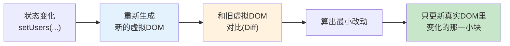

# 附录 B · 前端概念详解（组件 / Hooks / 状态 / 虚拟 DOM / Promise / async-await）

> 回到：[README 目录](README.md) ｜ 相关：[11-React-CRUD页面](11-React-CRUD页面.md)、[10-封装axios与API层](10-封装axios与API层.md)

第 9~11 章的 React 代码里出现了「组件、状态、`useState`、`useEffect`、虚拟 DOM、`async/await`」等词。本附录把这些前端核心概念讲清楚，让你不只是"照抄能跑"，而是真懂。

---

## B.1 组件（Component）—— 前端的"积木"

### B.1.1 是什么

**组件就是一段可复用的、能自己管理外观和行为的 UI 单元**。在 React 里，一个组件通常就是一个**返回 JSX 的 JavaScript 函数**：

```jsx
function Hello() {
  return <h2>你好，世界</h2>;   // 返回的这段"类 HTML"叫 JSX
}
```

一个页面 = 很多组件拼起来。比如第 11 章的 `UserManager` 里就嵌了表单、表格等结构。组件可以像标签一样嵌套使用：`<UserManager />`。

### B.1.2 什么是 JSX

JSX 是"在 JS 里写的类 HTML 语法"。它不是字符串，也不是 HTML，而是会被工具（Vite/Babel）编译成普通 JS 函数调用。要点：
- 用 `className` 而不是 `class`（因为 `class` 是 JS 关键字）。
- 用 `{}` 嵌入 JS 表达式：`<td>{user.username}</td>`。
- 必须有**一个**根节点（或用 `<>...</>` 空标签包裹）。

### B.1.3 为什么用组件

- **复用**：写一次 `<UserRow>`，列表里循环用 N 次。
- **拆分复杂度**：大页面拆成小组件，各管一块，好维护。
- **组合**：小组件拼成大组件，像搭积木。

---

## B.2 状态（State）—— 组件"会变的数据"

### B.2.1 是什么

**状态是组件内部会随时间变化的数据**。比如"当前用户列表""表单里输入的内容""是否正在加载"。

React 最核心的思想是：**UI = f(状态)**。即"界面是状态的函数"。你不用手动去操作 DOM（不用 `document.getElementById` 再改内容），**只要改状态，React 自动重新渲染界面**。

### B.2.2 用 useState 管理状态

```jsx
const [users, setUsers] = useState([]);   // 声明一个状态 users，初始值是空数组
//     ↑读     ↑改                ↑初始值

setUsers(data);   // 一调用，React 就知道"数据变了"，自动重新渲染这个组件
```

- `users`：当前状态值（读）。
- `setUsers`：**唯一**能改它的函数（写）。
- **不要直接 `users.push(...)` 去改**，必须调 `setUsers(...)`，否则 React 察觉不到变化、界面不更新。

### B.2.3 为什么"改状态就自动刷新界面"

因为调用 `setXxx` 会触发该组件**重新执行一遍函数**（重新渲染），用新状态算出新的 JSX，React 再对比并更新页面（见 B.4 虚拟 DOM）。这就是第 11 章里"增删改成功后调 `loadUsers()` 重新 `setUsers`，表格就自动更新"的原理。

---

## B.3 Hooks —— 给函数组件"加能力"的钩子

### B.3.1 是什么

**Hooks 是一批以 `use` 开头的函数**，让函数组件能用上"状态""副作用"等能力。最常用两个：

| Hook | 作用 |
|------|------|
| `useState` | 声明和管理状态（B.2 已讲） |
| `useEffect` | 处理"副作用"：如组件加载后请求数据、订阅、定时器等 |

### B.3.2 useEffect 详解

```jsx
useEffect(() => {
  loadUsers();      // 要执行的副作用（这里：加载用户列表）
}, []);             // ← 依赖数组
```

**依赖数组决定它什么时候跑**：

| 依赖数组 | 何时执行 |
|---------|---------|
| `[]`（空） | **只在组件首次挂载后执行一次**（第 11 章初始化加载用的就是它） |
| `[count]` | 首次 + 每当 `count` 变化时执行 |
| 不写第二个参数 | 每次渲染后都执行（慎用，易死循环） |

"副作用"指的是"渲染之外、与外部世界打交道的事"——比如发网络请求、操作定时器。把它们放进 `useEffect`，React 才能在合适时机帮你执行/清理。

### B.3.3 Hooks 的两条铁律（⚠️ 必记）

1. **只能在组件函数的最顶层调用**——不能放进 `if`、`for`、嵌套函数里（否则每次渲染 Hook 数量/顺序不一致会出错）。
2. **只能在 React 函数组件或自定义 Hook 里调用**——不能在普通函数里用。

---

## B.4 虚拟 DOM（Virtual DOM）—— React 为什么快

### B.4.1 真实 DOM 的问题

浏览器里的 DOM（页面元素树）**直接频繁操作它很慢**。如果每次数据变化都手动大改 DOM，既麻烦又低效。

### B.4.2 虚拟 DOM 是什么

**虚拟 DOM 是用 JS 对象来"描述"页面结构的一份轻量副本**。React 的工作方式：



1. 状态一变，React 先在内存里生成一棵新的"虚拟 DOM 树"（纯 JS 对象，很快）。
2. 拿它和上一棵旧树**对比（Diffing）**，找出到底哪里变了。
3. **只把变化的那一小部分**更新到真实 DOM 上，而不是整页重刷。

### B.4.3 为什么用它

- **性能**：把"多次零散的真实 DOM 操作"合并成"一次最小化更新"。
- **开发爽**：你只管改状态、描述"界面应该长什么样"，**具体怎么高效更新 DOM 交给 React**。这也呼应了 B.2 的 `UI = f(状态)`。

> 附带一提：第 11 章里 `users.map(...)` 渲染列表时每行要加 `key={u.id}`，正是为了帮 React 的 Diff 算法**准确识别哪一行变了/删了**，提升对比效率。

---

## B.5 Promise —— 处理"将来才有结果"的事

### B.5.1 为什么需要它

网络请求（如调后端接口）是**异步**的：发出去后不会立刻有结果，要等服务器响应。JS 不能"卡在原地干等"，于是用 **Promise** 表示"一个将来会完成（或失败）的操作"。

### B.5.2 是什么

**Promise 是一个"承诺"对象，代表一个异步操作的最终结果**。它有三种状态：

| 状态 | 含义 |
|------|------|
| `pending` | 进行中（还没结果） |
| `fulfilled` | 成功（拿到结果） |
| `rejected` | 失败（出错了） |

传统用 `.then()` / `.catch()` 取结果：

```js
getUsers()
  .then(data => console.log('成功拿到', data))   // 成功走这里
  .catch(err => console.log('出错了', err));     // 失败走这里
```

axios 的每个请求（`request.get(...)`）返回的就是一个 Promise。

---

## B.6 async / await —— 让异步代码"看起来像同步"

### B.6.1 是什么

`async/await` 是建立在 Promise 之上的**语法糖**，让异步代码写得像顺序执行的同步代码，更好读：

```jsx
// 用 async/await（第 11 章用的就是这种）
const loadUsers = async () => {        // 函数前加 async，才能在里面用 await
  setLoading(true);
  try {
    const data = await getUsers();     // await：等这个 Promise 有结果再往下走
    setUsers(data);                    // 拿到 data 后才执行这行
  } finally {
    setLoading(false);                 // 无论成败都执行
  }
};
```

对比 `.then()` 写法，`async/await` 把"回调嵌套"拉平成"从上到下顺序读"，更直观。

### B.6.2 要点

- `await` 只能用在 `async` 函数里。
- `await 一个Promise` = "暂停在这行，等结果出来再继续"（但不会卡死浏览器，只是这个函数内部等待）。
- 用 `try/catch` 捕获错误（相当于 Promise 的 `.catch`）；`finally` 里放"无论成败都要做的事"（如关闭 loading）。

### B.6.3 和后端调用串起来

第 10 章封装的 `getUsers()` 返回 Promise → 第 11 章用 `await getUsers()` 拿到数据 → `setUsers(data)` 改状态 → React 重渲染 → 虚拟 DOM diff → 表格更新。前端这条链就闭环了。

---

> 回到 👉 [11-React-CRUD页面](11-React-CRUD页面.md) ｜ [README 目录](README.md)
