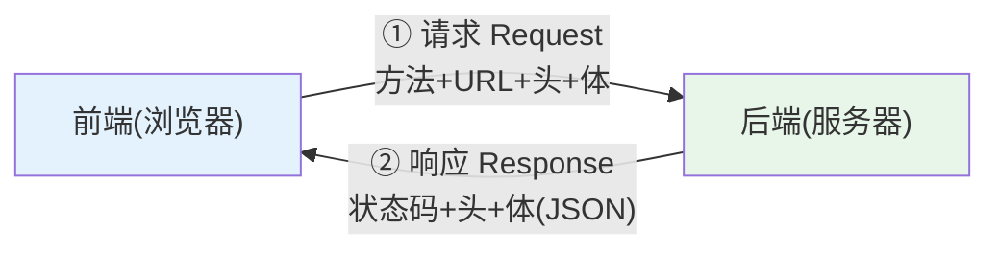
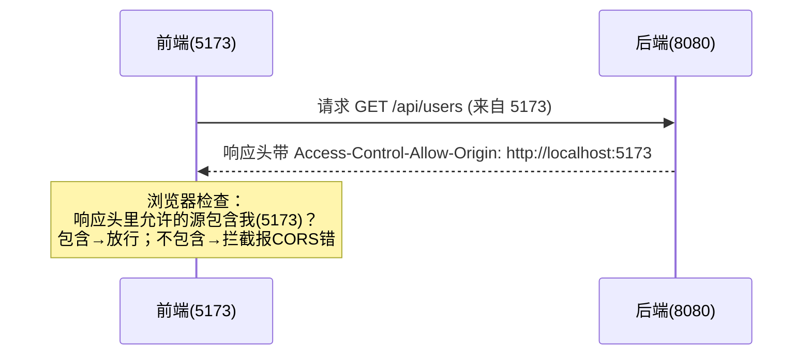

# 附录 C · HTTP 与 JSON 基础（请求方法 / 状态码 / 跨域原理）

> 回到：[README 目录](README.md) ｜ 相关：[06-后端分层代码](06-后端分层代码.md)、[07-统一返回-跨域-异常](07-统一返回-跨域-异常.md)

前后端分离项目里，前端和后端就是靠 **HTTP 协议**传 **JSON 数据**来通信的。理解这两样，你才明白第 6 章的 REST 接口、第 7 章的跨域配置到底在干什么。

---

## C.1 HTTP 是什么

**HTTP（超文本传输协议）是浏览器和服务器之间"对话"的规则**。一次对话分两部分：客户端发**请求（Request）**，服务器回**响应（Response）**。



### C.1.1 请求（Request）的组成

| 部分 | 说明 | 例子 |
|------|------|------|
| **请求方法** | 想做什么操作 | `GET` / `POST` / `PUT` / `DELETE` |
| **URL** | 访问哪个资源 | `http://localhost:8080/api/users/1` |
| **请求头(Headers)** | 附加说明 | `Content-Type: application/json` |
| **请求体(Body)** | 携带的数据（GET 通常没有） | `{"username":"张三","age":25}` |

### C.1.2 响应（Response）的组成

| 部分 | 说明 | 例子 |
|------|------|------|
| **状态码** | 这次请求成功/失败 | `200`、`404`、`500` |
| **响应头** | 附加说明 | `Content-Type: application/json` |
| **响应体** | 返回的数据 | `{"code":200,"data":[...]}` |

---

## C.2 请求方法（HTTP Methods）

不同方法表达不同"意图"，这正是第 6 章 REST 风格的基础：

| 方法 | 语义 | 幂等? | 本教程用途 |
|------|------|-------|-----------|
| **GET** | 查询/读取 | 是 | 查列表、查单条 |
| **POST** | 新建 | 否 | 新增用户 |
| **PUT** | 整体更新 | 是 | 修改用户 |
| **PATCH** | 局部更新 | 否 | （本教程未用） |
| **DELETE** | 删除 | 是 | 删除用户 |

> **幂等**：同样的请求发一次和发多次，对服务器的最终结果一样。`GET` 查 100 次数据不变；`DELETE` 删同一个 id，删 1 次和删 5 次结果都是"它没了"。而 `POST` 新增，发 5 次会多出 5 条——所以不幂等。理解幂等有助于设计接口和做重试。

---

## C.3 状态码（Status Code）

服务器用三位数字告诉你结果。**看首位就能判断大类**：

| 区间 | 含义 | 常见码 |
|------|------|--------|
| **2xx** | ✅ 成功 | `200 OK`（成功）、`201 Created`（已创建） |
| **3xx** | 🔀 重定向 | `301 永久移动`、`304 未修改(用缓存)` |
| **4xx** | ❌ **客户端**错了 | `400 请求参数错`、`401 未认证`、`403 无权限`、`404 找不到` |
| **5xx** | 💥 **服务器**错了 | `500 服务器内部错误`、`502 网关错误`、`503 服务不可用` |

**排错口诀**：`4xx` 先查前端（URL 写错？参数缺失？没登录？）；`5xx` 去看后端日志（代码抛异常了）。

> ⚠️ 注意区分：本教程第 7 章的 `Result` 里也有个 `code`（如 `200`/`500`），那是**业务状态码**，写在响应体 JSON 里，由我们自己定义；它和 HTTP 状态码是**两回事**。很多项目 HTTP 层永远返回 `200`，用响应体里的业务 code 表示成败——两种风格都常见。

---

## C.4 JSON 是什么

**JSON（JavaScript Object Notation）是一种轻量的数据格式**，前后端交换数据的"通用语言"。它是**纯文本字符串**，长得像 JS 对象：

```json
{
  "code": 200,
  "message": "success",
  "data": [
    { "id": 1, "username": "张三", "age": 25, "email": "z@test.com" }
  ]
}
```

### C.4.1 语法要点

- 只有几种类型：**对象 `{}`、数组 `[]`、字符串、数字、布尔 `true/false`、`null`**。
- **键必须用双引号** `"key"`（不能单引号、不能不加引号）。
- 不能有注释、不能有多余的尾逗号。
- 没有日期类型，时间通常用字符串表示（如 `"2026-07-07T10:00:00"`）。

### C.4.2 JSON ↔ 对象的转换（序列化）

| 方向 | 前端(JS) | 后端(Java) |
|------|----------|-----------|
| 对象 → JSON 字符串 | `JSON.stringify(obj)` | Jackson 自动（`@RestController` 返回时） |
| JSON 字符串 → 对象 | `JSON.parse(str)` | Jackson 自动（`@RequestBody` 接收时） |

这解释了第 6 章：`@RequestBody User user` 就是 Jackson 把前端发来的 JSON **反序列化**成 `User` 对象；Controller 返回 `User`/`Result` 时又被**序列化**成 JSON 发回前端。axios 也会自动把响应体 JSON 解析成 JS 对象。

---

## C.5 跨域（CORS）原理 —— 第 7 章那段配置到底在防什么

### C.5.1 什么是"同源策略"

浏览器有一条安全规则叫**同源策略**：网页只能自由访问**同源**的接口。"同源" = **协议 + 域名 + 端口**三者完全相同。

本教程里：
- 前端： `http://localhost:5173`
- 后端： `http://localhost:8080`

**端口不同（5173 ≠ 8080）→ 不同源 → 跨域**。浏览器默认会**拦截**这种跨域请求的响应，前端就报 `blocked by CORS policy`。

### C.5.2 为什么浏览器要这么"多管闲事"

为了安全：防止你登录了银行网站后，另一个恶意网页偷偷拿你的登录状态去请求银行接口。同源策略是浏览器保护用户的重要机制。

### C.5.3 CORS 是怎么"放行"的

**CORS（跨域资源共享）**是一套"服务器明确表示我允许某些外部源访问"的机制。关键在**后端在响应头里声明允许谁**：



第 7 章的 `CorsConfig` 做的就是让后端在响应里带上这类 `Access-Control-Allow-*` 头：

```java
registry.addMapping("/api/**")
        .allowedOrigins("http://localhost:5173")   // 告诉浏览器：我允许这个源
        .allowedMethods("GET","POST","PUT","DELETE","OPTIONS")
        .allowedHeaders("*");
```

### C.5.4 预检请求（Preflight / OPTIONS）

对于 `PUT`、`DELETE` 或带自定义头/JSON 体的"复杂请求"，浏览器会**先自动发一个 `OPTIONS` 请求**去问后端："我接下来想发个 PUT，你允许吗？"后端答应了，才发真正的请求。这就是为什么 `allowedMethods` 里要包含 `OPTIONS`。

### C.5.5 关键认知

- **跨域是浏览器的限制，不是后端的**。用 Postman 或 IDEA HTTP Client 直接调后端**永远不会有跨域问题**（它们不是浏览器）——所以第 8 章"先用 .http 测通后端"能绕开跨域，快速验证后端本身是否正常。
- 跨域要**在后端解决**（配 CORS），或用开发代理（Vite 的 `server.proxy`）把前端请求转发到后端，做到"同源"。

---

> 回到 👉 [07-统一返回-跨域-异常](07-统一返回-跨域-异常.md) ｜ [README 目录](README.md)
