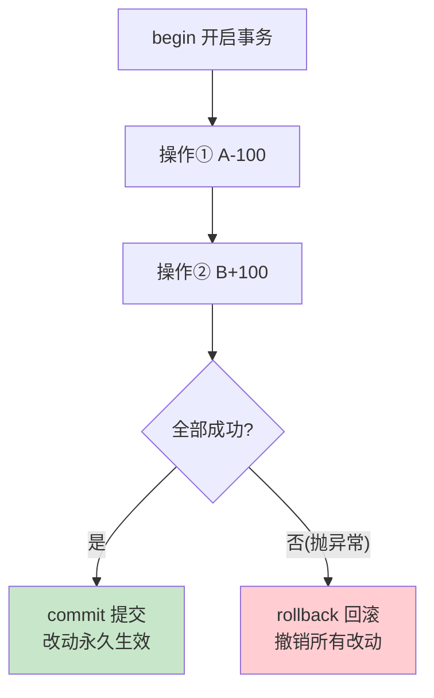
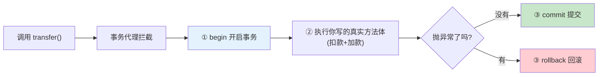
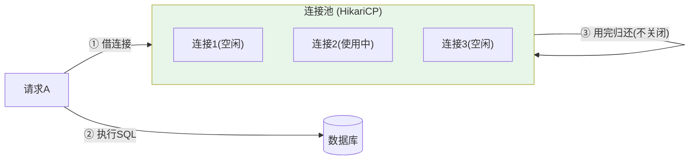

# 附录 D · 数据库与事务（事务 / ACID / @Transactional / 连接池 HikariCP）

> 回到：[README 目录](README.md) ｜ 相关：[05-数据库连接与MyBatisFlex配置](05-数据库连接与MyBatisFlex配置.md)、[06-后端分层代码](06-后端分层代码.md)

第 5 章配了数据库连接和 HikariCP 参数，第 6 章提到"多步写操作要加 `@Transactional`"。本附录把**事务、ACID、`@Transactional` 的生效原理、连接池**这几个绕不开的概念讲清楚。

---

## D.1 什么是事务（Transaction）

### D.1.1 一个经典例子：转账

A 给 B 转 100 元，数据库要做两步：

```
① A 的余额 - 100
② B 的余额 + 100
```

如果第 ① 步成功后、第 ② 步执行前程序崩了，会怎样？**A 少了 100，B 却没多——钱凭空消失了。** 这是绝对不能接受的。

**事务就是把"多个操作捆成一个不可分割的整体"**：要么全部成功，要么全部失败回退（就像什么都没发生过）。转账的两步必须在同一个事务里，"同生共死"。

### D.1.2 事务的三个核心动作

| 动作 | 含义 |
|------|------|
| **begin（开启）** | 声明"接下来的操作属于一个事务" |
| **commit（提交）** | 全部成功，把改动**永久保存**到数据库 |
| **rollback（回滚）** | 中途出错，**撤销**本事务内所有已做的改动，回到起点 |



---

## D.2 ACID —— 事务的四个保证

事务之所以可靠，是因为数据库保证它满足 **ACID** 四个特性：

| 字母 | 名称 | 含义 | 转账例子 |
|------|------|------|---------|
| **A** | 原子性(Atomicity) | 事务内操作不可分割，要么全做要么全不做 | 扣款和加款不能只成功一个 |
| **C** | 一致性(Consistency) | 事务前后，数据都处于"合法状态" | 转账前后总金额不变 |
| **I** | 隔离性(Isolation) | 多个事务并发执行时互不干扰 | 别人同时转账不会读到你转一半的中间状态 |
| **D** | 持久性(Durability) | 一旦 commit，改动永久保存，即使断电也不丢 | 转账成功后数据库重启，钱还在 |

### D.2.1 隔离级别（Isolation Level）简述

"隔离性"有强弱之分。隔离越强越安全，但性能越低。常见级别（由弱到强）：

| 级别 | 可能出现的问题 |
|------|--------------|
| 读未提交 (Read Uncommitted) | 脏读（读到别人没提交的数据） |
| 读已提交 (Read Committed) | 不可重复读 —— **SQL Server 默认** |
| 可重复读 (Repeatable Read) | 幻读 |
| 串行化 (Serializable) | 最安全，但最慢 |

> 一般用数据库默认级别即可，除非有特殊并发要求。`@Transactional(isolation = ...)` 可单独指定。

---

## D.3 @Transactional 怎么生效（原理）

### D.3.1 用法：一个注解搞定

在 Service 方法（或类）上加 `@Transactional`，Spring 就自动帮你 begin / commit / rollback：

```java
@Service
public class AccountServiceImpl implements AccountService {

    private final AccountMapper accountMapper;
    public AccountServiceImpl(AccountMapper m) { this.accountMapper = m; }

    @Transactional   // ★ 这个方法里的所有数据库操作，被包在同一个事务里
    @Override
    public void transfer(Long fromId, Long toId, BigDecimal money) {
        accountMapper.decrease(fromId, money);   // ① 扣款
        // 如果这里抛异常 ↓，上面的扣款会被自动回滚
        accountMapper.increase(toId, money);     // ② 加款
    }   // 方法正常结束 → 自动 commit；中途抛异常 → 自动 rollback
}
```

**行为规则**：方法正常返回就 commit；方法抛出**运行时异常（RuntimeException）**就 rollback。

### D.3.2 它凭什么能"自动"包事务？—— 又是动态代理

`@Transactional` 的生效原理和 [附录 A](附录A-Spring核心概念详解.md) 讲的**动态代理**是同一套机制：

Spring 不会真的执行你写的 `transfer` 那个原始对象，而是给它套了一个**代理对象**。你调用 `transfer()` 时，实际先进入代理：



代理在"执行你的方法"前后，自动插入了开启事务、提交/回滚的逻辑。这就是"加个注解就有事务"的真相。

### D.3.3 ⚠️ @Transactional 的常见坑

正因为它靠**代理**生效，就有几个必须知道的陷阱：

1. **只对 `public` 方法生效**：代理无法拦截 private/protected 方法。
2. **类内部自己调自己会失效**：同一个类里 `methodA()` 直接调 `this.methodB()`（methodB 上有 `@Transactional`），走的是原始对象、绕过了代理，事务不生效。解决：拆到另一个 Bean，或注入自身代理。
3. **默认只回滚 `RuntimeException` 和 `Error`**：如果你 catch 了异常没往外抛，或抛的是受检异常（如 `IOException`），默认**不回滚**。需要时用 `@Transactional(rollbackFor = Exception.class)`。
4. **事务方法里不要 catch 异常后"吞掉"**：吞了异常 Spring 就不知道要回滚了。
5. **只作用于数据库操作**：它不能回滚"发邮件""调第三方接口"这类外部副作用。

---

## D.4 连接池 HikariCP 在干嘛

### D.4.1 为什么需要连接池

程序每次要操作数据库，都需要一个"数据库连接（Connection）"。而**建立一个数据库连接是很贵的**：要走网络握手、身份验证、分配资源，可能耗时几十到几百毫秒。

如果每来一个请求就新建一个连接、用完就关，高并发下会：
- 慢（每次都花时间建连接）；
- 数据库被大量连接压垮。

### D.4.2 连接池是什么

**连接池 = 预先建好一批连接放在"池子"里，反复借用、归还，而不是用一次扔一次。**



流程：请求来了 → 从池里**借**一个空闲连接 → 执行 SQL → 用完**还**回池里（连接不关闭，留给下一个请求用）。这样省去了反复建连接的开销。

### D.4.3 HikariCP 是什么

**HikariCP 是目前最快、最主流的 Java 连接池**，也是 **Spring Boot 默认自带**的连接池——所以第 5 章我们没额外引依赖就能用。第 5 章配的那几个参数就是调它：

```yaml
spring:
  datasource:
    hikari:
      maximum-pool-size: 10    # 池里最多 10 个连接（并发上限）
      minimum-idle: 5          # 至少保持 5 个空闲连接待命
```

| 参数 | 含义 | 调优提示 |
|------|------|---------|
| `maximum-pool-size` | 最大连接数 | 不是越大越好；受数据库承受能力限制，常见 10~20 |
| `minimum-idle` | 最小空闲连接数 | 保证突发请求时有连接可用 |
| `connection-timeout` | 借连接的最长等待(ms) | 池满时等多久还借不到就报错 |
| `idle-timeout` | 空闲连接多久被回收 | — |
| `max-lifetime` | 连接最长存活时间 | 建议略小于数据库的连接超时 |

### D.4.4 和事务的关系

一个事务从头到尾必须用**同一个连接**（否则 begin 和 commit 不在一个连接上就乱了）。Spring 的事务管理会从 HikariCP 借一个连接，绑定到当前事务，直到 commit/rollback 后才归还。你不用手动管这些，理解即可。

---

## D.5 小结

| 概念 | 一句话 |
|------|--------|
| 事务 | 把多个操作捆成"要么全成、要么全败"的整体 |
| ACID | 事务的四大保证：原子、一致、隔离、持久 |
| `@Transactional` | 加个注解，Spring 用**代理**自动帮你 begin/commit/rollback |
| 连接池 | 预建一批连接反复借还，避免反复建连接的高开销 |
| HikariCP | Spring Boot 默认的高性能连接池，第 5 章配的就是它 |

---

> 回到 👉 [06-后端分层代码](06-后端分层代码.md) ｜ [README 目录](README.md)
