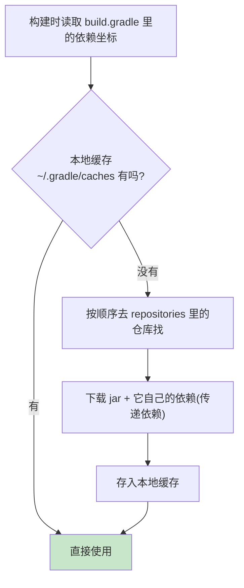

# 附录 E · Gradle 构建原理（依赖下载 / implementation vs api / 构建生命周期）

> 回到：[README 目录](README.md) ｜ 相关：[04-创建SpringBoot后端](04-创建SpringBoot后端.md)

第 4 章我们写了 `build.gradle`，加了一堆 `implementation`、`runtimeOnly`、`annotationProcessor`。本附录讲清楚：**Gradle 到底是什么、依赖是怎么被下载来的、各种依赖配置有什么区别、一次构建都经历了哪些阶段。**

---

## E.1 Gradle 是什么

**Gradle 是一个"构建工具"**——负责把你的源代码"变成"能运行的程序，中间要做：下载依赖、编译代码、跑测试、打包成 jar 等一系列自动化工作。

同类工具还有 Maven。Gradle 的优势：脚本更灵活（用 Groovy/Kotlin 写）、构建更快（增量编译 + 构建缓存）。

### E.1.1 Gradle Wrapper（gradlew）—— 为什么不用自己装 Gradle

项目里的 `gradlew`（Linux/Mac）和 `gradlew.bat`（Windows）叫 **Gradle Wrapper**。它是一个"自带的小启动器"：第一次运行时会**自动下载项目指定版本的 Gradle**，保证团队里每个人、CI 服务器用的 Gradle 版本完全一致。

> 所以第 2 章说"无需单独装 Gradle"——用 `./gradlew build` 而不是 `gradle build`，就是让 Wrapper 帮你搞定版本。版本号记录在 `gradle/wrapper/gradle-wrapper.properties`。

---

## E.2 依赖是怎么被下载来的

### E.2.1 三个要素：坐标、仓库、缓存

**① 坐标（GAV）**：每个依赖用三段唯一标识——`group:artifact:version`：

```groovy
implementation 'com.mybatis-flex:mybatis-flex-spring-boot3-starter:1.11.0'
//               └── group ──┘ └──────── artifact ────────┘ └version┘
```

**② 仓库（repositories）**：Gradle 去哪找这些 jar。第 4 章配的：

```groovy
repositories {
    maven { url 'https://maven.aliyun.com/repository/public' }  // 阿里云镜像(国内快)
    mavenCentral()                                              // 官方中央仓库
}
```

**③ 本地缓存**：下载过的 jar 会缓存在本机（`~/.gradle/caches/`），下次直接用，不重复下载。

### E.2.2 下载流程



### E.2.3 传递依赖（Transitive Dependencies）

你只写了一个 `spring-boot-starter-web`，Gradle 却下载了几十个 jar——因为它会**自动把这个依赖所依赖的东西一起拉下来**（如 Tomcat、Jackson 等）。这叫传递依赖，省得你手动列一大串。

> 用 `./gradlew dependencies` 可以打印完整的依赖树，排查版本冲突时很有用。

---

## E.3 依赖配置的区别（implementation / api / compileOnly ...）

这是第 4 章那些关键字的深入解释。它们决定依赖**在什么阶段可用**，以及**是否"传染"给依赖你的人**。

### E.3.1 逐个对比

| 配置 | 编译期可用? | 运行期可用? | 会传递给上游模块? | 典型用途 |
|------|:---:|:---:|:---:|---------|
| `implementation` | ✅ | ✅ | ❌ **不传递** | 绝大多数依赖（默认首选） |
| `api` | ✅ | ✅ | ✅ **会传递** | 库开发时，要暴露给使用方的依赖 |
| `compileOnly` | ✅ | ❌ | ❌ | 只编译要、运行不要（如 Lombok） |
| `runtimeOnly` | ❌ | ✅ | ❌ | 只运行要、编译不引用（如 JDBC 驱动 mssql-jdbc） |
| `annotationProcessor` | 编译期跑 | ❌ | ❌ | 注解处理器（Lombok、mybatis-flex-processor） |
| `testImplementation` | 仅测试 | 仅测试 | ❌ | 只在测试代码里用（JUnit 等） |

### E.3.2 重点：implementation vs api 的区别

这是最常被问的。假设有三个模块：**你的App → 依赖 B 库 → B 库依赖 C 库**。


- **B 库用 `implementation C`**：C 对 B 是"内部实现细节"。**你的 App 看不到 C**（编译期用不了 C 的类）。好处：B 将来把 C 换掉，不影响你的 App，**编译隔离、构建更快**。
- **B 库用 `api C`**：C 被 B "公开"了。**你的 App 也能直接用 C 的类**。代价：C 一变，所有用 B 的人都可能受影响、要重新编译。

**经验法则**：**默认永远用 `implementation`**；只有当你在写一个库、且某依赖的类会出现在你对外暴露的方法签名里时，才用 `api`。对我们这种应用项目，几乎全用 `implementation`。

### E.3.3 回看第 4 章为什么那样写

| 第 4 章的写法 | 为什么 |
|--------------|--------|
| `implementation "...mybatis-flex-spring-boot3-starter"` | 编译和运行都要用它的类 |
| `runtimeOnly "...mssql-jdbc"` | 代码里不直接 import 驱动类，只有运行时 JDBC 需要它 → 省得编译期误用 |
| `annotationProcessor "...mybatis-flex-processor"` | 它只在编译期跑，生成 `UserTableDef`，运行时不需要 |
| `compileOnly + annotationProcessor 'lombok'` | Lombok 编译期生成 getter/setter，运行时不需要它 |

---

## E.4 构建生命周期（一次 build 都干了啥）

### E.4.1 Gradle 的两层概念：Task 与生命周期

Gradle 干的每件事都是一个 **Task（任务）**，如 `compileJava`（编译）、`test`（测试）、`jar`（打包）。任务之间有依赖关系，Gradle 按顺序执行。

**Gradle 自身的三个执行阶段**（了解即可）：

| 阶段 | 干什么 |
|------|--------|
| Initialization（初始化） | 确定有哪些项目要构建 |
| Configuration（配置） | 执行 `build.gradle` 脚本，构建任务关系图 |
| Execution（执行） | 真正运行被要求的那些 Task |

### E.4.2 常用命令与它触发的任务链


| 命令 | 作用 |
|------|------|
| `./gradlew compileJava` | 只编译主代码（第 6 章生成 `UserTableDef` 就靠它触发 APT） |
| `./gradlew test` | 运行单元测试 |
| `./gradlew build` | 全套：编译 + 测试 + 打包 |
| `./gradlew bootRun` | Spring Boot 插件提供的：直接启动应用（第 8 章用过） |
| `./gradlew clean` | 删除 `build/` 目录，清理构建产物 |
| `./gradlew dependencies` | 打印依赖树 |

> `bootRun`、`bootJar` 这些任务是第 4 章加的 `org.springframework.boot` 插件带来的——**插件（plugins）会给项目"注入"额外的任务和能力**。

### E.4.3 为什么 Gradle 快：增量与缓存

- **增量构建**：没改过的代码不重复编译。
- **构建缓存**：任务的输出会被缓存，输入没变就直接复用结果。
- 这就是为什么第二次 `build` 通常比第一次快很多。

---

## E.5 小结

| 概念 | 一句话 |
|------|--------|
| Gradle | 构建工具：下载依赖、编译、测试、打包全自动化 |
| Wrapper (gradlew) | 自带启动器，自动用项目指定版本的 Gradle |
| 依赖坐标 | `group:artifact:version` 三段式唯一标识 |
| 仓库 + 缓存 | 去 repositories 找 jar，下过的存本地不重下 |
| `implementation` | 默认首选，不向上游传递、编译隔离、构建快 |
| `api` | 会把依赖暴露给使用方，写库时才用 |
| 生命周期 | 一堆 Task 按依赖顺序执行：编译→测试→打包 |

---

> 回到 👉 [04-创建SpringBoot后端](04-创建SpringBoot后端.md) ｜ [README 目录](README.md)
