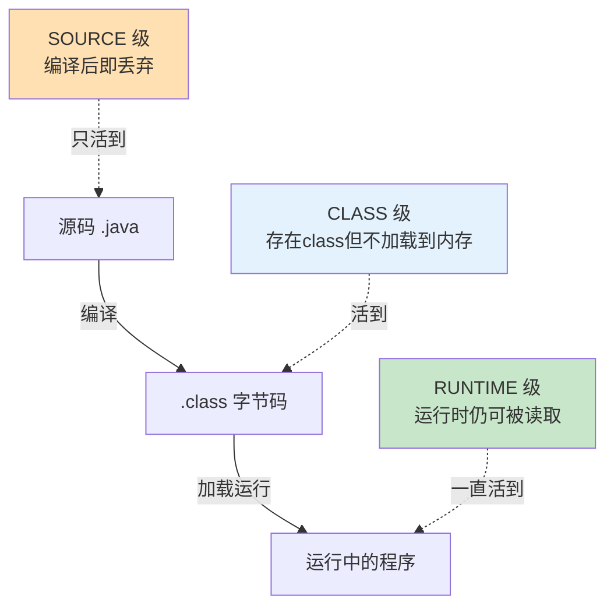

# 附录 F · 注解详解与速查（Annotation）

> 回到：[README 目录](README.md) ｜ 相关：[06-后端分层代码](06-后端分层代码.md)、[附录A-Spring核心概念详解](附录A-Spring核心概念详解.md)

本教程的 Java 代码里满眼都是 `@Table`、`@Service`、`@RestController`、`@Transactional`… 这些以 `@` 开头的东西叫**注解（Annotation）**。它们是 Spring 生态的"灵魂"。本附录先把"注解到底是什么、作什么用、怎么起作用"讲透，再给出分类速查表和易混对比。

---

## F.0 先澄清：注释 ≠ 注解（别搞混）

中文里两个词读音相近，但完全是两回事：

| 名称 | 英文 | 长什么样 | 给谁看 | 作用 |
|------|------|---------|--------|------|
| **注释** | Comment | `// 单行` `/* 多行 */` | **给人看** | 解释代码，程序运行时**完全忽略**，删掉不影响功能 |
| **注解** | Annotation | `@Table` `@Service` | **给程序/框架看** | 是一种"标记"，框架读取它后会**改变程序行为**，删了功能会变 |

```java
// 这是注释：解释给人看的，删掉程序照跑
@Service   // 这是注解：删掉它，Spring 就不认这个类为 Bean，程序会出错
public class UserServiceImpl { ... }
```

**本附录讲的是「注解」。**

---

## F.1 注解到底是什么？作什么用？

### F.1.1 一句话定义

**注解是"贴在代码上的一个标签（元数据）"。它本身不执行任何逻辑，只是一个标记；真正干活的是"读取这个标记的人"（框架、编译器、或你自己写的处理器）。**

打个比方：注解就像**行李上的标签贴纸**。


- 贴纸（注解）本身不会让行李移动。
- 是**分拣员（框架）看到贴纸，才按规则去处理**。
- 没有分拣员，贴纸就只是一张纸——**没有框架去读取，注解什么也不会发生**。

### F.1.2 用注解和不用注解，差别在哪

Spring 早期用 XML 配置一个 Bean 要这样写：

```xml
<!-- 传统 XML 方式：又长又容易写错 -->
<bean id="userService" class="com.example.UserServiceImpl">
    <constructor-arg ref="userMapper"/>
</bean>
```

用注解后，只要一个词：

```java
@Service   // 等价于上面一大段 XML
public class UserServiceImpl { ... }
```

**注解的价值 = 用简洁的"标记"代替繁琐的配置。** 这就是 Spring 推崇的「**约定优于配置（Convention over Configuration）**」：你打个标准标记，框架按约定帮你搞定一堆事。

### F.1.3 注解可以带"参数"

注解后面括号里能传值，进一步告诉框架"具体怎么处理"：

```java
@Table("sys_user")                        // 参数：表名叫 sys_user
@RequestMapping("/api/users")             // 参数：URL 前缀
@Id(keyType = KeyType.Auto)               // 命名参数：主键策略是自增
@Transactional(rollbackFor = Exception.class)  // 命名参数：所有异常都回滚
```

没有参数的注解就直接写 `@Service`、`@Override`。

---

## F.2 注解是怎么"起作用"的？（原理）

注解本身是"死"的，必须有人读它。按"什么时候被读取"，注解分三种**保留策略（RetentionPolicy）**：



| 保留策略 | 何时被读取 | 谁来读 | 例子 |
|---------|-----------|--------|------|
| **SOURCE** | 仅编译期，编完就没了 | 编译器 / 注解处理器(APT) | Lombok 的 `@Data`、`@Override`、mybatis-flex-processor 生成 `UserTableDef` |
| **CLASS** | 保留在字节码，但运行时不加载 | 少见 | 一些字节码工具 |
| **RUNTIME** | 运行时仍能被读取 | 框架靠**反射**读取 | Spring 的 `@Service`、`@RestController`、`@Transactional` 等绝大多数 |

### F.2.1 两条主要的"读取"路线

**① 运行时反射（RUNTIME 注解）——Spring 走这条**

程序运行时，Spring 用**反射**扫描类，"看见"哪些类带了 `@Service`、哪些方法带了 `@GetMapping`，据此创建 Bean、注册路由、织入事务。这也解释了[附录 A](附录A-Spring核心概念详解.md) 的容器启动过程——本质就是"读注解 → 做相应处理"。

**② 编译期处理（SOURCE 注解）——Lombok / MyBatis-Flex 处理器走这条**

编译时，**注解处理器（APT）** 读到 `@Data` 就生成 getter/setter 代码；读到实体上的 `@Table` 就生成 `UserTableDef` 类。这些注解编译完就"功成身退"，运行时已不存在。（详见[附录 E](附录E-Gradle构建原理.md) 里 `annotationProcessor` 的说明。）

### F.2.2 关键认知

> **注解不会自己生效，必须有"读取者"配套。** 你写的 `@Service` 之所以有用，是因为 Spring 框架在运行时去读它了；如果一个自定义注解没人读，它就只是个装饰。

---

## F.3 分类速查表（本教程涉及的注解）

### F.3.1 Web 控制层（Spring MVC）

| 注解 | 贴在哪 | 作用 |
|------|--------|------|
| `@RestController` | 类 | 标记为控制器，且每个方法返回值自动转 JSON |
| `@Controller` | 类 | 标记为控制器（返回视图名，前后端不分离时用） |
| `@RequestMapping("/api/users")` | 类/方法 | 定义 URL 映射（常用作类级前缀） |
| `@GetMapping` `@PostMapping` `@PutMapping` `@DeleteMapping` | 方法 | 分别映射 GET/POST/PUT/DELETE 请求 |
| `@PathVariable` | 参数 | 取 URL 路径里的变量，如 `/users/{id}` 的 `id` |
| `@RequestBody` | 参数 | 把请求体 JSON 反序列化成 Java 对象 |
| `@RequestParam` | 参数 | 取 URL 查询参数，如 `?page=1` 的 `page` |
| `@ResponseBody` | 方法 | 返回值转 JSON（`@RestController` 已内含） |

### F.3.2 容器与依赖装配（Spring Core）

| 注解 | 贴在哪 | 作用 |
|------|--------|------|
| `@SpringBootApplication` | 启动类 | 三合一：`@Configuration`+`@EnableAutoConfiguration`+`@ComponentScan` |
| `@Component` | 类 | 最基础的"我是 Bean"标记 |
| `@Service` | 类 | `@Component` 变体，语义=业务层 |
| `@Repository` | 类 | `@Component` 变体，语义=数据层 |
| `@Configuration` | 类 | 配置类，内部可用 `@Bean` 产出 Bean |
| `@Bean` | 方法 | 把方法返回值注册成 Bean |
| `@Autowired` | 构造器/字段/Setter | 依赖注入（构造器注入且唯一构造器时可省略） |
| `@Qualifier("名字")` | 参数/字段 | 同类型多个 Bean 时，指定注入哪一个 |
| `@Value("${...}")` | 字段 | 注入配置文件里的值 |

> `@Component`/`@Service`/`@Repository` 详见 [附录 A.3.3](附录A-Spring核心概念详解.md)。

### F.3.3 事务

| 注解 | 贴在哪 | 作用 |
|------|--------|------|
| `@Transactional` | 类/方法 | 声明式事务，自动 begin/commit/rollback（原理见 [附录 D.3](附录D-数据库与事务.md)） |

### F.3.4 MyBatis-Flex（持久层）

| 注解 | 贴在哪 | 作用 |
|------|--------|------|
| `@Table("sys_user")` | 实体类 | 声明该类映射哪张表 |
| `@Id(keyType = KeyType.Auto)` | 字段 | 声明主键及生成策略（`Auto`=数据库自增） |
| `@Column("列名")` | 字段 | 字段名与列名不一致时显式映射 |
| `@MapperScan("包名")` | 启动类 | 扫描 Mapper 接口，动态代理生成实现并注册为 Bean |
| `@Mapper` | Mapper 接口 | 单个标记为 Mapper（与 `@MapperScan` 二选一） |

### F.3.5 Lombok（编译期生成代码）

| 注解 | 贴在哪 | 作用 |
|------|--------|------|
| `@Data` | 类 | 一次生成 getter/setter/toString/equals/hashCode |
| `@Getter` `@Setter` | 类/字段 | 只生成 getter 或 setter |
| `@RequiredArgsConstructor` | 类 | 为 `final` 字段生成构造器（可辅助构造器注入） |
| `@Slf4j` | 类 | 生成一个 `log` 日志对象 |
| `@Builder` | 类 | 生成建造者模式 API |

### F.3.6 校验与异常处理（进阶）

| 注解 | 贴在哪 | 作用 |
|------|--------|------|
| `@Valid` | 参数 | 触发对象字段校验 |
| `@NotNull` `@NotBlank` `@Size` `@Min` | 字段 | 具体校验规则 |
| `@RestControllerAdvice` | 类 | 全局异常处理器（见第 7 章） |
| `@ExceptionHandler(Xxx.class)` | 方法 | 指定处理某类异常 |

---

## F.4 易混淆注解对比（最容易踩坑）

### F.4.1 @Controller vs @RestController

| | `@Controller` | `@RestController` |
|---|--------------|-------------------|
| 返回值默认当作 | **视图名**（找 HTML 页面） | **数据**（自动转 JSON） |
| 适用 | 传统服务端渲染（JSP/Thymeleaf） | **前后端分离（本教程）** |
| 关系 | —— | = `@Controller` + `@ResponseBody` |

### F.4.2 @PathVariable vs @RequestParam vs @RequestBody（参数从哪来）

```
DELETE /api/users/5?force=true    请求体: {"reason":"..."}
                   ↑        ↑                ↑
            @PathVariable  @RequestParam   @RequestBody
             (路径里的5)   (问号后的force)  (JSON 请求体)
```

| 注解 | 数据来源 | 例子 |
|------|---------|------|
| `@PathVariable` | URL **路径**的一段 | `/users/{id}` → `id=5` |
| `@RequestParam` | URL **查询字符串**（`?key=value`） | `?force=true` → `force=true` |
| `@RequestBody` | **请求体**（通常是 JSON） | `{"username":"张三"}` → User 对象 |

### F.4.3 @Component vs @Service vs @Repository

三者**功能几乎完全一样**（都是把类注册成 Bean），区别只在**语义**——让代码更能表达意图：

| 注解 | 语义暗示 | 用在 |
|------|---------|------|
| `@Component` | 通用组件 | 不属于下面三层的杂项 Bean |
| `@Service` | 业务逻辑 | Service 层 |
| `@Repository` | 数据访问 | DAO/Mapper 层（还会转换数据库异常） |
| `@Controller`/`@RestController` | 控制层 | Controller 层 |

> 用哪个都能跑，但**按层选对应的注解**是良好习惯，别人一看就懂这个类是干嘛的。

---

## F.5 本教程注解总索引（配跳转）

| 注解 | 出现章节 | 一句话作用 |
|------|---------|-----------|
| `@SpringBootApplication` | [05](05-数据库连接与MyBatisFlex配置.md) | 启动类总开关（含组件扫描、自动配置） |
| `@MapperScan` | [05](05-数据库连接与MyBatisFlex配置.md) | 扫描并代理生成 Mapper（原理见 [附录A.5](附录A-Spring核心概念详解.md)） |
| `@Table` `@Id` | [06](06-后端分层代码.md) | 实体↔表映射、主键策略 |
| `@Data`(Lombok) | [06](06-后端分层代码.md) | 自动生成 getter/setter 等 |
| `@Service` | [06](06-后端分层代码.md) | 注册业务层 Bean（Bean 概念见 [附录A.3](附录A-Spring核心概念详解.md)） |
| `@RestController` `@RequestMapping` `@GetMapping`… `@PathVariable` `@RequestBody` | [06](06-后端分层代码.md) | REST 接口相关（详见 [附录C](附录C-HTTP与JSON基础.md)） |
| `@Configuration` | [07](07-统一返回-跨域-异常.md) | 跨域配置类 |
| `@RestControllerAdvice` `@ExceptionHandler` | [07](07-统一返回-跨域-异常.md) | 全局异常处理 |
| `@Transactional` | [06](06-后端分层代码.md) / [附录D](附录D-数据库与事务.md) | 声明式事务 |

---

## F.6 小结

| 问题 | 答案 |
|------|------|
| 注解是什么？ | 贴在代码上的"标签/元数据"，本身不干活 |
| 注解作什么用？ | 让框架/编译器读取后改变程序行为，用简洁标记代替繁琐配置 |
| 注解怎么生效？ | 必须有"读取者"：Spring 运行时用**反射**读，Lombok/APT 编译期读 |
| 注释 vs 注解？ | 注释给人看、运行忽略；注解给程序看、影响行为 |

---

> 回到 👉 [06-后端分层代码](06-后端分层代码.md) ｜ [README 目录](README.md)
