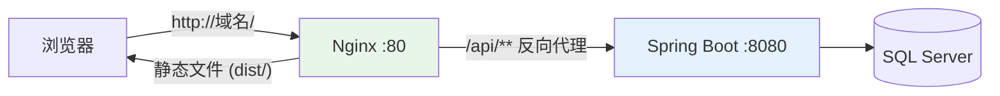

# 附录 G · 项目部署上线（打包 / 生产配置 / Nginx / Docker）

> 回到：[README 目录](README.md) ｜ 相关：[08-启动与接口测试](08-启动与接口测试.md)、[附录E-Gradle构建原理](附录E-Gradle构建原理.md)

开发时前端 `npm run dev`(5173)、后端 IDEA 里跑(8080)。但**上线不能这么跑**。本附录讲怎么把前后端打包成生产制品，并给出三种主流部署方案。

---

## G.1 开发环境 vs 生产环境有什么不同

| | 开发环境 | 生产环境 |
|---|---------|---------|
| 前端 | `npm run dev` 热更新服务器 | 打包成静态文件（HTML/JS/CSS）由 Web 服务器托管 |
| 后端 | IDEA 里点绿三角 | 打包成 jar，用 `java -jar` 常驻运行 |
| 配置 | 本地数据库、明文密码 | 生产数据库、密码走环境变量 |
| 跨域 | 后端配 CORS 放行 5173 | 通常用 Nginx 反向代理做到"同源"，不再需要 CORS |
| 端口 | 5173 / 8080 | 对外统一 80(HTTP) / 443(HTTPS) |

---

## G.2 后端：打包成可执行 jar

### G.2.1 打包

Spring Boot 插件提供 `bootJar` 任务（见[附录 E](附录E-Gradle构建原理.md)），一条命令打出一个**自带内嵌 Tomcat 的可执行 jar**：

```bash
./gradlew clean bootJar
# 产物在 build/libs/crud-backend-0.0.1-SNAPSHOT.jar
```

### G.2.2 运行

```bash
java -jar build/libs/crud-backend-0.0.1-SNAPSHOT.jar
```

无需在服务器上单独装 Tomcat——jar 里已内嵌。看到 `Tomcat started on port 8080` 即启动成功。

### G.2.3 生产配置（Profile + 外部化）

不要把生产数据库密码写死在代码里。用 **Profile** 分环境：

`application.yml`（公共）：
```yaml
spring:
  profiles:
    active: dev   # 默认用 dev；上线时用启动参数覆盖成 prod
```

`application-prod.yml`（生产专用）：
```yaml
server:
  port: 8080
spring:
  datasource:
    url: jdbc:sqlserver://生产库地址:1433;databaseName=demo_db;encrypt=true;trustServerCertificate=true
    username: ${DB_USER}       # ← 从环境变量读，不写死
    password: ${DB_PASSWORD}   # ← 从环境变量读，不写死
```

启动时指定用 prod 配置，并通过环境变量传密码：

```bash
DB_USER=sa DB_PASSWORD=你的密码 \
java -jar app.jar --spring.profiles.active=prod
```

> **安全铁律**：生产密码、密钥**绝不进 Git**。用环境变量、启动参数或配置中心。

---

## G.3 前端：打包成静态文件

### G.3.1 打包

```bash
cd crud-frontend
npm run build
# 产物在 dist/ 目录：index.html + assets/*.js + *.css
```

`dist/` 就是一堆纯静态文件，任何 Web 服务器都能托管。

### G.3.2 处理后端地址

开发时 axios 的 `baseURL` 写的是 `http://localhost:8080/api`。上线要改成生产地址，或——更常用——**改成相对路径 `/api`，由 Nginx 反向代理转发到后端**（见 G.4），这样前端不用关心后端在哪，也天然规避跨域。

```javascript
// request.js —— 生产建议用相对路径，交给 Nginx 转发
const request = axios.create({ baseURL: '/api', timeout: 10000 });
```

---

## G.4 方案一：Nginx 托管前端 + 反向代理后端（推荐）

这是前后端分离最主流的生产架构：**Nginx 对外只开一个端口(80)**，静态页面它自己发，`/api` 开头的请求转发给后端 jar。



**因为浏览器只和 Nginx(同一个域名+端口)打交道，前端眼里一切都是"同源"，跨域问题自然消失**（不再依赖后端的 CORS 配置）。

### Nginx 配置示例（`nginx.conf` 的 server 段）

```nginx
server {
    listen 80;
    server_name your-domain.com;

    # 1) 托管前端静态文件
    location / {
        root   /var/www/crud-frontend/dist;   # 把打包的 dist 放这里
        index  index.html;
        try_files $uri $uri/ /index.html;      # 单页应用刷新不 404 的关键
    }

    # 2) /api 开头的请求，反向代理给后端 jar
    location /api/ {
        proxy_pass http://127.0.0.1:8080;      # 后端地址
        proxy_set_header Host $host;
        proxy_set_header X-Real-IP $remote_addr;
    }
}
```

> `try_files ... /index.html` 这行很重要：单页应用（SPA）所有路由都交给 `index.html`，否则刷新子页面会 404。

**部署步骤**：① 前端 `npm run build` → 把 `dist/` 传到 `/var/www/crud-frontend/dist`；② 后端 `bootJar` → 服务器上 `java -jar` 启动；③ 配好上面的 Nginx 并 `nginx -s reload`。

---

## G.5 方案二：前端并入后端（一体化，最省事）

小项目可以把前端打包产物**直接放进 Spring Boot**，一个 jar 全搞定，连 Nginx 都不用。

1. 前端 `npm run build` 得到 `dist/`。
2. 把 `dist/` 里的文件拷进后端 `src/main/resources/static/`。
3. Spring Boot 会自动把 `static/` 下的文件当静态资源发布。
4. 打一个 jar，`java -jar` 后访问 `http://服务器:8080/` 就是前端页面，`/api/**` 就是接口——**天然同源，无跨域**。

> 优点：部署极简（单 jar）。缺点：前后端耦合、每次改前端要重打后端 jar，适合小型/内部项目。

---

## G.6 方案三：Docker 容器化（可移植、易扩展）

用 Docker 把应用连同运行环境打包成"容器"，在任何装了 Docker 的机器上都能一致运行。

**后端 `Dockerfile`**：
```dockerfile
FROM eclipse-temurin:17-jre
WORKDIR /app
COPY build/libs/crud-backend-0.0.1-SNAPSHOT.jar app.jar
EXPOSE 8080
ENTRYPOINT ["java", "-jar", "app.jar", "--spring.profiles.active=prod"]
```

**前端 `Dockerfile`**（用 Nginx 镜像托管 dist）：
```dockerfile
FROM nginx:alpine
COPY dist/ /usr/share/nginx/html/
COPY nginx.conf /etc/nginx/conf.d/default.conf
EXPOSE 80
```

**用 `docker-compose.yml` 一键拉起前端+后端**：
```yaml
services:
  backend:
    build: ./crud-backend
    environment:
      - DB_USER=sa
      - DB_PASSWORD=你的密码
    ports:
      - "8080:8080"
  frontend:
    build: ./crud-frontend
    ports:
      - "80:80"
    depends_on:
      - backend
```

```bash
docker compose up -d   # 后台启动全部服务
```

> 数据库 SQL Server 也可以用官方镜像 `mcr.microsoft.com/mssql/server` 加进 compose，但生产环境数据库通常用独立托管实例，不建议随容器同生共死。

---

## G.7 三种方案怎么选

| 方案 | 复杂度 | 适合 | 跨域 |
|------|--------|------|------|
| ① Nginx 反代 | 中 | **大多数生产项目（推荐）** | 天然同源 |
| ② 并入后端单 jar | 低 | 小型/内部项目、快速上线 | 天然同源 |
| ③ Docker | 中高 | 需要可移植、多环境、易扩缩容 | 视配置 |

---

## G.8 上线检查清单 ✅

- [ ] 后端 `bootJar` 能成功打包并 `java -jar` 启动
- [ ] 生产用 `application-prod.yml`，数据库密码走**环境变量**（未进 Git）
- [ ] 前端 `npm run build` 成功，`baseURL` 指向正确（相对 `/api` 或生产域名）
- [ ] 数据库连接串用生产地址，`encrypt`/`trustServerCertificate` 按实际证书情况配置
- [ ] Nginx（若用）配了 `try_files ... /index.html`，刷新不 404
- [ ] 关闭调试用的 SQL 日志（生产别开 `StdOutImpl`，影响性能）
- [ ] 有 HTTPS（443）和域名（生产建议）
- [ ] 日志、备份、监控到位

---

> 回到 👉 [README 目录](README.md) ｜ [08-启动与接口测试](08-启动与接口测试.md)
