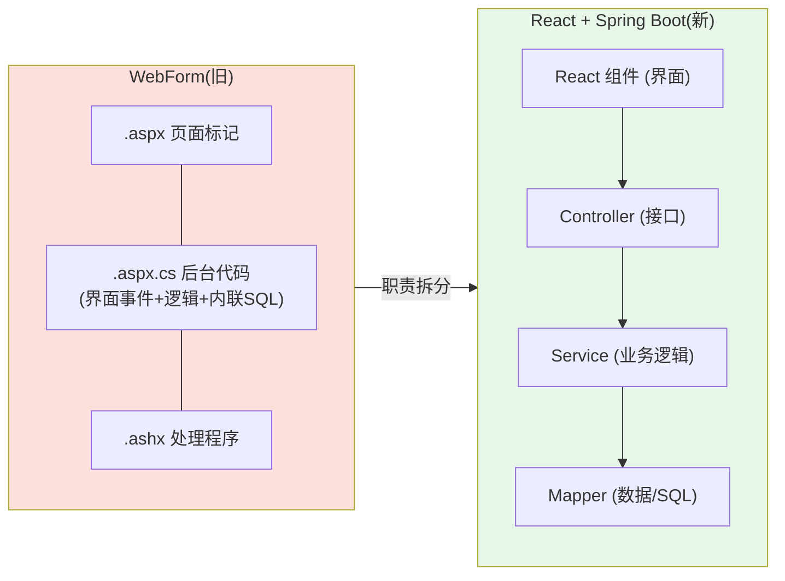

# 附录 H · WebForm 到 Spring Boot 概念对照表（老手过渡专用）

> 回到：[README 目录](README.md) ｜ 相关：[06-后端分层代码](06-后端分层代码.md)、[附录F-注解详解与速查](附录F-注解详解与速查.md)

如果你有 **ASP.NET WebForm（`.aspx` + 后台 `.aspx.cs` + 内联 SQL）** 的底子，这份对照表帮你用**已有的知识当锚点**快速理解 Spring Boot。左边是你熟悉的，右边是对应物。**不用从零学，只需"翻译"。**

> 前提：本教程是**前后端分离**（React + Spring Boot）。WebForm 里"服务端拼页面"的职责，被拆成了「React 管界面」+「Spring Boot 出数据接口」两块。所以有些 WebForm 概念对应到**前端**，有些对应到**后端**。

---

## H.1 全景对照图

**核心变化**：WebForm 把"界面 + 逻辑 + SQL"揉在一个 `.aspx.cs` 里；Spring Boot 把它们**拆开**——界面给 React，逻辑给 Service，SQL 给 Mapper。

---

## H.2 项目结构与入口

| WebForm | Spring Boot | 说明 |
|---------|-------------|------|
| 解决方案 / 项目(.csproj) | Gradle 项目(build.gradle) | 构建单元 |
| `Global.asax`（`Application_Start`） | **启动类** `@SpringBootApplication` 的 `main()` | 应用启动入口 |
| `Application_Start` 里的初始化 | `CommandLineRunner` / `@PostConstruct` | 启动时执行一次的逻辑 |
| `web.config` | **`application.yml`** | 配置文件（见 [第 5 章](05-数据库连接与MyBatisFlex配置.md)） |
| `<connectionStrings>` | `spring.datasource.*` | 数据库连接配置 |
| `<appSettings>` | 自定义配置 + `@Value("${...}")` | 读取配置项 |
| `bin/` 里的 `.dll` | `build/libs/` 里的 `.jar` | 编译产物 |
| NuGet 包 | Gradle 依赖（[附录 E](附录E-Gradle构建原理.md)） | 第三方库管理 |
| `namespace` | `package` | 命名空间/包 |
| `using xxx;` | `import xxx;` | 引入 |

---

## H.3 页面 / 界面层（对应到 React）

| WebForm | 对应物 | 说明 |
|---------|--------|------|
| `.aspx`（页面标记 HTML） | **React 组件 / JSX** | 界面结构 |
| `.master`（母版页） | React 布局组件 | 公共头尾框架 |
| `.ascx`（用户控件） | React 子组件 | 可复用 UI 片段 |
| 服务器控件 `GridView`/`Repeater` | React 里 `list.map(...)` 渲染 | 列表渲染（见 [第 11 章](11-React-CRUD页面.md)） |
| `DataBind()` 数据绑定 | React **状态驱动渲染**（`setState` → 自动重渲） | [附录 B.2](附录B-前端概念详解.md) |
| **ViewState** | ❌ **没有对应，也不需要** | REST 无状态；界面数据由 React 的 state 管理 |
| **PostBack** / `__doPostBack` | **AJAX / fetch 请求**（axios，[第 10 章](10-封装axios与API层.md)） | 不再整页回发，改为局部发请求拿 JSON |
| `Page_Load` 事件 | React `useEffect(()=>{...},[])` | 页面加载后执行（在前端，[附录 B.3](附录B-前端概念详解.md)） |
| `Response.Redirect` | 前端路由跳转（React Router） | 页面跳转交给前端 |

> **最大观念转变**：WebForm 是"整页回发（PostBack）→ 服务器重新拼整页"；React + REST 是"局部发 AJAX → 拿 JSON → 前端只更新变化的部分"。所以 **ViewState 这类为"整页回发"服务的机制，直接消失了**。

---

## H.4 请求处理 / 接口层（对应到 Controller）

| WebForm | Spring Boot | 说明 |
|---------|-------------|------|
| `.ashx`（`IHttpHandler`，返回 JSON） | **Controller**（更高层）/ Servlet（同层） | `.ashx` ≈ 底层 Servlet；Controller 是其上的封装 |
| `.asmx`（旧 Web Service） | `@RestController` REST 接口 | 对外接口 |
| `.aspx.cs` 里的按钮事件 `Button_Click` | Controller 的一个方法 `@PostMapping` | 一个操作 = 一个方法 |
| `Request["id"]` 手动取参 | `@RequestParam` / `@PathVariable` 自动绑定 | 参数获取（[附录 F.4](附录F-注解详解与速查.md)） |
| `Request.Form` / 读请求体 | `@RequestBody User` 自动转对象 | JSON 反序列化 |
| `JsonConvert.Serialize` + `Response.Write` | 返回对象，框架**自动转 JSON** | 序列化（[附录 C.4](附录C-HTTP与JSON基础.md)） |
| `?action=list/add/del` 的 if/else 调度 | 按 URL + HTTP 方法自动路由 | 不再需要手写调度盘 |
| `HttpModule` / `HttpHandler` | `Filter` / `Interceptor` | 请求拦截 |
| 各页面重复的 try/catch + `alert` | `@RestControllerAdvice` **全局异常**（[第 7 章](07-统一返回-跨域-异常.md)） | 统一异常处理 |

> 关于 `.ashx` 和 Controller/Servlet 的详细关系（"手工挡 vs 自动挡"），本教程正文讨论过：`.ashx` 能返回 JSON，但路由、参数绑定、序列化都要手写；Controller 把这些自动化了。

---

## H.5 数据访问层（对应到 Mapper —— 你最熟的部分）

| WebForm | Spring Boot + MyBatis-Flex | 说明 |
|---------|---------------------------|------|
| `SqlConnection` + `SqlCommand` | HikariCP 连接池 + Mapper（[附录 D.4](附录D-数据库与事务.md)） | 连接由框架托管，不用手动 open/close |
| 页面里的**内联 SQL**（`CommandType.Text`） | **Mapper + `QueryWrapper`** 或 XML/`@Select` | SQL 从页面里抽出来，集中管理 |
| **存储过程**（你常把内联 SQL 改的那个） | Mapper 方法（可仍调用存储过程）| 见下方 H.5.1 专门说明 |
| `SqlParameter`（手动加参数） | 方法参数 / 实体字段自动绑定 | 防注入，框架处理 |
| `SqlDataReader` 逐行读 | 查询结果**自动映射成实体对象** | 不用手写 `reader["username"]` |
| `DataSet` / `DataTable` | `List<User>` / 实体对象 | 强类型对象代替弱类型表格 |
| `reader["username"].ToString()` | `user.getUsername()` | 强类型、有提示、不易拼错 |

### H.5.1 给你的特别说明：存储过程怎么办？

你习惯"把页面内联 SQL 改写成存储过程"——这个习惯**在 Spring Boot 里完全可以延续**：

- **方案一（延续你的习惯）**：SQL 继续放在数据库的存储过程里，Java 侧的 Mapper 只负责**调用存储过程**。MyBatis-Flex/MyBatis 支持用 `@Select` 或 XML 调 `EXEC 存储过程名`。这样你的"数据层"依然在数据库端。
- **方案二（框架推荐）**：简单 CRUD 直接用 `BaseMapper` + `QueryWrapper`，SQL 由框架生成，连存储过程都不用写。
- **两者可混用**：简单的用 QueryWrapper，复杂/已有的存储过程继续调用。

> 关键认知：**你把内联 SQL 抽成存储过程，本质就是在"分层"**（把数据访问从页面逻辑里分离）。Mapper 层做的是同一件事，只是把这层放在 Java 里管理。所以你早就在实践分层的思想了。

---

## H.6 状态、会话与缓存

| WebForm | Spring Boot | 说明 |
|---------|-------------|------|
| `Session["user"]` | `HttpSession`（仍可用）或 **JWT/Token**（前后端分离推荐） | 前后端分离更倾向无状态 Token |
| `Application["x"]`（应用级全局） | 单例 **Bean** / 静态配置（[附录 A.3](附录A-Spring核心概念详解.md)） | 全局共享数据 |
| `Cache`（页面/数据缓存） | Spring Cache `@Cacheable` / Redis | 缓存 |
| Forms Authentication / Membership | **Spring Security** | 认证授权 |
| Cookie 操作 | `HttpServletResponse` 加 Cookie / 前端管理 | Cookie |

> **登录状态**是过渡时的一个重点：WebForm 靠 `Session` 存登录用户；前后端分离项目通常改用 **JWT**（登录后发一个 token，前端每次请求带上），后端无需保存会话，更利于扩展。

---

## H.7 语言层面（C# → Java）

| C# | Java | 说明 |
|----|------|------|
| 属性 `public string Name { get; set; }` | 字段 + `@Data`(Lombok) 自动生成 getter/setter | [附录 F](附录F-注解详解与速查.md) |
| `namespace` / `using` | `package` / `import` | — |
| `var` | `var`（Java 10+）/ 显式类型 | 局部变量类型推断 |
| `List<T>` / `Dictionary<K,V>` | `List<T>` / `Map<K,V>` | 集合 |
| `null` 判断 `?.` `??` | `Optional` / 显式判空 | 空值处理 |
| 特性 `[Attribute]` | 注解 `@Annotation` | 元数据标记（[附录 F](附录F-注解详解与速查.md)） |
| `try/catch/finally` | `try/catch/finally` | 几乎一样 |

---

## H.8 部署

| WebForm | Spring Boot | 说明 |
|---------|-------------|------|
| 发布到 **IIS 站点** | `java -jar`（内嵌 Tomcat）+ Nginx | 无需单独装 Web 服务器 |
| IIS 应用池 | JVM 进程 | 运行容器 |
| 复制 `bin/` + 页面文件 | 部署一个 `.jar`（后端）+ `dist/`（前端） | 制品（[附录 G](附录G-项目部署上线.md)） |
| `web.config` 改配置 | `application-prod.yml` / 环境变量 | 生产配置 |

---

## H.9 一句话速记

| 你熟悉的 | 就理解成 |
|---------|---------|
| `.aspx` 界面 | → React 组件 |
| `.aspx.cs` 后台代码 | → 拆成 Controller（接口）+ Service（逻辑） |
| `.ashx` 处理程序 | → Controller（本质是更高层的 Servlet） |
| 内联 SQL / 存储过程 | → Mapper（SQL 集中管理，存储过程可继续调） |
| `Global.asax` | → 启动类 `main()` |
| `web.config` | → `application.yml` |
| `Session` 登录态 | → JWT / Token |
| PostBack 整页回发 | → axios 发 AJAX 拿 JSON |
| ViewState | → 不需要了（React 的 state 管界面数据） |
| 发布到 IIS | → `java -jar` + Nginx |

---

## H.10 小结

- 你不是"从零学"，而是把已有概念**翻译**成新词：界面→React、逻辑→Controller/Service、SQL→Mapper。
- 你原本"抽存储过程"的习惯，正是**分层思想**，在 Spring Boot 里可无缝延续。
- 最大的观念升级是：**从"整页回发（PostBack）"转向"局部 AJAX + JSON"**，随之 ViewState 等机制不再需要，界面状态改由前端 React 管理。

---

> 回到 👉 [06-后端分层代码](06-后端分层代码.md) ｜ [README 目录](README.md)
