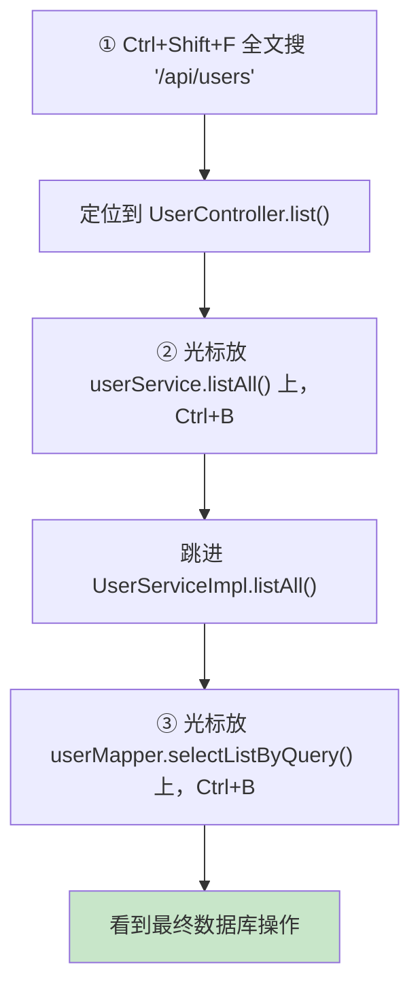

# 附录 I · 大型项目的组织与代码导航

> 回到：[README 目录](README.md) ｜ 相关：[06-后端分层代码](06-后端分层代码.md)、[附录H-WebForm到SpringBoot概念对照](附录H-WebForm到SpringBoot概念对照.md)

"一个功能写四五个文件，500 个功能岂不是几千个文件，怎么找？" —— 这是从 WebForm（一个页面一个文件）转过来的人最真实的疑问。本附录回答：**几千个文件里怎么快速定位。**

**关键反转认知**：让你觉得"复杂"的分层 + 命名规范，**恰恰是几千个文件还能被人接手、被导航的原因**。真正的噩梦是那种"一个文件几千行、命名随意、没有分层"的项目——那才是找都没法找。**文件多不可怕，可怕的是"没有规律的多"。**

---

## I.1 支柱一：命名规律 —— 知道一个，就知道全部

分层项目的文件名**高度可预测**。看到一个功能叫 `User`，不用找就能推出整套：

```
User            ← 实体      entity/User.java
UserMapper      ← 数据层    mapper/UserMapper.java
UserService     ← 业务接口  service/UserService.java
UserServiceImpl ← 业务实现  service/impl/UserServiceImpl.java
UserController  ← 接口层    controller/UserController.java
```

规律固定：**`功能名 + 层后缀`**。想找"订单的业务逻辑"，直接找 `OrderService` 就行。500 个功能只是同一套规律重复 500 次——**认知负担不是 500 倍，还是同一套规律。**

---

## I.2 支柱二：包的组织方式 —— 大项目用"按功能分包"

### I.2.1 两种风格

| 按层分包（小项目） | 按功能分包（大项目推荐） |
|-------------------|------------------------|
| `controller/`(500个) | `user/` ← 用户相关全在这 |
| `service/`(500个) | `order/` ← 订单相关全在这 |
| `mapper/`(500个) | `product/` |
| `entity/`(500个) | … |
| ❌ 每个包爆炸、跨包乱跳 | ✅ 找订单进 `order/` 即可 |

**按功能分包**：一个业务模块 = 一个文件夹，它的四层都在里面。找哪个功能，进哪个文件夹，不用在四个巨大的包之间来回跳。

### I.2.2 功能包内部的两种排布

```
① 扁平式(文件少)                 ② 嵌套式(文件多)
user/                            user/
├── User.java                    ├── controller/UserController.java
├── UserMapper.java              ├── service/UserService.java + impl/
├── UserService.java             ├── mapper/UserMapper.java
├── UserServiceImpl.java         ├── entity/User.java
└── UserController.java          ├── dto/  vo/  ...
```

### I.2.3 "功能"的粒度

一个包对应**"一块业务"**（如"用户"），不是"一个小操作"。"新增用户""查列表""改用户"都属于用户这块业务 → 同一个 `user/` 包里 `UserController` 的不同方法。所以"500 个操作"可能只对应几十个模块包，没那么吓人。

### I.2.4 公共包

跨功能共用的东西单独放 `common/`（或 `shared/`），不塞进具体功能：

```
com.example.crudbackend/
├── common/    ← Result、全局异常、工具类、CORS 配置
├── user/      ├── order/    ├── product/   ← 各功能模块
```

---

## I.3 支柱三：IDE 导航 —— 真正的答案

**没有人靠"用眼睛翻文件夹"找文件**，都是用 IDEA 快捷键秒定位。这是接手大项目的核心技能：

| 需求 | IDEA（Windows/Linux） | Mac | 效果 |
|------|----------------------|-----|------|
| 搜任何东西 | **Shift Shift**（双击 Shift） | 同 | 输入 `UserController` 直接跳 |
| 按类名找 | **Ctrl+N** | Cmd+O | 输入类名定位 |
| 按文件名找 | **Ctrl+Shift+N** | Cmd+Shift+O | 输入文件名定位 |
| 全文搜索 | **Ctrl+Shift+F** | Cmd+Shift+F | 搜 SQL、URL、报错文本 |
| 接口→实现 | **Ctrl+Alt+B** | Cmd+Opt+B | `UserService`→`UserServiceImpl` |
| 跳到定义 | **Ctrl+B** | Cmd+B | 点方法跳进去 |
| 谁调用了它 | **Alt+F7**（Find Usages） | Opt+F7 | 找出所有调用处 |
| 完整调用链 | **Ctrl+Alt+H**（Call Hierarchy） | Ctrl+Opt+H | 层层展开谁调谁 |
| 文件内结构 | **Alt+7** / Ctrl+F12 | Cmd+7 | 看类里有哪些方法 |
| 最近文件 | **Ctrl+E** | Cmd+E | 在文件间快速切换 |
| 前进/后退光标 | **Ctrl+Alt+←/→** | Cmd+Opt+←/→ | 跳来跳去后原路返回 |
| 加书签 | **F11** | F3 | 标记正在研究的关键点 |

---

## I.4 实操：接手项目后"顺藤摸瓜"找一个功能

已知前端请求 `/api/users`，想搞清"用户列表"怎么实现：



**几秒钟就把一个功能从"接口→业务→数据库"整条链摸清**，完全不需要知道文件在哪个文件夹。分层的可预测性 + IDE = 任何功能都能快速追踪。

---

## I.5 接手陌生大项目的方法论

1. **先看全局，别急着钻代码**：README、包结构、数据库表（一张表往往对应一个核心功能）。
2. **从"一个具体功能"入手**，顺着 I.4 的调用链读通一条，而不是想着一次读完几千个文件。
3. **看数据流，不看文件数**：抓住"请求从哪进、数据怎么流、从哪出"，文件多少就不重要了。
4. **善用书签(F11)、TODO、Call Hierarchy** 标记和梳理关键路径。
5. **改动前先 Find Usages(Alt+F7)**：看清一个方法/字段被谁用了，避免改坏别处。

---

## I.6 小结

| 支柱 | 作用 |
|------|------|
| 命名规律 | `功能名+层后缀`，知道一个推出全部 |
| 按功能分包 | 一个业务一个文件夹，四层聚在一起 |
| IDE 导航 | 快捷键秒定位，顺着调用链走，不靠翻文件夹 |

> 一句话：**分层 + 命名规范 + IDE，让"几千个文件"变成"有序可查"。** 你从 WebForm 来的"文件少"直觉，在大项目里恰恰会变成"没规律难找"；规范才是应对规模的解药。

---

> 回到 👉 [06-后端分层代码](06-后端分层代码.md) ｜ [README 目录](README.md)
