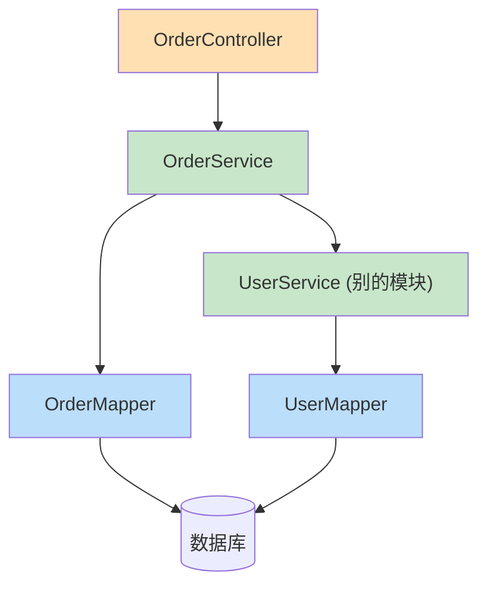

# 附录 J · 代码生成器与多模块协作

> 回到：[README 目录](README.md) ｜ 相关：[06-后端分层代码](06-后端分层代码.md)、[附录I-大型项目的组织与代码导航](附录I-大型项目的组织与代码导航.md)

针对两个高频疑问：**「四层每张表都手写太繁琐」**（→ 用代码生成器）和 **「多个模块的四层能不能相互调用」**（→ 能，靠依赖注入）。本附录给出可落地的做法。

---

## J.1 代码生成器 —— 四层一键生成，不用手写

### J.1.1 思路

MyBatis-Flex 自带**代码生成器**：连上数据库，读表结构，自动生成 Entity / Mapper / Service / ServiceImpl / Controller 全部代码。表越多越省事——**"功能多要写很多程序"这个担忧主要靠它解决。**

### J.1.2 加依赖

在 `build.gradle` 里加（生成器只在开发时用）：

```groovy
dependencies {
    // ... 原有依赖
    implementation 'com.mybatis-flex:mybatis-flex-codegen:1.11.0'
    // 生成器运行需要一个数据源实现和 SQL Server 驱动（项目里已有 mssql-jdbc）
    implementation 'com.zaxxer:HikariCP'
}
```

### J.1.3 写一个"一次性"的生成程序

新建一个 `CodeGenerator.java`（放在 `test` 或任意位置，跑一次即可），配置好包名和要生成的表：

```java
import com.mybatisflex.codegen.Generator;
import com.mybatisflex.codegen.config.GlobalConfig;
import com.zaxxer.hikari.HikariDataSource;
import javax.sql.DataSource;

public class CodeGenerator {
    public static void main(String[] args) {
        // 1) 配置数据源（指向你的 SQL Server）
        HikariDataSource ds = new HikariDataSource();
        ds.setJdbcUrl("jdbc:sqlserver://localhost:1433;databaseName=demo_db;encrypt=true;trustServerCertificate=true");
        ds.setUsername("sa");
        ds.setPassword("你的密码");

        // 2) 全局配置
        GlobalConfig config = new GlobalConfig();
        // 生成到哪个包
        config.getPackageConfig()
              .setBasePackage("com.example.crudbackend");
        // 生成哪些表（不设则全库表都生成）
        config.getStrategyConfig()
              .setGenerateTable("sys_user", "sys_role", "sys_order");
        // 要生成哪几层（按需开启）
        config.enableEntity();
        config.enableMapper();
        config.enableService();
        config.enableServiceImpl();
        config.enableController();

        // 3) 执行生成
        new Generator((DataSource) ds, config).generate();
        System.out.println("代码生成完毕！");
    }
}
```

> API 名称随 MyBatis-Flex 版本略有差异，以[官方文档](https://mybatis-flex.com)为准。核心流程都是：**数据源 → GlobalConfig（包名/表/开启哪些层）→ `Generator.generate()`**。

运行 `main`，四层代码全部生成到对应包里。你只需要事后微调业务逻辑，样板代码不用手敲。IDEA 也有类似的可视化生成插件。

### J.1.4 除了生成器，还能这样"减层"

分层不是铁板一块，简单场景可压缩：

| 技巧 | 说明 |
|------|------|
| 省掉 Service 接口 | 小项目只写一个 `UserService` 类，不写 `interface + impl` 两个文件 |
| 用 `ServiceImpl` 基类 | MyBatis-Flex 提供基类，几行就有整套 CRUD，方法不用逐个写 |
| Controller 直调 Mapper | 无业务逻辑的纯查询接口，可跳过 Service |
| 先简后繁 | 先写最简结构，等逻辑变复杂、需要复用/测试时再抽层 |

---

## J.1.5 完整实操：生成 → 只在 Service 填一条业务规则

下面用 `sys_user` 表走一遍完整流程，让你直观看到"**生成器包办样板，你只写业务逻辑**"。

### 第 1 步：跑生成器

运行 J.1.3 的 `CodeGenerator`（把 `setGenerateTable(...)` 里留 `"sys_user"` 即可）。跑完后，这 5 个文件被自动生成，**你一个字没敲**：

```
entity/User.java              ← 实体（按表字段生成）
mapper/UserMapper.java        ← 继承 BaseMapper，白得全套 CRUD
service/UserService.java      ← 业务接口（基础增删改查）
service/impl/UserServiceImpl.java  ← 业务实现（转调 Mapper）
controller/UserController.java     ← 5 个 REST 接口
```

### 第 2 步：看看生成的 Service 长什么样（骨架）

生成的 `UserServiceImpl` 大致是"直接转调 Mapper"的样子，**没有任何业务规则**——这正是留给你填的地方：

```java
@Service
public class UserServiceImpl implements UserService {

    private final UserMapper userMapper;
    public UserServiceImpl(UserMapper userMapper) { this.userMapper = userMapper; }

    @Override
    public boolean save(User user) {
        return userMapper.insert(user) > 0;   // ← 生成器只给了"直接插入"，没有任何校验
    }

    // listAll / getById / updateById / removeById ... 同理，都是直接转调
}
```

此时项目**已经能跑**：5 个接口都可用，纯 CRUD 一行业务代码都不用写。

### 第 3 步：只改 Service，加一条业务规则

现在加一个真实需求：**"新增用户前，用户名不能重复"**。这是生成器不可能知道的业务规则，只有你懂——所以只在 `UserServiceImpl.save()` 里动手，**其它四个文件（Entity/Mapper/Controller/接口）一律不碰**：

```java
import static com.example.crudbackend.entity.table.UserTableDef.USER;  // APT 生成的表定义

@Service
public class UserServiceImpl implements UserService {

    private final UserMapper userMapper;
    public UserServiceImpl(UserMapper userMapper) { this.userMapper = userMapper; }

    @Override
    public boolean save(User user) {
        // ★★★ 这几行就是你唯一要写的"业务逻辑" ★★★
        long count = userMapper.selectCountByQuery(
                QueryWrapper.create().where(USER.USERNAME.eq(user.getUsername()))
        );
        if (count > 0) {
            throw new RuntimeException("用户名已存在：" + user.getUsername());
        }
        // ★★★ 业务规则结束，下面是生成器给的原逻辑 ★★★

        user.setCreateTime(LocalDateTime.now());
        return userMapper.insert(user) > 0;
    }
}
```

就这么几行。前端调 `POST /api/users` 时，若用户名重复，全局异常处理器（[第 7 章](07-统一返回-跨域-异常.md)）会自动把它转成统一的错误 JSON 返回。

### 第 4 步：确认"你到底动了哪些文件"

| 文件 | 是否改动 | 说明 |
|------|:------:|------|
| `entity/User.java` | ❌ 没动 | 表结构没变，实体不用改 |
| `mapper/UserMapper.java` | ❌ 没动 | `selectCountByQuery` 是 `BaseMapper` 自带的 |
| `service/UserService.java`（接口） | ❌ 没动 | 方法签名没变 |
| **`service/impl/UserServiceImpl.java`** | ✅ **只改这里** | 加了 3~4 行"用户名查重"业务规则 |
| `controller/UserController.java` | ❌ 没动 | 接口不变，前端无感 |

**这就是核心结论的实证**：一个新需求，5 个文件里你只碰了 1 个、只加了几行。生成器负责"能跑的骨架"，你负责"业务的灵魂"。

> 小提示：如果规则涉及**多步写操作**（如"建用户同时建默认配置"），记得在方法上加 `@Transactional`（原理见 [附录 D.3](附录D-数据库与事务.md)），保证同成同败。

---

## J.2 多模块协作 —— 不同模块的四层能相互调用

### J.2.1 结论：能，靠依赖注入

假设有「用户」和「订单」两个模块，各有自己的四层。**它们完全可以相互调用**，靠的就是[附录 A](附录A-Spring核心概念详解.md) 讲的依赖注入——把要用的 Bean 注入进来即可。

### J.2.2 典型场景：订单模块需要用户信息

```java
@Service
public class OrderServiceImpl implements OrderService {

    private final OrderMapper orderMapper;
    private final UserService userService;   // ← 注入"另一个模块"的 Service

    // 构造器注入：容器自动把两个 Bean 塞进来
    public OrderServiceImpl(OrderMapper orderMapper, UserService userService) {
        this.orderMapper = orderMapper;
        this.userService = userService;
    }

    @Override
    public Long createOrder(Long userId, BigDecimal amount) {
        // 调用用户模块的业务，做校验
        User user = userService.getById(userId);
        if (user == null) throw new RuntimeException("用户不存在");

        Order order = new Order();
        order.setUserId(userId);
        order.setAmount(amount);
        orderMapper.insert(order);   // 用自己模块的 Mapper 存订单
        return order.getId();
    }
}
```

### J.2.3 调用规则（铁律）



| 规则 | 说明 |
|------|------|
| **横向协作优先走 Service 层** | 订单要用用户功能，注入 `UserService`（而非直接用 `UserMapper`），因为业务规则都在 Service |
| **只能上层调下层** | Controller→Service→Mapper 单向；下层**绝不能**反过来调上层 |
| **Controller 之间一般不互相调** | 控制层只面向前端；模块间协作放在 Service 层 |
| **Entity 只做数据载体** | 不在实体里写业务调用 |

### J.2.4 ⚠️ 当心循环依赖

如果 `OrderService` 注入 `UserService`，`UserService` 又反过来注入 `OrderService`，就形成**循环依赖**，启动可能报错（`BeanCurrentlyInCreationException`）。

```
OrderService → UserService
     ↑______________↓        ← 互相注入 = 循环，启动报错
```

解决办法：
1. **抽出第三方**：把两者共用的逻辑提到一个独立的 Service（如 `AccountFacadeService`），让 A、B 都依赖它，而不是互相依赖。
2. **重新划分边界**：循环依赖往往是模块职责划分不清的信号，是重构的提示。
3.（下策）用 `@Lazy` 延迟注入打破循环，但治标不治本。

---

## J.3 小结

| 疑问 | 答案 |
|------|------|
| 四层每表手写太繁琐？ | 用**代码生成器**一键生成；简单场景还能减层 |
| 多模块的四层能相互调用？ | 能，通过**依赖注入**引用别模块的 Service/Mapper |
| 协作要守什么规矩？ | 横向走 Service、只能上层调下层、当心循环依赖 |

> 分层的"文件多"是**一次性成本**，被生成器基本抹平；换来的是"每层小、职责清、好维护、可协作"的长期收益。功能越多，分层越划算。

---

> 回到 👉 [06-后端分层代码](06-后端分层代码.md) ｜ [README 目录](README.md)
