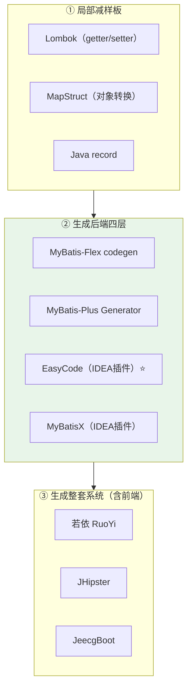

# 附录 K · 代码生成工具全景与选型（含 EasyCode 实操）

> 回到：[README 目录](README.md) ｜ 相关：[附录J-代码生成器与多模块协作](附录J-代码生成器与多模块协作.md)

代码生成工具非常多，MyBatis-Flex 自带的只是其中之一。本附录先给出**全景与选型**，再手把手教你用免费最好用的 **EasyCode**（IDEA 插件）连 SQL Server、配模板、一键生成四层。

---

## K.1 全景：按"生成什么"分三个层次

## K.2 全景表（标注是否免费）

| 工具 | 类型 | 生成什么 | 免费? |
|------|------|---------|:----:|
| **MyBatis-Flex codegen** | ORM 生成器 | 后端四层 | ✅ |
| **MyBatis-Plus Generator** | ORM 生成器 | 后端四层 | ✅ |
| **MyBatis Generator (MBG)** | ORM 生成器 | Entity/Mapper/XML | ✅ |
| **EasyCode** ⭐ | IDEA 插件 | 后端四层（模板可自定义） | ✅ |
| **MyBatisX** | IDEA 插件 | Mapper/XML、跳转 | ✅ |
| **JPA Buddy** | IDEA 插件 | 实体/Repository/DTO | 🟡 免费版+付费Pro |
| **IDEA Ultimate 数据库工具** | IDE 内置 | POJO（脚本可定制） | ❌ 需付费版 IDEA |
| **Spring Initializr** | 脚手架 | 项目骨架 | ✅ |
| **JHipster** | 全栈生成器 | 前端+后端+安全+测试 | ✅ |
| **若依 RuoYi** | 低代码平台 | 前端页面+后端 CRUD | ✅ |
| **JeecgBoot** | 低代码平台 | 在线设计并生成 | 🟡 社区免费+付费 |
| **Lombok / MapStruct** | 编译期 | 样板代码 | ✅ |
| **通义灵码 / Copilot** | AI 辅助 | 上下文补全 | 🟡 Copilot 收费/灵码有免费 |

## K.3 选型建议

| 你的目标 | 免费最优选 |
|---------|-----------|
| 在 IDEA 里选表生成后端四层、模板可改 | **EasyCode** ⭐ |
| 已用 MyBatis-Flex，保持一致 | **MyBatis-Flex codegen**（[附录 J](附录J-代码生成器与多模块协作.md)） |
| Mapper 增强 + 接口/XML 跳转 | **MyBatisX**（可与 EasyCode 同装） |
| 想连前端页面都省了、做内部管理系统 | **若依 RuoYi** |
| 前后端一把梭 | **JHipster** |
| 对象转换样板多 | **MapStruct** |

> **只推荐一个的话：先装 EasyCode。** 免费、上手快、不绑架项目结构，生成的就是标准 Spring Boot 四层代码。等要做大量内部管理页时再考虑若依。

---

## K.4 EasyCode 实操：连 SQL Server + 配模板 + 生成四层

> 环境：IntelliJ IDEA（社区版/旗舰版均可装该插件）+ 已有的 Spring Boot 项目 + SQL Server（`demo_db.sys_user`，见[第 3 章](03-SQLServer建库建表.md)）。

### 步骤 1：安装 EasyCode 插件

1. IDEA → **Settings/Preferences → Plugins → Marketplace**。
2. 搜索 **EasyCode** → **Install** → 重启 IDEA。
3.（可选）同时搜 **MyBatisX** 一起装，Mapper 跳转更顺手。

### 步骤 2：让 IDEA 能连上 SQL Server

EasyCode 依赖 IDEA 的 **Database 工具**读取表结构，先建好数据库连接：

1. 打开右侧 **Database** 面板（或 View → Tool Windows → Database）。
2. 点 **+ → Data Source → Microsoft SQL Server**。
3. 填写连接信息：
   - **Host**：`localhost`　**Port**：`1433`
   - **Database**：`demo_db`
   - **User**：`sa`　**Password**：你的密码
4. 首次会提示下载 SQL Server 驱动，点 **Download Driver**。
5.（本地无证书时）在 **Advanced/URL** 里补充：`encrypt=true;trustServerCertificate=true`，与[第 5 章](05-数据库连接与MyBatisFlex配置.md)的连接串一致。
6. 点 **Test Connection** 成功 → **OK**。此时能在面板里展开看到 `sys_user` 表。

### 步骤 3（可选）：配置生成模板与作者等信息

EasyCode 的模板决定生成代码的风格，可先用默认，再按需改：

1. **Settings → Other Settings → EasyCode**。
2. 里面能配置：
   - **Type Mapper**：数据库类型 → Java 类型的映射（如 SQL Server `datetime` → `LocalDateTime`、`bigint` → `Long`）。**检查一遍**，确保和你的实体类型一致。
   - **Template**：Entity / Mapper / Service / ServiceImpl / Controller 各有一个模板，用 Velocity 语法。可改包名规则、注释、是否加 `Result` 包装、是否生成 Service 接口等。
   - **Global Config**：作者名、日期格式等。
3. 初学者建议：**先用默认模板生成一遍看看效果，再逐步定制。**

### 步骤 4：选表生成四层代码

1. 在 Database 面板里 **右键 `sys_user` 表 → EasyCode → Generate Code**（或 Code Generation）。
2. 弹窗里设置：
   - **Module**：选你的后端模块。
   - **Package**：填目标包，如 `com.example.crudbackend`。
   - **Path**：生成到 `src/main/java`。
   - 勾选要生成的模板：**entity / mapper / service / serviceImpl / controller** 全选。
3. 点 **OK**，四层代码即刻生成到对应包里 ✅。

### 步骤 5：生成后要做的小调整

生成的代码是通用骨架，配合本教程的技术选型，通常再核对几点：

| 检查项 | 说明 |
|--------|------|
| 实体注解 | 确认用的是 MyBatis-Flex 的 `@Table`/`@Id`（EasyCode 默认模板可能是 MyBatis-Plus 的 `@TableName`/`@TableId`，**改模板或手动替换**） |
| 类型映射 | `datetime`→`LocalDateTime`、`bigint`→`Long` 是否正确（见步骤 3） |
| 主键策略 | `@Id(keyType = KeyType.Auto)` 对应 SQL Server 自增 |
| Mapper 扫描 | 启动类 `@MapperScan` 覆盖到生成的 mapper 包（[第 5 章](05-数据库连接与MyBatisFlex配置.md)） |
| 业务逻辑 | 生成的 Service 是空骨架，业务规则你来填（见 [附录 J.1.5](附录J-代码生成器与多模块协作.md)） |

> **提示**：如果你主力用 MyBatis-Flex，**把 EasyCode 的实体/Mapper 模板改成 MyBatis-Flex 风格**（`@Table`/`@Id`/`BaseMapper`）后保存，以后生成的代码就直接匹配，无需每次手改。改一次模板，长期省事。

---

## K.5 EasyCode vs MyBatis-Flex codegen 怎么选

| | EasyCode（插件） | MyBatis-Flex codegen（代码） |
|---|-----------------|----------------------------|
| 使用方式 | IDEA 里可视化点选 | 写一个 `main` 跑（[附录 J.1](附录J-代码生成器与多模块协作.md)） |
| 模板定制 | 图形化改 Velocity 模板 | 代码里配 GlobalConfig |
| 默认风格 | 偏 MyBatis-Plus，需调成 Flex | 原生 MyBatis-Flex |
| 适合 | 想在 IDE 里随手生成、跨项目通用 | 想和 Flex 完全一致、可纳入构建脚本 |

**结论**：图省事、可视化 → EasyCode（记得把模板调成 Flex 风格）；想和框架零偏差、可脚本化 → MyBatis-Flex codegen。两者不冲突，可按项目选。

---

## K.6 小结

- 代码生成分三层：**局部减样板 / 生成后端四层 / 生成整套系统**。
- 免费最好用：**EasyCode**（IDEA 插件，四层、模板可定制）；要含前端选 **若依 RuoYi**。
- EasyCode 五步走：装插件 → 连 SQL Server → 配模板/类型映射 → 选表生成 → 核对注解与业务逻辑。
- 生成器负责骨架，**业务逻辑始终由你在 Service 层填**（[附录 J.1.5](附录J-代码生成器与多模块协作.md)）。

---

> 回到 👉 [附录J-代码生成器与多模块协作](附录J-代码生成器与多模块协作.md) ｜ [README 目录](README.md)
